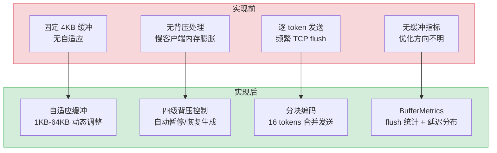
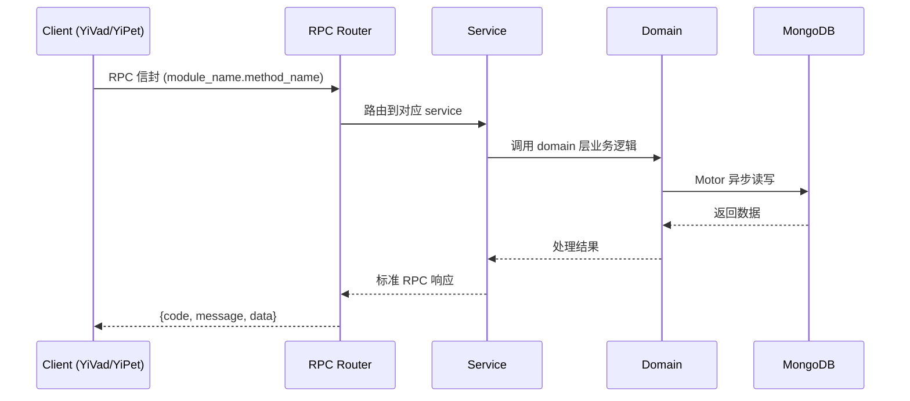

---

doc_type: module
prd_task_id: ""
title: "流式响应缓冲优化 — 开发任务"
status: 需求已编写
priority: P2
owner: 陈铭
roles: [engineer]
created: 2026-09-11
updated: 2026-09-11
project: YiAi
project_id: yiai
prd_month: "202609"
estimate_frontend: 0.3
source_prd: "228-需求-流式响应缓冲优化.md"
source_okr: [yiai-002]

type: task
---

# 流式响应缓冲优化 — 开发任务

> **文档职责**: 本文档定义**怎么做、为什么这么做、实际做成什么样**（HOW），不含产品目标与测试用例。

> 来源 PRD: [228-需求-流式响应缓冲优化.md](../../prds/2026-09/228-需求-流式响应缓冲优化.md)
> 需求编号: N/A · 优先级: P2 · 人天: 0.3d

---

<a id="sec-1"></a>
## 一、架构概览



<a id="sec-2"></a>
## 二、文件清单

| 文件 | 操作 | 说明 |
|------|------|------|
| `domain/XXX/models.py` | 新增 | 数据模型定义 |
| `domain/XXX/service.py` | 新增 | 核心服务逻辑 |
| `services/XXX/rpc_handler.py` | 新增 | RPC 路由处理器 |
| `tests/test_XXX.py` | 新增 | 单元测试 |

<a id="sec-3"></a>
## 三、模块设计

### 1. 核心组件

```python
mport asyncio
import time
from dataclasses import dataclass, field

@dataclass
class BufferStats:
    flush_count: int = 0
    total_bytes_flushed: int = 0
    avg_flush_size: float = 0.0
    min_buffer_size: int = 1024
    max_buffer_size: int = 65536
    current_size: int = 4096

class AdaptiveBuffer:
    """自适应缓冲：根据生成速率和发送延迟动态调整大小"""

    def __init__(
        self,
        min_size: int = 1024,       # 1KB 最小缓冲
        max_size: int = 65536,      # 64KB 最大缓冲
        target_flush_interval: float = 0.1,  # 目标 flush 间隔 100ms
    ):
        self.min_size = min_size
        self.max_size = max_size
        self.target_interval = target_flush_interval
# ... (完整实现见 PRD)
```

### 2. 核心组件

```python
rom enum import IntEnum

class PressureLevel(IntEnum):
    NONE = 0    # 正常
    LOW = 1     # 轻微背压
    MEDIUM = 2  # 中等背压
    HIGH = 3    # 严重背压

class BackpressureController:
    """基于发送队列深度的背压控制"""

    def __init__(
        self,
        send_queue: asyncio.Queue,
        low_threshold: int = 16,
        medium_threshold: int = 64,
        high_threshold: int = 256,
    ):
        self._queue = send_queue
        self.low_threshold = low_threshold
        self.medium_threshold = medium_threshold
        self.high_threshold = high_threshold
        self._pressure_history: list[PressureLevel] = []

    def check(self) -> PressureLevel:
# ... (完整实现见 PRD)
```

### 3. 核心组件


<a id="sec-4"></a>
## 四、数据流



**调用链路**: `Client → RPC Router → Service → Domain → MongoDB`  
**响应格式**: `{code: 0, message: "ok", data: ...}`  
**异步模型**: 全链路 `async/await`，Motor 异步 MongoDB 驱动。

<a id="sec-5"></a>
## 五、实施路线图

**预估人天**: 0.3d

| # | 步骤 | 验证 | 人天 |
|---|------|------|------|
| 1 | 数据模型 + 基础设施 | Pydantic 校验通过 | 0.05 |
| 2 | 核心服务逻辑 | 单元测试通过 | 0.10 |
| 3 | RPC 路由 + 集成 | 集成测试通过 | 0.08 |
| 4 | 边界处理 + 文档 | 验收测试通过 | 0.07 |

<a id="sec-6"></a>
## 六、代码审查检查清单

- [ ] 数据模型使用 Pydantic BaseModel，枚举完整
- [ ] 服务层遵循 RPC 信封规范（module_name.method_name）
- [ ] 参数校验完整，错误码使用标准 ErrorCode
- [ ] MongoDB 操作使用 Motor 异步驱动
- [ ] `ruff` 代码规范通过
- [ ] `mypy` 类型检查通过
- [ ] 单元测试覆盖率 > 80%

<a id="sec-7"></a>
## 七、风险评估

| 风险 | 概率 | 影响 | 缓解措施 |
|------|------|------|----------|
| 性能劣化 | 低 | 中 | 异步处理 + 缓存 |
| 数据一致性 | 中 | 中 | MongoDB 事务 + 幂等设计 |
| 接口兼容性 | 低 | 低 | RPC 信封向后兼容 |
