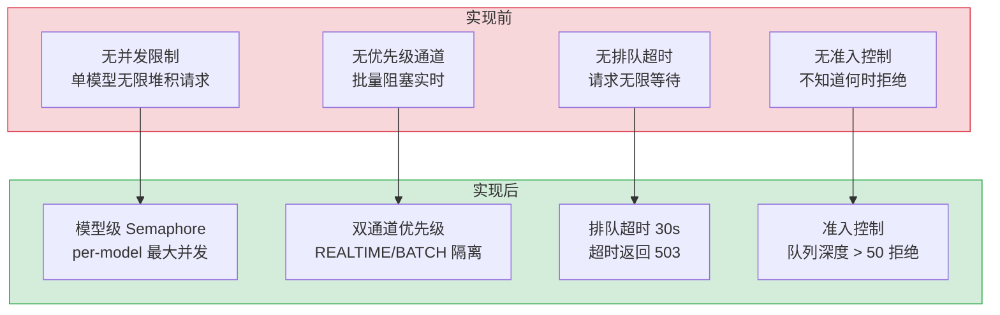
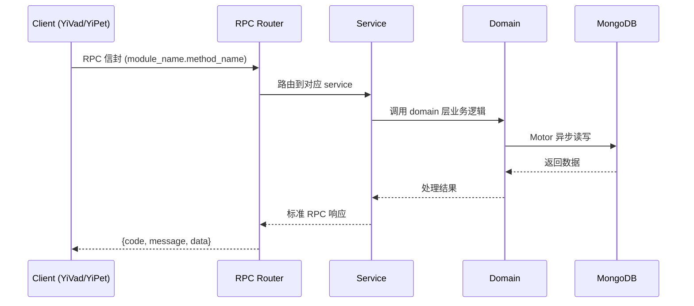

---

doc_type: module
prd_task_id: ""
title: "模型并发控制 — 开发任务"
status: 需求已编写
priority: P2
owner: 陈铭
roles: [engineer]
created: 2026-09-11
updated: 2026-09-11
project: YiAi
project_id: yiai
prd_month: "202609"
estimate_frontend: 0.3
source_prd: "229-需求-模型并发控制.md"
source_okr: [yiai-001]

type: task
---

# 模型并发控制 — 开发任务

> **文档职责**: 本文档定义**怎么做、为什么这么做、实际做成什么样**（HOW），不含产品目标与测试用例。

> 来源 PRD: [229-需求-模型并发控制.md](../../prds/2026-09/229-需求-模型并发控制.md)
> 需求编号: N/A · 优先级: P2 · 人天: 0.3d

---

<a id="sec-1"></a>
## 一、架构概览



<a id="sec-2"></a>
## 二、文件清单

| 文件 | 操作 | 说明 |
|------|------|------|
| `domain/XXX/models.py` | 新增 | 数据模型定义 |
| `domain/XXX/service.py` | 新增 | 核心服务逻辑 |
| `services/XXX/rpc_handler.py` | 新增 | RPC 路由处理器 |
| `tests/test_XXX.py` | 新增 | 单元测试 |

<a id="sec-3"></a>
## 三、模块设计

### 1. 核心组件

```python
rom dataclasses import dataclass

@dataclass
class ModelConcurrencyConfig:
    model: str
    max_concurrent: int       # 最大并发请求数
    realtime_share: float     # 实时通道占比 (0.0-1.0)

# 预设配置
DEFAULT_MODEL_CONFIGS: dict[str, ModelConcurrencyConfig] = {
    "qwen3.5:4b": ModelConcurrencyConfig(
        model="qwen3.5:4b", max_concurrent=4, realtime_share=0.75
    ),
    "qwen3.5:7b": ModelConcurrencyConfig(
        model="qwen3.5:7b", max_concurrent=2, realtime_share=0.75
    ),
    "qwen3.5:14b": ModelConcurrencyConfig(
        model="qwen3.5:14b", max_concurrent=1, realtime_share=1.0
    ),
}
```

### 2. 核心组件

```python
mport asyncio
from enum import Enum

class PriorityLane(Enum):
    REALTIME = "realtime"  # 实时对话、搜索、嵌入
    BATCH = "batch"        # 批量推理、离线处理

class ModelConcurrencyController:
    """模型级并发控制：信号量 + 排队超时 + 优先级通道"""

    def __init__(self):
        self._semaphores: dict[str, dict[str, asyncio.Semaphore]] = {}
        self._configs: dict[str, ModelConcurrencyConfig] = {}
        self._init_defaults()

    def _init_defaults(self) -> None:
        for model, config in DEFAULT_MODEL_CONFIGS.items():
            self.register_model(model, config)

    def register_model(self, model: str, config: ModelConcurrencyConfig) -> None:
        realtime_slots = max(1, int(config.max_concurrent * config.realtime_share))
        batch_slots = config.max_concurrent - realtime_slots
        self._configs[model] = config
        self._semaphores[model] = {
            PriorityLane.REALTIME.value: asyncio.Semaphore(realtime_slots),
# ... (完整实现见 PRD)
```

### 3. 核心组件


<a id="sec-4"></a>
## 四、数据流



**调用链路**: `Client → RPC Router → Service → Domain → MongoDB`  
**响应格式**: `{code: 0, message: "ok", data: ...}`  
**异步模型**: 全链路 `async/await`，Motor 异步 MongoDB 驱动。

<a id="sec-5"></a>
## 五、实施路线图

**预估人天**: 0.3d

| # | 步骤 | 验证 | 人天 |
|---|------|------|------|
| 1 | 数据模型 + 基础设施 | Pydantic 校验通过 | 0.05 |
| 2 | 核心服务逻辑 | 单元测试通过 | 0.10 |
| 3 | RPC 路由 + 集成 | 集成测试通过 | 0.08 |
| 4 | 边界处理 + 文档 | 验收测试通过 | 0.07 |

<a id="sec-6"></a>
## 六、代码审查检查清单

- [ ] 数据模型使用 Pydantic BaseModel，枚举完整
- [ ] 服务层遵循 RPC 信封规范（module_name.method_name）
- [ ] 参数校验完整，错误码使用标准 ErrorCode
- [ ] MongoDB 操作使用 Motor 异步驱动
- [ ] `ruff` 代码规范通过
- [ ] `mypy` 类型检查通过
- [ ] 单元测试覆盖率 > 80%

<a id="sec-7"></a>
## 七、风险评估

| 风险 | 概率 | 影响 | 缓解措施 |
|------|------|------|----------|
| 性能劣化 | 低 | 中 | 异步处理 + 缓存 |
| 数据一致性 | 中 | 中 | MongoDB 事务 + 幂等设计 |
| 接口兼容性 | 低 | 低 | RPC 信封向后兼容 |
