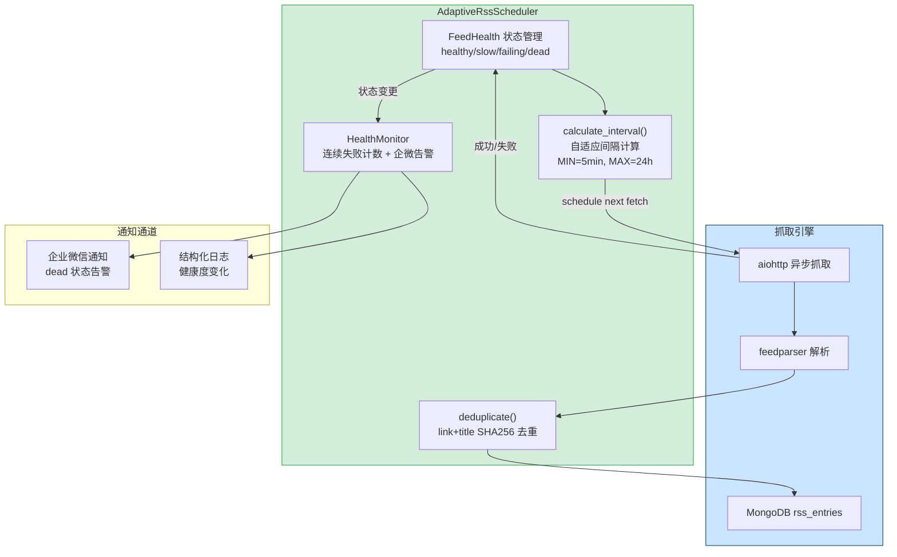

---

doc_type: module
prd_task_id: "YA-09-91"
title: "YA-09-91: RSS 调度优化 — 自适应轮询 + 内容去重 + 健康监控 — 开发方案"
status: 需求已编写
priority: P2
owner: 陈铭
roles: [engineer]
created: 2026-09-11
updated: 2026-09-23
project: YiAi
project_id: yiai
prd_month: "202609"
estimate_frontend: 1.0
source_prd: "23-需求-RSS抓取调度优化.md"
source_okr: [yiai-001]

type: task
---

# YA-09-91: RSS 调度优化 — 自适应轮询 + 内容去重 + 健康监控 — 开发方案

> 来源 PRD：[23-需求-RSS抓取调度优化.md](../../prds/2026-09/23-需求-RSS抓取调度优化.md)
> 需求编号：YA-09-91 · 优先级：P2 · 人天：1.0d
> 类型：架构 · 状态：需求已编写

---

## 一、架构概述

YiAi 通过 `rss_scheduler`（apscheduler）定期抓取 RSS 源存入 `rss_entries` 集合。当前固定 30min 轮询不合理：新闻源 5min 更新而博客 24h 更新，统一间隔造成高频源延迟 + 低频源无效请求。无内容去重机制，同一文章通过不同 Feed 交叉收录（日均有 ~15 篇重复）。本方案引入三个核心能力：**自适应轮询**（基于历史更新频率动态调整间隔 5min-24h）、**内容去重**（link+title SHA256 哈希）、**Feed 健康状态机**（healthy/slow/failing/dead 四级）。

```mermaid
stateDiagram-v2
    [*] --> unknown: 新增 Feed
    unknown --> healthy: 首次抓取成功
    healthy --> healthy: 持续成功<br/>(自适应间隔)
    healthy --> failing: 连续失败 3 次
    failing --> healthy: 抓取成功
    failing --> dead: 连续失败 10 次
    dead --> healthy: 恢复抓取成功
    healthy --> slow: 响应时间 > 10s
    slow --> healthy: 响应恢复 < 10s

    note right of healthy: 间隔: 5min-24h<br/>正常抓取
    note right of failing: 间隔: 固定 30min<br/>WARNING + 降级重试
    note right of dead: 间隔: 固定 24h<br/>ERROR + 企微告警
```



### 自适应间隔策略

| Feed 类型 | 判定条件 | 轮询间隔 | 示例 |
|----------|---------|---------|------|
| 高频 | avg_update_interval < 10min | 5min | 新闻站点 |
| 中频 | 10min ≤ interval < 2h | min(interval*0.5, 24h) | 技术博客 |
| 低频 | interval ≥ 2h | 2h | 月刊/年报 |
| 失效 | consecutive_failures ≥ 10 | 24h | 已停止维护 |

---

## 二、文件清单

| # | 文件 | 操作 | 说明 | 预估行数 |
|---|------|------|------|----------|
| 1 | `src/domain/rss/adaptive_scheduler.py` | 新增 | `AdaptiveRssScheduler` 类：健康状态机 + 间隔计算 + 去重 | +180 |
| 2 | `src/domain/rss/feed_health.py` | 新增 | `FeedHealth` dataclass + `HealthMonitor` 告警逻辑 | +60 |
| 3 | `src/domain/rss/deduplicator.py` | 新增 | `ContentDeduplicator`：SHA256 去重 + LRU cache 限制 | +50 |
| 4 | `src/domain/rss/__init__.py` | 修改 | 导出新类，初始化调度器 | +15 |
| 5 | `src/services/rss/rss_service.py` | 修改 | 集成自适应调度器，替换固定 30min 间隔 | +30 |
| 6 | `tests/domain/rss/test_adaptive_scheduler.py` | 新增 | 健康状态转换 + 间隔计算 + 去重单元测试 | +120 |
| **合计** | | | | **~455 行** |

### 组件树

```
src/domain/rss/
├── adaptive_scheduler.py  # 自适应调度核心
│   ├── class AdaptiveRssScheduler
│   │   ├── calculate_interval(feed: FeedHealth) -> timedelta
│   │   ├── update_health(feed, new_articles, success) -> None
│   │   ├── should_fetch(feed) -> bool
│   │   └── get_stats() -> dict[str, Any]
│   │
├── feed_health.py         # Feed 健康模型
│   ├── @dataclass FeedHealth
│   │   ├── url, last_fetch, last_success
│   │   ├── consecutive_failures: int
│   │   ├── avg_update_interval: timedelta | None
│   │   ├── status: str  # healthy|slow|failing|dead
│   │   └── response_time_ms: float
│   │
│   └── class HealthMonitor
│       ├── check_health(feed) -> str
│       ├── send_alert(feed, old_status, new_status) -> None
│       └── get_dead_feeds() -> list[FeedHealth]
│
└── deduplicator.py        # 内容去重
    └── class ContentDeduplicator
        ├── is_duplicate(link, title) -> bool
        ├── add(link, title) -> None
        ├── deduplicate_entries(entries) -> list[dict]
        └── _hash_key(link, title) -> str
```

---

## 三、模块设计

### 3.1 FeedHealth 状态模型

```python
from dataclasses import dataclass, field
from datetime import datetime, timedelta
from enum import Enum

class FeedStatus(str, Enum):
    HEALTHY = "healthy"       # 正常
    SLOW = "slow"             # 响应慢（> 10s）
    FAILING = "failing"       # 连续失败 3-9 次
    DEAD = "dead"             # 连续失败 ≥ 10 次
    UNKNOWN = "unknown"       # 新增，尚未抓取

@dataclass
class FeedHealth:
    url: str
    last_fetch: Optional[datetime] = None
    last_success: Optional[datetime] = None
    consecutive_failures: int = 0
    total_fetches: int = 0
    total_failures: int = 0
    avg_update_interval: Optional[timedelta] = None
    avg_response_time_ms: float = 0.0
    status: str = FeedStatus.UNKNOWN
    created_at: datetime = field(default_factory=datetime.utcnow)
```

### 3.2 AdaptiveRssScheduler

```python
class AdaptiveRssScheduler:
    """自适应 RSS 调度器 — 基于 Feed 更新频率动态调整轮询间隔。"""

    MIN_INTERVAL = timedelta(minutes=5)
    MAX_INTERVAL = timedelta(hours=24)
    DEFAULT_INTERVAL = timedelta(minutes=30)

    # 状态转换阈值
    FAILING_THRESHOLD = 3         # 连续失败 3 次 → failing
    DEAD_THRESHOLD = 10           # 连续失败 10 次 → dead
    SLOW_RESPONSE_THRESHOLD_MS = 10_000  # 响应 > 10s → slow
    HEALTHY_RESPONSE_THRESHOLD_MS = 3_000  # 响应 < 3s → 恢复为 healthy

    def __init__(self) -> None:
        self._feeds: dict[str, FeedHealth] = {}
        self._deduplicator = ContentDeduplicator(max_size=100_000)
        self._monitor = HealthMonitor()

    def calculate_interval(self, feed: FeedHealth) -> timedelta:
        """
        基于 Feed 历史更新频率计算下次轮询间隔。

        策略:
          - 高频源 (avg_interval ≤ 10min): 5min
          - 中频源 (10min < avg_interval ≤ 2h): avg_interval * 0.5
          - 低频源 (avg_interval > 2h): 2h
          - 失效源 (status=dead): 24h
          - 无历史数据: 30min (默认)
        """
        if feed.status == FeedStatus.DEAD:
            return self.MAX_INTERVAL
        if feed.avg_update_interval is None:
            return self.DEFAULT_INTERVAL

        if feed.avg_update_interval <= timedelta(minutes=10):
            return self.MIN_INTERVAL
        if feed.avg_update_interval <= timedelta(hours=2):
            half = feed.avg_update_interval * 0.5
            return max(self.MIN_INTERVAL, min(half, self.MAX_INTERVAL))
        return timedelta(hours=2)

    async def update_health(
        self,
        feed: FeedHealth,
        new_articles: int,
        success: bool,
        response_time_ms: float,
    ) -> None:
        """
        更新 Feed 健康状态。

        状态转换规则:
          success=True:
            - consecutive_failures 重置为 0
            - 若有新文章，更新 avg_update_interval (EMA α=0.3)
            - 根据响应时间更新 slow/healthy 状态
          success=False:
            - consecutive_failures += 1
            - ≥ 10 → dead + 企微告警
            - ≥ 3 → failing + WARNING 日志
        """
        old_status = feed.status
        feed.last_fetch = datetime.utcnow()
        feed.total_fetches += 1

        # 更新响应时间 (EMA)
        if feed.avg_response_time_ms == 0:
            feed.avg_response_time_ms = response_time_ms
        else:
            feed.avg_response_time_ms = (
                feed.avg_response_time_ms * 0.7 + response_time_ms * 0.3
            )

        if success:
            feed.last_success = datetime.utcnow()
            feed.consecutive_failures = 0

            # 更新状态（响应时间维度）
            if response_time_ms > self.SLOW_RESPONSE_THRESHOLD_MS:
                feed.status = FeedStatus.SLOW
            elif response_time_ms < self.HEALTHY_RESPONSE_THRESHOLD_MS:
                feed.status = FeedStatus.HEALTHY

            # 更新平均发布间隔（仅在有新文章时）
            if new_articles > 0 and feed.last_success:
                elapsed = datetime.utcnow() - feed.last_success
                if feed.avg_update_interval:
                    feed.avg_update_interval = (
                        feed.avg_update_interval * 0.7 + elapsed * 0.3
                    )
                else:
                    feed.avg_update_interval = elapsed
        else:
            feed.total_failures += 1
            feed.consecutive_failures += 1
            if feed.consecutive_failures >= self.DEAD_THRESHOLD:
                feed.status = FeedStatus.DEAD
            elif feed.consecutive_failures >= self.FAILING_THRESHOLD:
                feed.status = FeedStatus.FAILING

        if feed.status != old_status:
            await self._monitor.on_status_change(feed, old_status)

    async def get_stats(self) -> dict[str, Any]:
        """获取所有 Feed 统计信息。"""
        feeds = list(self._feeds.values())
        return {
            "total": len(feeds),
            "healthy": sum(1 for f in feeds if f.status == FeedStatus.HEALTHY),
            "slow": sum(1 for f in feeds if f.status == FeedStatus.SLOW),
            "failing": sum(1 for f in feeds if f.status == FeedStatus.FAILING),
            "dead": sum(1 for f in feeds if f.status == FeedStatus.DEAD),
            "total_entries_deduped": self._deduplicator.dedup_count,
        }
```

### 3.3 ContentDeduplicator

```python
import hashlib
from collections import OrderedDict

class ContentDeduplicator:
    """基于 link + title 的 SHA256 内容去重器。"""

    def __init__(self, max_size: int = 100_000) -> None:
        self._hashes: OrderedDict[str, None] = OrderedDict()
        self._max_size = max_size
        self.dedup_count: int = 0

    def _hash_key(self, link: str, title: str) -> str:
        return hashlib.sha256(f"{link}|{title}".encode()).hexdigest()

    def is_duplicate(self, link: str, title: str) -> bool:
        return self._hash_key(link, title) in self._hashes

    def add(self, link: str, title: str) -> None:
        key = self._hash_key(link, title)
        if key in self._hashes:
            self._hashes.move_to_end(key)
        else:
            if len(self._hashes) >= self._max_size:
                self._hashes.popitem(last=False)  # LRU 淘汰
            self._hashes[key] = None

    def deduplicate_entries(self, entries: list[dict]) -> list[dict]:
        """去重并返回新条目列表。"""
        new_entries = []
        for entry in entries:
            link = entry.get("link", "")
            title = entry.get("title", "")
            if not link and not title:
                continue
            if not self.is_duplicate(link, title):
                self.add(link, title)
                new_entries.append(entry)
            else:
                self.dedup_count += 1
        return new_entries
```

---

## 四、数据流

### 4.1 自适应调度周期

```
apscheduler 触发下次抓取
    │
    │  从 MongoDB 加载所有 Feed 配置
    ▼
对每个 Feed:
    │
    ├── 1. should_fetch(feed)?
    │      检查 last_fetch + calculate_interval()
    │      → 未到轮询时间 → skip
    │
    ├── 2. aiohttp.fetch(feed.url)
    │      timeout=30s, 记录 response_time_ms
    │
    ├── 3. feedparser.parse(response)
    │
    ├── 4. deduplicate_entries(entries)
    │      基于 link+title SHA256 去重
    │
    ├── 5. Motor 批量 upsert 到 rss_entries
    │
    └── 6. update_health(feed, new_articles, success, response_time_ms)
            │
            ├── 状态变更? → HealthMonitor.on_status_change()
            │   ├── → dead: 企微告警
            │   └── → failing: WARNING 日志
            │
            └── 计算下次间隔 → apscheduler.reschedule_job(feed.url, interval)
```

### 4.2 内容去重流

```
RSS 抓取返回 25 条 entry
    │
    ▼
ContentDeduplicator.deduplicate_entries(entries)
    │
    ├── entry_1: link="https://..." title="New Post"
    │   SHA256("https://...|New Post") → a1b2c3...
    │   → 不在 _hashes → 保留 + add()
    │
    ├── entry_2: link="https://..." title="New Post"
    │   SHA256 相同 → a1b2c3...
    │   → 在 _hashes → 跳过 (dedup_count++)
    │
    └── ...
    │
    ▼
返回 18 条新条目（7 条重复被过滤）
```

---

## 五、实施路线图

### 阶段一：核心实现（0.5d）

| 步骤 | 任务 | 验证方式 | 产出 |
|------|------|---------|------|
| 1 | 创建 `FeedHealth` dataclass + `FeedStatus` 枚举 | dataclass 字段校验通过 | `feed_health.py` |
| 2 | 实现 `AdaptiveRssScheduler.calculate_interval()` | 高频源 5min、低频源 2h | `adaptive_scheduler.py` |
| 3 | 实现 `update_health()` + 状态转换逻辑 | failing/dead 阈值触发正确 | 同上 |
| 4 | 实现 `ContentDeduplicator` + LRU 限制 | 重复条目被过滤 | `deduplicator.py` |

### 阶段二：集成 + 告警（0.5d）

| 步骤 | 任务 | 验证方式 | 产出 |
|------|------|---------|------|
| 5 | `rss_service.py` 集成自适应调度器 | 替换固定 30min 间隔 | `rss_service.py` |
| 6 | `HealthMonitor.on_status_change()` 企微告警 | dead 状态触发企微通知 | `feed_health.py` |
| 7 | 单元测试（状态转换 / 间隔计算 / 去重） | pytest 全部通过 | `test_adaptive_scheduler.py` |
| 8 | 边界测试（全 dead / 全 healthy / 混合状态） | 所有边界通过 | 同上 |

**合计：1.0d。**

---

## 六、Code Review 检查清单

- [ ] `calculate_interval()` 返回值始终在 [5min, 24h] 范围内
- [ ] `update_health()` 中 EMA 平滑系数 α=0.3 合理（避免单次异常过度影响）
- [ ] 状态转换日志完整（old_status → new_status + 触发原因）
- [ ] `dead` 状态 24h 后仍会重试（而非永久放弃）——保持恢复可能
- [ ] `ContentDeduplicator` 内存上限 `max_size` 通过 LRU 淘汰控制
- [ ] 去重 key 使用 `link + title` 而非仅 `link`（部分 Feed link 可能相同）
- [ ] `HealthMonitor` 企微告警限流（同一 Feed 1h 内最多 1 次）
- [ ] 新增 Feed 默认 `unknown` 状态，首次抓取 30min 默认间隔
- [ ] 抓取超时 30s——避免慢 Feed 阻塞调度器
- [ ] `get_stats()` 返回实时统计，供 Dashboard 展示

---

## 七、技术风险评估

| 风险 | 概率 | 影响 | 缓解措施 |
|------|------|------|---------|
| EMA 平滑导致 dead 恢复过慢 | 低 | 中 | dead 恢复后重置 consecutive_failures，直接进入 30min 默认间隔 |
| 去重哈希碰撞（SHA256） | 极低 | 低 | SHA256 碰撞概率可忽略；极端情况可加 `published` 字段 |
| 大量 Feed 时内存占用 | 中 | 低 | `ContentDeduplicator` LRU 上限 100K 条，约 6.4MB |
| 企微告警风暴（所有 Feed 同时 dead） | 低 | 高 | 告警限流：同一 Feed 1h 最多 1 次 |
| apscheduler 与 async 兼容性 | 中 | 中 | 使用 `AsyncIOScheduler`，所有 job 函数为 async |

---

## 八、关联模块

- 基础：[YA-09-05 RSS 内容聚合引擎](./05-prd-task-RAG引擎.md)
- 关联：[YA-09-106 监控与告警体系](./106-prd-task-监控与告警体系.md)
- 关联：[YA-09-32 结构化日志](./35-prd-task-结构化日志.md)