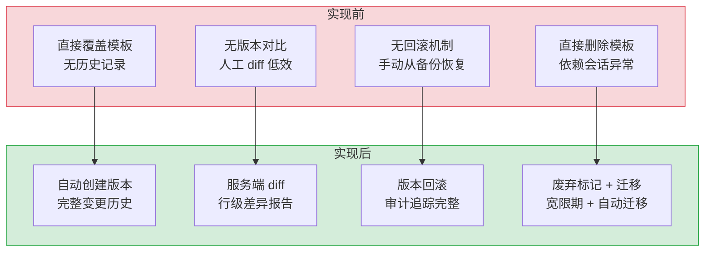
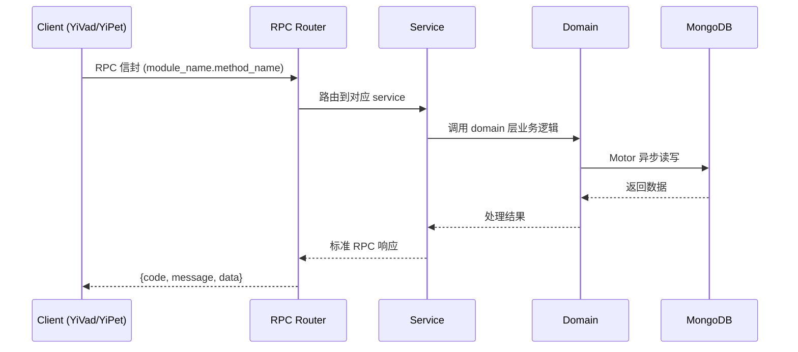

---

doc_type: module
prd_task_id: ""
title: "对话模板版本管理 — 开发任务"
status: 需求已编写
priority: P2
owner: 陈铭
roles: [engineer]
created: 2026-09-11
updated: 2026-09-11
project: YiAi
project_id: yiai
prd_month: "202609"
estimate_frontend: 0.3
source_prd: "230-需求-对话模板版本管理.md"
source_okr: [yiai-001]

type: task
---

# 对话模板版本管理 — 开发任务

> **文档职责**: 本文档定义**怎么做、为什么这么做、实际做成什么样**（HOW），不含产品目标与测试用例。

> 来源 PRD: [230-需求-对话模板版本管理.md](../../prds/2026-09/230-需求-对话模板版本管理.md)
> 需求编号: N/A · 优先级: P2 · 人天: 0.3d

---

<a id="sec-1"></a>
## 一、架构概览



<a id="sec-2"></a>
## 二、文件清单

| 文件 | 操作 | 说明 |
|------|------|------|
| `domain/XXX/models.py` | 新增 | 数据模型定义 |
| `domain/XXX/service.py` | 新增 | 核心服务逻辑 |
| `services/XXX/rpc_handler.py` | 新增 | RPC 路由处理器 |
| `tests/test_XXX.py` | 新增 | 单元测试 |

<a id="sec-3"></a>
## 三、模块设计

### 1. 核心组件

```python
rom datetime import datetime, timezone
from typing import Optional

class TemplateVersionManager:
    """对话模板版本管理：创建/查询/对比/回滚"""

    def __init__(self, db):
        self.db = db
        self.templates = db["templates"]
        self.versions = db["template_versions"]

    async def create_template(self, name: str, content: str, author: str) -> str:
        """创建模板（自动生成 version=1）"""
        now = datetime.now(timezone.utc)
        result = await self.templates.insert_one({
            "name": name,
            "content": content,
            "current_version": 1,
            "status": "active",
            "deprecated_at": None,
            "migration_path": None,
            "created_at": now,
            "updated_at": now,
            "updated_by": author,
        })
# ... (完整实现见 PRD)
```

### 2. 核心组件

```python
mport difflib

class DiffEngine:
    """服务端模板差异计算"""

    @staticmethod
    def compute_diff(old_content: str, new_content: str) -> dict:
        """计算两个版本之间的差异"""
        old_lines = old_content.splitlines(keepends=True)
        new_lines = new_content.splitlines(keepends=True)

        differ = difflib.unified_diff(
            old_lines, new_lines,
            fromfile="old", tofile="new",
            lineterm=""
        )
        diff_lines = list(differ)

        added = sum(1 for l in diff_lines if l.startswith("+") and not l.startswith("+++"))
        removed = sum(1 for l in diff_lines if l.startswith("-") and not l.startswith("---"))

        return {
            "added_lines": added,
            "removed_lines": removed,
            "total_changes": added + removed,
# ... (完整实现见 PRD)
```

### 3. 核心组件


<a id="sec-4"></a>
## 四、数据流



**调用链路**: `Client → RPC Router → Service → Domain → MongoDB`  
**响应格式**: `{code: 0, message: "ok", data: ...}`  
**异步模型**: 全链路 `async/await`，Motor 异步 MongoDB 驱动。

<a id="sec-5"></a>
## 五、实施路线图

**预估人天**: 0.3d

| # | 步骤 | 验证 | 人天 |
|---|------|------|------|
| 1 | 数据模型 + 基础设施 | Pydantic 校验通过 | 0.05 |
| 2 | 核心服务逻辑 | 单元测试通过 | 0.10 |
| 3 | RPC 路由 + 集成 | 集成测试通过 | 0.08 |
| 4 | 边界处理 + 文档 | 验收测试通过 | 0.07 |

<a id="sec-6"></a>
## 六、代码审查检查清单

- [ ] 数据模型使用 Pydantic BaseModel，枚举完整
- [ ] 服务层遵循 RPC 信封规范（module_name.method_name）
- [ ] 参数校验完整，错误码使用标准 ErrorCode
- [ ] MongoDB 操作使用 Motor 异步驱动
- [ ] `ruff` 代码规范通过
- [ ] `mypy` 类型检查通过
- [ ] 单元测试覆盖率 > 80%

<a id="sec-7"></a>
## 七、风险评估

| 风险 | 概率 | 影响 | 缓解措施 |
|------|------|------|----------|
| 性能劣化 | 低 | 中 | 异步处理 + 缓存 |
| 数据一致性 | 中 | 中 | MongoDB 事务 + 幂等设计 |
| 接口兼容性 | 低 | 低 | RPC 信封向后兼容 |
