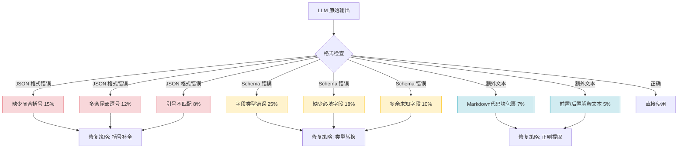
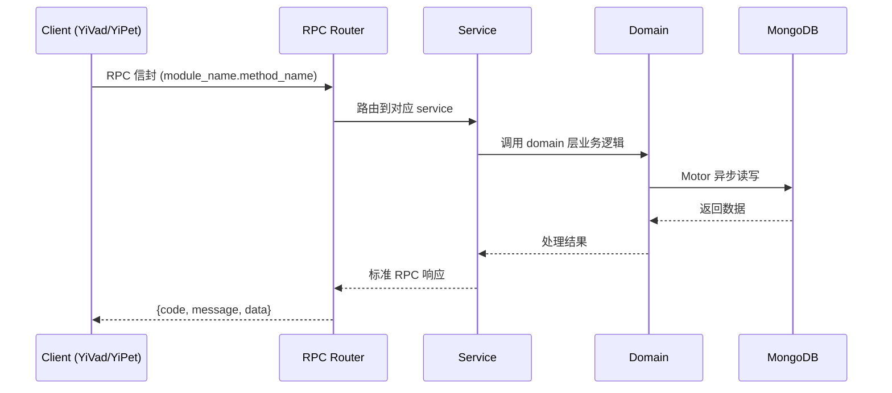

---

doc_type: module
prd_task_id: "YA-09-153"
title: "YA-09-153: LLM 输出格式化校验 — JSON Schema 验证 + 自动修复 — 开发方案"
status: 需求已编写
priority: P2
owner: 陈铭
roles: [engineer]
created: 2026-09-11
updated: 2026-09-14
project: YiAi
project_id: yiai
prd_month: "202609"
estimate_frontend: 0.5
source_prd: "231-需求-LLM输出格式化校验.md"
source_okr: [yiai-001]

type: task
---

# YA-09-153: LLM 输出格式化校验 — JSON Schema 验证 + 自动修复 — 开发方案

> **文档职责**: 本文档定义**怎么做、为什么这么做、实际做成什么样**（HOW），不含产品目标与测试用例。

> 来源 PRD: [231-需求-LLM输出格式化校验.md](../../prds/2026-09/231-需求-LLM输出格式化校验.md)
> 需求编号: YA-09-153 · 优先级: P2 · 人天: 0.5d

---

<a id="sec-1"></a>
## 一、架构概览



<a id="sec-2"></a>
## 二、文件清单

| 文件 | 操作 | 说明 |
|------|------|------|
| `domain/XXX/models.py` | 新增 | 数据模型定义 |
| `domain/XXX/service.py` | 新增 | 核心服务逻辑 |
| `services/XXX/rpc_handler.py` | 新增 | RPC 路由处理器 |
| `tests/test_XXX.py` | 新增 | 单元测试 |

<a id="sec-3"></a>
## 三、模块设计

### 1. 核心组件

```python
 domain/validation/
# ├── __init__.py
# ├── schemas.py       # Schema 定义与加载
# ├── extractor.py     # JSON 提取器（正则）
# ├── repairer.py      # JSON 修复器（括号/逗号/引号）
# ├── validator.py     # Schema 验证器
# ├── retry.py         # 重试策略
# └── metrics.py       # 校验指标收集

class OutputValidator:
    """LLM 输出校验器"""

    def __init__(self, schemas_dir: str = "domain/validation/schemas/"):
        self.schemas_dir = schemas_dir
        self.extractor = JsonExtractor()
        self.repairer = JsonRepairer()
        self.schema_validator = SchemaValidator(schemas_dir)
        self.metrics = ValidationMetrics()

    async def validate(
        self,
        raw_output: str,
        schema_name: str,
        retry_fn: Callable | None = None,  # 重试时重新调用 LLM
        max_retries: int = 1,
# ... (完整实现见 PRD)
```

### 2. 核心组件

```python
rom dataclasses import dataclass
from typing import Any

@dataclass
class ValidationResult:
    success: bool                   # 最终是否通过
    data: Any | None = None         # 校验通过后的结构化数据
    raw_output: str | None = None   # LLM 原始输出
    errors: list[dict] = field(default_factory=list)  # 错误列表
    repairs: list[str] = field(default_factory=list)  # 修复操作记录
    retry_count: int = 0            # 重试次数
    duration_ms: float = 0.0        # 校验耗时
    schema_name: str = ""           # 使用的 Schema 名称
```

### 3. 核心组件


<a id="sec-4"></a>
## 四、数据流



**调用链路**: `Client → RPC Router → Service → Domain → MongoDB`  
**响应格式**: `{code: 0, message: "ok", data: ...}`  
**异步模型**: 全链路 `async/await`，Motor 异步 MongoDB 驱动。

<a id="sec-5"></a>
## 五、实施路线图

**预估人天**: 0.5d

| 步骤 | 内容 | 涉及文件 | 验证方式 | 人天 |
|------|------|---------|---------|------|
| 1 | 实现 JSON 提取器：正则提取、括号匹配、Markdown 代码块提取 | `extractor.py` | 单元测试覆盖 6 种输入格式 | 0.25 |
| 2 | 实现 JSON 修复器：5 种修复策略 | `repairer.py` | 每种策略至少 3 个测试用例 | 0.5 |
| 3 | 实现 Schema 注册表 + 验证器 | `schemas.py`, `validator.py` | jsonschema 验证通过 | 0.25 |
| 4 | 实现校验流水线（提取→修复→验证→重试） | `validator.py` + `__init__.py` | 端到端测试覆盖全流程 | 0.5 |
| 5 | 实现指标收集（成功率、延迟、错误分布） | `metrics.py` | 指标数据格式正确 | 0.25 |
| 6 | 集成到 Agent 工具调用链路 | `agent_service.py` | Agent 工具调用参数格式错误时能自动修复 | 0.5 |
| 7 | 集成到 Chat 服务 + Knowledge 服务 | `chat_service.py`, `knowledge_service.py` | 结构化输出校验正常 | 0.25 |
| 8 | 编写集成测试 + 回归验证 | `tests/` | 所有 LLM 调用点通过校验流水线 | 0.5 |

**总计：3.0d**


<a id="sec-6"></a>
## 六、代码审查检查清单

- [ ] JSON 提取器支持 3 种以上包裹格式（Markdown 代码块、纯文本前后缀、数组包裹）
- [ ] JSON 修复器每种策略有对应的单元测试
- [ ] Schema 文件格式正确（`jsonschema.Draft7Validator.check_schema()` 通过）
- [ ] 重试逻辑带错误反馈描述，而非简单重放
- [ ] 校验指标正常写入，无遗漏
- [ ] Agent 工具调用参数校验集成正确
- [ ] 修复后 JSON 经过 `json.loads()` 二次验证
- [ ] Schema 文件无硬编码路径，使用相对于项目根目录的配置
- [ ] `ruff` 代码规范通过
- [ ] `mypy` 类型检查通过


<a id="sec-7"></a>
## 七、风险评估

| 风险 | 概率 | 影响 | 等级 | 缓解措施 | 应急预案 |
|------|------|------|------|----------|----------|
| JSON 修复器引入新错误（修复后仍无法解析） | 中 | 低 | 低 | 修复后先 `json.loads()` 验证，失败则跳过修复直接走重试 | 回退修复逻辑，降级为纯重试 |
| Schema 定义与下游消费方不一致 | 中 | 中 | 中 | Schema 文件纳入代码审查，与下游服务共享 Schema 定义 | Schema 版本冻结，紧急回退到前一版本 |
| jsonschema 库性能影响 | 低 | 低 | 低 | Schema 预编译为 Validator 实例缓存，避免重复解析 | 移除 Schema 验证，仅保留格式修复 |
| 重试导致 LLM 调用量翻倍 | 中 | 中 | 中 | 最多重试 1 次；监控重试率，超过 20% 时告警 | 增加 max_retries=0 的紧急开关 |
| 校验流水线增加 RPC 延迟 | 中 | 低 | 低 | 提取+修复 < 5ms，Schema 验证 < 2ms；异步指标写入 | 紧急关闭校验开关，回退到原始行为 |


<a id="sec-8"></a>
## 八、回滚方案

| 回滚场景 | 回滚方式 | 影响范围 | 恢复时间 |
|----------|----------|----------|----------|
| JSON 修复器导致合法 JSON 被破坏 | 关闭修复器（`settings.validation_repair_enabled = False`），仅保留 Schema 验证 | Agent 工具调用 | 5min |
| Schema 验证误报率超过 10% | 关闭 Schema 验证（`settings.validation_schema_enabled = False`），仅保留格式提取 | 所有结构化输出 | 5min |
| 重试导致 LLM 成本翻倍 | 设置 `max_retries = 0`，关闭重试，仅做修复+验证 | LLM 调用成本 | 1min（配置热更新） |
| 校验流水线延迟超过 100ms | 关闭整个校验模块（`settings.validation_enabled = False`） | 所有 LLM 输出 | 1min（配置热更新） |

**回滚验证：**
- LLM 调用正常，响应时间无明显增加
- Agent 工具调用成功率不低于回滚前
- 数据结构化提取功能正常

