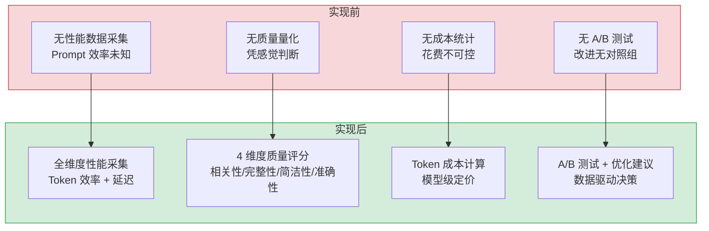
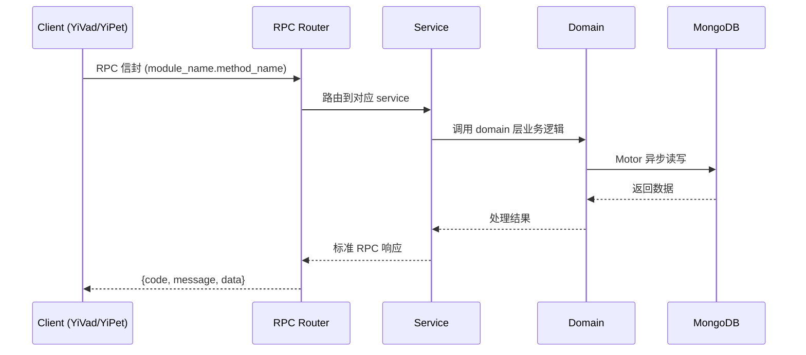

---

doc_type: module
prd_task_id: ""
title: "Prompt性能分析 — 开发任务"
status: 需求已编写
priority: P2
owner: 陈铭
roles: [engineer]
created: 2026-09-11
updated: 2026-09-11
project: YiAi
project_id: yiai
prd_month: "202609"
estimate_frontend: 0.3
source_prd: "232-需求-Prompt性能分析.md"
source_okr: [yiai-002]

type: task
---

# Prompt性能分析 — 开发任务

> **文档职责**: 本文档定义**怎么做、为什么这么做、实际做成什么样**（HOW），不含产品目标与测试用例。

> 来源 PRD: [232-需求-Prompt性能分析.md](../../prds/2026-09/232-需求-Prompt性能分析.md)
> 需求编号: N/A · 优先级: P2 · 人天: 0.3d

---

<a id="sec-1"></a>
## 一、架构概览



<a id="sec-2"></a>
## 二、文件清单

| 文件 | 操作 | 说明 |
|------|------|------|
| `domain/XXX/models.py` | 新增 | 数据模型定义 |
| `domain/XXX/service.py` | 新增 | 核心服务逻辑 |
| `services/XXX/rpc_handler.py` | 新增 | RPC 路由处理器 |
| `tests/test_XXX.py` | 新增 | 单元测试 |

<a id="sec-3"></a>
## 三、模块设计

### 1. 核心组件

```python
rom dataclasses import dataclass, field
import asyncio
import time

@dataclass
class PromptMetrics:
    template_id: str
    template_version: int
    session_id: str
    model: str
    input_tokens: int
    output_tokens: int
    token_efficiency: float
    prompt_overhead: float
    input_cost: float
    output_cost: float
    total_cost: float
    latency_ms: float
    quality: dict | None = None
    ab_test_group: str | None = None
    optimization_flags: list[str] = field(default_factory=list)
    timestamp: str = ""

class PromptAnalyzer:
    """Prompt 性能分析：Token 效率 + 成本 + 质量"""
# ... (完整实现见 PRD)
```

### 2. 核心组件

```python
lass QualityEvaluator:
    """多维度响应质量评分"""

    def __init__(self, model_runtime=None):
        self.runtime = model_runtime

    async def evaluate(
        self, messages: list[dict], response: str
    ) -> dict:
        """4 维度质量评分"""
        scores = {}

        # 相关性：响应是否对齐用户最后一条消息的意图
        scores["relevance"] = await self._score_relevance(messages, response)

        # 完整性：是否完整回答了问题（无遗漏）
        scores["completeness"] = self._score_completeness(response)

        # 简洁性：无冗余、重复内容
        scores["conciseness"] = self._score_conciseness(response)

        # 准确性：基于规则（无幻觉检测需要外部知识）
        scores["accuracy"] = self._score_accuracy(response)

        scores["overall"] = sum(scores.values()) / len(scores)
# ... (完整实现见 PRD)
```

### 3. 核心组件


<a id="sec-4"></a>
## 四、数据流



**调用链路**: `Client → RPC Router → Service → Domain → MongoDB`  
**响应格式**: `{code: 0, message: "ok", data: ...}`  
**异步模型**: 全链路 `async/await`，Motor 异步 MongoDB 驱动。

<a id="sec-5"></a>
## 五、实施路线图

**预估人天**: 0.3d

| # | 步骤 | 验证 | 人天 |
|---|------|------|------|
| 1 | 数据模型 + 基础设施 | Pydantic 校验通过 | 0.05 |
| 2 | 核心服务逻辑 | 单元测试通过 | 0.10 |
| 3 | RPC 路由 + 集成 | 集成测试通过 | 0.08 |
| 4 | 边界处理 + 文档 | 验收测试通过 | 0.07 |

<a id="sec-6"></a>
## 六、代码审查检查清单

- [ ] 数据模型使用 Pydantic BaseModel，枚举完整
- [ ] 服务层遵循 RPC 信封规范（module_name.method_name）
- [ ] 参数校验完整，错误码使用标准 ErrorCode
- [ ] MongoDB 操作使用 Motor 异步驱动
- [ ] `ruff` 代码规范通过
- [ ] `mypy` 类型检查通过
- [ ] 单元测试覆盖率 > 80%

<a id="sec-7"></a>
## 七、风险评估

| 风险 | 概率 | 影响 | 缓解措施 |
|------|------|------|----------|
| 性能劣化 | 低 | 中 | 异步处理 + 缓存 |
| 数据一致性 | 中 | 中 | MongoDB 事务 + 幂等设计 |
| 接口兼容性 | 低 | 低 | RPC 信封向后兼容 |
