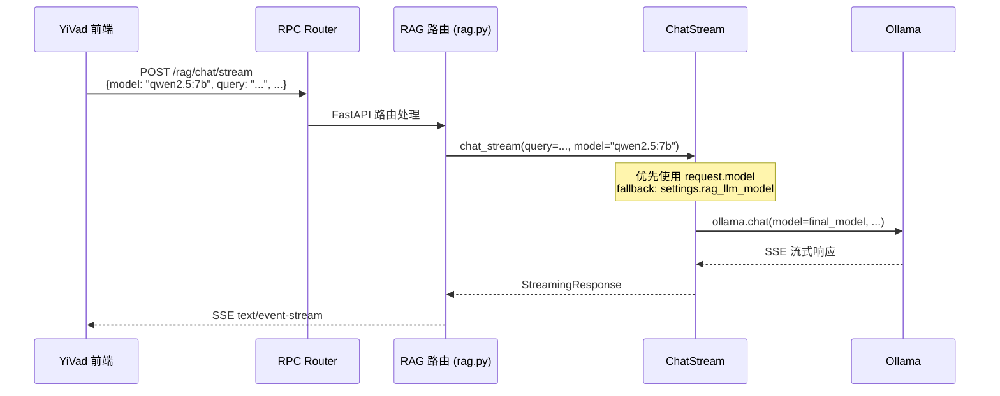
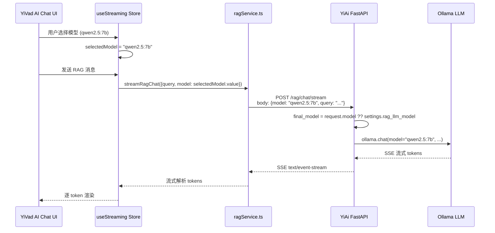

# YA-09-234: RAG 聊天流模型参数支持 — 开发方案

> **文档职责**: 本文档定义**怎么做、为什么这么做、实际做成什么样**（HOW），不含产品目标与测试用例。

> 来源 PRD: [YV-09-87: RAG 聊天模型参数传递修复](../../yivad/prds/2026-09/87-需求-RAG聊天模型参数传递.md)
> 需求编号: YV-09-87 · 优先级: P1 · 人天: 0.25d · 状态: 已完成

---

## 背景与问题

当前 RAG 聊天功能存在严重 bug：用户开启 RAG 后发送消息，后端日志报 `model: null` 错误，导致 RAG 聊天完全不可用。

**根因**: 前端 `streamRagChat` 调用未传递 `model` 参数，后端 `rag_chat_stream` 也未接受 `model` 参数，而是硬编码使用 `settings.rag_llm_model`。当该配置值与实际可用模型不匹配时（或用户切换了 UI 中的模型选择），RAG 聊天完全不可用。

**影响范围**: RAG 聊天完全不可用，用户在 UI 中选择的模型对 RAG 聊天无效，配置耦合导致无法按会话切换模型。

---

<a id="sec-1"></a>
## 一、架构概览



**调用链路**: `YiVad → FastAPI /rag/chat/stream → rag_chat_stream(model=...) → ollama.chat`  
**响应格式**: SSE `text/event-stream`  
**异步模型**: 全链路 `async/await`

---

<a id="sec-2"></a>
## 二、文件清单

| 文件 | 操作 | 说明 |
|------|------|------|
| `YiAi/src/models/schemas_knowledge.py` | 修改 | `RagChatRequest` 新增 `model` 可选字段 |
| `YiAi/src/server/routes/rag.py` | 修改 | 传递 `request.model` 到 `chat_stream` |
| `YiAi/src/domain/rag/chat_stream.py` | 修改 | `chat_stream` 接受 `model` 参数，fallback 到配置 |
| `YiVad/src/api/interface/rag.ts` | 修改 | `RagChatPayload` 新增 `model` 字段 |
| `YiVad/src/api/modules/ragService.ts` | 修改 | `streamRagChat` body 包含 `model` |
| `YiVad/src/stores/modules/aiChat/useStreaming.ts` | 修改 | 传递 `selectedModel.value` |

---

<a id="sec-3"></a>
## 三、模块设计

### 3.1 后端 Schema 扩展

```python
 YiAi/src/models/schemas_knowledge.py

from pydantic import BaseModel, Field
from typing import Optional

class RagChatRequest(BaseModel):
    """RAG 聊天请求 Schema — 新增 model 字段."""
    query: str = Field(..., description="用户查询")
    session_key: Optional[str] = Field(None, description="会话 key")
    knowledge_base: Optional[str] = Field(None, description="知识库名称")
    top_k: int = Field(default=5, description="检索结果数")
    model: Optional[str] = Field(None, description="模型名称，不传则使用 RAG 默认模型")
    temperature: Optional[float] = Field(None, description="温度参数")
```

### 3.2 后端路由修改

```python
 YiAi/src/server/routes/rag.py

@router.post("/chat/stream")
async def rag_chat_stream(request: RagChatRequest):
    """RAG 聊天流式接口 — 支持 model 参数传递."""
    return StreamingResponse(
        chat_stream(
            query=request.query,
            model=request.model,                # 新增: 传递用户选择的模型
            session_key=request.session_key,
            knowledge_base=request.knowledge_base,
            top_k=request.top_k,
            temperature=request.temperature,     # 新增: 传递温度参数
        ),
        media_type="text/event-stream",
    )
```

### 3.3 核心引擎修改

```python
# YiAi/src/domain/rag/chat_stream.py

async def chat_stream(
    query: str,
    model: Optional[str] = None,        # 新增: 可选模型参数
    session_key: Optional[str] = None,
    knowledge_base: Optional[str] = None,
    top_k: int = 5,
    temperature: Optional[float] = None,
) -> AsyncGenerator[str, None]:
    """模型优先级: request.model > settings.rag_llm_model."""
    final_model = model or settings.rag_llm_model
    documents = await retrieve_documents(query, knowledge_base, top_k)
    context = format_rag_context(documents)
    prompt = build_rag_prompt(query, context, session_key)
    async for chunk in ollama_stream(
        model=final_model,
        prompt=prompt,
        temperature=temperature or settings.rag_temperature,
    ):
        yield format_sse_chunk(chunk)
```

---

<a id="sec-4"></a>
## 四、数据流



**调用链路**: `UI selectedModel → useStreaming → ragService.streamRagChat(model) → FastAPI /rag/chat/stream → chat_stream(model) → ollama.chat(model)`  
**Fallback 链**: `request.model` (用户选择) > `settings.rag_llm_model` (配置默认) > `settings.default_model` (全局默认)  
**异步模型**: FastAPI StreamingResponse + `async for` ollama 流式

---

<a id="sec-5"></a>
## 五、实施路线图

**预估人天**: 0.25d

| # | 步骤 | 涉及文件 | 验证 | 人天 |
|---|------|---------|------|------|
| 1 | 后端 Schema 扩展: `RagChatRequest` 新增 `model` + `temperature` 可选字段 | `schemas_knowledge.py` | Pydantic 校验通过，向后兼容（旧请求不传 model 不报错） | 0.03 |
| 2 | 后端路由修改: 传递 `request.model` 到 `chat_stream` | `routes/rag.py` | `request.model` 正确传递 | 0.02 |
| 3 | 后端引擎修改: `chat_stream` 接受 `model` 参数，实现 fallback 逻辑 | `chat_stream.py` | RAG 聊天正常，模型参数生效 | 0.05 |
| 4 | 前端接口修改: `RagChatPayload` 新增 `model` 字段 | `rag.ts` | TypeScript 类型检查通过 | 0.02 |
| 5 | 前端服务修改: `streamRagChat` body 包含 `model` | `ragService.ts` | 请求 body 包含 model 字段 | 0.02 |
| 6 | 前端 Store 修改: 传递 `selectedModel.value` | `useStreaming.ts` | RAG 聊天使用用户选择的模型 | 0.02 |
| 7 | 回归测试 | 全链路 | 非 RAG 聊天不受影响，现有 RAG 测试全部通过 | 0.04 |
| 8 | 文档更新 | CLAUDE.md / YiKnowledge | — | 0.05 |

**总人天: 0.25d**

---

<a id="sec-6"></a>
## 六、代码审查检查清单

- [ ] `RagChatRequest.model` 为 `Optional[str]`，默认 `None`，向后兼容
- [ ] `RagChatRequest.temperature` 为 `Optional[float]`，默认 `None`
- [ ] `chat_stream` 中 `final_model = model or settings.rag_llm_model` 优先级正确
- [ ] 日志记录模型来源（`request` vs `config`），便于排查
- [ ] 前端 `RagChatPayload` TypeScript 接口与后端 Pydantic Schema 一致
- [ ] `streamRagChat` 函数签名更新，所有调用点传递 `model`
- [ ] 非 RAG 聊天的 `chatService.streamChat` 不受影响
- [ ] `vue-tsc --noEmit` 类型检查通过
- [ ] `ruff` + `mypy` 通过
- [ ] 现有 RAG 测试（`test_rag_chat_stream`）在未传 `model` 时仍通过

---

<a id="sec-7"></a>
## 七、风险评估

| 风险 | 概率 | 影响 | 缓解措施 |
|------|------|------|----------|
| 前端未更新所有调用点 | 中 | 中 | 类型检查强制所有调用点传递 `model`；`model` 为 Optional，不传则 fallback |
| `settings.rag_llm_model` 未配置 | 低 | 低 | 已有默认值，仅在模型不存在时回退到 `settings.default_model` |
| 前后端参数名不一致 | 低 | 高 | 使用相同的 `model` 字段名，前后端类型定义保持同步 |
| 温度参数传递引发副作用 | 低 | 低 | `temperature` 同样为 Optional，不影响现有行为 |

---

<a id="sec-8"></a>
## 八、回滚方案

| 场景 | 回滚操作 | 影响 |
|------|----------|------|
| 模型参数导致 RAG 聊天异常 | 前端不传 `model`，后端 fallback 到 `settings.rag_llm_model`（现有行为） | 用户无法在 RAG 中切换模型 |
| 温度参数导致输出异常 | 前端不传 `temperature`，后端使用默认值 | 用户无法自定义温度 |
| Schema 变更导致旧客户端不兼容 | `model` 和 `temperature` 均为 Optional，旧客户端不传不报错 | 无影响 |