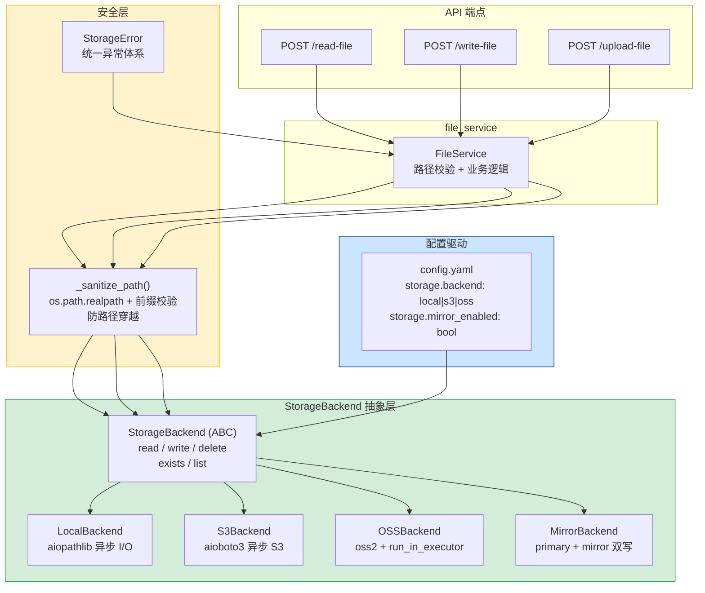

---

doc_type: module
prd_task_id: "YA-09-35"
title: "YA-09-35: 文件存储抽象层 — 本地/S3/OSS 多后端可插拔 — 开发方案"
status: 需求已编写
priority: P2
owner: 陈铭
roles: [engineer]
created: 2026-09-11
updated: 2026-09-23
project: YiAi
project_id: yiai
prd_month: "202609"
estimate_frontend: 1.5
source_prd: "24-需求-文件存储抽象层.md"
source_okr: [yiai-001]

type: task
---

# YA-09-35: 文件存储抽象层 — 本地/S3/OSS 多后端可插拔 — 开发方案

> 来源 PRD：[24-需求-文件存储抽象层.md](../../prds/2026-09/24-需求-文件存储抽象层.md)
> 需求编号：YA-09-35 · 优先级：P2 · 人天：1.5d
> 类型：架构 · 状态：需求已编写

---

## 一、架构概述

当前 YiAi 的文件操作直接依赖本地文件系统（`pathlib.Path` + `open()`），存在三个核心问题：无法切换到 S3/OSS 对象存储、`target_file` 参数无路径穿越防护、测试依赖真实文件系统无法隔离。本方案引入 **5 方法 `StorageBackend` 抽象接口**（read/write/delete/exists/list），通过配置驱动切换后端，可选 `primary + mirror` 双写模式。同时增加路径穿越防护（`_sanitize_path`）和统一异常体系。



### 设计决策回顾

| 决策 | 选项 | 选择 | 理由 |
|------|------|------|------|
| 接口粒度 | 5/8/POSIX 方法 | **5 方法** | 覆盖 90% 场景，S3/OSS 全兼容 |
| 异步实现 | aioboto3/boto3+executor/httpx | **aioboto3** | 真异步 I/O，性能最高 |
| 路径安全 | realpath/前缀校验/白名单 | **realpath + 前缀** | 防路径穿越，简单有效 |
| 双写模式 | 同步/异步/无 | **异步 mirror** | 不阻塞主写入流 |

---

## 二、文件清单

| # | 文件 | 操作 | 说明 | 预估行数 |
|---|------|------|------|----------|
| 1 | `src/domain/storage/__init__.py` | 新增 | 包初始化 + `create_backend()` 工厂函数 | +25 |
| 2 | `src/domain/storage/backend.py` | 新增 | `StorageBackend` ABC：5 个抽象方法 + `_sanitize_path` 静态方法 | +60 |
| 3 | `src/domain/storage/local.py` | 新增 | `LocalBackend`：基于 `aiofiles` + `aiopathlib` 的异步本地存储 | +80 |
| 4 | `src/domain/storage/s3.py` | 新增 | `S3Backend`：基于 `aioboto3` 的异步 S3 存储 | +100 |
| 5 | `src/domain/storage/oss.py` | 新增 | `OSSBackend`：基于 `oss2` + `run_in_executor` 的阿里云 OSS | +80 |
| 6 | `src/domain/storage/mirror.py` | 新增 | `MirrorBackend`：主后端 + 异步镜像到备用后端 | +60 |
| 7 | `src/domain/storage/errors.py` | 新增 | `StorageError` 统一异常体系 | +40 |
| 8 | `src/services/files/file_service.py` | 修改 | 替换直接 `Path` 操作为 `StorageBackend` 调用 | +20 / -30 |
| 9 | `src/server/routes.py` | 修改 | `/read-file`、`/write-file` 端点改用 `FileService` | +10 / -20 |
| 10 | `config.yaml` | 修改 | 新增 `storage` 配置段 | +15 |
| 11 | `tests/domain/storage/test_backends.py` | 新增 | 三后端 + mirror 集成测试（含路径穿越测试） | +150 |
| **合计** | | | | **~640 行** |

### 组件树

```
src/domain/storage/
├── __init__.py
│   └── def create_backend(config: StorageConfig) -> StorageBackend
│
├── backend.py                   # 抽象基类
│   ├── class StorageBackend(ABC)
│   │   ├── async def read(path: str) -> bytes
│   │   ├── async def write(path: str, data: bytes) -> None
│   │   ├── async def delete(path: str) -> None
│   │   ├── async def exists(path: str) -> bool
│   │   ├── async def list(prefix: str) -> list[str]
│   │   └── @staticmethod _sanitize_path(path: str, base_dir: str) -> str
│   │
├── local.py                     # 本地文件系统
│   └── class LocalBackend(StorageBackend)
│
├── s3.py                        # AWS S3
│   └── class S3Backend(StorageBackend)
│
├── oss.py                       # 阿里云 OSS
│   └── class OSSBackend(StorageBackend)
│
├── mirror.py                    # 双写镜像
│   └── class MirrorBackend(StorageBackend)
│       ├── primary: StorageBackend
│       ├── mirror: StorageBackend
│       └── _mirror_queue: asyncio.Queue
│
└── errors.py                    # 异常体系
    ├── class StorageError(Exception)
    ├── class FileNotFoundError(StorageError)
    ├── class PathTraversalError(StorageError)
    └── class BackendUnavailableError(StorageError)
```

---

## 三、模块设计

### 3.1 StorageBackend 抽象基类

```python
from abc import ABC, abstractmethod
from pathlib import Path
from typing import Optional

class StorageBackend(ABC):
    """文件存储后端抽象 — 5 方法接口，所有后端最小交集。"""

    @abstractmethod
    async def read(self, path: str) -> bytes:
        """读取文件内容 — path 为后端相对路径。"""
        ...

    @abstractmethod
    async def write(self, path: str, data: bytes) -> None:
        """写入文件 — 自动创建父目录（如适用）。"""
        ...

    @abstractmethod
    async def delete(self, path: str) -> None:
        """删除文件 — 文件不存在时应静默成功。"""
        ...

    @abstractmethod
    async def exists(self, path: str) -> bool:
        """检查文件是否存在。"""
        ...

    @abstractmethod
    async def list(self, prefix: str = "") -> list[str]:
        """列出指定前缀下的文件路径列表。"""
        ...

    @staticmethod
    def sanitize_path(user_path: str, base_dir: str) -> str:
        """
        路径穿越防护 — 解析绝对路径并校验前缀。

        规则:
          1. os.path.realpath() 解析符号链接和 ../
          2. 结果路径必须以 base_dir 开头
          3. 不允许路径包含 null 字节

        抛出: PathTraversalError
        """
        if "\x00" in user_path:
            raise PathTraversalError("路径包含非法字符")
        resolved = os.path.realpath(os.path.join(base_dir, user_path))
        if not resolved.startswith(os.path.realpath(base_dir)):
            raise PathTraversalError(
                f"路径穿越检测: {user_path} → {resolved}"
            )
        return resolved
```

### 3.2 LocalBackend 实现

```python
import aiofiles
import aiofiles.os
from pathlib import Path

class LocalBackend(StorageBackend):
    """本地文件系统后端 — 基于 aiofiles 异步 I/O。"""

    def __init__(self, base_dir: str = "./data/files") -> None:
        self._base_dir = os.path.realpath(base_dir)

    async def read(self, path: str) -> bytes:
        safe_path = self.sanitize_path(path, self._base_dir)
        async with aiofiles.open(safe_path, "rb") as f:
            return await f.read()

    async def write(self, path: str, data: bytes) -> None:
        safe_path = self.sanitize_path(path, self._base_dir)
        await aiofiles.os.makedirs(os.path.dirname(safe_path), exist_ok=True)
        async with aiofiles.open(safe_path, "wb") as f:
            await f.write(data)

    async def delete(self, path: str) -> None:
        safe_path = self.sanitize_path(path, self._base_dir)
        try:
            await aiofiles.os.remove(safe_path)
        except FileNotFoundError:
            pass  # 幂等删除

    async def exists(self, path: str) -> bool:
        safe_path = self.sanitize_path(path, self._base_dir)
        return await aiofiles.os.path.exists(safe_path)

    async def list(self, prefix: str = "") -> list[str]:
        base = os.path.join(self._base_dir, prefix)
        if not await aiofiles.os.path.exists(base):
            return []
        result = []
        for root, _, files in os.walk(base):
            for f in files:
                full = os.path.join(root, f)
                rel = os.path.relpath(full, self._base_dir)
                result.append(rel)
        return result
```

### 3.3 S3Backend 实现

```python
import aioboto3
from botocore.exceptions import ClientError

class S3Backend(StorageBackend):
    """AWS S3 后端 — 基于 aioboto3 异步 SDK。"""

    def __init__(
        self,
        bucket: str,
        prefix: str = "",
        region: str = "us-east-1",
        endpoint_url: Optional[str] = None,  # MinIO 兼容
    ) -> None:
        self._bucket = bucket
        self._prefix = prefix.strip("/")
        self._session = aioboto3.Session()
        self._client_kwargs = {
            "region_name": region,
            **({"endpoint_url": endpoint_url} if endpoint_url else {}),
        }

    def _full_key(self, path: str) -> str:
        return f"{self._prefix}/{path.lstrip('/')}" if self._prefix else path.lstrip("/")

    async def read(self, path: str) -> bytes:
        async with self._session.client("s3", **self._client_kwargs) as s3:
            try:
                resp = await s3.get_object(Bucket=self._bucket, Key=self._full_key(path))
                return await resp["Body"].read()
            except ClientError as e:
                if e.response["Error"]["Code"] == "NoSuchKey":
                    raise FileNotFoundError(path) from e
                raise BackendUnavailableError(str(e)) from e

    async def write(self, path: str, data: bytes) -> None:
        async with self._session.client("s3", **self._client_kwargs) as s3:
            await s3.put_object(Bucket=self._bucket, Key=self._full_key(path), Body=data)

    async def delete(self, path: str) -> None:
        async with self._session.client("s3", **self._client_kwargs) as s3:
            await s3.delete_object(Bucket=self._bucket, Key=self._full_key(path))

    async def exists(self, path: str) -> bool:
        async with self._session.client("s3", **self._client_kwargs) as s3:
            try:
                await s3.head_object(Bucket=self._bucket, Key=self._full_key(path))
                return True
            except ClientError:
                return False

    async def list(self, prefix: str = "") -> list[str]:
        async with self._session.client("s3", **self._client_kwargs) as s3:
            full_prefix = self._full_key(prefix)
            paginator = s3.get_paginator("list_objects_v2")
            result = []
            async for page in paginator.paginate(Bucket=self._bucket, Prefix=full_prefix):
                for obj in page.get("Contents", []):
                    key = obj["Key"]
                    if self._prefix:
                        key = key[len(self._prefix) + 1:]
                    result.append(key)
            return result
```

### 3.4 MirrorBackend

```python
import asyncio

class MirrorBackend(StorageBackend):
    """双写镜像后端 — 主后端写入成功后异步镜像到备用后端。"""

    def __init__(self, primary: StorageBackend, mirror: StorageBackend) -> None:
        self._primary = primary
        self._mirror = mirror
        self._mirror_queue: asyncio.Queue = asyncio.Queue()
        self._mirror_failures: int = 0
        self._mirror_task: Optional[asyncio.Task] = None

    async def start(self) -> None:
        """启动镜像 worker。"""
        self._mirror_task = asyncio.create_task(self._mirror_loop())

    async def _mirror_loop(self) -> None:
        while True:
            path, data = await self._mirror_queue.get()
            try:
                await self._mirror.write(path, data)
            except Exception as e:
                self._mirror_failures += 1
                logger.error(f"[MirrorBackend] 镜像写入失败: {path}: {e}")

    async def read(self, path: str) -> bytes:
        return await self._primary.read(path)

    async def write(self, path: str, data: bytes) -> None:
        await self._primary.write(path, data)
        await self._mirror_queue.put((path, data))  # 异步镜像

    async def delete(self, path: str) -> None:
        await self._primary.delete(path)
        await self._mirror_queue.put((path, b"__DELETE__"))

    async def exists(self, path: str) -> bool:
        return await self._primary.exists(path)

    async def list(self, prefix: str = "") -> list[str]:
        return await self._primary.list(prefix)
```

### 3.5 工厂函数与配置

```python
# src/domain/storage/__init__.py
from dataclasses import dataclass

@dataclass
class StorageConfig:
    backend: str = "local"          # local | s3 | oss
    local_base_dir: str = "./data/files"
    s3_bucket: str = ""
    s3_prefix: str = ""
    s3_region: str = "us-east-1"
    s3_endpoint_url: str = ""       # MinIO 兼容
    oss_bucket: str = ""
    oss_endpoint: str = ""
    oss_access_key: str = ""
    oss_secret_key: str = ""
    mirror_enabled: bool = False
    mirror_backend: str = "s3"

def create_backend(config: StorageConfig) -> StorageBackend:
    """工厂函数 — 根据配置创建存储后端实例。"""
    primary = _create_primary(config)
    if config.mirror_enabled:
        mirror = _create_mirror_backend(config)
        backend = MirrorBackend(primary, mirror)
        asyncio.get_event_loop().create_task(backend.start())
        return backend
    return primary
```

---

## 四、数据流

### 4.1 文件读取流（改造后）

```
YiVad POST /read-file {target_file: "knowledge/README.md"}
    │
    ▼
file_service.read_file("knowledge/README.md")
    │
    ├── 1. StorageBackend.sanitize_path("knowledge/README.md", base_dir)
    │      → os.path.realpath() → "/app/data/knowledge/README.md"
    │      → 前缀校验: 以 base_dir 开头 ✓
    │
    ├── 2. backend.read("knowledge/README.md")
    │      LocalBackend → aiofiles.open + read
    │      S3Backend    → aioboto3.get_object
    │
    ▼
bytes → {"content": "..."} → RPC 响应
```

### 4.2 文件写入流（双写模式）

```
YiVad POST /write-file {target_file: "uploads/image.png", content: "<base64>"}
    │
    ▼
MirrorBackend.write("uploads/image.png", decoded_bytes)
    │
    ├── 1. primary (LocalBackend).write("uploads/image.png", bytes)
    │      → 写入本地磁盘 ✓
    │
    └── 2. _mirror_queue.put(("uploads/image.png", bytes))
           → 异步 worker: mirror (S3Backend).write(...)
           → 失败不影响主流程，记录 mirror_failures 计数
    │
    ▼
RPC 响应: {code: 0}
```

---

## 五、实施路线图

### 阶段一：抽象层 + LocalBackend（0.5d）

| 步骤 | 任务 | 验证方式 | 产出 |
|------|------|---------|------|
| 1 | 创建 `StorageBackend` ABC + `StorageError` 异常体系 | ABC 实例化报 TypeError | `backend.py` + `errors.py` |
| 2 | 实现 `LocalBackend` + 路径穿越防护 | `../../etc/passwd` 被拒绝 | `local.py` |
| 3 | 实现工厂函数 `create_backend()` | config 驱动创建正确后端 | `__init__.py` |

### 阶段二：S3Backend + OSSBackend（0.5d）

| 步骤 | 任务 | 验证方式 | 产出 |
|------|------|---------|------|
| 4 | 实现 `S3Backend`（基于 aioboto3） | MinIO 本地测试通过 | `s3.py` |
| 5 | 实现 `OSSBackend`（基于 oss2 + executor） | OSS sandbox 测试通过 | `oss.py` |
| 6 | 实现 `MirrorBackend` 双写模式 | primary 写入 + mirror 异步复制 | `mirror.py` |

### 阶段三：集成 + 测试（0.5d）

| 步骤 | 任务 | 验证方式 | 产出 |
|------|------|---------|------|
| 7 | `file_service.py` + `routes.py` 切换到 `StorageBackend` | 现有 API 行为不变 | 修改现有文件 |
| 8 | `config.yaml` 增加 `storage` 配置段 | 配置切换后端生效 | `config.yaml` |
| 9 | 集成测试（三后端 + 路径穿越 + mirror） | pytest 全部通过 | `test_backends.py` |

**合计：1.5d。**

---

## 六、Code Review 检查清单

- [ ] `StorageBackend` 5 个方法全部为 `@abstractmethod`——防止子类遗漏
- [ ] `sanitize_path` 覆盖空字节注入 + `../` 穿越 + 符号链接遍历
- [ ] `LocalBackend.delete` 文件不存在时静默成功（幂等）
- [ ] `S3Backend` 使用连接池复用（`aioboto3.Session` 单例）
- [ ] `S3Backend.exists` 使用 `head_object` 而非 `get_object`（避免传输 body）
- [ ] `OSSBackend` 使用 `run_in_executor` 避免阻塞事件循环
- [ ] `MirrorBackend` 镜像失败不影响主写入流返回值
- [ ] `MirrorBackend._mirror_failures` 暴露监控指标
- [ ] 所有后端对同一文件的 `read` 行为一致（bytes 返回）
- [ ] 工厂函数处理不支持的 `backend` 值 → 抛出 `ValueError`

---

## 七、技术风险评估

| 风险 | 概率 | 影响 | 缓解措施 |
|------|------|------|---------|
| aioboto3 与 Python 3.12 兼容性 | 低 | 中 | 锁定 `aioboto3>=12.0`；备选 `boto3 + run_in_executor` |
| S3 prefix 路径拼接边界问题 | 中 | 中 | `_full_key()` 统一处理，单元测试覆盖边界 |
| MirrorBackend 队列积压 | 低 | 高 | 队列 `maxsize=1000` + 满时丢弃 mirror 写入 + 告警 |
| OSS SDK 同步阻塞事件循环 | 中 | 中 | `run_in_executor` 线程池；监控 executor 队列长度 |
| 测试环境无 MinIO/S3 | 高 | 低 | 默认测试使用 `LocalBackend`；CI 中启动 MinIO 容器 |

---

## 八、关联模块

- 依赖：[YA-09-06 数据层](./06-prd-task-数据层.md)
- 关联：[YA-09-27 数据查询缓存层](./29-prd-task-数据查询缓存层.md)
- 关联：[YA-09-137 Docker 部署](./137-prd-task-容器化与Docker部署.md)