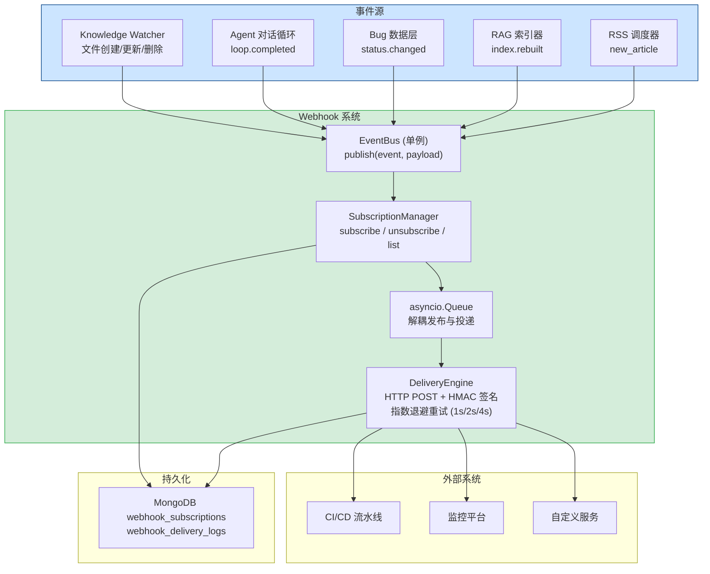

---

doc_type: module
prd_task_id: "YA-09-21"
title: "YA-09-21: Webhook 事件通知系统 — 关键事件订阅与异步推送 — 开发方案"
status: 需求已编写
priority: P2
owner: 陈铭
roles: [engineer]
created: 2026-09-11
updated: 2026-09-23
project: YiAi
project_id: yiai
prd_month: "202609"
estimate_frontend: 1.0
source_prd: "25-需求-Webhook事件通知.md"
source_okr: [yiai-001]

type: task
---

# YA-09-21: Webhook 事件通知系统 — 关键事件订阅与异步推送 — 开发方案

> 来源 PRD：[25-需求-Webhook事件通知.md](../../prds/2026-09/25-需求-Webhook事件通知.md)
> 需求编号：YA-09-21 · 优先级：P2 · 人天：1.0d
> 依赖：YA-09-31（结构化日志）· 类型：架构 · 状态：需求已编写

---

## 一、架构概述

YiAi 的关键事件（知识库文件变更、Agent 循环完成、Bug 状态更新）当前仅通过日志记录，外部系统无法实时感知内部状态变化。前端通过 60s 轮询获取状态，延迟\+资源浪费。本方案引入 **Webhook 事件通知系统**：定义 7 种标准事件类型，外部系统可订阅感兴趣的事件，事件发生时异步推送 HTTP POST 到订阅 URL，附带 HMAC 签名验证来源，支持指数退避重试（最多 3 次）。



### 事件类型定义

| 事件类型 | 触发时机 | Payload 字段 | 适用场景 |
|---------|---------|-------------|---------|
| `knowledge.file.created` | 知识监视器发现新文件 | `file_path`, `title`, `tags`, `category` | 触发内容审核流水线 |
| `knowledge.file.updated` | 知识文件内容变更 | `file_path`, `title`, `diff_summary` | 通知 CI 重新索引 |
| `knowledge.file.deleted` | 知识文件被删除 | `file_path`, `title` | 清理关联缓存 |
| `agent.loop.completed` | Agent 对话循环结束 | `session_key`, `tool_calls_count`, `duration_ms` | 触发后续自动化流程 |
| `bug.status.changed` | Bug 状态变更 | `bug_key`, `old_status`, `new_status`, `title` | 自动创建 Jira ticket |
| `rag.index.rebuilt` | RAG 索引重建完成 | `docs_count`, `duration_ms`, `index_size_mb` | 通知依赖服务刷新 |
| `rss.feed.new_article` | RSS 抓取到新文章 | `feed_url`, `article_title`, `article_link` | 触发内容分析流水线 |

---

## 二、文件清单

| # | 文件 | 操作 | 说明 | 预估行数 |
|---|------|------|------|----------|
| 1 | `src/services/events/__init__.py` | 新增 | 包初始化 + `init_webhook_system()` 启动函数 | +15 |
| 2 | `src/services/events/event_types.py` | 新增 | `EventType` 枚举 + `EventPayload` dataclass（7 种事件） | +40 |
| 3 | `src/services/events/event_bus.py` | 新增 | `EventBus` 单例：`publish()` + `subscribe()` + 队列解耦 | +70 |
| 4 | `src/services/events/webhook_manager.py` | 新增 | `WebhookManager`：订阅 CRUD + DeliveryEngine + HMAC 签名 | +150 |
| 5 | `src/services/events/webhook_routes.py` | 新增 | 管理 API（订阅/取消/列表/统计） | +60 |
| 6 | `src/domain/knowledge/watcher.py` | 修改 | 文件变更时调用 `EventBus.publish()` | +10 |
| 7 | `src/services/ai/agent.py` | 修改 | Agent 循环完成时调用 `EventBus.publish()` | +10 |
| 8 | `src/services/data/data_service.py` | 修改 | Bug 状态变更时调用 `EventBus.publish()` | +10 |
| 9 | `src/domain/rag/indexer.py` | 修改 | 索引重建完成时调用 `EventBus.publish()` | +10 |
| 10 | `tests/services/events/test_webhook.py` | 新增 | Webhook 订阅/推送/重试/HMAC 测试 | +130 |
| **合计** | | | | **~505 行** |

### 组件树

```
src/services/events/
├── __init__.py
│   └── async def init_webhook_system() -> None
│
├── event_types.py
│   ├── class EventType(str, Enum)     # 7 种事件
│   └── @dataclass EventPayload        # 事件载体
│       ├── type: EventType
│       ├── timestamp: datetime
│       ├── source: str
│       └── data: dict[str, Any]
│
├── event_bus.py
│   ├── class EventBus (单例)
│   │   ├── async def publish(event_type, data) -> None
│   │   ├── async def subscribe(callback) -> str  # 返回 sub_id
│   │   └── async def unsubscribe(sub_id) -> bool
│   │
├── webhook_manager.py
│   ├── @dataclass WebhookSubscription
│   │   ├── url, events, secret, active
│   │   ├── retry_count, created_at
│   │   └── stats: delivered, failed, retried
│   │
│   └── class WebhookManager
│       ├── async def subscribe(url, events) -> str
│       ├── async def unsubscribe(sub_id) -> bool
│       ├── async def list_subscriptions() -> list
│       ├── async def _deliver(sub, event, payload)
│       ├── def _generate_hmac(secret, body) -> str
│       └── async def get_stats() -> dict[str, int]
│
└── webhook_routes.py                  # FastAPI 管理端点
    ├── POST   /webhooks/subscribe
    ├── DELETE /webhooks/{sub_id}
    ├── GET    /webhooks/
    └── GET    /webhooks/stats
```

---

## 三、模块设计

### 3.1 EventBus 单例

```python
import asyncio
from dataclasses import dataclass, field
from datetime import datetime, timezone

@dataclass
class EventPayload:
    type: "EventType"
    timestamp: datetime = field(default_factory=lambda: datetime.now(timezone.utc))
    source: str = "yiai"
    data: dict[str, Any] = field(default_factory=dict)

class EventBus:
    """事件总线 — 单例模式，解耦事件发布与推送。"""

    _instance: Optional["EventBus"] = None
    _subscribers: dict[str, Callable[[EventPayload], Coroutine]]
    _queue: asyncio.Queue[EventPayload]

    def __new__(cls) -> "EventBus":
        if cls._instance is None:
            cls._instance = super().__new__(cls)
            cls._instance._subscribers = {}
            cls._instance._queue = asyncio.Queue(maxsize=1000)
        return cls._instance

    async def publish(
        self, event_type: "EventType", data: dict[str, Any]
    ) -> None:
        """
        发布事件 — 写入队列后立即返回，不阻塞调用方。

        用法（在 Knowledge Watcher 中）:
          await EventBus().publish(
              EventType.KNOWLEDGE_FILE_CREATED,
              {"file_path": "engineer/learn/01.md", "title": "..."},
          )
        """
        payload = EventPayload(type=event_type, data=data)
        try:
            self._queue.put_nowait(payload)
        except asyncio.QueueFull:
            logger.warning(
                f"[EventBus] 队列已满，丢弃事件: {event_type.value}"
            )

    async def _dispatch_loop(self) -> None:
        """后台循环 — 从队列取出事件，分发给 WebhookManager。"""
        while True:
            payload = await self._queue.get()
            # WebhookManager 监听事件总线
            await self._webhook_manager.on_event(payload)
```

### 3.2 WebhookManager 核心

```python
import hashlib
import hmac
import secrets
import httpx

@dataclass
class WebhookSubscription:
    url: str
    events: list["EventType"]
    secret: str                    # HMAC 密钥
    active: bool = True
    retry_limit: int = 3
    created_at: datetime = field(default_factory=datetime.utcnow)
    stats: dict = field(default_factory=lambda: {
        "delivered": 0, "failed": 0, "retried": 0
    })

class WebhookManager:
    """Webhook 订阅管理与异步推送。"""

    RETRY_INTERVALS = [1, 2, 4]  # 指数退避（秒）

    def __init__(self) -> None:
        self._subscriptions: dict[str, WebhookSubscription] = {}
        self._http = httpx.AsyncClient(
            timeout=httpx.Timeout(10.0),
            headers={"Content-Type": "application/json", "User-Agent": "YiAi-Webhook/1.0"},
        )

    async def subscribe(
        self, url: str, events: list["EventType"]
    ) -> dict[str, str]:
        """注册订阅 — 返回 sub_id + secret。"""
        secret = secrets.token_hex(16)
        sub_id = hashlib.sha256(
            f"{url}|{datetime.utcnow().isoformat()}".encode()
        ).hexdigest()[:12]
        self._subscriptions[sub_id] = WebhookSubscription(
            url=url, events=events, secret=secret,
        )
        await self._persist(sub_id)
        logger.info(
            f"[Webhook] 新增订阅: {sub_id} → {url}"
            f" ({len(events)} events)"
        )
        return {"sub_id": sub_id, "secret": secret}

    async def on_event(self, payload: EventPayload) -> None:
        """事件到达时匹配订阅者并异步推送。"""
        matching = [
            sub for sub in self._subscriptions.values()
            if payload.type in sub.events and sub.active
        ]
        if not matching:
            return
        tasks = [
            self._deliver(sub, payload) for sub in matching
        ]
        # 并发推送，不阻塞事件循环
        asyncio.create_task(self._gather_deliveries(tasks))

    async def _deliver(
        self,
        sub: WebhookSubscription,
        payload: EventPayload,
        attempt: int = 0,
    ) -> bool:
        """推送单个 Webhook — 含 HMAC 签名和重试。"""
        body = json.dumps({
            "event": payload.type.value,
            "timestamp": payload.timestamp.isoformat(),
            "data": payload.data,
        })
        signature = self._generate_hmac(sub.secret, body)

        try:
            resp = await self._http.post(
                sub.url,
                content=body,
                headers={"X-YiAi-Signature": signature},
            )
            if resp.status_code < 500:
                sub.stats["delivered"] += 1
                logger.debug(
                    f"[Webhook] 推送成功: {sub.url} "
                    f"event={payload.type.value} status={resp.status_code}"
                )
                return True
        except httpx.TimeoutException:
            logger.warning(
                f"[Webhook] 推送超时: {sub.url} "
                f"attempt={attempt + 1}"
            )
        except Exception as e:
            logger.error(f"[Webhook] 推送异常: {sub.url}: {e}")

        # 重试逻辑
        if attempt < sub.retry_limit:
            wait = self.RETRY_INTERVALS[min(attempt, len(self.RETRY_INTERVALS) - 1)]
            sub.stats["retried"] += 1
            logger.info(
                f"[Webhook] 重试 {attempt + 1}/{sub.retry_limit} "
                f"for {sub.url}, waiting {wait}s"
            )
            await asyncio.sleep(wait)
            return await self._deliver(sub, payload, attempt + 1)

        sub.stats["failed"] += 1
        logger.warning(
            f"[Webhook] 推送失败（已达最大重试）: {sub.url} "
            f"event={payload.type.value}"
        )
        return False

    @staticmethod
    def _generate_hmac(secret: str, body: str) -> str:
        """HMAC-SHA256 签名 — 接收方可用同密钥验证。"""
        return hmac.new(
            secret.encode(), body.encode(), hashlib.sha256
        ).hexdigest()
```

### 3.3 管理 API 端点

```python
# src/services/events/webhook_routes.py
from fastapi import APIRouter

router = APIRouter(prefix="/webhooks", tags=["webhooks"])

@router.post("/subscribe")
async def subscribe(
    url: str,
    events: list[str],  # EventType 值列表
) -> dict:
    """注册 Webhook 订阅，返回 sub_id + secret。"""
    event_types = [EventType(e) for e in events]
    return await webhook_manager.subscribe(url, event_types)

@router.delete("/{sub_id}")
async def unsubscribe(sub_id: str) -> dict:
    """取消 Webhook 订阅。"""
    success = await webhook_manager.unsubscribe(sub_id)
    return {"ok": success}

@router.get("/")
async def list_subscriptions() -> list[dict]:
    """列出所有活跃订阅。"""
    return await webhook_manager.list_subscriptions()

@router.get("/stats")
async def get_stats() -> dict[str, int]:
    """全局推送统计。"""
    return await webhook_manager.get_stats()
```

---

## 四、数据流

### 4.1 事件发布到推送全链路

```
Knowledge Watcher 检测文件变更
    │
    │  EventBus().publish(EventType.KNOWLEDGE_FILE_CREATED, {"file_path": "..."})
    ▼
EventBus._queue.put_nowait(payload)    # 写入队列（非阻塞）
    │
    │  _dispatch_loop 从队列取出
    ▼
WebhookManager.on_event(payload)
    │
    │  遍历 _subscriptions，匹配 event in sub.events
    ▼
匹配到 3 个订阅者
    │
    │  asyncio.create_task → 并发推送
    ▼
_deliver(sub_1, payload):
    ├── HMAC-SHA256 签名 (X-YiAi-Signature header)
    ├── httpx.POST → sub_1.url
    │   ├── 200 OK → stats.delivered++ ✓
    │   └── 502 Bad Gateway → retry (1s → 2s → 4s) → stats.failed++

_deliver(sub_2, payload):  # 并行
    └── httpx.POST → sub_2.url → 200 OK ✓

_deliver(sub_3, payload):  # 并行
    └── httpx.POST → sub_3.url → timeout → retry → 200 OK ✓
```

### 4.2 HMAC 验证流（接收方视角）

```
接收方收到 Webhook POST:
    │
    ├── 1. 从 header 获取 X-YiAi-Signature
    ├── 2. 使用订阅时获得的 secret 计算 HMAC-SHA256(body)
    ├── 3. 比较: hmac.compare_digest(computed, received)
    │       → 相等: 来源可信，处理 payload
    │       → 不等: 签名不匹配，拒绝请求 (403)
```

---

## 五、实施路线图

### 阶段一：核心实现（0.5d）

| 步骤 | 任务 | 验证方式 | 产出 |
|------|------|---------|------|
| 1 | 创建 `EventType` 枚举 + `EventPayload` dataclass | 7 种事件类型定义完整 | `event_types.py` |
| 2 | 实现 `EventBus` 单例 + 队列解耦 | publish 后队列可消费 | `event_bus.py` |
| 3 | 实现 `WebhookManager` 订阅 CRUD + HMAC 签名 | subscribe 返回 sub_id + secret | `webhook_manager.py` |

### 阶段二：集成 + 边界处理（0.5d）

| 步骤 | 任务 | 验证方式 | 产出 |
|------|------|---------|------|
| 4 | 事件源集成（Watcher/Agent/Bug/RAG/RSS 添加 publish 调用） | 事件发生时触发推送 | 4 个文件的少量修改 |
| 5 | 管理 API 端点 | subscribe/unsubscribe/list/stats 可用 | `webhook_routes.py` |
| 6 | 测试（订阅/推送/重试/HMAC/队列满/订阅者不存在） | pytest 全部通过 | `test_webhook.py` |
| 7 | 管理端点（订阅生命周期） | 集成测试通过 | 同上 |

**合计：1.0d。**

---

## 六、Code Review 检查清单

- [ ] `EventBus` 使用 `asyncio.Queue(maxsize=1000)` 防止内存无限增长
- [ ] 队列满时 `put_nowait` 捕获 `QueueFull`，丢弃事件 + WARNING 日志（不崩溃）
- [ ] `_deliver` 使用指数退避重试（1s/2s/4s），最多 3 次
- [ ] HMAC 密钥使用 `secrets.token_hex(16)` 生成（安全随机）
- [ ] `list_subscriptions` 返回数据脱敏——不暴露 `secret` 明文
- [ ] 推送超时设置 10s——避免慢订阅者阻塞其他订阅者
- [ ] Webhook URL 校验格式（至少 `http://` 或 `https://` 开头）
- [ ] 接收方 HMAC 验证使用 `hmac.compare_digest` 防时序攻击
- [ ] `_deliver` 方法中 `attempt` 参数正确递增
- [ ] 订阅 CRUD 持久化到 MongoDB `webhook_subscriptions` 集合

---

## 七、技术风险评估

| 风险 | 概率 | 影响 | 缓解措施 |
|------|------|------|---------|
| 目标 URL 不可达导致推送延迟 | 中 | 中 | 3 次重试后放弃；`active=False` 可选自动禁用 |
| 队列积压（事件产生快于推送） | 低 | 高 | `maxsize=1000` + 满时丢弃 + 监控 `queue.qsize()` |
| HMAC 密钥泄露 | 低 | 高 | 密钥仅订阅时返回一次，不存储明文（或加密存储） |
| 大量订阅者并发推送内存占用 | 低 | 中 | 限制单用户最多 10 个订阅 |
| 重试期间服务重启导致事件丢失 | 中 | 中 | 可选持久化到 `webhook_delivery_logs` 集合 |

---

## 八、关联模块

- 依赖：[YA-09-31 结构化日志](./35-prd-task-结构化日志.md)
- 关联：[YA-09-98 异步任务队列](./46-prd-task-异步任务队列.md)
- 关联：[YA-09-144 Webhook 集成系统](./144-prd-task-Webhook集成系统.md)