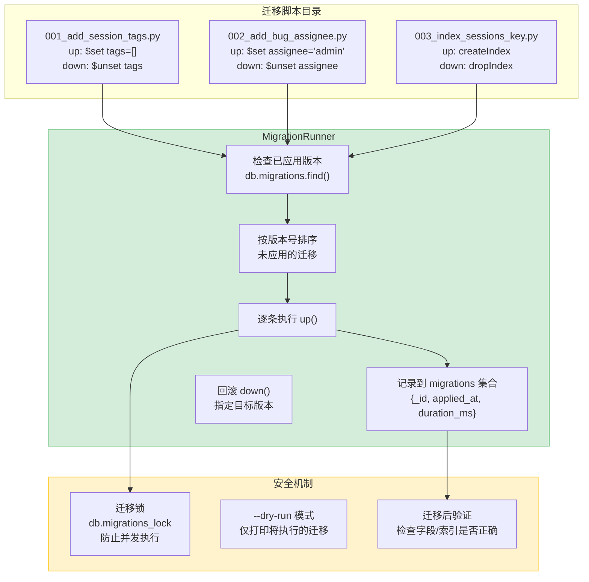

---

doc_type: module
prd_task_id: "YA-09-95"
title: "YA-09-95: MongoDB Schema 迁移 — 版本管理 + 滚动升级 — 开发方案"
status: 需求已编写
priority: P2
owner: 陈铭
roles: [engineer]
created: 2026-09-11
updated: 2026-09-23
project: YiAi
project_id: yiai
prd_month: "202609"
estimate_frontend: 1.5
source_prd: "26-需求-MongoDB-Schema迁移.md"
source_okr: [yiai-001]

type: task
---

# YA-09-95: MongoDB Schema 迁移 — 版本管理 + 滚动升级 — 开发方案

> 来源 PRD：[26-需求-MongoDB-Schema迁移.md](../../prds/2026-09/26-需求-MongoDB-Schema迁移.md)
> 需求编号：YA-09-95 · 优先级：P2 · 人天：1.5d
> 类型：架构 · 状态：需求已编写

---

## 一、架构概述

MongoDB 的 schemaless 特性意味着字段变更不会自动迁移存量数据。当前 YiAi 集合（sessions/bugs/knowledge_files）字段变更靠人工脚本或应用层兼容代码，缺乏版本追踪和回滚能力。本方案引入类 Django/ActiveRecord 风格的迁移系统：每个迁移脚本包含 `up()` 和 `down()` 方法，`MigrationRunner` 通过 `migrations` 集合追踪已应用版本，启动时自动执行未应用的迁移，支持回滚到指定版本。



---

## 二、文件清单

| # | 文件 | 操作 | 说明 | 预估行数 |
|---|------|------|------|----------|
| 1 | `src/shared/migrations/__init__.py` | 新增 | 包初始化 + `Migration` 协议定义 + `MigrationRunner` 导出 | +15 |
| 2 | `src/shared/migrations/runner.py` | 新增 | `MigrationRunner`：版本追踪/执行/回滚/锁/验证 | +120 |
| 3 | `src/shared/migrations/base.py` | 新增 | `BaseMigration` 抽象类：`up()`/`down()` + `id`/`description` | +30 |
| 4 | `migrations/001_add_session_tags.py` | 新增 | 示例迁移：sessions 增加 `tags` 字段默认值 | +20 |
| 5 | `migrations/002_add_bug_schema_version.py` | 新增 | 示例迁移：bugs 增加 `schema_version` 字段 | +20 |
| 6 | `src/app.py` | 修改 | lifespan startup 中调用 `MigrationRunner.migrate()` | +10 |
| 7 | `tests/shared/migrations/test_runner.py` | 新增 | 迁移执行/幂等/回滚/并发锁测试 | +120 |
| **合计** | | | | **~335 行** |

---

## 三、模块设计

### 3.1 Migration 协议与 Runner

```python
from abc import ABC, abstractmethod
from dataclasses import dataclass, field
from datetime import datetime, timezone
from typing import Any, Optional
from motor.motor_asyncio import AsyncIOMotorDatabase
import asyncio

class BaseMigration(ABC):
    """迁移脚本基类 — 每个迁移必须实现 up() 和 down()。"""

    @property
    @abstractmethod
    def id(self) -> str:
        """迁移唯一标识符，如 '001_add_session_tags'。"""
        ...

    @property
    @abstractmethod
    def description(self) -> str:
        """人类可读的迁移说明。"""
        ...

    @abstractmethod
    async def up(self, db: AsyncIOMotorDatabase) -> None:
        """执行迁移 — 向前推进 Schema。"""
        ...

    @abstractmethod
    async def down(self, db: AsyncIOMotorDatabase) -> None:
        """回滚迁移 — 恢复到迁移前状态。"""
        ...

@dataclass
class MigrationRecord:
    _id: str                          # 迁移 ID
    applied_at: datetime = field(default_factory=lambda: datetime.now(timezone.utc))
    duration_ms: float = 0.0
    success: bool = True

class MigrationRunner:
    """迁移执行器 — 版本追踪 + 滚动升级 + 回滚。"""

    LOCK_ID = "migration_lock"
    LOCK_TIMEOUT = 300  # 5 分钟

    def __init__(self, db: AsyncIOMotorDatabase, migrations: list[BaseMigration]):
        self._db = db
        self._migrations = sorted(migrations, key=lambda m: m.id)
        self._lock: Optional[asyncio.Lock] = None  # 进程级锁

    async def migrate(self, target: Optional[str] = None, dry_run: bool = False) -> list[str]:
        """
        执行所有未应用的迁移，或迁移到指定 target 版本。

        流程:
          1. 获取分布式锁（MongoDB migrations_lock 集合）
          2. 查询已应用迁移列表
          3. 按版本号排序，过滤未应用的
          4. 逐条执行 up()
          5. 记录执行结果到 migrations 集合
          6. 释放锁

        返回: 成功执行的迁移 ID 列表。
        """
        if not await self._acquire_lock():
            raise MigrationError("无法获取迁移锁——可能有其他实例正在执行迁移")

        try:
            applied = await self._get_applied_ids()
            pending = [m for m in self._migrations if m.id not in applied]

            if target:
                pending = [m for m in pending if m.id <= target]

            if dry_run:
                return [m.id for m in pending]

            executed = []
            for migration in pending:
                start = datetime.now(timezone.utc)
                try:
                    await migration.up(self._db)
                    duration = (datetime.now(timezone.utc) - start).total_seconds() * 1000
                    await self._db.migrations.insert_one({
                        "_id": migration.id,
                        "applied_at": datetime.now(timezone.utc),
                        "duration_ms": duration,
                        "success": True,
                    })
                    executed.append(migration.id)
                    logger.info(
                        f"[Migration] ✓ {migration.id}: {migration.description}"
                        f" ({duration:.0f}ms)"
                    )
                except Exception as e:
                    logger.error(f"[Migration] ✗ {migration.id}: {e}")
                    raise MigrationError(
                        f"迁移 {migration.id} 失败: {e}"
                    ) from e
            return executed
        finally:
            await self._release_lock()

    async def rollback(self, target_id: str, dry_run: bool = False) -> list[str]:
        """
        回滚到指定版本——从最新已应用迁移开始，依次执行 down()。

        参数:
          target_id: 回滚目标版本（此版本及之后的将被回滚）
        """
        if not await self._acquire_lock():
            raise MigrationError("无法获取迁移锁")
        try:
            applied = await self._get_applied_ids()
            to_rollback = [
                m for m in reversed(self._migrations)
                if m.id in applied and m.id >= target_id
            ]
            if dry_run:
                return [m.id for m in to_rollback]
            rolled_back = []
            for migration in to_rollback:
                await migration.down(self._db)
                await self._db.migrations.delete_one({"_id": migration.id})
                rolled_back.append(migration.id)
                logger.info(f"[Migration] ↺ 回滚: {migration.id}")
            return rolled_back
        finally:
            await self._release_lock()

    async def _acquire_lock(self) -> bool:
        """获取分布式锁——防止多个进程并发执行迁移。"""
        try:
            result = await self._db.migrations_lock.find_one_and_update(
                {"_id": self.LOCK_ID, "locked": {"$ne": True}},
                {"$set": {
                    "locked": True,
                    "locked_at": datetime.now(timezone.utc),
                }},
                upsert=True,
                return_document=True,
            )
            return result is not None
        except Exception:
            return False

    async def _release_lock(self) -> None:
        await self._db.migrations_lock.update_one(
            {"_id": self.LOCK_ID},
            {"$set": {"locked": False}},
        )

    async def _get_applied_ids(self) -> set[str]:
        cursor = self._db.migrations.find({"success": True}, {"_id": 1})
        return {doc["_id"] async for doc in cursor}

    async def status(self) -> dict[str, Any]:
        """迁移状态：总数/已应用/未应用列表。"""
        applied = await self._get_applied_ids()
        return {
            "total": len(self._migrations),
            "applied": len(applied),
            "pending": [m.id for m in self._migrations if m.id not in applied],
            "applied_list": sorted(applied),
        }
```

### 3.2 迁移脚本示例

```python
# migrations/001_add_session_tags.py
from shared.migrations.base import BaseMigration
from motor.motor_asyncio import AsyncIOMotorDatabase

class Migration(BaseMigration):
    id = "001_add_session_tags"
    description = "为 sessions 集合添加 tags 字段，默认空数组"

    async def up(self, db: AsyncIOMotorDatabase) -> None:
        result = await db.sessions.update_many(
            {"tags": {"$exists": False}},
            {"$set": {"tags": []}},
        )
        logger.info(
            f"[001] 更新 {result.modified_count} 条 session 记录"
        )

    async def down(self, db: AsyncIOMotorDatabase) -> None:
        await db.sessions.update_many(
            {},
            {"$unset": {"tags": ""}},
        )
```

---

## 四、数据流

### 4.1 启动时自动迁移

```
YiAi 启动 (main.py → lifespan)
    │
    │  from shared.migrations.runner import MigrationRunner
    │  runner = MigrationRunner(db, MIGRATIONS)
    │  await runner.migrate()
    ▼
MigrationRunner.migrate()
    │
    ├── 1. _acquire_lock()
    │      尝试在 migrations_lock 集合中 upsert: {locked: false} → {locked: true}
    │      → 失败（另一实例正在迁移）→ 抛出 MigrationError（但不阻止服务启动）
    │
    ├── 2. _get_applied_ids()
    │      查询 db.migrations.find({success: true}) → {"001", "002"}
    │
    ├── 3. 排序 migrations 列表 → 过滤已应用的
    │      未应用: ["003_add_index", "004_add_rag_metadata"]
    │
    ├── 4. 逐条执行:
    │      003_add_index.up(db) → createIndex → 插入 migrations record
    │      004_add_rag_metadata.up(db) → $set → 插入 migrations record
    │
    └── 5. _release_lock()
    │
    ▼
迁移完成 → 服务继续启动
```

---

## 五、实施路线图

### 阶段一：MigrationRunner 核心（0.75d）

| 步骤 | 任务 | 验证方式 | 产出 |
|------|------|---------|------|
| 1 | 创建 `BaseMigration` 抽象类 + 迁移 ID 规范 | 子类可实例化 | `base.py` |
| 2 | 实现 `MigrationRunner.migrate()` + 版本追踪 | 幂等执行（重复调用不重复迁移） | `runner.py` |
| 3 | 实现分布式锁（`migrations_lock` 集合） | 并发启动时仅一个实例执行 | 同上 |
| 4 | 创建示例迁移脚本（`001`、`002`） | up/down 可执行 | `migrations/` |

### 阶段二：回滚 + 集成 + 测试（0.75d）

| 步骤 | 任务 | 验证方式 | 产出 |
|------|------|---------|------|
| 5 | 实现 `rollback()` 方法 + `--dry-run` 模式 | 回滚后字段/索引恢复原状 | `runner.py` |
| 6 | lifespan startup 集成 | 启动时自动执行未应用迁移 | `app.py` |
| 7 | 测试（执行/幂等/回滚/并发锁/迁移失败处理） | pytest 全部通过 | `test_runner.py` |

**合计：1.5d。**

---

## 六、Code Review 检查清单

- [ ] 迁移脚本 `id` 命名规范：`{序号}_{描述}`，如 `001_add_session_tags`
- [ ] `up()` 操作使用 `{"$exists": False}` 条件——只更新缺少字段的文档
- [ ] `down()` 方法正确恢复 up() 之前的 Schema 状态
- [ ] `MigrationRunner` 分布式锁防止并发执行——5 分钟超时自动释放
- [ ] 迁移失败时停止后续迁移（不跳过）——保持 Schema 一致性
- [ ] 迁移执行时间记录到 `migrations` 集合（`duration_ms` 字段）
- [ ] `--dry-run` 模式仅打印将执行的迁移，不做实际修改
- [ ] 禁止在迁移中删除字段——先废弃标记，确认无引用后再删除
- [ ] 迁移中使用 `allowDiskUse: true`（如果涉及大量数据更新）
- [ ] 迁移脚本文件名与 `id` 一致——方便人工查找

---

## 七、技术风险评估

| 风险 | 概率 | 影响 | 缓解措施 |
|------|------|------|---------|
| 迁移执行期间服务重启导致部分执行 | 低 | 高 | 每条迁移是原子操作 + 分布式锁；重启后从未应用的开始 |
| 大集合迁移耗时过长 | 中 | 中 | 分批 `update_many` + `allowDiskUse`；监控进度日志 |
| 分布式锁未释放（进程 crash） | 低 | 高 | 锁 5 分钟自动超时；手动 Admin API 解锁 |
| 回滚时数据丢失 | 中 | 高 | `down()` 测试覆盖；生产环境回滚前备份集合 |
| 迁移 ID 冲突（多人并行开发） | 中 | 低 | 迁移 ID 含日期前缀，如 `20260911_001_xxx` |

---

## 八、关联模块

- 基础：[YA-09-06 数据层](./06-prd-task-数据层.md)
- 关联：[YA-09-110 数据库迁移工具](./110-prd-task-数据库迁移工具.md)
- 关联：[YA-09-114 Schema 兼容性检测](./114-prd-task-Schema兼容性检测.md)