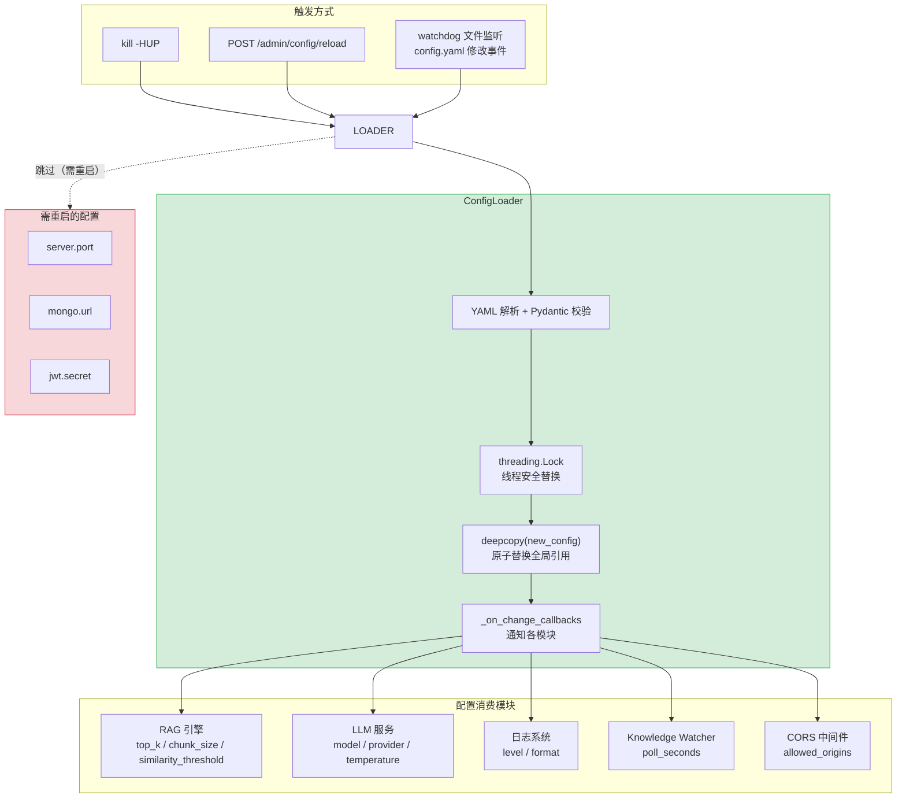

---

doc_type: module
prd_task_id: "YA-09-72"
title: "YA-09-72: 配置中心热更新 — SIGHUP + YAML watch + 通知 — 开发方案"
status: 需求已编写
priority: P2
owner: 陈铭
roles: [engineer]
created: 2026-09-11
updated: 2026-09-23
project: YiAi
project_id: yiai
prd_month: "202609"
estimate_frontend: 0.5
source_prd: "27-需求-配置中心热更新.md"
source_okr: [yiai-001]

type: task
---

# YA-09-72: 配置中心热更新 — SIGHUP + YAML watch + 通知 — 开发方案

> 来源 PRD：[27-需求-配置中心热更新.md](../../prds/2026-09/27-需求-配置中心热更新.md)
> 需求编号：YA-09-72 · 优先级：P2 · 人天：0.5d
> 类型：架构 · 状态：需求已编写

---

## 一、架构概述

当前 YiAi 的 `config.yaml` 仅在启动时加载，任何配置变更需要重启服务才能生效——影响可用性且违背 12-Factor App 原则。本方案通过 **SIGHUP 信号** + **Admin API** + **可选 watchdog 文件监听** 三种方式触发配置热更新。Loader 层实现线程安全的配置替换（`threading.Lock` + `copy.deepcopy`），变更后通过回调通知各模块刷新依赖（如 RAG `top_k`、日志级别、LLM `model` 等）。



### 可热更新 vs 需重启

| 可热更新 | 触发方式 | 需重启 | 原因 |
|---------|---------|--------|------|
| `rag.top_k`、`rag.chunk_size`、`rag.similarity_threshold` | SIGHUP/API/Watch | — | 查询参数，无状态 |
| `llm.model`、`llm.provider`、`llm.temperature` | SIGHUP/API/Watch | — | 每次调用读取最新配置 |
| `knowledge.watcher_poll_seconds` | SIGHUP/API/Watch | — | apscheduler reschedule |
| `logging.level`、`logging.format` | SIGHUP/API/Watch | — | `logging.setLevel()` |
| `cors.allowed_origins` | SIGHUP/API/Watch | — | Starlette 中间件支持运行时更新 |
| — | — | `server.port` | uvicorn 启动时绑定，不可改 |
| — | — | `mongo.url` | Motor 连接池启动时建立 |
| — | — | `jwt.secret` | 已签发 Token 仍用旧密钥 |

---

## 二、文件清单

| # | 文件 | 操作 | 说明 | 预估行数 |
|---|------|------|------|----------|
| 1 | `src/shared/config/__init__.py` | 修改 | 导出 `ConfigLoader` + `settings` 全局单例 | +15 |
| 2 | `src/shared/config/loader.py` | 新增 | `ConfigLoader` 类：加载/重载/校验/回调通知 | +100 |
| 3 | `src/shared/config/hot_reload.py` | 新增 | `HotReloadManager`：SIGHUP + Admin API + watchdog 集成 | +60 |
| 4 | `src/server/routes.py` | 修改 | 新增 `POST /admin/config/reload` 端点 | +15 |
| 5 | `src/app.py` | 修改 | lifespan startup 注册 SIGHUP handler | +10 |
| 6 | `tests/shared/config/test_hot_reload.py` | 新增 | 重载/校验/回调/线程安全测试 | +80 |
| **合计** | | | | **~280 行** |

---

## 三、模块设计

### 3.1 ConfigLoader

```python
import copy
import signal
import threading
from pathlib import Path
from typing import Any, Callable, Optional

import yaml
from pydantic import ValidationError

logger = logging.getLogger(__name__)

class ConfigLoader:
    """线程安全的配置加载器 — 支持热更新 + 变更回调。"""

    def __init__(self, config_path: Path) -> None:
        self._config_path = config_path
        self._lock = threading.Lock()
        self._callbacks: list[Callable[[dict, dict], None]] = []
        self._config: dict[str, Any] = {}
        self.load()

    def load(self) -> dict[str, Any]:
        """从 YAML 加载配置 — 解析 + Pydantic 校验。"""
        raw = yaml.safe_load(self._config_path.read_text(encoding="utf-8"))
        config = self._validate(raw)

        with self._lock:
            old_config = copy.deepcopy(self._config)
            self._config = config

        # 通知变更回调
        if old_config:
            self._notify_changes(old_config, config)

        logger.info(
            f"[Config] 配置已加载: {len(config)} 个顶级键"
        )
        return config

    def reload(self) -> dict[str, Any]:
        """热更新 — 重新加载 YAML 并应用变更。"""
        logger.info("[Config] 收到热更新信号，重新加载配置...")
        return self.load()

    def get(self, key: str, default: Any = None) -> Any:
        """线程安全读取 — 点分隔路径，如 'rag.top_k'。"""
        with self._lock:
            config = self._config
        keys = key.split(".")
        for k in keys:
            if isinstance(config, dict):
                config = config.get(k)
            else:
                return default
        return config if config is not None else default

    def on_change(self, callback: Callable[[dict, dict], None]) -> None:
        """注册配置变更回调 — callback(old_config, new_config)。"""
        self._callbacks.append(callback)

    def _notify_changes(self, old: dict, new: dict) -> None:
        """调用所有注册的回调，传递变更前后配置。"""
        for cb in self._callbacks:
            try:
                cb(old, new)
            except Exception as e:
                logger.error(f"[Config] 回调异常: {cb.__name__}: {e}")

    def _validate(self, raw: dict) -> dict:
        """Pydantic 校验配置结构。"""
        try:
            from shared.config.schema import AppConfig
            return AppConfig(**raw).model_dump()
        except ValidationError as e:
            logger.error(f"[Config] 配置校验失败: {e}")
            raise
```

### 3.2 HotReloadManager

```python
import signal
from watchdog.observers import Observer
from watchdog.events import FileSystemEventHandler

class ConfigFileHandler(FileSystemEventHandler):
    """watchdog 文件变更处理器 — config.yaml 修改时触发重载。"""
    def __init__(self, loader: ConfigLoader) -> None:
        self._loader = loader
        self._debounce_seconds = 2.0  # 防抖：2s 内多次修改只触发一次重载

    def on_modified(self, event) -> None:
        if event.src_path.endswith("config.yaml"):
            logger.info("[Config] watchdog 检测到 config.yaml 修改")
            self._loader.reload()

class HotReloadManager:
    """热更新管理器 — 注册 SIGHUP handler + 可选 watchdog。"""

    def __init__(self, loader: ConfigLoader, use_watchdog: bool = False) -> None:
        self._loader = loader
        # 注册 SIGHUP 处理器
        signal.signal(signal.SIGHUP, self._on_sighup)
        # 可选 watchdog
        self._observer: Optional[Observer] = None
        if use_watchdog:
            self._observer = Observer()
            self._observer.schedule(
                ConfigFileHandler(loader),
                path=str(loader._config_path.parent),
                recursive=False,
            )
            self._observer.start()
            logger.info("[Config] watchdog 文件监听已启动")

    def _on_sighup(self, signum: int, frame: Any) -> None:
        """SIGHUP 信号处理器 — kill -HUP <pid> 触发重载。"""
        logger.info("[Config] 收到 SIGHUP 信号")
        try:
            self._loader.reload()
        except Exception as e:
            logger.error(f"[Config] SIGHUP 重载失败: {e}")

    def shutdown(self) -> None:
        if self._observer:
            self._observer.stop()
            self._observer.join()
```

### 3.3 Admin API

```python
# src/server/routes.py
from fastapi import APIRouter

admin_router = APIRouter(prefix="/admin", tags=["admin"])

@admin_router.post("/config/reload")
async def reload_config():
    """手动触发配置热更新。"""
    try:
        new_config = settings.reload()
        return {
            "code": 0,
            "message": "配置已重载",
            "data": {
                "keys": list(new_config.keys()),
                "rag_top_k": new_config.get("rag", {}).get("top_k"),
                "llm_model": new_config.get("llm", {}).get("model"),
            },
        }
    except Exception as e:
        return {"code": 5001, "message": f"重载失败: {e}"}
```

---

## 四、数据流

```
kill -HUP <pid> 或 POST /admin/config/reload
    │
    ▼
ConfigLoader.reload()
    │
    ├── 1. yaml.safe_load(config.yaml) → raw dict
    │
    ├── 2. Pydantic AppConfig(**raw) → 校验通过
    │
    ├── 3. threading.Lock()
    │       deepcopy(new_config) → 原子替换 self._config
    │
    ├── 4. _notify_changes(old, new)
    │       ├── RAG callback: 对比 rag.top_k 是否变化 → 更新查询参数
    │       ├── LLM callback: 对比 llm.model → 重建 model runtime
    │       ├── Log callback: 对比 logging.level → logging.setLevel()
    │       └── CORS callback: 对比 cors.origins → 更新中间件
    │
    └── 5. logger.info("[Config] 热更新完成: X keys loaded")
    │
    ▼
所有模块使用最新配置（线程安全读取）
```

---

## 五、实施路线图

| 步骤 | 任务 | 验证方式 | 人天 |
|------|------|---------|------|
| 1 | 重构 `ConfigLoader`：线程安全 + 回调机制 | 并发读写不 crash | 0.1 |
| 2 | SIGHUP handler + Admin API 端点 | `kill -HUP` 触发重载 | 0.1 |
| 3 | 模块回调注册（RAG/LLM/Log/CORS） | 配置变更后模块行为更新 | 0.15 |
| 4 | 可选 watchdog 文件监听 | 修改 config.yaml 自动重载 | 0.05 |
| 5 | 测试（重载/校验失败/回调异常/线程安全） | pytest 全部通过 | 0.1 |

**合计：0.5d。**

---

## 六、Code Review 检查清单

- [ ] `ConfigLoader.reload()` 校验失败时不替换现有配置（保留旧配置运行）
- [ ] `threading.Lock` 保护 `self._config` 读写——异步上下文中使用 `copy` 后释放锁
- [ ] 回调异常不影响其他回调执行——`try/except` 包装每个回调
- [ ] SIGHUP handler 中不执行阻塞操作——仅调用 `reload()`
- [ ] Admin API `/admin/config/reload` 需管理员权限
- [ ] watchdog 防抖（2s）——避免编辑器保存时触发多次重载
- [ ] 不可热更新的配置项（port/mongo.url/jwt.secret）重载时跳过 + WARNING 日志
- [ ] `ConfigLoader.get()` 使用点分隔路径，缺失时返回 `default`
- [ ] 重载失败时返回明确错误信息到 Admin API 响应

---

## 七、技术风险评估

| 风险 | 概率 | 影响 | 缓解措施 |
|------|------|------|---------|
| YAML 格式错误导致重载失败 | 中 | 中 | 校验失败不替换旧配置——服务继续运行 |
| 回调异常导致部分模块使用旧配置 | 低 | 中 | 每个回调 try/except 隔离 |
| watchdog 在容器环境中不工作 | 低 | 低 | watchdog 可选——默认关闭，生产环境用 SIGHUP |
| threading.Lock 与 asyncio 不兼容 | 低 | 高 | `get()` 方法用 `copy` 快速释放锁；不在锁内 await |

---

## 八、关联模块

- 集成：[YA-09-28 服务优雅关闭](./28-prd-task-服务优雅关闭.md)
- 关联：[YA-09-52 配置漂移检测](./52-prd-task-配置漂移检测.md)
- 关联：[YA-09-147 多环境配置管理](./147-prd-task-多环境配置管理.md)