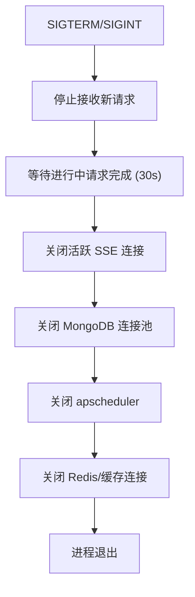

# YA-09-17: 服务优雅关闭 — 连接池/定时任务/SSE 连接的安全停止 — 开发方案

> **文档职责**：本文档定义**怎么做、为什么这么做、实际做成什么样**（HOW），不含产品目标与测试用例。

> 来源 PRD：[28-需求-服务优雅关闭.md](../../prds/2026-09/28-需求-服务优雅关闭.md)
> 需求编号：YA-09-17 · 优先级：P1 · 人天：1.0d · 状态：需求已编写

---

## 一、方案

FastAPI lifespan 的 `yield` 之后为关闭阶段。确保所有资源正确释放：

### 关闭顺序（关键）

不按顺序关闭会导致资源泄漏或请求失败——必须**先断开外部连接，再释放内部资源**：

| 顺序 | 资源 | 超时 | 说明 |
|------|------|------|------|
| 1 | HTTP 请求 | 30s | 等待进行中请求完成 |
| 2 | SSE 连接 | 5s | 发送最后一帧后关闭 |
| 3 | MongoDB 连接池 | 10s | `db.close()` |
| 4 | apscheduler | 5s | `scheduler.shutdown()` |
| 5 | Redis/缓存 | 5s | `cache.close()` |

---

## 二、实施步骤

| 步骤 | 验证 | 人天 |
|------|------|------|
| 1 | `lifespan shutdown` 按序关闭 | `kill -TERM` 后无资源泄漏日志 | 0.5 |
| 2 | SSE 连接优雅关闭 + 测试 | 客户端收到最后一帧 | 0.5 |

**合计：1.0d**。

---

## 三、关联模块

- 集成：`src/app.py` lifespan
- 关联：[K8s 健康探针](./20-prd-task-服务健康检查与就绪探针.md)