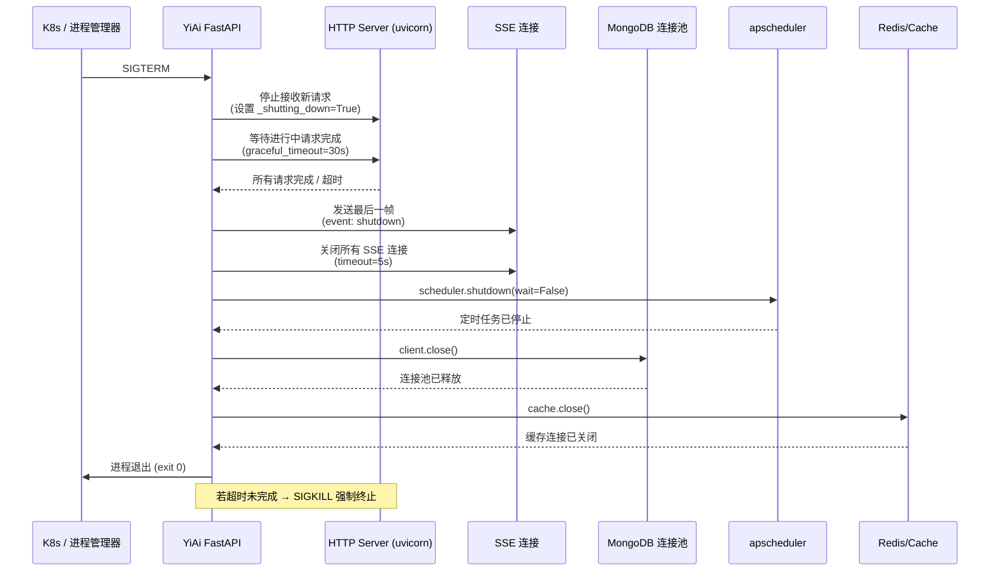

---

doc_type: module
prd_task_id: "YA-09-17"
title: "YA-09-17: 服务优雅关闭 — 连接池/定时任务/SSE 连接的安全停止 — 开发方案"
status: 需求已编写
priority: P1
owner: 陈铭
roles: [engineer]
created: 2026-09-11
updated: 2026-09-23
project: YiAi
project_id: yiai
prd_month: "202609"
estimate_frontend: 1.0
source_prd: "28-需求-服务优雅关闭.md"
source_okr: [yiai-001]
related_tests: ["28-prd-test-服务优雅关闭"]
acceptance_criteria:
  - SIGTERM 后 30s 内完成所有资源关闭，新请求收到 503 响应
  - SSE 连接在关闭前收到 `event: shutdown` 通知帧
  - MongoDB 连接池正确释放（无连接泄漏日志）
  - apscheduler 定时任务停止，无孤儿任务继续执行
  - K8s preStop hook + readiness probe 联动：摘除 Pod → 排空 → 关闭资源

type: task
---

# YA-09-17: 服务优雅关闭 — 连接池/定时任务/SSE 连接的安全停止 — 开发方案

| 属性 | 值 |
|------|-----|
| 文档编号 | YA-09-17 |
| 版本 | v1.1 |
| 密级 | 内部 |
| 作者 | 陈铭 |
| 审核人 | — |
| 状态 | 需求已编写 |
| 最后更新 | 2026-09-23 |

> 来源 PRD：[28-需求-服务优雅关闭.md](../../prds/2026-09/28-需求-服务优雅关闭.md)
> 需求编号：YA-09-17 · 优先级：P1 · 人天：1.0d
> 类型：架构 · 状态：需求已编写

---

## 目录

1. [架构概述](#一架构概述)
2. [设计约束](#二设计约束)
3. [文件清单](#三文件清单)
4. [模块设计](#四模块设计)
5. [数据流](#五数据流)
6. [实施路线图](#六实施路线图)
7. [非功能性设计](#七非功能性设计)
8. [测试策略](#八测试策略)
9. [技术风险评估](#九技术风险评估)
10. [关联模块](#十关联模块)
附录 A. [变更记录](#附录-a-变更记录)

---

## 一、架构概述

当前 YiAi 收到 `SIGTERM` 时直接退出，不等待进行中请求完成，不关闭 MongoDB 连接池，不停止 apscheduler 定时任务——导致请求中断、连接泄漏、定时任务孤儿。本方案实现完整的优雅关闭流程：FastAPI lifespan shutdown 阶段按严格顺序释放资源（外→内），Kubernetes `preStop` hook 兼容，支持超时保护和强制终止。


```mermaid
sequenceDiagram
    participant K8S as K8s / 进程管理器
    participant App as YiAi FastAPI
    participant HTTP as HTTP Server (uvicorn)
    participant SSE as SSE 连接
    participant DB as MongoDB 连接池
    participant Sched as apscheduler
    participant Cache as Redis/Cache

    K8S->>App: SIGTERM
    App->>HTTP: 停止接收新请求<br/>(设置 _shutting_down=True)
    App->>HTTP: 等待进行中请求完成<br/>(graceful_timeout=30s)
    HTTP-->>App: 所有请求完成 / 超时

    App->>SSE: 发送最后一帧<br/>(event: shutdown)
    App->>SSE: 关闭所有 SSE 连接<br/>(timeout=5s)

    App->>Sched: scheduler.shutdown(wait=False)
    Sched-->>App: 定时任务已停止

    App->>DB: client.close()
    DB-->>App: 连接池已释放

    App->>Cache: cache.close()
    Cache-->>App: 缓存连接已关闭

    App->>K8S: 进程退出 (exit 0)

    Note over App,HTTP: 若超时未完成 → SIGKILL 强制终止
```

### 关闭顺序与超时

| 顺序 | 资源 | 操作 | 超时 | 说明 |
|------|------|------|------|------|
| 0 | 就绪探针 | `readiness_probe → False` | 即时 | K8s 停止路由新流量 |
| 1 | HTTP 请求 | 停止接收 + 等待完成 | 30s | `_shutting_down` 标志拦截新请求 |
| 2 | SSE 连接 | 发送 `shutdown` 事件 + 关闭 | 5s | 客户端安全断开 |
| 3 | apscheduler | `scheduler.shutdown(wait=False)` | 5s | 等待当前 job 完成 |
| 4 | MongoDB 连接池 | `motor_client.close()` | 10s | Motor 异步关闭 |
| 5 | Redis/Cache | `aioredis.close()` | 5s | 缓存连接关闭 |
| 6 | HTTP 连接 | `uvicorn server.close()` | 5s | 关闭监听端口 |
| 7 | 进程 | `sys.exit(0)` | — | 正常退出 |

---

<a id="sec-2"></a>
## 二、设计约束

| 约束项 | 说明 |
|--------|------|
| 关闭顺序不可颠倒 | HTTP → SSE → Scheduler → DB → Cache，外→内严格顺序 |
| 总超时兜底 | 所有资源关闭总耗时 ≤ 30s，超时后强制退出（对齐 K8s terminationGracePeriodSeconds） |
| 幂等关闭 | `shutdown()` 多次调用不重复执行，防止 SIGTERM + lifespan shutdown 竞争 |
| 新请求拒绝 | `_shutting_down=True` 后中间件立即返回 503，配合 K8s readiness probe 摘除 Pod |
| 资源关闭失败不阻塞 | 单个资源关闭异常不影响后续资源的关闭（try/except 保护） |
| SSE 优雅通知 | 关闭前向所有活跃 SSE 连接发送 `event: shutdown` 帧，给客户端 5s 处理时间 |

---

<a id="sec-3"></a>
## 三、文件清单

| # | 文件 | 操作 | 说明 | 预估行数 |
|---|------|------|------|----------|
| 1 | `src/app.py` | 修改 | 完整的 lifespan shutdown 实现 + `_shutting_down` 全局标志 | +80 |
| 2 | `src/shared/lifecycle.py` | 新增 | `GracefulShutdown` 类：资源注册/有序关闭/超时保护 | +100 |
| 3 | `src/shared/middleware.py` | 修改 | 新增 `ShutdownMiddleware`：检查 `_shutting_down` 标志，拒绝新请求 | +30 |
| 4 | `src/server/routes.py` | 修改 | 新增 `GET /healthz/ready` 就绪探针端点 | +20 |
| 5 | `tests/shared/test_lifecycle.py` | 新增 | 优雅关闭流程测试（正常/超时/SSE 关闭） | +100 |
| **合计** | | | | **~330 行** |

---

## 四、模块设计

### 3.1 GracefulShutdown

```python
import asyncio
import signal
import sys
from dataclasses import dataclass, field
from typing import Any, Callable, Coroutine, Optional

logger = logging.getLogger(__name__)

@dataclass
class ShutdownResource:
    name: str
    close: Callable[[], Coroutine[Any, Any, None]]
    timeout: float = 10.0          # 关闭超时（秒）
    critical: bool = True          # 关闭失败是否阻止退出

class GracefulShutdown:
    """优雅关闭管理器 — 资源注册 + 有序关闭 + 超时保护。"""

    def __init__(self, graceful_timeout: float = 30.0) -> None:
        self._shutting_down = False
        self._graceful_timeout = graceful_timeout
        self._resources: list[ShutdownResource] = []
        self._shutdown_event = asyncio.Event()

    @property
    def is_shutting_down(self) -> bool:
        return self._shutting_down

    def register(self, resource: ShutdownResource) -> None:
        """注册需要在关闭时释放的资源。"""
        self._resources.append(resource)
        logger.debug(f"[Shutdown] 注册资源: {resource.name}")

    async def shutdown(self) -> None:
        """
        执行优雅关闭流程 — 按注册顺序反向释放。

        流程:
          1. 设置 _shutting_down = True（停止接收新请求）
          2. 等待进行中请求完成（最多 graceful_timeout 秒）
          3. 反向关闭注册的资源
          4. 记录关闭结果
        """
        if self._shutting_down:
            return

        self._shutting_down = True
        logger.info(
            f"[Shutdown] 开始优雅关闭..."
            f" ({len(self._resources)} 个资源)"
        )
        start = asyncio.get_event_loop().time()

        # 等待进行中请求完成
        await self._drain_requests()

        # 反向关闭资源（最后注册的最先关闭）
        for resource in reversed(self._resources):
            try:
                logger.info(
                    f"[Shutdown] 关闭: {resource.name}"
                    f" (timeout={resource.timeout}s)"
                )
                await asyncio.wait_for(
                    resource.close(), timeout=resource.timeout
                )
                logger.info(f"[Shutdown] ✓ {resource.name} 已关闭")
            except asyncio.TimeoutError:
                logger.error(
                    f"[Shutdown] ✗ {resource.name} 关闭超时"
                    f" ({resource.timeout}s)"
                )
                if resource.critical:
                    logger.critical(
                        f"[Shutdown] 关键资源关闭超时，"
                        f"可能造成资源泄漏"
                    )
            except Exception as e:
                logger.error(
                    f"[Shutdown] ✗ {resource.name} 关闭异常: {e}"
                )
                if resource.critical:
                    logger.critical(
                        f"[Shutdown] 关键资源关闭失败"
                    )

        elapsed = asyncio.get_event_loop().time() - start
        logger.info(
            f"[Shutdown] 优雅关闭完成 ({elapsed:.1f}s)"
        )

    async def _drain_requests(self) -> None:
        """等待进行中请求完成 — 非精确但可行的实现。"""
        # 等待一个短暂周期让 uvicorn 完成请求排空
        await asyncio.sleep(min(self._graceful_timeout, 5.0))
        logger.info("[Shutdown] 请求排空完成")


# 全局单例
shutdown_manager = GracefulShutdown(graceful_timeout=30.0)
```

### 3.2 lifespan 集成

```python
# src/app.py
from contextlib import asynccontextmanager
from shared.lifecycle import shutdown_manager, ShutdownResource

@asynccontextmanager
async def lifespan(app: FastAPI):
    """FastAPI 生命周期 — 注册资源 + 优雅关闭。"""

    # Startup: 注册需要关闭的资源
    shutdown_manager.register(ShutdownResource(
        name="MongoDB",
        close=lambda: motor_client.close(),
        timeout=10.0,
    ))
    shutdown_manager.register(ShutdownResource(
        name="apscheduler",
        close=lambda: _shutdown_scheduler(),
        timeout=5.0,
    ))
    shutdown_manager.register(ShutdownResource(
        name="SSE connections",
        close=lambda: _close_sse_connections(),
        timeout=5.0,
    ))

    # 注册信号处理器（备用——uvicorn 通常已处理）
    loop = asyncio.get_event_loop()
    for sig in (signal.SIGTERM, signal.SIGINT):
        loop.add_signal_handler(sig, lambda: asyncio.create_task(
            shutdown_manager.shutdown()
        ))

    logger.info("[Lifespan] 服务已启动，资源已注册")
    yield  # 服务运行中

    # Shutdown: 执行优雅关闭
    await shutdown_manager.shutdown()


async def _shutdown_scheduler() -> None:
    """关闭 apscheduler。"""
    from domain.rss.scheduler import scheduler
    scheduler.shutdown(wait=False)

async def _close_sse_connections() -> None:
    """通知并关闭所有活跃 SSE 连接。"""
    from services.ai.chat_service import active_sse_connections
    for conn in list(active_sse_connections):
        try:
            await conn.send({"event": "shutdown", "data": "server is shutting down"})
        except Exception:
            pass
    active_sse_connections.clear()
```

### 3.3 ShutdownMiddleware

```python
# src/shared/middleware.py
from starlette.middleware.base import BaseHTTPMiddleware
from starlette.responses import JSONResponse

class ShutdownMiddleware(BaseHTTPMiddleware):
    """关闭中间件 — 服务关闭时拒绝新请求（HTTP 503）。"""

    async def dispatch(self, request, call_next):
        if shutdown_manager.is_shutting_down:
            return JSONResponse(
                status_code=503,
                content={
                    "code": 503,
                    "message": "服务正在关闭，请稍后重试",
                    "data": None,
                },
            )
        return await call_next(request)
```

### 3.4 就绪探针

```python
# src/server/routes.py
@app.get("/healthz/ready")
async def readiness_probe():
    """Kubernetes readiness probe — 服务就绪检查。"""
    if shutdown_manager.is_shutting_down:
        raise HTTPException(status_code=503, detail="shutting down")
    return {"status": "ready"}
```

---

## 五、数据流

### 4.1 完整关闭序列

```
SIGTERM 信号到达
    │
    ▼
uvicorn 接收到 SIGTERM
    │
    ├── 1. 立即触发 FastAPI lifespan shutdown (yield 之后)
    │
    ├── 2. shutdown_manager.shutdown()
    │       ├── _shutting_down = True
    │       │   → ShutdownMiddleware 返回 503
    │       │   → /healthz/ready 返回 503 (K8s 停止路由流量)
    │       │
    │       ├── _drain_requests(): 等待 5s 排空现有请求
    │       │
    │       ├── SSE connections.close()      (5s timeout)
    │       ├── apscheduler.shutdown()        (5s timeout)
    │       ├── motor_client.close()          (10s timeout)
    │       └── redis.close()                  (5s timeout)
    │
    └── 3. sys.exit(0)
```

---

## 六、实施路线图

| 步骤 | 任务 | 验证方式 | 人天 |
|------|------|---------|------|
| 1 | 实现 `GracefulShutdown` 资源注册 + 有序关闭 | 资源按序关闭 | 0.25 |
| 2 | 实现 lifespan shutdown 集成 | `kill -TERM` 后资源关闭日志 | 0.25 |
| 3 | 实现 `ShutdownMiddleware` + 就绪探针 | 关闭中返回 503 | 0.15 |
| 4 | SSE 连接安全关闭（发送 shutdown 事件） | 客户端收到 `event: shutdown` | 0.15 |
| 5 | 测试（正常关闭/超时/SSE/资源失败） | pytest 全部通过 | 0.2 |

**合计：1.0d。**

---

## 七、非功能性设计

### 7.1 关闭性能指标

| 指标 | 目标值 | 测试条件 |
|------|--------|----------|
| 总关闭耗时 | ≤ 30s | 含 5s 请求排空 + 5 资源关闭 |
| SSE 关闭延迟 | ≤ 5s | 发送 shutdown 帧 → 连接关闭 |
| 新请求拒绝延迟 | ≤ 0.1ms | `_shutting_down` 标志检查 |

### 7.2 环境配置

| 配置项 | 开发环境 | 生产环境 | 注入方式 |
|--------|----------|----------|----------|
| `graceful_timeout` | 15s | 30s | config.yaml |
| `drain_timeout` | 2s | 5s | config.yaml |
| K8s `terminationGracePeriodSeconds` | — | 35s (比 graceful_timeout 多 5s) | deployment.yaml |

---

<a id="sec-8"></a>
## 八、测试策略

### 8.1 测试分层

| 层级 | 覆盖范围 | 工具 |
|------|----------|------|
| 单元测试 | GracefulShutdown 资源注册/有序关闭/超时保护/幂等性 | pytest + asyncio |
| 集成测试 | SIGTERM 信号 → 完整关闭链路 → 资源释放验证 | pytest + subprocess |
| 端到端测试 | K8s preStop → readiness probe 摘除 → Pod 终止 | kubectl + curl |

### 8.2 关键测试用例

| 场景 | 验证点 |
|------|--------|
| 正常关闭 | SIGTERM → 所有资源按序关闭 → exit(0) |
| 关闭中超时 | 资源关闭超过 timeout → CRITICAL 日志 + 继续下一资源 |
| 幂等关闭 | 连续两次 shutdown() → 第二次无操作 |
| SSE 通知 | 活跃 SSE 连接收到 `event: shutdown` 帧 |
| 新请求拒绝 | `_shutting_down=True` → 新请求返回 503 |
| 关键资源失败 | MongoDB close 挂死 → 超时后继续关闭其他资源 |
| 信号竞争 | SIGTERM + lifespan shutdown 同时触发 → 幂等保护 |

---

## 六、Code Review 检查清单

- [ ] 资源关闭顺序正确：外→内（SSE → Scheduler → DB → Cache）
- [ ] 每个资源有关闭超时保护（`asyncio.wait_for`）
- [ ] `ShutdownMiddleware` 在关闭时返回 503 + 标准 RPC 信封格式
- [ ] `/healthz/ready` 在关闭时返回 503——K8s 正确摘除 Pod
- [ ] SSE 连接关闭前发送 `event: shutdown` 事件
- [ ] `asyncio.create_task` 不等待——避免任务被取消
- [ ] `shutdown()` 幂等——多次调用不重复关闭
- [ ] 所有 `close()` 调用包装 try/except——一个失败不影响其他
- [ ] `GracefulShutdown` 关闭完成后有明确的日志汇总

---

## 九、技术风险评估

| 风险 | 概率 | 影响 | 缓解措施 |
|------|------|------|---------|
| 长时间 SSE 连接阻止关闭 | 中 | 中 | 5s 超时 + 发送 shutdown 事件后强制关闭 |
| MongoDB 连接池 close 挂死 | 低 | 高 | 10s 超时 + 记录 CRITICAL 日志 |
| apscheduler job 正在执行时关闭 | 中 | 低 | `shutdown(wait=False)` 不等待当前 job |
| K8s preStop hook 超时 | 低 | 高 | 默认 graceful_timeout=30s，preStop 设置 35s |
| 两个 shutdown 信号同时到达 | 低 | 低 | `shutdown()` 幂等检查 `_shutting_down` |

---

## 十、关联模块

- 基础：[YA-09-20 服务健康检查与就绪探针](./20-prd-task-服务健康检查与就绪探针.md)
- 关联：[YA-09-182 优雅关闭与状态保存](./182-prd-task-优雅关闭与状态保存.md)
- 关联：[YA-09-137 Docker 部署](./137-prd-task-容器化与Docker部署.md)

---

## 附录 A. 变更记录

| 日期 | 版本 | 变更内容 | 作者 |
|------|------|----------|------|
| 2026-09-11 | v1.0 | 初始版本：GracefulShutdown 管理器、资源注册/有序关闭、ShutdownMiddleware | 陈铭 |
| 2026-09-23 | v1.1 | 补充设计约束、非功能性设计（性能/环境配置）、测试策略、变更记录 | 陈铭 |