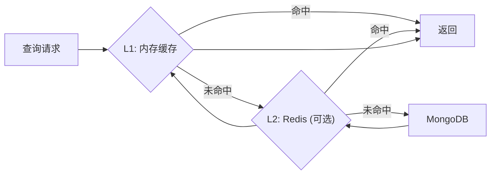

# YA-09-14: 数据查询缓存层 — 内存/Redis 多级缓存 + 智能失效 — 开发方案

> **文档职责**：本文档定义**怎么做、为什么这么做、实际做成什么样**（HOW），不含产品目标与测试用例。

> 来源 PRD：[29-需求-数据查询缓存层.md](../../prds/2026-09/29-需求-数据查询缓存层.md)
> 需求编号：YA-09-14 · 优先级：P1 · 人天：2.0d · 状态：需求已编写

---

## 一、方案

在 `data_service.query_documents` 和 Dashboard 聚合查询前插入缓存层。内存缓存（L1）+ Redis 缓存（L2，可选），减少 MongoDB 查询压力。

### 失效策略

| 策略 | 触发 | 适用场景 |
|------|------|---------|
| TTL | 固定过期时间 | Dashboard 统计 |
| 写入失效 | `create/update/delete` 后清除 | 数据 CRUD |
| 主动预热 | 定时刷新热门查询 | 高频查询 |

---

## 二、实施步骤

| 步骤 | 验证 | 人天 |
|------|------|------|
| 1 | 内存缓存 + TTL 失效 | Dashboard 查询延迟降 50%+ | 0.75 |
| 2 | Redis L2 + 写入失效 | 数据变更后缓存即时失效 | 0.75 |
| 3 | 缓存命中率监控 + 测试 | 命中率 > 80% | 0.5 |

**合计：2.0d**。

---

## 三、关联模块

- 集成：[YA-08-15 数据访问层](../2026-08/15-prd-task-数据访问层.md)
- 消费：[YA-08-07 Dashboard](../2026-08/07-prd-task-Dashboard健康聚合API.md)