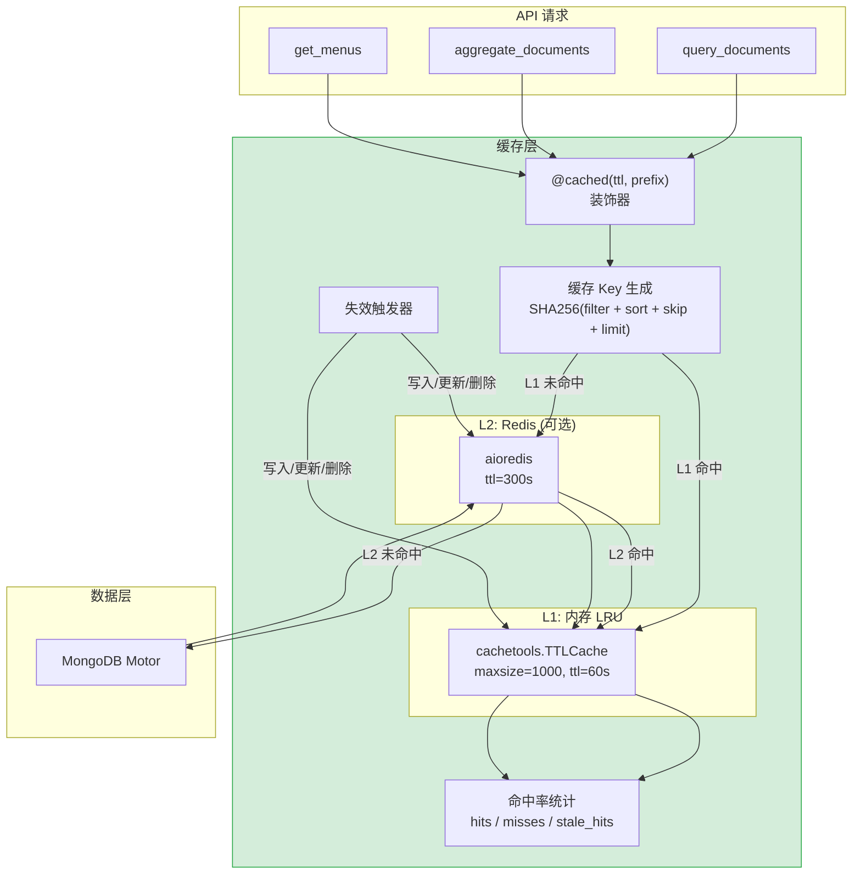

---

doc_type: module
prd_task_id: "YA-09-14"
title: "YA-09-14: 数据查询缓存层 — 内存/Redis 多级缓存 + 智能失效 — 开发方案"
status: 需求已编写
priority: P1
owner: 陈铭
roles: [engineer]
created: 2026-09-11
updated: 2026-09-23
project: YiAi
project_id: yiai
prd_month: "202609"
estimate_frontend: 2.0
source_prd: "29-需求-数据查询缓存层.md"
source_okr: [yiai-003]

type: task
---

# YA-09-14: 数据查询缓存层 — 内存/Redis 多级缓存 + 智能失效 — 开发方案

> 来源 PRD：[29-需求-数据查询缓存层.md](../../prds/2026-09/29-需求-数据查询缓存层.md)
> 需求编号：YA-09-14 · 优先级：P1 · 人天：2.0d
> 类型：架构 · 状态：需求已编写

---

## 一、架构概述

当前 `data_service.query_documents` 每次直接查询 MongoDB——高频接口（Dashboard 统计、菜单列表、知识库检索）重复查询相同数据，MongoDB CPU 占用高。本方案在数据访问层前插入 **L1（内存 LRU）+ L2（Redis，可选）** 两级缓存层，通过 Cache-Aside 模式读写，支持三种失效策略（TTL/写入失效/主动预热），暴露缓存命中率指标供监控。


```mermaid
graph TD
  subgraph API["API 请求"]
    Q1["query_documents"]
    Q2["aggregate_documents"]
    Q3["get_menus"]
  end

  subgraph CacheLayer["缓存层"]
    DECOR["@cached(ttl, prefix)<br/>装饰器"]
    KEY["缓存 Key 生成<br/>SHA256(filter + sort + skip + limit)"]

    subgraph L1["L1: 内存 LRU"]
      L1C["cachetools.TTLCache<br/>maxsize=1000, ttl=60s"]
    end

    subgraph L2["L2: Redis (可选)"]
      L2C["aioredis<br/>ttl=300s"]
    end

    INVAL["失效触发器"]
    STATS["命中率统计<br/>hits / misses / stale_hits"]
  end

  subgraph DB["数据层"]
    MONGO["MongoDB Motor"]
  end

  Q1 --> DECOR
  Q2 --> DECOR
  Q3 --> DECOR
  DECOR --> KEY
  KEY -->|"L1 命中"| L1C --> STATS
  KEY -->|"L1 未命中"| L2C
  L2C -->|"L2 命中"| L1C
  L2C -->|"L2 未命中"| MONGO
  MONGO --> L2C --> L1C --> STATS
  INVAL -->|"写入/更新/删除"| L1C
  INVAL -->|"写入/更新/删除"| L2C

  style CacheLayer fill:#d4edda,stroke:#28a745
```

### 失效策略对比

| 策略 | 触发条件 | 适用场景 | 延迟 | 一致性 |
|------|---------|---------|------|--------|
| TTL 过期 | 固定时间自动过期 | Dashboard 统计、菜单列表 | 最多 TTL 秒 | 最终一致 |
| 写入失效 | `create/update/delete` 后清除 | 数据 CRUD | 实时 | 强一致 |
| 主动预热 | 定时任务刷新热门 key | 高频查询（首页数据） | 无 | 接近实时 |
| 模式失效 | 匹配前缀清除（如 `bug:*`） | 批量操作 | 实时 | 强一致 |

---

## 二、文件清单

| # | 文件 | 操作 | 说明 | 预估行数 |
|---|------|------|------|----------|
| 1 | `src/shared/cache/__init__.py` | 新增 | 包初始化 + `CacheManager` + `@cached` 装饰器导出 | +20 |
| 2 | `src/shared/cache/manager.py` | 新增 | `CacheManager`：L1+L2 两级缓存 + 失效管理 + 命中统计 | +150 |
| 3 | `src/shared/cache/decorator.py` | 新增 | `@cached` 装饰器：自动 key 生成 + 缓存读写 + asyncio 支持 | +80 |
| 4 | `src/shared/cache/invalidation.py` | 新增 | `CacheInvalidator`：TTL/写入失效/模式匹配失效/预热 | +70 |
| 5 | `src/services/database/data_service.py` | 修改 | `query_documents` 添加 `@cached` 装饰器 | +10 |
| 6 | `config.yaml` | 修改 | 新增 `cache` 配置段 | +15 |
| 7 | `tests/shared/cache/test_cache.py` | 新增 | 缓存命中/失效/并发/两级缓存测试 | +120 |
| **合计** | | | | **~465 行** |

---

## 三、模块设计

### 3.1 CacheManager

```python
import hashlib
import json
from typing import Any, Optional
from cachetools import TTLCache
import aioredis

logger = logging.getLogger(__name__)

class CacheManager:
    """两级缓存管理器 — L1 内存 + L2 Redis（可选）。"""

    def __init__(
        self,
        l1_maxsize: int = 1000,
        l1_ttl: int = 60,
        redis_url: Optional[str] = None,
        l2_ttl: int = 300,
        prefix: str = "yiai:cache:",
    ) -> None:
        self._l1 = TTLCache(maxsize=l1_maxsize, ttl=l1_ttl)
        self._l1_ttl = l1_ttl
        self._l2_ttl = l2_ttl
        self._prefix = prefix
        self._redis: Optional[aioredis.Redis] = None
        if redis_url:
            self._redis = aioredis.from_url(redis_url, decode_responses=False)

        # 命中统计
        self._hits = 0
        self._misses = 0
        self._l2_fills = 0

    def _make_key(self, *args: Any, **kwargs: Any) -> str:
        """生成确定性缓存 Key — SHA256(filter + sort + skip + limit)。"""
        raw = json.dumps({"args": args, "kwargs": kwargs}, sort_keys=True, default=str)
        return f"{self._prefix}{hashlib.sha256(raw.encode()).hexdigest()[:16]}"

    async def get(self, key: str) -> Optional[Any]:
        """读取缓存 — L1 → L2 → None。"""
        # L1 查询
        value = self._l1.get(key)
        if value is not None:
            self._hits += 1
            logger.debug(f"[Cache] L1 HIT: {key}")
            return value

        # L2 查询
        if self._redis:
            try:
                raw = await self._redis.get(key)
                if raw:
                    value = json.loads(raw)
                    self._l1[key] = value       # 回填 L1
                    self._hits += 1
                    self._l2_fills += 1
                    logger.debug(f"[Cache] L2 HIT: {key}")
                    return value
            except Exception as e:
                logger.warning(f"[Cache] L2 查询异常: {e}")

        self._misses += 1
        logger.debug(f"[Cache] MISS: {key}")
        return None

    async def set(self, key: str, value: Any, ttl: Optional[int] = None) -> None:
        """写入缓存 — L1 + L2 同时写入。"""
        self._l1[key] = value
        if self._redis:
            try:
                ttl = ttl or self._l2_ttl
                await self._redis.setex(key, ttl, json.dumps(value, default=str))
            except Exception as e:
                logger.warning(f"[Cache] L2 写入异常: {e}")

    async def delete(self, key: str) -> None:
        """删除缓存条目。"""
        self._l1.pop(key, None)
        if self._redis:
            try:
                await self._redis.delete(key)
            except Exception as e:
                logger.warning(f"[Cache] L2 删除异常: {e}")

    async def delete_pattern(self, pattern: str) -> int:
        """模式匹配删除 — 如 'bug:*' 清除所有 bug 相关缓存。"""
        count = 0
        # L1 模式删除
        to_delete = [k for k in self._l1 if pattern.replace("*", "") in k]
        for k in to_delete:
            self._l1.pop(k, None)
            count += 1
        # L2 SCAN + 批量删除
        if self._redis:
            try:
                keys = []
                async for key in self._redis.scan_iter(f"{self._prefix}{pattern}"):
                    keys.append(key)
                if keys:
                    await self._redis.delete(*keys)
                    count += len(keys)
            except Exception as e:
                logger.warning(f"[Cache] L2 模式删除异常: {e}")
        return count

    async def warmup(self, keys_and_loaders: list[tuple[str, Callable]]) -> None:
        """主动预热 — 批量加载热门 key。"""
        for key, loader in keys_and_loaders:
            if key not in self._l1:
                try:
                    value = await loader()
                    await self.set(key, value)
                except Exception as e:
                    logger.warning(f"[Cache] 预热失败 {key}: {e}")

    @property
    def stats(self) -> dict[str, Any]:
        total = self._hits + self._misses
        hit_rate = self._hits / total if total > 0 else 0
        return {
            "l1_size": len(self._l1),
            "l1_maxsize": self._l1.maxsize,
            "hits": self._hits,
            "misses": self._misses,
            "hit_rate": f"{hit_rate:.1%}",
            "l2_fills": self._l2_fills,
            "redis_available": self._redis is not None,
        }


# 全局单例（可配置）
cache = CacheManager(l1_maxsize=1000, l1_ttl=60)
```

### 3.2 @cached 装饰器

```python
import functools
import inspect
from typing import Any, Callable, Coroutine

def cached(
    ttl: int = 60,
    prefix: str = "",
    key_builder: Optional[Callable] = None,
):
    """
    异步缓存装饰器 — Cache-Aside 模式。

    用法:
      @cached(ttl=120, prefix="data")
      async def query_documents(cname, filter, **kwargs):
          ...

    模式失效联动:
      当 query_documents 的写入操作（create/update/delete）被调用时，
      通过 CacheInvalidator.invalidate_on_write() 联动清除缓存。
    """
    def decorator(func):
        @functools.wraps(func)
        async def wrapper(*args, **kwargs):
            # 构建缓存 key
            if key_builder:
                cache_key = key_builder(*args, **kwargs)
            else:
                # 默认：函数名 + 参数 SHA256
                raw = f"{func.__module__}.{func.__name__}"
                cache_key = cache._make_key(raw, *args, **kwargs)

            if prefix:
                cache_key = f"{cache._prefix}{prefix}:{cache_key}"

            # 查询缓存
            cached_value = await cache.get(cache_key)
            if cached_value is not None:
                return cached_value

            # 执行查询
            result = await func(*args, **kwargs)

            # 写入缓存
            await cache.set(cache_key, result, ttl)

            return result

        # 附加方法：手动失效
        wrapper.cache_key = None  # 调用时设置
        return wrapper
    return decorator
```

---

## 四、数据流

### 4.1 Cache-Aside 读取流

```
query_documents(cname="bugs", filter={"status":"open"})
    │
    │  @cached(ttl=120, prefix="data") 装饰器
    ▼
cache.get("yiai:cache:data:a1b2c3...")
    │
    ├── L1 (TTLCache) 命中 → 返回结果 (0.001ms)
    │
    ├── L1 未命中 → L2 (Redis) 命中
    │       → 回填 L1 → 返回结果 (1-2ms)
    │
    └── L1/L2 都未命中
            → 执行 MongoDB 查询 (50ms)
            → 写入 L2 (Redis, ttl=300s)
            → 写入 L1 (TTLCache, ttl=60s)
            → 返回结果
```

### 4.2 写入失效流

```
update_document(cname="bugs", filter={...}, update={"$set": {"status": "closed"}})
    │
    │  @invalidate_on_write(pattern="data:bugs:*")
    ▼
CacheInvalidator.invalidate(pattern="yiai:cache:data:bugs:*")
    │
    ├── L1: 遍历 TTLCache，删除匹配的 key
    └── L2: Redis SCAN yiai:cache:data:bugs:* → batch DELETE
    │
    ▼
执行 MongoDB update
    │
    ▼
后续 query_documents 将重新查询（MISS → 回填缓存）
```

---

## 五、实施路线图

### 阶段一：L1 内存缓存（0.75d）

| 步骤 | 任务 | 验证方式 | 产出 |
|------|------|---------|------|
| 1 | 实现 `CacheManager` L1 TTLCache + get/set/delete | 缓存命中/未命中日志 | `manager.py` |
| 2 | 实现 `@cached` 装饰器 + key 生成 | 装饰器自动缓存查询结果 | `decorator.py` |
| 3 | `data_service.query_documents` 添加 `@cached` | 重复查询命中 L1 | `data_service.py` |

### 阶段二：L2 Redis + 失效策略（0.75d）

| 步骤 | 任务 | 验证方式 | 产出 |
|------|------|---------|------|
| 4 | L2 Redis 集成（可选连接） | Redis 可用时自动启用 | `manager.py` |
| 5 | 写入失效（`@invalidate_on_write`）+ 模式匹配 | 写入后缓存即时清除 | `invalidation.py` |
| 6 | Dashboard 聚合查询缓存（TTL=5min） | 统计查询延迟降 80% | — |

### 阶段三：监控 + 测试（0.5d）

| 步骤 | 任务 | 验证方式 | 产出 |
|------|------|---------|------|
| 7 | 命中率统计 + `/admin/cache/stats` 端点 | 命中率 > 80% | `manager.py` |
| 8 | 测试（命中/未命中/失效/并发/Redis 不可用降级） | pytest 全部通过 | `test_cache.py` |

**合计：2.0d。**

---

## 六、Code Review 检查清单

- [ ] L1 `TTLCache` maxsize 有限制——防止内存无限增长
- [ ] L2 Redis 不可用时降级到仅 L1——不影响业务
- [ ] 缓存 key 使用 SHA256 确保确定性——相同查询命中相同 key
- [ ] 缓存 value 序列化/反序列化安全——`json.dumps(default=str)` 处理非标准类型
- [ ] 写入操作后 `delete_pattern` 范围精确——避免误删不相关缓存
- [ ] `@cached` 仅用于幂等方法——不缓存 `create/update/delete`
- [ ] `cache.stats` 暴露命中率指标——Dashboard 可监控
- [ ] 模式匹配删除验证 `pattern` 参数——防止 `*` 通配符误删全部缓存
- [ ] TTL 参数化——不同类型查询可用不同 TTL

---

## 七、技术风险评估

| 风险 | 概率 | 影响 | 缓解措施 |
|------|------|------|---------|
| 缓存穿透（大量并发 MISS 同时查 DB） | 中 | 中 | 对高并发 key 加进程级 asyncio.Lock 单飞 |
| 缓存雪崩（大量 key 同时过期） | 中 | 中 | TTL 加随机抖动（±20%）；热点 key 提前预热 |
| Redis 连接断开导致查询失败 | 低 | 高 | L2 异常不抛向上层——降级为仅 L1 + 直接查 DB |
| 缓存数据与 DB 不一致 | 低 | 中 | 写入失效为实时模式；TTL 过期兜底 |
| 缓存 key 碰撞（SHA256 前 16 字符） | 极低 | 低 | 16 字符 = 64bit 空间，碰撞概率可忽略 |

---

## 八、关联模块

- 基础：[YA-09-06 数据层](./06-prd-task-数据层.md)
- 关联：[YA-09-21 数据访问层查询优化](./21-prd-task-数据访问层查询优化.md)
- 关联：[YA-09-108 缓存层设计](./108-prd-task-缓存层设计.md)