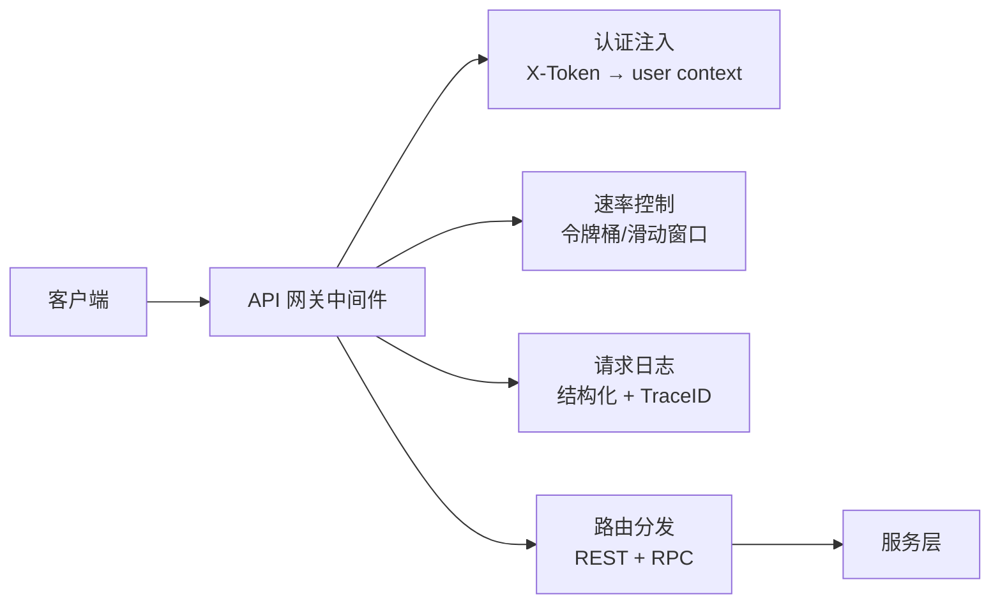

# YA-09-27: API 网关 — 统一入口 + 认证注入 + 速率控制 — 开发方案

> **文档职责**：本文档定义**怎么做、为什么这么做、实际做成什么样**（HOW），不含产品目标与测试用例。

> 来源 PRD：[30-需求-API网关.md](../../prds/2026-09/30-需求-API网关.md)
> 需求编号：YA-09-27 · 优先级：P2 · 人天：2.0d · 状态：需求已编写

---

<a id="sec-1"></a>
## 一、方案

在 FastAPI 中间件层实现轻量 API 网关——统一入口、认证注入、请求/响应转换、速率控制。避免引入 Nginx/Kong 等外部网关的运维复杂度。



### 中间件管道

```python
# 按序执行
app.add_middleware(TraceMiddleware)       # 1. TraceID 注入
app.add_middleware(LoggingMiddleware)     # 2. 请求日志
app.add_middleware(RateLimitMiddleware)   # 3. 限流
app.add_middleware(AuthMiddleware)        # 4. 认证
app.add_middleware(TimeoutMiddleware)     # 5. 超时控制
```

---

<a id="sec-2"></a>
## 二、实施步骤

| 步骤 | 验证 | 人天 |
|------|------|------|
| 1 | 中间件管道编排 | 5 个中间件按序执行 | 0.75 |
| 2 | 请求/响应转换 + 错误统一 | 所有响应走统一信封 | 0.5 |
| 3 | 网关层监控 + 测试 | 网关延迟 < 5ms | 0.75 |

**合计：2.0d**。

---

<a id="sec-3"></a>
## 三、关联模块

- 集成：[YA-09-08 API 限流](./16-prd-task-API限流与并发控制.md)
- 集成：[YA-09-23 请求日志中间件](./141-prd-task-请求响应日志中间件.md)