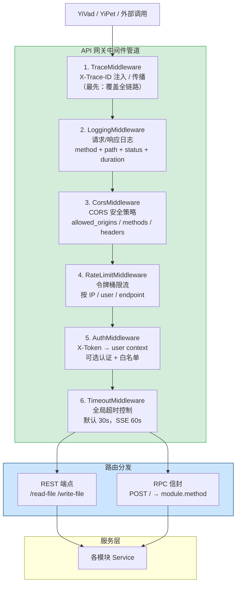

---

doc_type: module
prd_task_id: "YA-09-27"
title: "YA-09-27: API 网关 — 统一入口 + 认证注入 + 速率控制 — 开发方案"
status: 需求已编写
priority: P2
owner: 陈铭
roles: [engineer]
created: 2026-09-11
updated: 2026-09-23
project: YiAi
project_id: yiai
prd_month: "202609"
estimate_frontend: 2.0
source_prd: "30-需求-API网关.md"
source_okr: [yiai-002]

type: task
---

# YA-09-27: API 网关 — 统一入口 + 认证注入 + 速率控制 — 开发方案

> 来源 PRD：[30-需求-API网关.md](../../prds/2026-09/30-需求-API网关.md)
> 需求编号：YA-09-27 · 优先级：P2 · 人天：2.0d
> 依赖：YA-09-08（API 限流）· 类型：架构 · 状态：需求已编写

---

## 一、架构概述

当前 YiAi 的请求处理分散在多个端点中，缺乏统一的横切关注点（认证、限流、日志、超时）。每个端点独立实现认证逻辑，限流和超时控制缺失。本方案在 FastAPI 中间件层实现轻量 API 网关——5 个中间件按序组成管道，无需引入外部 Nginx/Kong。统一入口负责 TraceID 注入、请求日志、认证注入、速率控制和全局超时。


```mermaid
graph TD
  CLIENT["YiVad / YiPet / 外部调用"]

  subgraph Gateway["API 网关中间件管道"]
    direction TB
    M1["1. TraceMiddleware<br/>X-Trace-ID 注入 / 传播<br/>（最先：覆盖全链路）"]
    M2["2. LoggingMiddleware<br/>请求/响应日志<br/>method + path + status + duration"]
    M3["3. CorsMiddleware<br/>CORS 安全策略<br/>allowed_origins / methods / headers"]
    M4["4. RateLimitMiddleware<br/>令牌桶限流<br/>按 IP / user / endpoint"]
    M5["5. AuthMiddleware<br/>X-Token → user context<br/>可选认证 + 白名单"]
    M6["6. TimeoutMiddleware<br/>全局超时控制<br/>默认 30s，SSE 60s"]
  end

  subgraph Router["路由分发"]
    REST["REST 端点<br/>/read-file /write-file"]
    RPC["RPC 信封<br/>POST / → module.method"]
  end

  subgraph Services["服务层"]
    SVC["各模块 Service"]
  end

  CLIENT --> M1 --> M2 --> M3 --> M4 --> M5 --> M6
  M6 --> REST
  M6 --> RPC
  REST --> SVC
  RPC --> SVC

  style Gateway fill:#d4edda,stroke:#28a745
  style Router fill:#cce5ff,stroke:#004085
```

### 响应格式标准化

| 场景 | HTTP 状态码 | RPC code | Body 格式 |
|------|-----------|----------|-----------|
| 成功 | 200 | `0` | `{code:0, message:"ok", data:{...}}` |
| 参数校验失败 | 422 | `1001` | `{code:1001, message:"...", data:null}` |
| 认证失败 | 401 | `4001` | `{code:4001, message:"...", data:null}` |
| 限流 | 429 | `4003` | `{code:4003, message:"...", data:null}` |
| 超时 | 504 | `9999` | `{code:9999, message:"request timeout", data:null}` |
| 服务关闭中 | 503 | `9999` | `{code:9999, message:"service unavailable", data:null}` |

---

## 二、文件清单

| # | 文件 | 操作 | 说明 | 预估行数 |
|---|------|------|------|----------|
| 1 | `src/shared/gateway/__init__.py` | 新增 | 包初始化 + `GatewayPipeline` 导出 | +10 |
| 2 | `src/shared/gateway/trace.py` | 新增 | `TraceMiddleware`：X-Trace-ID 注入 + 传播 | +40 |
| 3 | `src/shared/gateway/logging_middleware.py` | 新增 | `LoggingMiddleware`：结构化请求/响应日志 | +60 |
| 4 | `src/shared/gateway/auth_middleware.py` | 新增 | `AuthMiddleware`：X-Token 验证 + 白名单 + user context | +80 |
| 5 | `src/shared/gateway/timeout_middleware.py` | 新增 | `TimeoutMiddleware`：全局超时控制 + SSE 特殊处理 | +50 |
| 6 | `src/shared/gateway/response.py` | 新增 | `ResponseFormatter`：统一响应信封 + 异常转 RPC 错误码 | +70 |
| 7 | `src/app.py` | 修改 | 注册 5 个中间件到 FastAPI app | +20 |
| 8 | `tests/shared/gateway/test_pipeline.py` | 新增 | 中间件管道集成测试 | +120 |
| **合计** | | | | **~450 行** |

---

## 三、模块设计

### 3.1 TraceMiddleware

```python
import uuid
from starlette.middleware.base import BaseHTTPMiddleware

class TraceMiddleware(BaseHTTPMiddleware):
    """TraceID 中间件 — 注入并传播 X-Trace-ID。"""

    async def dispatch(self, request, call_next):
        trace_id = request.headers.get("X-Trace-ID") or str(uuid.uuid4())
        request.state.trace_id = trace_id
        response = await call_next(request)
        response.headers["X-Trace-ID"] = trace_id
        return response
```

### 3.2 AuthMiddleware

```python
from starlette.middleware.base import BaseHTTPMiddleware
from starlette.responses import JSONResponse

class AuthMiddleware(BaseHTTPMiddleware):
    """认证中间件 — X-Token 验证 + 白名单路径。"""

    # 不需要认证的路径白名单
    PUBLIC_PATHS = {
        "/healthz",
        "/healthz/ready",
        "/healthz/live",
        "/docs",
        "/openapi.json",
    }

    def __init__(self, app, auth_enabled: bool = True):
        super().__init__(app)
        self._auth_enabled = auth_enabled

    async def dispatch(self, request, call_next):
        # 白名单路径跳过认证
        if request.url.path in self.PUBLIC_PATHS or not self._auth_enabled:
            request.state.user = None
            return await call_next(request)

        token = request.headers.get("X-Token")
        if not token:
            return JSONResponse(
                status_code=401,
                content={"code": 4001, "message": "缺少认证 Token", "data": None},
            )

        # 验证 Token
        try:
            from domain.auth.jwt import verify_token
            user = verify_token(token)
            request.state.user = user
        except Exception:
            return JSONResponse(
                status_code=401,
                content={"code": 4001, "message": "Token 无效或已过期", "data": None},
            )

        return await call_next(request)
```

### 3.3 TimeoutMiddleware

```python
import asyncio
from starlette.middleware.base import BaseHTTPMiddleware

class TimeoutMiddleware(BaseHTTPMiddleware):
    """全局超时中间件 — 不同端点不同超时。"""

    # 路径 → 超时（秒）映射
    PATH_TIMEOUTS = {
        "/": 30,                     # RPC 信封
        "/read-file": 10,
        "/write-file": 15,
        "/upload-file": 60,
        "/rag": 30,
    }
    DEFAULT_TIMEOUT = 30

    async def dispatch(self, request, call_next):
        path = request.url.path
        timeout = self.PATH_TIMEOUTS.get(path, self.DEFAULT_TIMEOUT)

        # SSE 端点不设超时（由 FrameMiddleware 控制）
        if "text/event-stream" in request.headers.get("Accept", ""):
            return await call_next(request)

        try:
            return await asyncio.wait_for(call_next(request), timeout=timeout)
        except asyncio.TimeoutError:
            return JSONResponse(
                status_code=504,
                content={
                    "code": 9999,
                    "message": f"请求超时 ({timeout}s)",
                    "data": None,
                },
            )
```

### 3.4 ResponseFormatter

```python
class ResponseFormatter:
    """统一响应格式化 — 成功响应 + 异常转 RPC 错误码。"""

    ERROR_CODE_MAP = {
        "ValidationError": (422, 1001),
        "AuthError": (401, 4001),
        "PermissionError": (403, 4002),
        "NotFoundError": (404, 1002),
        "TimeoutError": (504, 9999),
    }

    @staticmethod
    def success(data: Any) -> dict:
        return {"code": 0, "message": "ok", "data": data}

    @staticmethod
    def error(exception: Exception) -> tuple[int, dict]:
        exc_name = type(exception).__name__
        http_status, rpc_code = ResponseFormatter.ERROR_CODE_MAP.get(
            exc_name, (500, 9999)
        )
        return http_status, {
            "code": rpc_code,
            "message": str(exception),
            "data": None,
        }
```

---

## 四、数据流

```
YiVad 请求: POST /  {module_name: "services.ai.chat_service.chat", ...}
    │
    │  X-Trace-ID: (无 — 自动生成)
    │  X-Token: eyJhbG...
    ▼
TraceMiddleware:
    │  生成 X-Trace-ID: "a1b2c3d4-..."
    │  request.state.trace_id = "a1b2c3d4-..."
    ▼
LoggingMiddleware:
    │  记录: [a1b2c3d4] POST /  (start)
    ▼
CorsMiddleware:
    │  检查 Origin header → 在 allowed_origins 白名单中 ✓
    ▼
RateLimitMiddleware:
    │  检查令牌桶: IP 192.168.1.1 → tokens=9/100 ✓
    ▼
AuthMiddleware:
    │  检查 X-Token → verify_token("eyJhbG...") → user={username:"admin", roles:["admin"]}
    │  request.state.user = {username:"admin", ...}
    ▼
TimeoutMiddleware:
    │  设置 asyncio.wait_for(call_next, timeout=30s)
    ▼
路由分发 → RPC handler → chat_service.chat(...)
    │  (SSE 流式响应 — TimeoutMiddleware 不拦截)
    ▼
LoggingMiddleware:
    │  记录: [a1b2c3d4] POST / 200 1523ms
    ▼
响应: {code:0, message:"ok", data:...}
    │  X-Trace-ID: a1b2c3d4-...
```

---

## 五、实施路线图

### 阶段一：中间件管道搭建（0.75d）

| 步骤 | 任务 | 验证方式 | 产出 |
|------|------|---------|------|
| 1 | 创建 5 个中间件模块 | 每个中间件可独立测试 | `gateway/*.py` |
| 2 | `app.py` 中按序注册中间件 | 请求经过完整管道 | `app.py` |
| 3 | `ResponseFormatter` 统一响应格式 | 所有异常转为标准 RPC 信封 | `response.py` |

### 阶段二：认证 + 限流集成（0.5d）

| 步骤 | 任务 | 验证方式 | 产出 |
|------|------|---------|------|
| 4 | `AuthMiddleware` 集成 JWT 验证 + 白名单 | 无 Token 返回 401 | `auth_middleware.py` |
| 5 | `RateLimitMiddleware` 集成令牌桶 | 超过限制返回 429 | `rate_limit.py`（复用 YA-09-08） |

### 阶段三：超时 + 日志 + 测试（0.75d）

| 步骤 | 任务 | 验证方式 | 产出 |
|------|------|---------|------|
| 6 | 端点差异化超时 + SSE 跳过 | 慢端点触发 504 | `timeout_middleware.py` |
| 7 | `LoggingMiddleware` 结构化日志 + TraceID 关联 | 日志包含 trace_id | `logging_middleware.py` |
| 8 | 集成测试（正常请求/401/429/504/503） | pytest 全部通过 | `test_pipeline.py` |

**合计：2.0d。**

---

## 六、Code Review 检查清单

- [ ] 中间件注册顺序正确：Trace → Log → CORS → RateLimit → Auth → Timeout
- [ ] `AuthMiddleware` 白名单路径完整（/healthz, /docs, /openapi.json）
- [ ] `TimeoutMiddleware` SSE 端点不设超时——避免流被截断
- [ ] 所有中间件异常被 `ResponseFormatter` 转为统一 RPC 信封
- [ ] `TraceMiddleware` 从请求头继承 `X-Trace-ID`——支持跨服务传播
- [ ] `LoggingMiddleware` 记录 `trace_id`、`duration_ms`、`status_code`
- [ ] 认证失败和限流返回的 HTTP 状态码符合规范（401/429）
- [ ] 中间件不阻塞 `asyncio` 事件循环（无同步 IO）
- [ ] 每个中间件有独立日志前缀便于排查

---

## 七、技术风险评估

| 风险 | 概率 | 影响 | 缓解措施 |
|------|------|------|---------|
| 中间件链过长增加延迟 | 中 | 低 | 每个中间件 < 0.5ms；总网关开销 < 5ms |
| `asyncio.wait_for` 取消后资源未清理 | 中 | 中 | FastAPI 的 `cancel_scope` 自动清理 |
| 认证中间件在认证禁用时仍有开销 | 低 | 低 | `auth_enabled=False` 时直接放行，无 JWT 解析 |
| 速率限制误伤正常请求 | 低 | 中 | 令牌桶参数可配置；Admin API 单独限流策略 |

---

## 八、关联模块

- 基础：[YA-09-08 API 限流与并发控制](./16-prd-task-API限流与并发控制.md)
- 关联：[YA-09-23 请求日志中间件](./141-prd-task-请求响应日志中间件.md)
- 关联：[YA-09-49 CORS 安全策略增强](./49-prd-task-CORS安全策略增强.md)