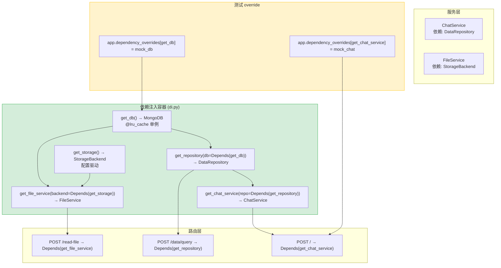

---

doc_type: module
prd_task_id: "YA-09-49"
title: "YA-09-49: 依赖注入容器 — FastAPI Depends 模块解耦 — 开发方案"
status: 需求已编写
priority: P2
owner: 陈铭
roles: [engineer]
created: 2026-09-11
updated: 2026-09-23
project: YiAi
project_id: yiai
prd_month: "202609"
estimate_frontend: 1.0
source_prd: "31-需求-依赖注入容器.md"
source_okr: [yiai-001]

type: task
---

# YA-09-49: 依赖注入容器 — FastAPI Depends 模块解耦 — 开发方案

> 来源 PRD：[31-需求-依赖注入容器.md](../../prds/2026-09/31-需求-依赖注入容器.md)
> 需求编号：YA-09-49 · 优先级：P2 · 人天：1.0d
> 类型：架构 · 状态：需求已编写

---

## 一、架构概述

当前 `domain/` 和 `services/` 之间通过直接 `import` 硬耦合——Service 直接 `from domain.ai.chat import ChatEngine`，导致模块间强依赖、测试难以 Mock、切换实现需修改所有引用处。本方案利用 FastAPI 内置 `Depends` 机制建立依赖注入容器：每个依赖（DB 连接、Service、Repository）通过工厂函数注册，路由通过 `Depends()` 声明依赖，FastAPI 自动解析依赖树并注入。测试时通过 `app.dependency_overrides` 替换实现。



### 依赖层次

| 层级 | 职责 | 生命周期 | 示例 |
|------|------|---------|------|
| L0: 基础设施 | 连接/客户端 | 单例（进程级） | `get_db`, `get_redis`, `get_storage` |
| L1: Repository | 数据访问 | 单例（复用连接） | `get_data_repository`, `get_file_repository` |
| L2: Service | 业务逻辑 | 单例（无状态） | `get_chat_service`, `get_rag_service` |
| L3: Route Handler | 请求处理 | 请求级 | FastAPI 自动创建 |

---

## 二、文件清单

| # | 文件 | 操作 | 说明 | 预估行数 |
|---|------|------|------|----------|
| 1 | `src/shared/di.py` | 新增 | 依赖容器：所有 `get_*` 工厂函数 + `@lru_cache` 单例 | +100 |
| 2 | `src/shared/di_config.py` | 新增 | DI 配置 + `override_for_test()` 辅助函数 | +50 |
| 3 | `src/server/routes.py` | 修改 | 路由改用 `Depends()` 声明依赖 | +30 / -40 |
| 4 | `src/services/*/` | 修改 | Service 构造函数接收依赖（而非直接 import） | +20 / -30 |
| 5 | `tests/conftest.py` | 修改 | 新增 `override_dependencies` fixture | +40 |
| 6 | `tests/shared/test_di.py` | 新增 | 依赖注入/覆盖/生命周期测试 | +80 |
| **合计** | | | | **~320 行** |

### 组件树

```
src/shared/
├── di.py                          # 依赖容器
│   ├── @lru_cache() def get_db() -> AsyncIOMotorDatabase
│   ├── @lru_cache() def get_redis() -> aioredis.Redis
│   ├── @lru_cache() def get_storage() -> StorageBackend
│   ├── def get_repository(db = Depends(get_db)) -> DataRepository
│   ├── def get_chat_service(db = Depends(get_db)) -> ChatService
│   ├── def get_rag_service(db = Depends(get_db)) -> RAGService
│   ├── def get_file_service(storage = Depends(get_storage)) -> FileService
│   ├── def get_rss_service(db = Depends(get_db)) -> RSSService
│   └── def get_data_service(repo = Depends(get_repository)) -> DataService
│
└── di_config.py                   # DI 配置辅助
    ├── def override_for_test(app, overrides: dict) -> None
    └── def reset_overrides(app) -> None
```

---

## 三、模块设计

### 3.1 依赖容器 (di.py)

```python
from functools import lru_cache
from typing import AsyncGenerator
from motor.motor_asyncio import AsyncIOMotorClient, AsyncIOMotorDatabase
from fastapi import Depends

# ==================== L0: 基础设施（单例） ====================

@lru_cache(maxsize=1)
def get_mongo_client() -> AsyncIOMotorClient:
    """MongoDB 客户端 — 进程级单例。"""
    from shared.config import settings
    return AsyncIOMotorClient(
        settings.get("mongo.url", "mongodb://localhost:27017"),
        maxPoolSize=settings.get("mongo.max_pool_size", 50),
    )

@lru_cache(maxsize=1)
def get_db() -> AsyncIOMotorDatabase:
    """MongoDB 数据库实例。"""
    from shared.config import settings
    client = get_mongo_client()
    return client[settings.get("mongo.db_name", "yiai")]

@lru_cache(maxsize=1)
def get_redis():
    """Redis 客户端 — 可选，配置不存在时返回 None。"""
    from shared.config import settings
    redis_url = settings.get("redis.url")
    if not redis_url:
        return None
    import aioredis
    return aioredis.from_url(redis_url, decode_responses=False)

@lru_cache(maxsize=1)
def get_storage():
    """存储后端 — 配置驱动。"""
    from shared.config import settings
    from domain.storage import create_backend, StorageConfig
    config = StorageConfig(
        backend=settings.get("storage.backend", "local"),
        local_base_dir=settings.get("storage.local_base_dir", "./data/files"),
    )
    return create_backend(config)


# ==================== L1: Repository（依赖 L0） ====================

def get_data_repository(
    db: AsyncIOMotorDatabase = Depends(get_db),
) -> "DataRepository":
    """数据仓库 — 封装 MongoDB CRUD 操作。"""
    from domain.data.repository import DataRepository
    return DataRepository(db)

def get_file_repository(
    storage = Depends(get_storage),
) -> "FileRepository":
    """文件仓库 — 封装文件存储操作。"""
    from domain.files.repository import FileRepository
    return FileRepository(storage)


# ==================== L2: Service（依赖 L1） ====================

def get_chat_service(
    db: AsyncIOMotorDatabase = Depends(get_db),
    repo = Depends(get_data_repository),
) -> "ChatService":
    """聊天服务。"""
    from services.ai.chat_service import ChatService
    return ChatService(db, repo)

def get_rag_service(
    db: AsyncIOMotorDatabase = Depends(get_db),
    redis = Depends(get_redis),
) -> "RAGService":
    """RAG 服务 — 可选 Redis 缓存。"""
    from services.ai.rag_service import RAGService
    return RAGService(db, redis)

def get_file_service(
    repo = Depends(get_file_repository),
) -> "FileService":
    """文件服务。"""
    from services.files.file_service import FileService
    return FileService(repo)

def get_rss_service(
    db: AsyncIOMotorDatabase = Depends(get_db),
) -> "RSSService":
    """RSS 抓取服务。"""
    from services.rss.rss_service import RSSService
    return RSSService(db)

def get_data_service(
    repo = Depends(get_data_repository),
    cache = Depends(get_redis),
) -> "DataService":
    """通用数据 CRUD 服务。"""
    from services.database.data_service import DataService
    return DataService(repo, cache)
```

### 3.2 路由层使用

```python
# src/server/routes.py
from fastapi import APIRouter, Depends
from shared.di import (
    get_chat_service, get_file_service, get_data_service,
)

router = APIRouter()

@router.post("/")
async def rpc_handler(
    request: RPCRequest,
    chat_service: ChatService = Depends(get_chat_service),
    data_service: DataService = Depends(get_data_service),
):
    """RPC 信封路由 — 依赖通过 Depends 注入。"""
    # 路由到对应模块方法
    ...

@router.post("/read-file")
async def read_file(
    target_file: str,
    file_service: FileService = Depends(get_file_service),
):
    """读取文件 — 注入 FileService。"""
    content = await file_service.read(target_file)
    return ResponseFormatter.success({"content": content})

@router.post("/write-file")
async def write_file(
    target_file: str,
    content: str,
    file_service: FileService = Depends(get_file_service),
):
    """写入文件 — 注入 FileService。"""
    path = await file_service.write(target_file, content)
    return ResponseFormatter.success({"path": path})
```

### 3.3 测试 override

```python
# tests/conftest.py
import pytest
from unittest.mock import AsyncMock
from fastapi import FastAPI

@pytest.fixture
def override_dependencies(app: FastAPI):
    """替换所有外部依赖为 mock。"""
    mock_db = AsyncMock(spec=AsyncIOMotorDatabase)
    mock_chat = AsyncMock()

    overrides = {
        get_db: lambda: mock_db,
        get_chat_service: lambda: mock_chat,
    }
    for original, override in overrides.items():
        app.dependency_overrides[original] = override

    yield {"db": mock_db, "chat": mock_chat}

    # 清理
    app.dependency_overrides.clear()

# tests/services/test_chat.py
async def test_chat_endpoint_with_mock(client, override_dependencies):
    override_dependencies["chat"].chat.return_value = {"reply": "Hello"}
    response = await client.post("/", json={
        "module_name": "services.ai.chat_service",
        "method_name": "chat",
        "parameters": {"messages": [{"role": "user", "content": "Hi"}]},
    })
    assert response.json()["code"] == 0
```

---

## 四、数据流

### 4.1 依赖解析

```
请求: POST /read-file {target_file: "README.md"}
    │
    ▼
FastAPI 解析路由: read_file(target_file: str, file_service = Depends(get_file_service))
    │
    │  FastAPI 依赖图解析:
    │
    ├── get_file_service(repo = Depends(get_file_repository))
    │       │
    │       └── get_file_repository(storage = Depends(get_storage))
    │               │
    │               └── get_storage()  →  @lru_cache → StorageBackend 单例
    │                                           │
    │                                           └── 从 config.yaml 读取 backend 类型
    │
    ▼
file_service = FileService(repo=FileRepository(storage=LocalBackend("./data/files")))
    │
    ▼
file_service.read("README.md") → bytes → response
```

### 4.2 测试 override

```
测试: async def test_read_file(client, override_dependencies):
    │
    │  override_dependencies 替换:
    │    get_storage → lambda: MockStorageBackend()
    │
    ▼
client.post("/read-file", json={"target_file": "test.txt"})
    │
    │  FastAPI 依赖解析使用 override:
    │    get_storage() → MockStorageBackend()  (而非 LocalBackend)
    │
    ▼
MockStorageBackend.read("test.txt") → b"mock content"
    │
    ▼
响应: {code:0, data:{content:"mock content"}}
```

---

## 五、实施路线图

| 步骤 | 任务 | 验证方式 | 人天 |
|------|------|---------|------|
| 1 | 创建 `di.py` 依赖容器 + 所有 `get_*` 工厂函数 | `get_db()` 返回 MongoDB 实例 | 0.3 |
| 2 | 重构 Service 构造函数——接收依赖参数 | Service 不直接 import 其他模块 | 0.2 |
| 3 | 路由改用 `Depends()` 声明依赖 | 请求正常处理 | 0.15 |
| 4 | 创建 `override_for_test` + fixture | 测试中可替换依赖 | 0.15 |
| 5 | 重构现有测试使用 DI override | 现有测试全部通过 | 0.2 |

**合计：1.0d。**

---

## 六、Code Review 检查清单

- [ ] `@lru_cache` 用于 L0 基础设施——确保进程级单例
- [ ] Service 构造函数参数类型使用 Protocol/ABC——面向接口编程
- [ ] `Depends()` 链深度 ≤ 3——避免过于复杂的依赖图
- [ ] 测试 `override_dependencies` fixture 在所有测试后清理（`clear()`）
- [ ] 不使用全局 `from di import db`——始终通过 `Depends()` 注入
- [ ] Service 层不导入路由层——单向依赖
- [ ] `get_redis()` 返回 `None` 时 Service 正确降级
- [ ] 循环依赖检测——FastAPI 运行时 DependencyResolutionError 会报错
- [ ] `di.py` 中 `import` 使用延迟导入（函数内 `from ... import`）避免循环

---

## 七、技术风险评估

| 风险 | 概率 | 影响 | 缓解措施 |
|------|------|------|---------|
| 循环依赖（A → B → A） | 中 | 高 | 延迟导入 + FastAPI 运行时检测 DependencyResolutionError |
| `@lru_cache` 与 asyncio 不兼容 | 低 | 中 | `@lru_cache` 仅用于同步工厂函数；不缓存异步结果 |
| 依赖图过长影响请求延迟 | 低 | 低 | 依赖解析是 FastAPI 启动时完成的（非请求时） |
| override 残留影响其他测试 | 中 | 中 | fixture teardown 中 `dependency_overrides.clear()` |

---

## 八、关联模块

- 依赖：[YA-09-06 数据层](./06-prd-task-数据层.md)
- 关联：[YA-09-24 文件存储抽象层](./24-prd-task-文件存储抽象层.md)
- 指南：FastAPI [Dependencies](https://fastapi.tiangolo.com/tutorial/dependencies/)