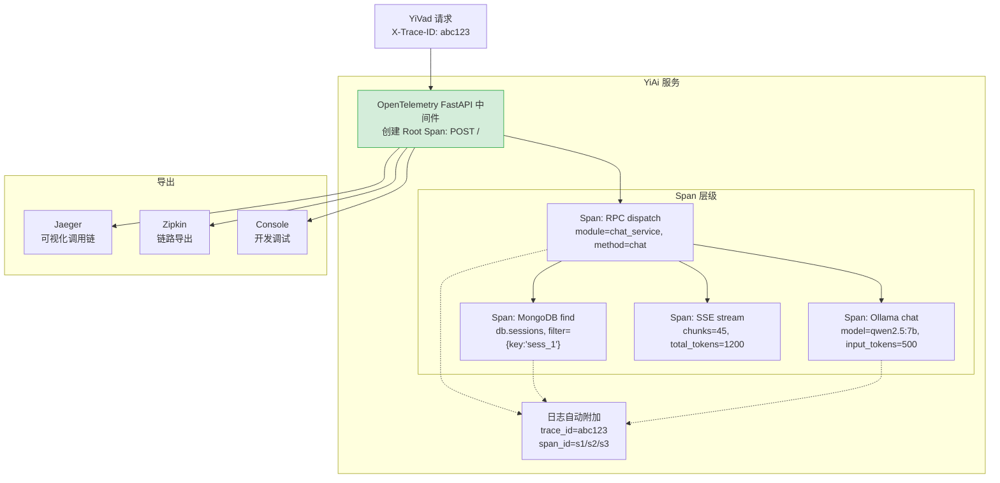

---

doc_type: module
prd_task_id: "YA-09-15"
title: "YA-09-15: 全链路 TraceID 透传 — OpenTelemetry + Span 传播 — 开发方案"
status: 需求已编写
priority: P2
owner: 陈铭
roles: [engineer]
created: 2026-09-11
updated: 2026-09-23
project: YiAi
project_id: yiai
prd_month: "202609"
estimate_frontend: 1.5
source_prd: "33-需求-分布式链路追踪.md"
source_okr: [yiai-001]

type: task
---

# YA-09-15: 全链路 TraceID 透传 — OpenTelemetry + Span 传播 — 开发方案

> 来源 PRD：[33-需求-分布式链路追踪.md](../../prds/2026-09/33-需求-分布式链路追踪.md)
> 需求编号：YA-09-15 · 优先级：P2 · 人天：1.5d
> 依赖：YA-09-16（结构化日志）· 类型：架构 · 状态：需求已编写

---

## 一、架构概述

当前 YiAi 的日志系统缺乏跨请求的关联标识——一个问题排查需要人工按时间戳匹配 RPC 调用、MongoDB 查询、Ollama 推理等多层日志。本方案通过 OpenTelemetry SDK 在 FastAPI 中间件层注入 TraceID，跨 RPC/MongoDB/Ollama/SSE 调用透传 Span context，日志自动附加 TraceID，支持 Jaeger/Zipkin 可视化。



### 透传矩阵

| 环节 | 透传方式 | 载体 |
|------|---------|------|
| HTTP 请求头 | `X-Trace-ID` + `traceparent` (W3C) | HTTP Headers |
| RPC 信封 | `X-Trace-ID` 注入 request.state | `request.state.trace_id` |
| MongoDB 查询 | Motor `comment` 字段附加 TraceID | `collection.find(..., comment={trace_id})` |
| Ollama 调用 | httpx headers 注入 `X-Trace-ID` | 请求头透传 |
| SSE 流 | 首帧 data 中包含 TraceID | `event: meta` |
| 内部日志 | `logging.LogRecord` 自动附加 | `structlog` bound context |

---

## 二、文件清单

| # | 文件 | 操作 | 说明 | 预估行数 |
|---|------|------|------|----------|
| 1 | `src/shared/tracing/__init__.py` | 新增 | 包初始化 + `init_tracing()` + `get_tracer()` 导出 | +15 |
| 2 | `src/shared/tracing/config.py` | 新增 | 采样策略配置 + exporter 选择（Jaeger/Zipkin/Console） | +40 |
| 3 | `src/shared/tracing/middleware.py` | 新增 | FastAPI OpenTelemetry 中间件：Span 创建 + context 传播 | +60 |
| 4 | `src/shared/tracing/instrumentors.py` | 新增 | Motor/Ollama/httpx 自动插桩配置 | +50 |
| 5 | `src/shared/logging.py` | 修改 | structlog 集成：自动绑定 trace_id 到日志 context | +30 |
| 6 | `src/app.py` | 修改 | 启动时调用 `init_tracing()` | +10 |
| 7 | `config.yaml` | 修改 | 新增 `tracing` 配置段 | +15 |
| 8 | `tests/shared/tracing/test_tracing.py` | 新增 | TraceID 传播/采样/导出测试 | +80 |
| **合计** | | | | **~300 行** |

---

## 三、模块设计

### 3.1 初始化与配置

```python
# src/shared/tracing/__init__.py
from opentelemetry import trace
from opentelemetry.sdk.trace import TracerProvider
from opentelemetry.sdk.trace.sampling import TraceIdRatioBased, ALWAYS_ON, ALWAYS_OFF
from opentelemetry.exporter.otlp.proto.grpc.trace_exporter import OTLPSpanExporter
from opentelemetry.exporter.jaeger.thrift import JaegerExporter
from opentelemetry.sdk.resources import SERVICE_NAME, Resource
from opentelemetry.instrumentation.fastapi import FastAPIInstrumentor
from opentelemetry.instrumentation.httpx import HTTPXClientInstrumentor

def init_tracing(
    service_name: str = "yiai",
    exporter_type: str = "console",
    sample_rate: float = 1.0,
    otlp_endpoint: str = "",
) -> None:
    """初始化 OpenTelemetry — 配置采样 + 导出 + 自动插桩。"""
    # 采样策略
    if sample_rate >= 1.0:
        sampler = ALWAYS_ON
    elif sample_rate <= 0.0:
        sampler = ALWAYS_OFF
    else:
        sampler = TraceIdRatioBased(sample_rate)

    # 资源标识
    resource = Resource(attributes={SERVICE_NAME: service_name})

    # Provider
    provider = TracerProvider(sampler=sampler, resource=resource)

    # Exporter
    if exporter_type == "jaeger":
        provider.add_span_processor(BatchSpanProcessor(
            JaegerExporter(agent_host_name="localhost", agent_port=6831)
        ))
    elif exporter_type == "otlp":
        provider.add_span_processor(BatchSpanProcessor(
            OTLPSpanExporter(endpoint=otlp_endpoint)
        ))
    # console: 默认 OTLP 到 stdout

    trace.set_tracer_provider(provider)
    logger.info(
        f"[Tracing] 已初始化: service={service_name}, "
        f"exporter={exporter_type}, sample_rate={sample_rate}"
    )

def get_tracer(name: str = "yiai"):
    return trace.get_tracer(name)
```

### 3.2 Motor MongoDB 插桩

```python
# src/shared/tracing/instrumentors.py
from opentelemetry import trace

class TracedMotorCollection:
    """包装 Motor Collection — 自动创建 MongoDB Span。"""

    def __init__(self, collection, tracer_name: str = "yiai.mongodb"):
        self._collection = collection
        self._tracer = trace.get_tracer(tracer_name)

    async def find(self, filter: dict, *args, **kwargs):
        with self._tracer.start_as_current_span(
            f"mongodb.{self._collection.name}.find",
            attributes={
                "db.collection": self._collection.name,
                "db.operation": "find",
                "db.filter": str(filter)[:200],
            },
        ) as span:
            if trace_id := get_current_trace_id():
                kwargs.setdefault("comment", {"trace_id": trace_id})
            return await self._collection.find(filter, *args, **kwargs)
```

---

## 四、数据流

```
YiVad → POST /  {module: "chat_service", method: "chat"}
    │  X-Trace-ID: "a1b2c3" (或自动生成)
    ▼
OpenTelemetry FastAPIInstrumentor:
    │  创建 Root Span: "POST /"
    │  提取 X-Trace-ID → SpanContext
    ▼
RPC dispatch (with tracer.start_as_current_span("rpc.chat_service.chat")):
    │
    ├── MongoDB find (with tracer.start_as_current_span("mongodb.sessions.find")):
    │       Motor comment={"trace_id": "a1b2c3"}
    │       duration_ms 自动记录
    │
    ├── Ollama chat (httpx → X-Trace-ID header 透传):
    │       HTTPXClientInstrumentor 自动创建 span "HTTP POST ollama:11434"
    │
    └── SSE stream:
            首帧: {event: "meta", data: {trace_id: "a1b2c3"}}
            Logger: structlog.bind(trace_id="a1b2c3")
    │
    ▼
SpanExporter:
    Jaeger UI → 完整调用链可视化:
      POST / (1200ms)
        ├── rpc.chat_service.chat (1180ms)
        │   ├── mongodb.sessions.find (15ms)
        │   ├── mongodb.knowledge.find (23ms)
        │   └── HTTP POST ollama (1100ms)
        └── sse.stream (1110ms)
```

---

## 五、实施路线图

| 步骤 | 任务 | 验证方式 | 人天 |
|------|------|---------|------|
| 1 | OpenTelemetry SDK + FastAPI 中间件集成 | TraceID 出现在响应头 `X-Trace-ID` | 0.5 |
| 2 | Motor/Ollama/httpx 自动插桩 | Jaeger 中可视 MongoDB + Ollama Span | 0.5 |
| 3 | structlog 集成 + 采样策略 + 测试 | 日志中自动绑定 trace_id | 0.5 |

**合计：1.5d。**

---

## 六、Code Review 检查清单

- [ ] `init_tracing()` 在 FastAPI lifespan startup 中调用
- [ ] 采样率可配置——生产环境按需调整（默认 10%）
- [ ] Jaeger exporter 连接失败时降级到 console（不阻塞服务启动）
- [ ] Motor 插桩使用 `comment` 字段传递 TraceID
- [ ] structlog 日志中 trace_id 自动绑定
- [ ] SSE 流首帧包含 TraceID（客户端可直接获取）
- [ ] 响应头设置 `X-Trace-ID` 便于前端关联
- [ ] 健康检查端点（/healthz）不创建 Span（避免噪音）

---

## 七、技术风险评估

| 风险 | 概率 | 影响 | 缓解措施 |
|------|------|------|---------|
| OpenTelemetry SDK 额外开销 | 低 | 低 | 采样率控制 + BatchSpanProcessor 批量导出 |
| Jaeger 不可用导致 Span 积压 | 中 | 低 | BatchSpanProcessor 内存上限 + 超时丢弃 |
| Motor 插桩性能影响 | 低 | 低 | 仅记录 Span 属性——无额外 I/O |

---

## 八、关联模块

- 基础：[YA-09-16 结构化日志](./35-prd-task-结构化日志.md)
- 关联：[YA-09-27 API 网关](./30-prd-task-API网关.md)
- 关联：[YA-09-84 Zipkin 链路导出](./84-prd-task-Zipkin链路导出.md)