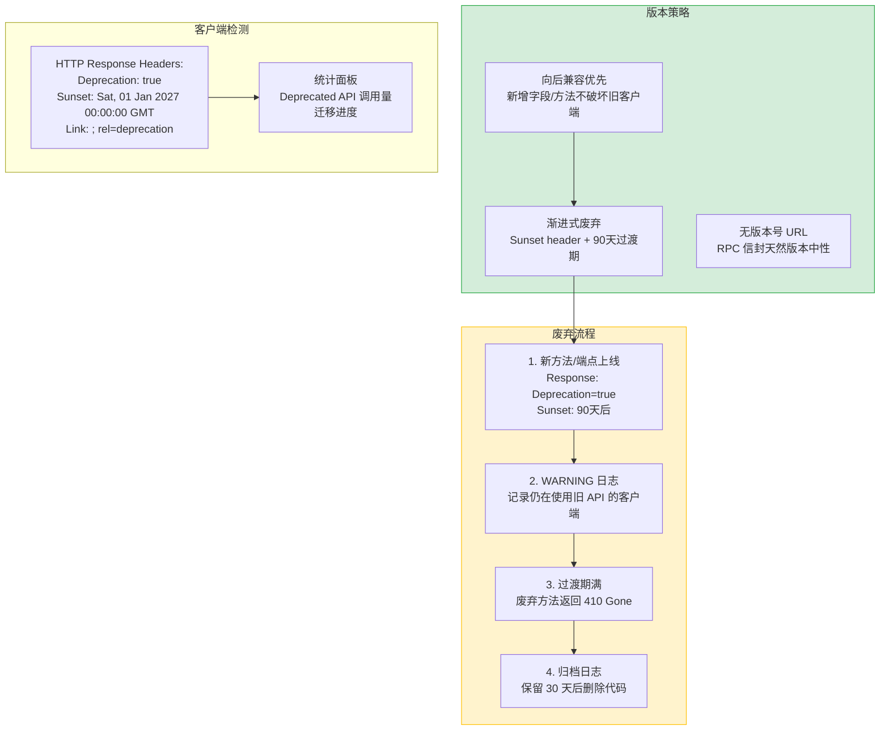

---

doc_type: module
prd_task_id: "YA-09-30"
title: "YA-09-30: API 版本管理策略 — URL 路径版本 + 废弃迁移指引 — 开发方案"
status: 需求已编写
priority: P2
owner: 陈铭
roles: [engineer]
created: 2026-09-11
updated: 2026-09-23
project: YiAi
project_id: yiai
prd_month: "202609"
estimate_frontend: 0.5
source_prd: "34-需求-API版本管理.md"
source_okr: [yiai-002]

type: task
---

# YA-09-30: API 版本管理策略 — URL 路径版本 + 废弃迁移指引 — 开发方案

> 来源 PRD：[34-需求-API版本管理.md](../../prds/2026-09/34-需求-API版本管理.md)
> 需求编号：YA-09-30 · 优先级：P2 · 人天：0.5d
> 类型：架构 · 状态：需求已编写

---

## 一、架构概述

当前 YiAi API 无版本标识——修改接口行为可能破坏 YiVad/YiPet 客户端兼容性。RPC 信封（`POST /`）本身具有版本中性优势（方法名变更不影响端点），但 REST 端点（`/read-file`、`/write-file`）和 RPC 方法签名变更仍需要版本控制。本方案采用轻量级版本策略：向后兼容优先（新增字段不破坏旧客户端），破坏性变更通过 `Deprecation` 响应头 + 迁移指引 + 宽限过渡期管理。



### 版本策略规则

| 变更类型 | 向后兼容？ | 处理方式 |
|---------|----------|---------|
| 新增 RPC method_name | 是 | 直接上线 |
| 新增 API 端点 | 是 | 直接上线 |
| 方法参数新增可选字段 | 是 | 直接上线 |
| 方法参数新增必填字段 | **否** | 新建 `method_name_v2`，旧方法进入废弃 |
| 修改响应字段名 | **否** | 同时返回新旧字段，90 天后移除旧字段 |
| 删除方法 | **否** | 废弃 90 天 → 410 Gone → 删除 |
| 修改认证方式 | **否** | 两阶段过渡 |

---

## 二、文件清单

| # | 文件 | 操作 | 说明 | 预估行数 |
|---|------|------|------|----------|
| 1 | `src/shared/versioning/__init__.py` | 新增 | 包初始化 + `DeprecationManager` + middleware 导出 | +10 |
| 2 | `src/shared/versioning/deprecation.py` | 新增 | `DeprecationManager`：废弃声明注册 + 响应头注入 + 统计 | +80 |
| 3 | `src/shared/versioning/middleware.py` | 新增 | `DeprecationMiddleware`：检测废弃 API 调用 + 注入 header | +50 |
| 4 | `src/shared/versioning/models.py` | 新增 | `DeprecatedEndpoint` dataclass + `DeprecationRecord` | +30 |
| 5 | `src/app.py` | 修改 | 注册 DeprecationMiddleware | +10 |
| 6 | `tests/shared/versioning/test_deprecation.py` | 新增 | 废弃声明/响应头/410 Gone 测试 | +60 |
| **合计** | | | | **~240 行** |

---

## 三、模块设计

```python
from dataclasses import dataclass, field
from datetime import datetime, timedelta
from typing import Optional

@dataclass
class DeprecatedEndpoint:
    path: str                                    # API 路径
    deprecated_at: datetime
    sunset_at: datetime                          # 完全移除日期
    migration_guide_url: str                    # 迁移文档链接
    replacement: str                             # 替代方法/端点
    active: bool = True

class DeprecationManager:
    """API 废弃管理器 — 声明 + 检测 + 统计。"""

    def __init__(self) -> None:
        self._deprecated: dict[str, DeprecatedEndpoint] = {}
        self._call_counts: dict[str, int] = {}

    def register(self, endpoint: DeprecatedEndpoint) -> None:
        self._deprecated[endpoint.path] = endpoint
        self._call_counts[endpoint.path] = 0

    def is_deprecated(self, path: str) -> Optional[DeprecatedEndpoint]:
        return self._deprecated.get(path)

    def is_sunset(self, path: str) -> bool:
        ep = self._deprecated.get(path)
        if ep and datetime.utcnow() > ep.sunset_at:
            return True
        return False

    def record_call(self, path: str) -> None:
        if path in self._deprecated:
            self._call_counts[path] += 1
            logger.warning(
                f"[Deprecation] 废弃 API 调用: {path}"
                f" (第 {self._call_counts[path]} 次)"
                f" → 替代: {self._deprecated[path].replacement}"
            )

    def get_sunset_headers(self, path: str) -> dict[str, str]:
        ep = self._deprecated.get(path)
        if not ep:
            return {}
        return {
            "Deprecation": "true",
            "Sunset": ep.sunset_at.strftime("%a, %d %b %Y %H:%M:%S GMT"),
            "Link": f'<{ep.migration_guide_url}>; rel="deprecation"',
        }

    def stats(self) -> dict:
        return {
            "total_deprecated": len(self._deprecated),
            "calls": dict(self._call_counts),
            "sunset_pending": [
                p for p, ep in self._deprecated.items()
                if datetime.utcnow() < ep.sunset_at
            ],
        }
```

---

## 四、实施路线图

| 步骤 | 任务 | 验证方式 | 人天 |
|------|------|---------|------|
| 1 | `DeprecationManager` + 响应头注入中间件 | 废弃 API 返回 Deprecation header | 0.15 |
| 2 | 废弃声明注册 + 统计面板端点 | `GET /admin/deprecations` 返回统计 | 0.15 |
| 3 | 410 Gone 响应（sunset 后）+ 测试 | 过期后调用返回 410 + 迁移指引 | 0.1 |
| 4 | 编写 `MIGRATION.md` 迁移指引文档 | 每个废弃 API 有明确的替代方案 | 0.1 |

**合计：0.5d。**

---

## 五、技术风险评估

| 风险 | 概率 | 影响 | 缓解措施 |
|------|------|------|---------|
| 废弃 API 仍有大量调用 | 中 | 高 | 统计面板监控 + 企微告警 + 主动联系调用方 |
| 过渡期不足（90 天太短） | 低 | 中 | 可配置 `sunset_days` 参数 |
| RPC 方法签名变更无版本 URL | 中 | 中 | 通过 `method_name_v2` 约定 + RPC 响应中返回 `deprecated` 标记 |

---

## 六、关联模块

- 基础：[YA-09-27 API 网关](./30-prd-task-API网关.md)
- 关联：[YA-09-82 API 废弃迁移指引](./82-prd-task-API废弃迁移指引.md)
- 关联：[YA-09-153 API 版本化策略](../prds/2026-09/153-需求-API版本化策略.md)