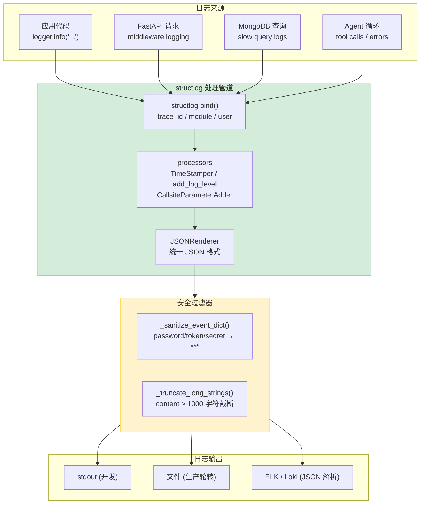

---

doc_type: module
prd_task_id: "YA-09-16"
title: "YA-09-16: 结构化 JSON 日志 — 统一格式 + 级别规范 + 敏感数据脱敏 — 开发方案"
status: 需求已编写
priority: P2
owner: 陈铭
roles: [engineer]
created: 2026-09-11
updated: 2026-09-23
project: YiAi
project_id: yiai
prd_month: "202609"
estimate_frontend: 1.0
source_prd: "35-需求-结构化日志.md"
source_okr: [yiai-001]

type: task
---

# YA-09-16: 结构化 JSON 日志 — 统一格式 + 级别规范 + 敏感数据脱敏 — 开发方案

> 来源 PRD：[35-需求-结构化日志.md](../../prds/2026-09/35-需求-结构化日志.md)
> 需求编号：YA-09-16 · 优先级：P2 · 人天：1.0d
> 依赖：YA-09-15（全链路 TraceID）· 类型：架构 · 状态：需求已编写

---

## 一、架构概述

当前 YiAi 使用 Python 标准 `logging` 输出纯文本格式，无法被日志聚合系统（ELK/Loki）高效解析和检索，缺乏日志级别规范（ERROR/WARN 混用），无敏感数据脱敏机制。本方案引入 `structlog` 统一 JSON 日志格式，定义 4 级日志使用规范，在 Formatter 层实现自动脱敏（password/token/secret/api_key），与 TraceID 系统集成。



### 日志级别规范

| 级别 | 数值 | 使用场景 | 示例 | 告警 |
|------|------|---------|------|------|
| CRITICAL | 50 | 服务不可用，需立即人工介入 | MongoDB 连接丢失、Ollama 崩溃 | 企微 @all |
| ERROR | 40 | 功能异常，需人工介入 | RAG 索引失败、RPC 调用异常 | 企微 |
| WARNING | 30 | 降级/重试/异常但可恢复 | 缓存未命中、SSE 重连、RSS 抓取失败 | 日志 |
| INFO | 20 | 关键业务事件 | 请求完成、Agent 循环结束 | 无 |
| DEBUG | 10 | 开发调试（生产环境默认关闭） | 函数参数、中间状态 | 无 |

---

## 二、文件清单

| # | 文件 | 操作 | 说明 | 预估行数 |
|---|------|------|------|----------|
| 1 | `src/shared/logging/__init__.py` | 新增 | 包初始化 + `get_logger()` + `configure_logging()` | +15 |
| 2 | `src/shared/logging/config.py` | 新增 | structlog 配置：processors + JSONRenderer + 级别 | +60 |
| 3 | `src/shared/logging/sanitizer.py` | 新增 | `sanitize()` 脱敏函数 + 字段名黑名单 + 截断 | +50 |
| 4 | `src/shared/logging/formatter.py` | 新增 | 自定义 `structlog.stdlib.ProcessorFormatter` | +40 |
| 5 | `src/app.py` | 修改 | lifespan startup 调用 `configure_logging()` | +10 |
| 6 | `tests/shared/logging/test_logging.py` | 新增 | JSON 格式/脱敏/级别/截断测试 | +80 |
| **合计** | | | | **~255 行** |

---

## 三、模块设计

### 3.1 structlog 配置

```python
import structlog
import logging

def configure_logging(
    level: str = "INFO",
    json_format: bool = True,
    development: bool = False,
) -> None:
    """
    配置 structlog + 标准库 logging 管道。

    输出格式:
      {"timestamp": "2026-09-14T10:30:00.000Z", "level": "info",
       "logger": "domain.ai.chat", "event": "Chat completed",
       "trace_id": "abc123", "duration_ms": 1523, "tokens": 500}
    """
    shared_processors = [
        structlog.stdlib.add_log_level,
        structlog.stdlib.add_logger_name,
        structlog.processors.TimeStamper(fmt="iso"),
        structlog.processors.StackInfoRenderer(),
        structlog.processors.format_exc_info,
        structlog.processors.UnicodeDecoder(),
    ]

    if development:
        # 开发环境：彩色 console + key-value 格式
        structlog.configure(
            processors=shared_processors + [
                structlog.dev.ConsoleRenderer(colors=True),
            ],
            context_class=dict,
            logger_factory=structlog.PrintLoggerFactory(),
        )
    else:
        # 生产环境：JSON 输出
        structlog.configure(
            processors=shared_processors + [
                sanitize_processor,          # 脱敏
                structlog.processors.JSONRenderer(),
            ],
            context_class=dict,
            logger_factory=structlog.stdlib.LoggerFactory(),
        )

    # 标准库 logging → structlog
    logging.basicConfig(
        format="%(message)s",
        level=getattr(logging, level.upper()),
    )

def get_logger(name: str = __name__) -> structlog.stdlib.BoundLogger:
    return structlog.get_logger(name)
```

### 3.2 脱敏处理器

```python
import re

SENSITIVE_FIELDS = {
    "password", "passwd", "pwd",
    "token", "access_token", "refresh_token", "api_key",
    "secret", "secret_key", "private_key",
    "authorization", "x-token",
}

MASK_VALUE = "***"
MAX_STRING_LENGTH = 1000

def sanitize_processor(logger, method_name, event_dict):
    """structlog processor — 自动脱敏敏感字段。"""
    return sanitize_dict(event_dict)

def sanitize_dict(data: dict) -> dict:
    result = {}
    for key, value in data.items():
        key_lower = key.lower()
        if any(s in key_lower for s in SENSITIVE_FIELDS):
            result[key] = MASK_VALUE
        elif isinstance(value, str) and len(value) > MAX_STRING_LENGTH:
            result[key] = value[:MAX_STRING_LENGTH] + "...[truncated]"
        elif isinstance(value, dict):
            result[key] = sanitize_dict(value)
        else:
            result[key] = value
    return result

def sanitize_string(text: str) -> str:
    """移除字符串中的 token/password 模式（如 URL 参数中的 token=xxx）。"""
    text = re.sub(r'(token|api_key|secret)=[^\s&]+', r'\1=***', text, flags=re.I)
    text = re.sub(r'Bearer\s+[^\s]+', 'Bearer ***', text, flags=re.I)
    return text
```

### 3.3 使用示例

```python
from shared.logging import get_logger

logger = get_logger(__name__)

# 带 context 的日志
log = logger.bind(trace_id="abc123", module="chat_service")
log.info("chat_completed", duration_ms=1523, tokens=500)

# 脱敏测试
log.info("user_login", username="admin", password="secret123")
# 输出: {..., "event": "user_login", "username": "admin", "password": "***"}
```

---

## 四、实施路线图

| 步骤 | 任务 | 验证方式 | 人天 |
|------|------|---------|------|
| 1 | structlog 集成 + JSONRenderer 配置 | `stdout` 输出合法 JSON | 0.3 |
| 2 | 脱敏处理器 + 字段黑名单 | `password`/`token` 字段自动屏蔽 | 0.2 |
| 3 | 级别规范 + 全局替换 `print` → `logger` | 生产日志无 `print` | 0.2 |
| 4 | 测试（JSON 格式/脱敏/级别/超长截断） | pytest 全部通过 | 0.3 |

**合计：1.0d。**

---

## 五、Code Review 检查清单

- [ ] `configure_logging()` 在 FastAPI lifespan startup 调用
- [ ] 生产环境使用 `JSONRenderer`——开发环境用 `ConsoleRenderer`
- [ ] 脱敏字段黑名单覆盖所有常见敏感字段名
- [ ] `sanitize_string()` 正则覆盖 URL 参数和 HTTP Header
- [ ] 日志中不使用 `logger.info(f"...")` 格式化——始终用 key=value 结构化
- [ ] 禁止 `print()` 输出——CI 增加 `flake8` 规则 `T001`
- [ ] 所有 ERROR 日志包含 `exc_info=True`（异常堆栈）
- [ ] 日志包含 `trace_id`（从 structlog context 绑定）

---

## 六、技术风险评估

| 风险 | 概率 | 影响 | 缓解措施 |
|------|------|------|---------|
| structlog 与 async 兼容性 | 低 | 低 | structlog 无 I/O，纯 CPU 操作 |
| 脱敏规则漏网（新敏感字段名） | 中 | 低 | 定期审查日志样本 + CI 规则检查 |
| 日志量过大占用磁盘 | 中 | 中 | 生产环境 `RotatingFileHandler` + 级别控制 |

---

## 七、关联模块

- 基础：[YA-09-15 全链路 TraceID](./33-prd-task-分布式链路追踪.md)
- 关联：[YA-09-111 日志敏感数据脱敏](./111-prd-task-日志敏感数据脱敏.md)
- 关联：[YA-09-94 自适应日志采样](./94-prd-task-自适应日志采样.md)