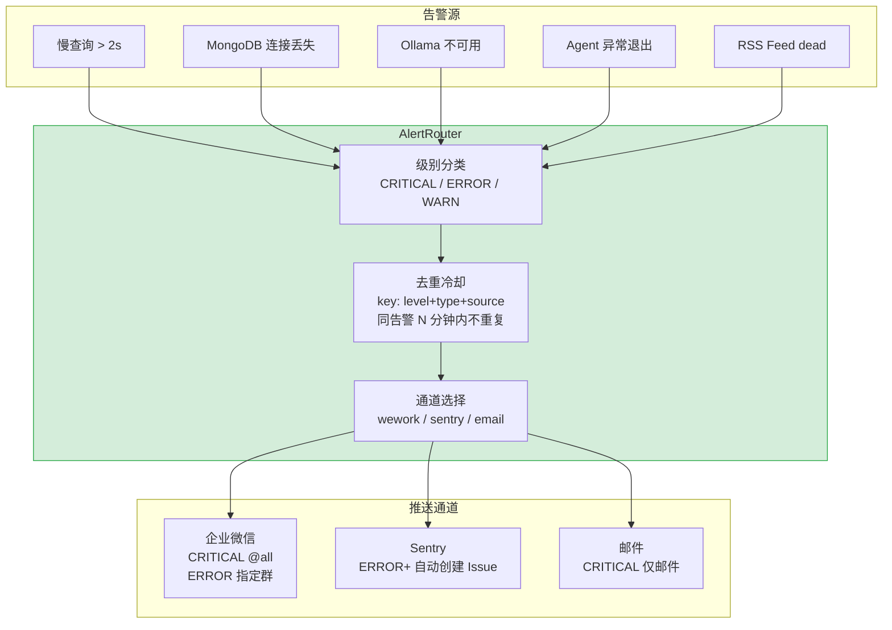

---

doc_type: module
prd_task_id: "YA-09-92"
title: "YA-09-92: 告警路由 — 分级 + 企微/Sentry/邮件三通道 — 开发方案"
status: 需求已编写
priority: P2
owner: 陈铭
roles: [engineer]
created: 2026-09-11
updated: 2026-09-23
project: YiAi
project_id: yiai
prd_month: "202609"
estimate_frontend: 0.5
source_prd: "36-需求-告警路由.md"
source_okr: [yiai-001]

type: task
---

# YA-09-92: 告警路由 — 分级 + 企微/Sentry/邮件三通道 — 开发方案

> 来源 PRD：[36-需求-告警路由.md](../../prds/2026-09/36-需求-告警路由.md)
> 需求编号：YA-09-92 · 优先级：P2 · 人天：0.5d
> 类型：架构 · 状态：需求已编写

---

## 一、架构概述

告警统一入口 `AlertRouter`，根据级别匹配通道规则（CRITICAL→三通道，ERROR→双通道，WARN→单通道），通过去重冷却防止告警风暴。



### 路由规则

| 级别 | 企微 | Sentry | 邮件 | 冷却 | 说明 |
|------|------|--------|------|------|------|
| CRITICAL | @all | 创建 Issue | 发送 | 5min | MongoDB 不可达、Ollama 崩溃 |
| ERROR | 指定群 | 创建 Issue | — | 15min | RAG 索引失败、RPC 超时 |
| WARN | 指定群 | — | — | 1h | 缓存未命中、配置变更 |

---

## 二、文件清单

| # | 文件 | 操作 | 说明 | 预估行数 |
|---|------|------|------|----------|
| 1 | `src/shared/alerts/__init__.py` | 新增 | 包初始化 + `AlertRouter` + `Alert` dataclass | +10 |
| 2 | `src/shared/alerts/router.py` | 新增 | `AlertRouter`：级别路由 + 去重 + 并发推送 | +80 |
| 3 | `src/shared/alerts/channels.py` | 新增 | 通道实现：`send_wework()` / `send_sentry()` / `send_email()` | +70 |
| 4 | `tests/shared/alerts/test_router.py` | 新增 | 路由规则/去重/通道 mock 测试 | +60 |
| **合计** | | | | **~220 行** |

---

## 三、模块设计

```python
from dataclasses import dataclass, field
from datetime import datetime, timedelta
from enum import Enum
import asyncio

class AlertLevel(str, Enum):
    CRITICAL = "CRITICAL"
    ERROR = "ERROR"
    WARN = "WARN"
    INFO = "INFO"

@dataclass
class Alert:
    level: AlertLevel
    type: str                # 告警类型: "slow_query", "db_connection", "ollama_unavailable"
    source: str              # 来源模块: "data_service", "chat_service"
    message: str
    details: dict = field(default_factory=dict)
    timestamp: datetime = field(default_factory=datetime.utcnow)

class AlertRouter:
    """告警路由器 — 级别路由 + 去重冷却 + 并发推送。"""

    RULES = {
        AlertLevel.CRITICAL: {
            "channels": ["wework", "sentry", "email"],
            "wework_mention_all": True,
            "cooldown": timedelta(minutes=5),
        },
        AlertLevel.ERROR: {
            "channels": ["wework", "sentry"],
            "wework_mention_all": False,
            "cooldown": timedelta(minutes=15),
        },
        AlertLevel.WARN: {
            "channels": ["wework"],
            "wework_mention_all": False,
            "cooldown": timedelta(hours=1),
        },
    }

    def __init__(self) -> None:
        self._last_sent: dict[str, datetime] = {}
        self._sent_count: int = 0
        self._suppressed_count: int = 0

    def _dedup_key(self, alert: Alert) -> str:
        return f"{alert.level.value}:{alert.type}:{alert.source}"

    def _should_send(self, alert: Alert) -> bool:
        rule = self.RULES.get(alert.level)
        if not rule:
            return False
        key = self._dedup_key(alert)
        now = datetime.utcnow()
        last = self._last_sent.get(key)
        if last and (now - last) < rule["cooldown"]:
            self._suppressed_count += 1
            logger.debug(f"[Alert] 去重抑制: {key}")
            return False
        return True

    async def route(self, alert: Alert) -> None:
        """路由告警到对应通道。"""
        if not self._should_send(alert):
            return
        rule = self.RULES[alert.level]
        key = self._dedup_key(alert)
        self._last_sent[key] = datetime.utcnow()
        self._sent_count += 1

        tasks = []
        for ch in rule["channels"]:
            if ch == "wework":
                tasks.append(send_wework(alert, mention_all=rule["wework_mention_all"]))
            elif ch == "sentry":
                tasks.append(send_sentry(alert))
            elif ch == "email":
                tasks.append(send_email(alert))

        results = await asyncio.gather(*tasks, return_exceptions=True)
        for ch, r in zip(rule["channels"], results):
            if isinstance(r, Exception):
                logger.error(f"[Alert] {ch} 推送失败: {r}")

    @property
    def stats(self) -> dict:
        return {
            "sent": self._sent_count,
            "suppressed": self._suppressed_count,
            "suppression_rate": (
                f"{self._suppressed_count / max(1, self._sent_count + self._suppressed_count):.1%}"
            ),
        }
```

---

## 四、实施路线图

| 步骤 | 任务 | 验证方式 | 人天 |
|------|------|---------|------|
| 1 | `AlertRouter` + 去重冷却逻辑 | 同告警 5min 内抑制 | 0.15 |
| 2 | 企微/Sentry/邮件通道实现 | CRITICAL 三通道推送 | 0.15 |
| 3 | 告警源集成（slow_query/db/unavailable/rss dead） | 对应场景触发告警 | 0.1 |
| 4 | 测试（路由/去重/通道失败隔离） | pytest 全部通过 | 0.1 |

**合计：0.5d。**

---

## 五、技术风险评估

| 风险 | 概率 | 影响 | 缓解措施 |
|------|------|------|---------|
| 企微 Webhook 限频 | 中 | 中 | 去重冷却 + `asyncio.gather(return_exceptions=True)` 不阻塞 |
| Sentry DSN 泄露 | 低 | 高 | 仅通过环境变量配置 |
| 告警风暴时 `_last_sent` 内存增长 | 低 | 低 | 定期清理 24h 前的 key |