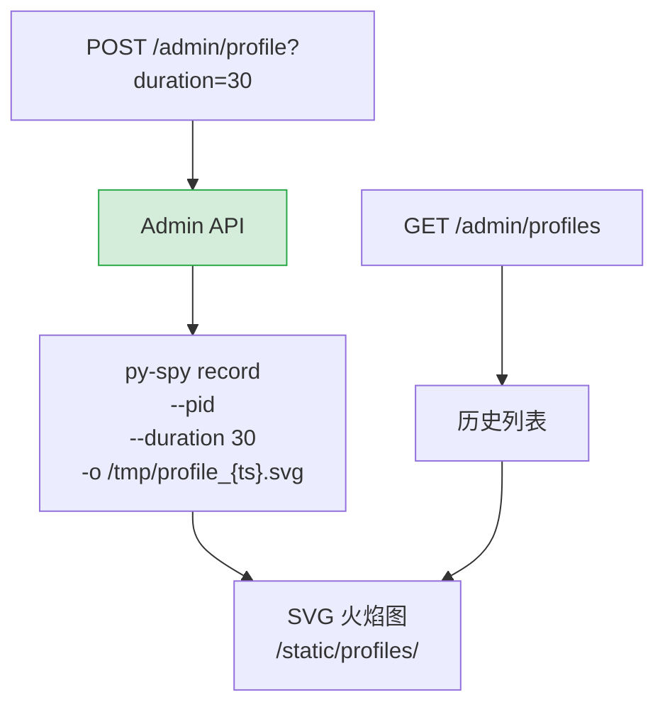

---

doc_type: module
prd_task_id: "YA-09-103"
title: "YA-09-103: 性能剖析与火焰图 — py-spy + Admin API — 开发方案"
status: 需求已编写
priority: P2
owner: 陈铭
roles: [engineer]
created: 2026-09-11
updated: 2026-09-23
project: YiAi
project_id: yiai
prd_month: "202609"
estimate_frontend: 0.5
source_prd: "37-需求-性能剖析火焰图.md"
source_okr: [yiai-001]

type: task
---

# YA-09-103: 性能剖析与火焰图 — py-spy + Admin API — 开发方案

> 来源 PRD：[37-需求-性能剖析火焰图.md](../../prds/2026-09/37-需求-性能剖析火焰图.md)
> 需求编号：YA-09-103 · 优先级：P2 · 人天：0.5d
> 类型：工具 · 状态：需求已编写

---

## 一、架构概述

通过 `py-spy` 对运行中的 FastAPI 进程采样生成火焰图 SVG，无需修改代码或重启服务。Admin API 触发采样，Dashboard 展示历史火焰图列表，用于排查 CPU 热点和性能瓶颈。



### 文件清单

| # | 文件 | 操作 | 行数 |
|---|------|------|------|
| 1 | `src/server/admin_routes.py` | 新增 | Admin 端点：触发采样 + 历史列表 | +60 |
| 2 | `src/shared/profiler.py` | 新增 | `ProfilerManager`：py-spy 进程管理 + 文件清理 | +70 |
| 3 | `src/app.py` | 修改 | 挂载 `/static/profiles` 静态目录 | +10 |
| 4 | `tests/shared/test_profiler.py` | 新增 | 采样/文件管理测试 | +50 |

---

## 二、模块设计

```python
import asyncio
import os
from datetime import datetime
from pathlib import Path

class ProfilerManager:
    """py-spy 性能剖析管理器。"""

    PROFILE_DIR = Path("/tmp/yiai_profiles")

    def __init__(self) -> None:
        self.PROFILE_DIR.mkdir(exist_ok=True)
        self._active_profile: Optional[asyncio.subprocess.Process] = None

    async def start_profile(self, duration: int = 30) -> str:
        """启动 CPU 采样，返回文件名。"""
        if self._active_profile and self._active_profile.returncode is None:
            raise RuntimeError("已有采样任务正在执行")
        ts = datetime.utcnow().strftime("%Y%m%d_%H%M%S")
        filename = f"profile_{ts}.svg"
        filepath = self.PROFILE_DIR / filename
        self._active_profile = await asyncio.create_subprocess_exec(
            "py-spy", "record", "-o", str(filepath),
            "--pid", str(os.getpid()),
            f"--duration={duration}",
            "--native",              # C 扩展调用栈
            stdout=asyncio.subprocess.PIPE,
            stderr=asyncio.subprocess.PIPE,
        )
        return filename

    async def wait_profile(self) -> Optional[str]:
        """等待采样完成，返回文件路径或 None。"""
        if not self._active_profile:
            return None
        await self._active_profile.wait()
        return str(self.PROFILE_DIR / f"profile_{datetime.utcnow().strftime('%Y%m%d_%H%M%S')}.svg")

    def list_profiles(self) -> list[dict]:
        """列出历史火焰图文件。"""
        files = sorted(self.PROFILE_DIR.glob("profile_*.svg"), reverse=True)
        return [{"name": f.name, "size": f.stat().st_size, "created": datetime.fromtimestamp(f.stat().st_ctime).isoformat()} for f in files[:20]]

    async def cleanup(self, keep_days: int = 7) -> int:
        """清理过期火焰图文件。"""
        cutoff = datetime.utcnow().timestamp() - keep_days * 86400
        deleted = 0
        for f in self.PROFILE_DIR.glob("profile_*.svg"):
            if f.stat().st_ctime < cutoff:
                f.unlink()
                deleted += 1
        return deleted
```

### Admin 端点

```python
@admin_router.post("/profile")
async def trigger_profile(duration: int = 30):
    filename = await profiler.start_profile(duration)
    return {"message": f"采样中 ({duration}s)", "filename": filename}

@admin_router.get("/profiles")
async def list_profiles():
    return {"profiles": profiler.list_profiles()}
```

---

## 三、实施路线图

| 步骤 | 任务 | 人天 |
|------|------|------|
| 1 | `ProfilerManager` + Admin API 端点 | 0.15 |
| 2 | Dashboard 集成 + 历史列表 | 0.15 |
| 3 | 清理策略 + 测试 | 0.2 |

**合计：0.5d。**

---

## 四、技术风险

| 风险 | 缓解 |
|------|------|
| py-spy 未安装在服务器 | 启动时检测 `which py-spy`，缺失时 Admin API 返回提示 |
| 采样影响生产性能 | py-spy 低开销（< 1% CPU），duration 限制 60s |
| 并发采样冲突 | 进程级锁，同时只允许一个采样任务 |