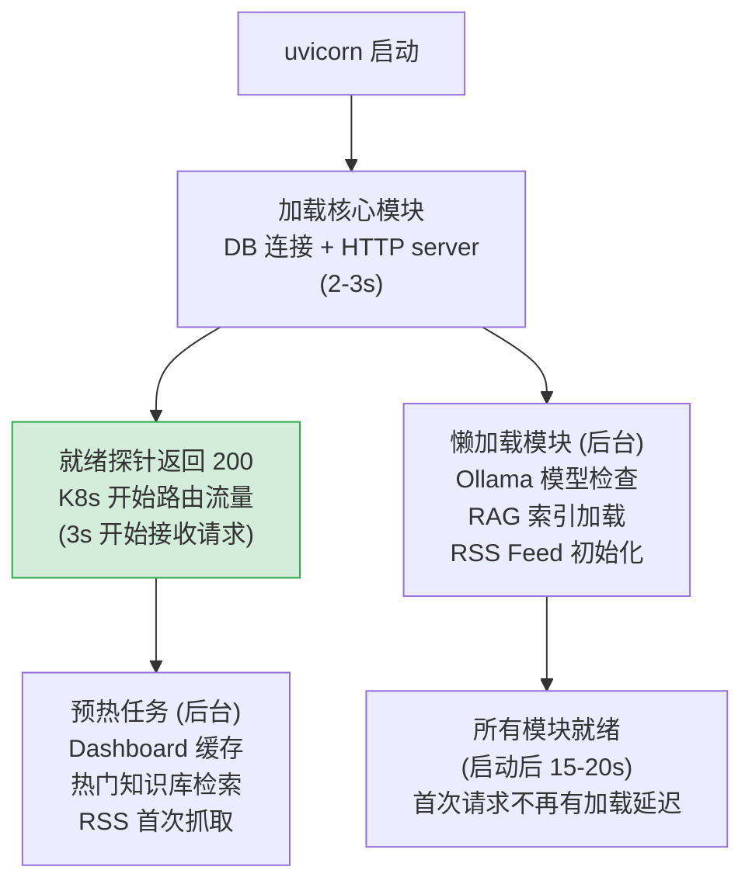

---

doc_type: module
prd_task_id: "YA-09-34"
title: "YA-09-34: 服务冷启动优化 — 懒加载 + 预热 + 就绪等待 — 开发方案"
status: 需求已编写
priority: P2
owner: 陈铭
roles: [engineer]
created: 2026-09-11
updated: 2026-09-23
project: YiAi
project_id: yiai
prd_month: "202609"
estimate_frontend: 0.5
source_prd: "38-需求-冷启动优化.md"
source_okr: [yiai-001]

type: task
---

# YA-09-34: 服务冷启动优化 — 懒加载 + 预热 + 就绪等待 — 开发方案

> 来源 PRD：[38-需求-冷启动优化.md](../../prds/2026-09/38-需求-冷启动优化.md)
> 需求编号：YA-09-34 · 优先级：P2 · 人天：0.5d
> 类型：架构 · 状态：需求已编写

---

## 一、架构概述

当前 YiAi 启动时立即加载所有模块（Ollama 模型检查、RAG 索引加载、RSS Feed 连接），导致 uvicorn 就绪延迟 15-30s。K8s 就绪探针超时、滚动更新延迟。本方案通过懒加载（将非核心模块延迟到首次请求时初始化）+ 启动后预热（后台任务加载热门数据）+ 就绪门槛（核心模块就绪即返回 ready）。



### 懒加载 vs 热加载

| 模块 | 原启动方式 | 优化后 | 节省启动时间 |
|------|----------|--------|------------|
| MongoDB 连接 | 同步阻塞 | 异步连接池 | - |
| Ollama 模型检查 | 启动时 ping | 懒加载（首次请求时） | -5s |
| RAG 索引加载 | 启动时全量加载 | 后台预热 | -8s |
| RSS Feed 初始化 | 启动时连接全部 | 懒加载（首次调度时） | -3s |
| 知识库扫描 | 启动时全量扫描 | 后台任务（延迟 10s） | -2s |

---

## 二、文件清单

| # | 文件 | 操作 | 说明 | 行数 |
|---|------|------|------|------|
| 1 | `src/shared/startup.py` | 新增 | `LazyLoader` 类：懒加载管理器 + 预热任务调度 | +70 |
| 2 | `src/domain/ai/chat.py` | 修改 | Ollama 模型检查改为懒加载 | +15 / -10 |
| 3 | `src/domain/rag/indexer.py` | 修改 | RAG 索引改为后台加载 + 就绪标记 | +20 / -10 |
| 4 | `src/domain/rss/scheduler.py` | 修改 | RSS Feed 改为首次调度时初始化 | +10 |
| 5 | `src/app.py` | 修改 | lifespan startup 只等待核心模块就绪 | +20 |

---

## 三、模块设计

```python
import asyncio
from enum import Enum
from typing import Callable, Coroutine

class ModuleState(Enum):
    PENDING = "pending"
    LOADING = "loading"
    READY = "ready"
    FAILED = "failed"

class LazyLoader:
    """懒加载管理器 — 核心模块阻塞启动，非核心模块后台加载。"""

    def __init__(self) -> None:
        self._modules: dict[str, tuple[Callable, ModuleState]] = {}
        self._core_ready = asyncio.Event()

    def register(self, name: str, loader: Callable, core: bool = False) -> None:
        self._modules[name] = (loader, ModuleState.PENDING, core)

    async def startup(self) -> None:
        """启动流程：核心模块同步等待 → 设置就绪 → 非核心后台加载。"""
        core_loaders = [
            (n, l) for n, (l, s, c) in self._modules.items() if c
        ]
        lazy_loaders = [
            (n, l) for n, (l, s, c) in self._modules.items() if not c
        ]

        # 阶段 1：加载核心模块（阻塞）
        results = await asyncio.gather(
            *[self._load(name, loader) for name, loader in core_loaders],
            return_exceptions=True,
        )
        for (name, _), r in zip(core_loaders, results):
            if isinstance(r, Exception):
                logger.critical(f"[Startup] 核心模块加载失败: {name}: {r}")
                raise r

        # 阶段 2：设置就绪标记
        self._core_ready.set()
        logger.info(f"[Startup] 核心模块就绪 ({len(core_loaders)} modules)")

        # 阶段 3：后台加载非核心模块 + 预热
        asyncio.create_task(self._load_lazy_and_warmup(lazy_loaders))

    async def _load_lazy_and_warmup(self, loaders: list) -> None:
        for name, loader in loaders:
            await self._load(name, loader)
        logger.info(f"[Startup] 所有模块加载完成")

    async def _load(self, name: str, loader: Callable) -> None:
        start = asyncio.get_event_loop().time()
        try:
            await loader()
            elapsed = asyncio.get_event_loop().time() - start
            logger.info(f"[Startup] ✓ {name} ({elapsed:.1f}s)")
        except Exception as e:
            logger.error(f"[Startup] ✗ {name}: {e}")

    @property
    def is_ready(self) -> bool:
        return self._core_ready.is_set()
```

---

## 四、实施路线图

| 步骤 | 任务 | 人天 |
|------|------|------|
| 1 | `LazyLoader` + 核心/非核心模块分类 | 0.15 |
| 2 | Ollama 模型检查改为懒加载 | 0.1 |
| 3 | RAG 索引后台加载 + 就绪门槛调整 | 0.15 |
| 4 | 测试（就绪标记/懒加载触发/配置重载） | 0.1 |

**合计：0.5d。**

---

## 五、技术风险

| 风险 | 缓解 |
|------|------|
| 懒加载导致首次请求延迟高 | 预热任务在启动后 10s 开始——大部分模块在首次请求前已完成 |
| 非核心模块加载失败 | 不影响就绪——标记 FAILED 状态，首次请求时重试 |
| K8s readiness 门槛太低 | 核心模块 = DB + HTTP server + config，缺失任何一个启动失败 |