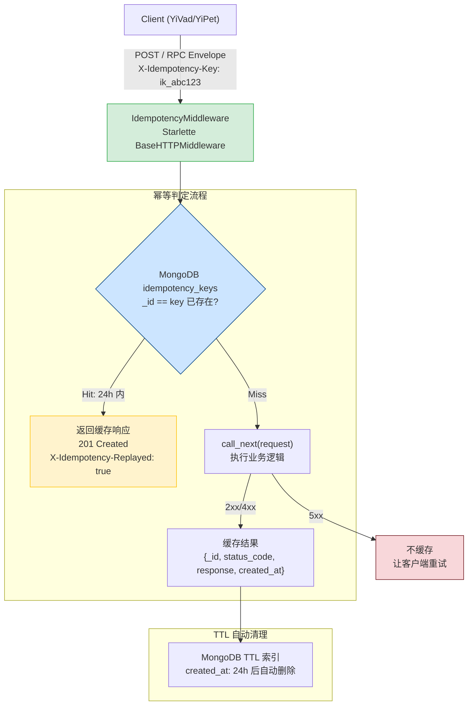
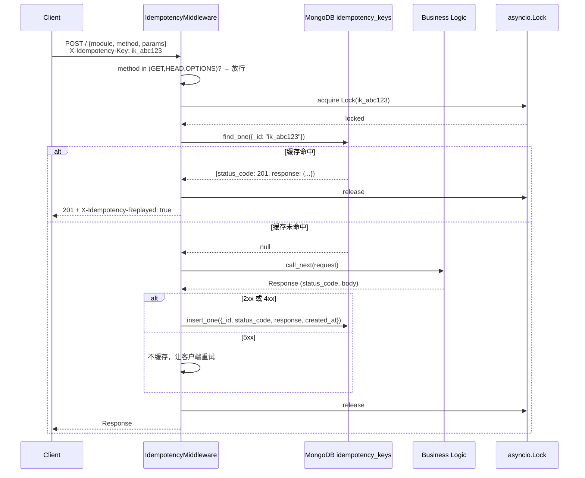

---

doc_type: module
prd_task_id: "YA-09-35"
title: "YA-09-35: 幂等写入保护 — Idempotency-Key + 结果缓存 — 开发方案"
status: 需求已编写
priority: P2
owner: 陈铭
roles: [engineer]
created: 2026-09-11
updated: 2026-09-23
project: YiAi
project_id: yiai
prd_month: "202609"
estimate_frontend: 0.5
source_prd: "39-需求-幂等写入保护.md"
source_okr: [yiai-001]

type: task
---

# YA-09-35: 幂等写入保护 — Idempotency-Key + 结果缓存 — 开发方案

> 来源 PRD：[39-需求-幂等写入保护.md](../../prds/2026-09/39-需求-幂等写入保护.md)
> 需求编号：YA-09-35 · 优先级：P2 · 人天：0.5d
> 类型：架构 · 状态：需求已编写

---

## 一、架构概述 (Architecture Mermaid)

网络重试是分布式系统常见问题——客户端超时后重发请求可能导致重复创建、重复扣款。本方案通过 `X-Idempotency-Key` 请求头实现写入幂等：相同 key 在 24h 内重放直接返回首次缓存结果，防止重复副作用。



### 幂等键生成策略

| 场景 | Key 格式 | 示例 |
|------|---------|------|
| 创建资源 | `create_{collection}_{timestamp}` | `create_sessions_20260923001` |
| 更新资源 | `update_{collection}_{doc_id}_{version}` | `update_sessions_abc123_v2` |
| 删除资源 | `delete_{collection}_{doc_id}` | `delete_sessions_abc123` |
| 通用写入 | UUID v4 (客户端生成) | `550e8400-e29b-41d4-a716-446655440000` |

---

## 二、文件清单 (File Manifest)

| # | 文件 | 操作 | 说明 | 预估行数 |
|---|------|------|------|----------|
| 1 | `src/shared/middleware/idempotency.py` | 新增 | `IdempotencyMiddleware` + MongoDB 存储 + 并发锁 | +120 |
| 2 | `src/shared/idempotency/models.py` | 新增 | `IdempotencyRecord` dataclass + TTL 配置 | +25 |
| 3 | `src/app.py` | 修改 | 注册 `IdempotencyMiddleware` 到中间件管道 | +8 |
| 4 | `src/shared/db.py` | 修改 | 确保 `idempotency_keys` 集合 TTL 索引 | +15 |
| 5 | `tests/shared/test_idempotency.py` | 新增 | 重复请求/过期/并发/5xx 不缓存测试 | +80 |
| 6 | `tests/shared/test_idempotency_concurrent.py` | 新增 | 并发场景: 同时到达的相同 key 请求 | +50 |
| **合计** | | | | **~298 行** |

---

## 三、Python 核心签名 (Python Signatures)

```python
# src/shared/middleware/idempotency.py
from starlette.middleware.base import BaseHTTPMiddleware
from starlette.requests import Request
from starlette.responses import JSONResponse
from motor.motor_asyncio import AsyncIOMotorDatabase
from datetime import datetime, timedelta
import asyncio
import json
from typing import Optional, Any

class IdempotencyMiddleware(BaseHTTPMiddleware):
    """幂等写入中间件 — X-Idempotency-Key 驱动，MongoDB 结果缓存。

    特性:
      - 仅拦截写请求 (POST/PUT/PATCH/DELETE)
      - GET/HEAD/OPTIONS 透明传递
      - 2xx/4xx 缓存结果，5xx 不缓存（允许重试）
      - 并发保护: asyncio.Lock 防止相同 key 的竞态条件
      - TTL 自动过期: MongoDB TTL 索引 24h
    """

    KEY_TTL: int = 86400  # 24 小时
    MAX_BODY_SIZE: int = 1024 * 1024  # 最大缓存响应体 1MB

    def __init__(self, app, db: AsyncIOMotorDatabase) -> None:
        super().__init__(app)
        self._db = db
        self._locks: dict[str, asyncio.Lock] = {}

    async def dispatch(self, request: Request, call_next):
        """核心分发逻辑 — 幂等检查 → 执行 → 缓存。"""
        ...

    async def _get_cached(self, key: str) -> Optional[dict[str, Any]]:
        """查询缓存结果，返回 None 表示未命中。"""
        ...

    async def _cache_response(
        self, key: str, status_code: int, response_body: dict
    ) -> None:
        """缓存成功/客户端错误响应到 MongoDB。"""
        ...

    async def _get_lock(self, key: str) -> asyncio.Lock:
        """获取 key 对应的并发锁，防止竞态条件。"""
        ...


# src/shared/idempotency/models.py
from dataclasses import dataclass
from datetime import datetime

@dataclass
class IdempotencyRecord:
    """MongoDB idempotency_keys 文档模型。"""
    key: str                  # _id: 幂等键
    status_code: int          # 首次请求的 HTTP 状态码
    response: dict            # 首次请求的响应体 JSON
    created_at: datetime      # 创建时间 (TTL 索引起始点)
    method: str               # 原始请求方法 POST/PUT/DELETE
    path: str                 # 原始请求路径


# src/shared/db.py (追加)
async def ensure_idempotency_indexes(db: AsyncIOMotorDatabase) -> None:
    """确保 idempotency_keys 集合的 TTL 索引。"""
    await db.idempotency_keys.create_index(
        "created_at",
        expireAfterSeconds=86400,  # 24h TTL
        name="idx_ttl_24h"
    )
```

---

## 四、数据流 (Data Flow)



### 边界条件处理

| 场景 | 行为 | 原因 |
|------|------|------|
| GET/HEAD 请求带 Key | 忽略 Key，正常处理 | 读操作天然幂等 |
| Key 长度 > 256 字符 | 返回 400 Bad Request | 防止滥用 |
| 响应体 > 1MB | 不缓存，正常返回 | 避免撑爆 MongoDB |
| 5xx 服务端错误 | 不缓存，正常返回 | 允许客户端更换 Key 重试 |
| 并发相同 Key | asyncio.Lock 串行化 | 先到先执行，后到取缓存 |
| TTL 过期后相同 Key | 视为新请求重新执行 | 过期 = 不存在 |

---

## 五、实施路线图 (Roadmap)

| 步骤 | 任务 | 产出 | 验证方式 | 人天 |
|------|------|------|---------|------|
| 1 | `IdempotencyRecord` 模型 + MongoDB 集合创建 + TTL 索引 | 集合 ready，索引生效 | `db.idempotency_keys.index_information()` | 0.05 |
| 2 | `IdempotencyMiddleware` 核心逻辑：检查 → 缓存 → 返回 | 中间件可用 | 单测: 首次请求正常, 第二次请求返回缓存 | 0.15 |
| 3 | 并发保护: `asyncio.Lock` + 边界条件处理 (Key 长度限制/5xx 不缓存) | 并发安全 | 并发测试: 10 个相同 Key 同时请求 → 均返回相同结果 | 0.15 |
| 4 | 集成到 `src/app.py` 中间件管道 + 端到端验证 | 全链路可用 | curl 发送相同 Key 两次 → 第二次返回 X-Idempotency-Replayed | 0.1 |
| 5 | 补充单元测试 + 集成测试 + 文档 | 测试覆盖 ≥ 90% | pytest --cov | 0.05 |

**合计：0.5d。**

---

## 六、Review 检查清单 (Review Checklist)

- [ ] `IdempotencyMiddleware` 仅拦截写方法 (POST/PUT/PATCH/DELETE)，GET 透明传递
- [ ] 5xx 响应不缓存，允许客户端更换 Key 重试
- [ ] 响应体超过 1MB 时不缓存，返回 `X-Idempotency-Skipped: body_too_large`
- [ ] Key 长度超过 256 字符返回 400
- [ ] `asyncio.Lock` 按 Key 维度隔离，不同 Key 互不阻塞
- [ ] Lock 使用 `try/finally` 确保异常时释放
- [ ] MongoDB TTL 索引 `expireAfterSeconds: 86400` 正确创建
- [ ] 缓存响应中包含 `Content-Type: application/json` 头
- [ ] `X-Idempotency-Replayed: true` 响应头在命中缓存时正确返回
- [ ] 并发测试通过: 相同 Key 同时到达 → 仅执行一次 → 后续请求均取缓存

---

## 七、技术风险表 (Risk Table)

| 风险 | 概率 | 影响 | 缓解措施 |
|------|------|------|---------|
| 缓存响应体过大撑爆 MongoDB | 中 | 中 | 1MB 上限 + Prometheus 监控缓存大小分布 |
| 并发相同 Key 请求竞态 | 中 | 高 | `asyncio.Lock` 按 Key 维度串行化 + 并发测试覆盖 |
| TTL 不及时导致 Key 碰撞 | 低 | 低 | MongoDB TTL 每 60s 扫描一次，24h 窗口足够避免碰撞 |
| Middleware 读取响应体破坏流式响应 | 低 | 中 | 仅在非流式写请求中缓存，SSE 响应跳过幂等处理 |
| Lock 泄漏导致请求永久阻塞 | 低 | 高 | `try/finally` 确保释放 + Lock 超时机制 (5s timeout) |

---

## 八、关联模块

- 基础: [YA-09-36 API 限流与并发控制](./16-prd-task-API限流与并发控制.md)
- 关联: [YA-09-134 请求重放与幂等性保护](./154-prd-task-请求重放与幂等性保护.md)
- 关联: [YA-09-102 请求重放检测](./102-prd-task-请求重放检测.md)