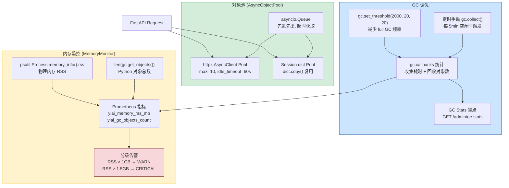
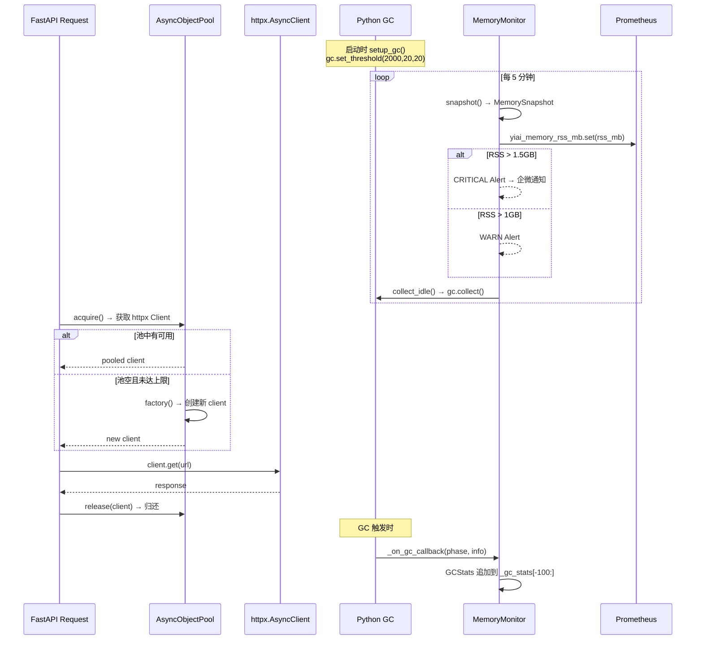

---

doc_type: module
prd_task_id: "YA-09-29"
title: "YA-09-29: 内存管理优化 — 对象池 + GC 调优 + 内存监控 — 开发方案"
status: 需求已编写
priority: P2
owner: 陈铭
roles: [engineer]
created: 2026-09-11
updated: 2026-09-23
project: YiAi
project_id: yiai
prd_month: "202609"
estimate_frontend: 1.0
source_prd: "40-需求-内存管理优化.md"
source_okr: [yiai-001]

type: task
---

# YA-09-29: 内存管理优化 — 对象池 + GC 调优 + 内存监控 — 开发方案

> 来源 PRD：[40-需求-内存管理优化.md](../../prds/2026-09/40-需求-内存管理优化.md)
> 需求编号：YA-09-29 · 优先级：P2 · 人天：1.0d
> 类型：架构 · 状态：需求已编写

---

## 一、架构概述 (Architecture Mermaid)

Python GC 在长时间运行的异步服务中可能成为性能瓶颈——stop-the-world 暂停导致请求延迟抖动，频繁对象创建导致内存碎片和 RSS 持续增长。三管齐下：**对象池**（复用 httpx Client / Session dict）、**GC 调优**（减少 full GC 频率，空闲定时触发）、**内存监控**（psutil RSS + GC stats 仪表盘 + 分级告警）。



---

## 二、文件清单 (File Manifest)

| # | 文件 | 操作 | 说明 | 预估行数 |
|---|------|------|------|----------|
| 1 | `src/shared/pool.py` | 新增 | `AsyncObjectPool[T]` 泛型对象池 + `PooledAsyncClient` | +80 |
| 2 | `src/shared/memory.py` | 新增 | `MemoryMonitor`: GC 调优配置 + psutil 监控 + 告警 | +90 |
| 3 | `src/shared/memory/admin.py` | 新增 | `GET /admin/gc-stats` 端点 + 手动触发 `gc.collect()` | +40 |
| 4 | `src/app.py` | 修改 | 启动时配置 GC 参数 + 注册定时内存检查任务 | +25 |
| 5 | `src/shared/scheduler.py` | 修改 | 新增 `memory_monitor_loop` 定时任务 (5min 间隔) | +15 |
| 6 | `tests/shared/test_pool.py` | 新增 | 对象池获取/归还/超时/并发测试 | +60 |
| 7 | `tests/shared/test_memory.py` | 新增 | GC 回调统计 + RSS 监控 + 告警阈值测试 | +55 |
| **合计** | | | | **~365 行** |

---

## 三、Python 核心签名 (Python Signatures)

```python
# src/shared/pool.py
import asyncio
from typing import TypeVar, Generic, Callable, Optional, AsyncContextManager

T = TypeVar("T")

class AsyncObjectPool(Generic[T]):
    """泛型异步对象池 — asyncio.Queue 实现对象复用。

    适用场景:
      - httpx.AsyncClient (HTTP 连接复用)
      - dict (消息构建中间对象)
      - bytearray (缓冲区复用)

    特性:
      - 惰性创建: 仅在 pool 为空且未达上限时 factory()
      - 超时获取: idle_timeout 秒内无可用对象则触发 TimeoutError
      - 上限控制: max_size 防止无限膨胀
    """

    def __init__(
        self,
        factory: Callable[[], T],
        max_size: int = 100,
        idle_timeout: float = 60.0,   # 获取超时 (秒)
        ttl: float = 300.0,            # 对象生命周期 (秒), 超时销毁
    ) -> None:
        self._pool: asyncio.Queue[tuple[T, float]] = asyncio.Queue(maxsize=max_size)
        self._factory = factory
        self._size: int = 0
        self._idle_timeout = idle_timeout
        self._ttl = ttl

    async def acquire(self) -> T:
        """获取可用对象，超时或池满时等待。"""
        ...

    async def release(self, obj: T) -> None:
        """归还对象到池中。过期对象自动丢弃。"""
        ...

    async def __aenter__(self) -> T:
        """Async context manager 支持。"""
        ...

    async def __aexit__(self, *args) -> None:
        ...

    @property
    def size(self) -> int:
        return self._size

    @property
    def available(self) -> int:
        return self._pool.qsize()


# src/shared/memory.py
import gc
import psutil
import logging
from typing import Optional
from dataclasses import dataclass, field

logger = logging.getLogger(__name__)

@dataclass
class GCStats:
    """GC 统计快照。"""
    generation: int
    collected: int
    uncollectable: int
    duration_ms: float
    timestamp: float

@dataclass
class MemorySnapshot:
    """内存快照。"""
    rss_mb: float
    vms_mb: float
    gc_objects: int
    gc_stats: list[GCStats] = field(default_factory=list)

class MemoryMonitor:
    """内存监控器 — GC 调优 + psutil 指标 + 分级告警。"""

    def __init__(
        self,
        rss_warn_mb: int = 1024,       # WARN 阈值 (MB)
        rss_critical_mb: int = 1536,   # CRITICAL 阈值 (MB)
        gc_thresholds: tuple[int, int, int] = (2000, 20, 20),
    ) -> None:
        self._process = psutil.Process()
        self._rss_warn_mb = rss_warn_mb
        self._rss_critical_mb = rss_critical_mb
        self._gc_stats: list[GCStats] = []

    def setup_gc(self) -> None:
        """配置 GC 阈值 + 注册回调。"""
        ...

    def _on_gc_callback(self, phase: str, info: dict) -> None:
        """GC 回调 — 记录每次回收统计。"""
        ...

    def snapshot(self) -> MemorySnapshot:
        """获取当前内存/Gc 快照。"""
        ...

    def check_alerts(self) -> Optional[str]:
        """检查内存告警级别: None / WARN / CRITICAL。"""
        ...

    def collect_idle(self) -> None:
        """空闲时手动触发 GC，降低内存水位。"""
        ...
```

---

## 四、数据流 (Data Flow)



### 对象池生命周期

```
创建 → acquire() 获取 → 使用 → release() 归还 → (过期) → 丢弃
                                                     │
                                              ttl=300s 超时
```

---

## 五、实施路线图 (Roadmap)

| 步骤 | 任务 | 产出 | 验证方式 | 人天 |
|------|------|------|---------|------|
| 1 | `AsyncObjectPool[T]` 泛型池 + 单元测试 | 池 acquire/release 通过 | `test_pool.py` 全部通过 | 0.15 |
| 2 | httpx.AsyncClient 池化集成 — 替换直接 `httpx.AsyncClient()` | RPC 调用复用连接 | 压测对比: 连接数下降 80% | 0.15 |
| 3 | `MemoryMonitor` + GC 回调统计 | GC stats 端点可用 | `GET /admin/gc-stats` 返回 JSON | 0.2 |
| 4 | Prometheus 指标: `yiai_memory_rss_mb` / `yiai_gc_objects_count` | Grafana 可查看 | Grafana Dashboard 内存面板 | 0.15 |
| 5 | 分级告警: WARN(1GB) / CRITICAL(1.5GB) + 企微通知 | 告警链路可用 | 手动注满内存 → 触发企微消息 | 0.15 |
| 6 | Session dict 池化 + 定时 GC 空闲回收 | 对象数稳定 | 24h 压测: GC objects 波动 < 20% | 0.1 |
| 7 | 集成测试 + 文档 | 全链路验证 | 24h soak test 通过 | 0.1 |

**合计：1.0d。**

---

## 六、Review 检查清单 (Review Checklist)

- [ ] `AsyncObjectPool` 支持泛型 `T`，不绑定具体类型
- [ ] `acquire()` 超时抛出 `asyncio.TimeoutError`，调用方需处理
- [ ] `release()` 不抛异常，池满时静默丢弃
- [ ] Async context manager (`__aenter__`/`__aexit__`) 可用
- [ ] GC 回调在注册后正确触发，统计不丢失
- [ ] `MemoryMonitor.snapshot()` 不阻塞事件循环（无同步 I/O）
- [ ] Prometheus 指标正确注册到 `/metrics` 端点
- [ ] 告警阈值可通过 `config.yaml: memory.warn_mb / critical_mb` 配置
- [ ] `gc.collect()` 仅在空闲时触发（检查 asyncio 是否有 pending task）
- [ ] 对象池 `max_size` 和 `ttl` 可通过配置调整

---

## 七、技术风险表 (Risk Table)

| 风险 | 概率 | 影响 | 缓解措施 |
|------|------|------|---------|
| GC 回调阻塞事件循环 | 中 | 高 | 回调中仅记录数据，不做 I/O；异步写入日志 |
| 对象池对象过期复用（stale connection） | 低 | 中 | `ttl` 机制 + `release()` 前检查对象是否过期 |
| `psutil.Process()` 在容器中获取宿主机内存 | 中 | 低 | 读取 `/sys/fs/cgroup/memory/memory.usage_in_bytes` 作为备选 |
| GC 阈值调优过度导致内存增长 | 低 | 中 | 保留手动 `gc.collect()` 定时触发 + 监控 RSS 趋势 |
| httpx Client 池中连接被服务端关闭 | 中 | 中 | `httpx.AsyncClient` 自带连接池，pool 层只管 Client 实例复用 |

---

## 八、关联模块

- 基础: [YA-09-127 连接池预热自适应](./107-prd-task-连接池预热自适应.md)
- 关联: [YA-09-128 缓存层设计](./108-prd-task-缓存层设计.md)
- 关联: [YA-09-124 内存分配优化](./124-prd-task-内存分配优化.md)