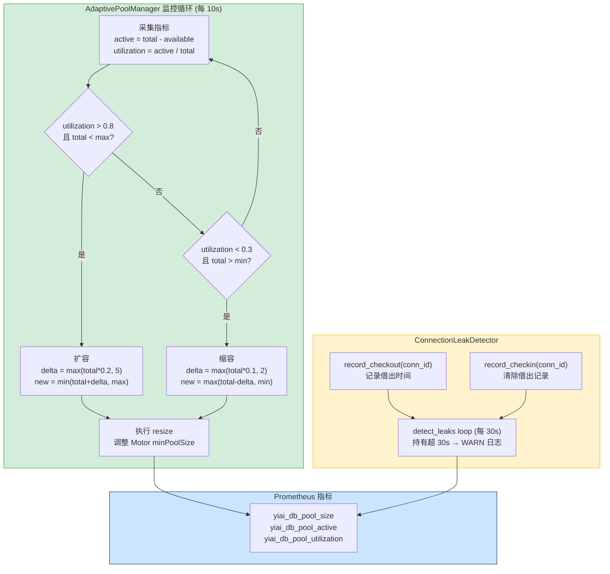
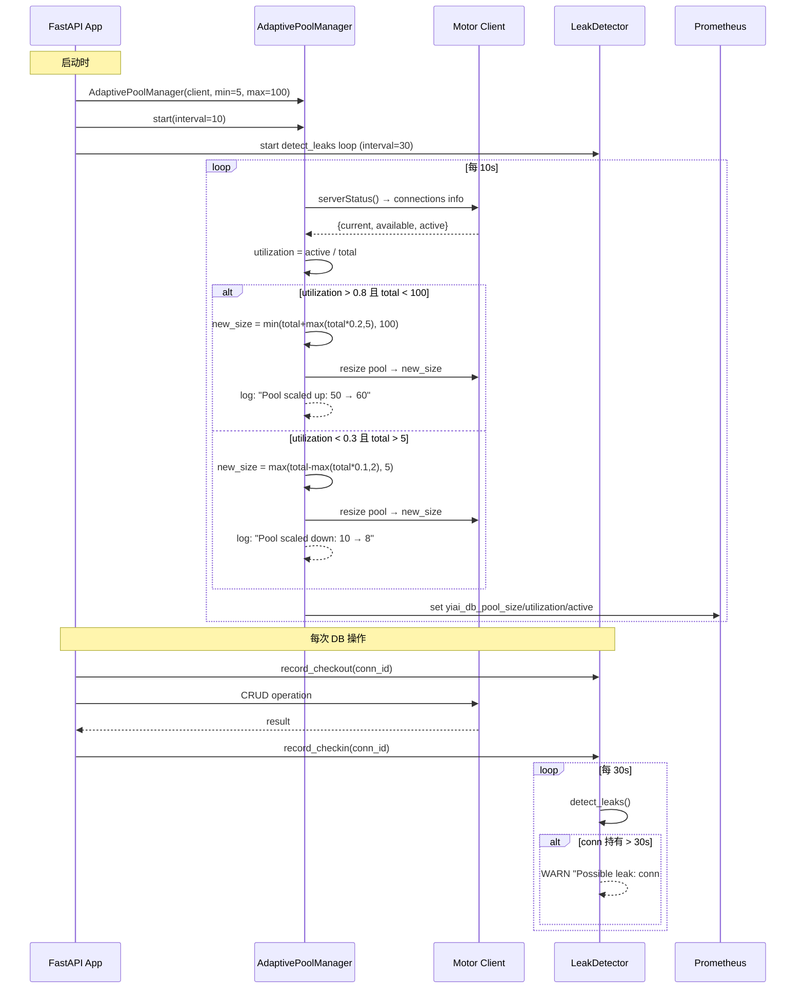

---

doc_type: module
prd_task_id: "YA-09-18"
title: "YA-09-18: 数据库连接池动态伸缩 — 按需扩缩容 + 泄漏检测 + 指标 — 开发方案"
status: 需求已编写
priority: P2
owner: 陈铭
roles: [engineer]
created: 2026-09-11
updated: 2026-09-23
project: YiAi
project_id: yiai
prd_month: "202609"
estimate_frontend: 3.0
source_prd: "41-需求-连接池动态伸缩.md"
source_okr: [yiai-001]
related_tests: ["41-prd-test-连接池动态伸缩"]

type: task
---

# YA-09-18: 数据库连接池动态伸缩 — 按需扩缩容 + 泄漏检测 + 指标 — 开发方案

> 来源 PRD：[41-需求-连接池动态伸缩.md](../../prds/2026-09/41-需求-连接池动态伸缩.md)
> 需求编号：YA-09-18 · 优先级：P2 · 人天：3.0d
> 类型：架构 · 状态：需求已编写

---

## 一、架构概述 (Architecture Mermaid)

当前 Motor 连接池固定 `minPoolSize=10, maxPoolSize=50`。低负载浪费 10 个连接，高负载 50 个不够时排队等待。目标：**动态调整 5-100，峰值处理能力提升 50%**。



### 连接池参数

| 参数 | 默认值 | 说明 |
|------|--------|------|
| `pool.min_size` | 5 | 最小连接数 |
| `pool.max_size` | 100 | 最大连接数 |
| `pool.target_utilization` | 0.7 | 目标利用率 |
| `pool.scale_up_threshold` | 0.8 | 扩容触发阈值 |
| `pool.scale_down_threshold` | 0.3 | 缩容触发阈值 |
| `pool.monitor_interval` | 10s | 监控检查间隔 |
| `pool.leak_warn_threshold` | 30s | 连接泄漏告警阈值 |

---

## 二、文件清单 (File Manifest)

| # | 文件 | 操作 | 说明 | 预估行数 |
|---|------|------|------|----------|
| 1 | `src/shared/db/pool_manager.py` | 新增 | `AdaptivePoolManager` + 监控循环 + resize 逻辑 | +120 |
| 2 | `src/shared/db/leak_detector.py` | 新增 | `ConnectionLeakDetector` + checkout/checkin 追踪 | +60 |
| 3 | `src/shared/db/metrics.py` | 新增 | Prometheus 指标注册 (pool_size/active/utilization) | +35 |
| 4 | `src/shared/db/__init__.py` | 修改 | 导出 PoolManager + LeakDetector | +10 |
| 5 | `src/app.py` | 修改 | 启动时初始化 Manager + 注册后台任务 | +20 |
| 6 | `config.yaml` | 修改 | 新增 `pool:` 配置段 | +15 |
| 7 | `tests/shared/db/test_pool_manager.py` | 新增 | 扩容/缩容/边界值/Mock Motor 测试 | +90 |
| 8 | `tests/shared/db/test_leak_detector.py` | 新增 | checkout/checkin/超时检测测试 | +55 |
| **合计** | | | | **~405 行** |

---

## 三、Python 核心签名 (Python Signatures)

```python
# src/shared/db/pool_manager.py
import asyncio
import logging
from dataclasses import dataclass
from motor.motor_asyncio import AsyncIOMotorClient
from typing import Optional

logger = logging.getLogger(__name__)

@dataclass
class PoolSnapshot:
    """连接池瞬时快照。"""
    total_connections: int
    active_connections: int
    available_connections: int
    utilization: float              # 0.0 ~ 1.0
    min_size: int
    max_size: int

class AdaptivePoolManager:
    """Motor 连接池自适应管理器 — 按利用率动态扩缩容。

    扩容策略: utilization > scale_up_threshold → 增加 20% 或 5 个
    缩容策略: utilization < scale_down_threshold → 减少 10% 或 2 个
    回退开关: config.yaml pool.adaptive=false 回到固定 min/max
    """

    def __init__(
        self,
        client: AsyncIOMotorClient,
        min_size: int = 5,
        max_size: int = 100,
        target_utilization: float = 0.7,
        scale_up_threshold: float = 0.8,
        scale_down_threshold: float = 0.3,
    ) -> None:
        self._client = client
        self._min = min_size
        self._max = max_size
        self._target = target_utilization
        self._scale_up = scale_up_threshold
        self._scale_down = scale_down_threshold
        self._current: int = min_size
        self._running = False

    async def start(self, interval: float = 10.0) -> None:
        """启动监控循环 (后台 asyncio.Task)。"""
        ...

    async def stop(self) -> None:
        """停止监控循环。"""
        ...

    async def _monitor_loop(self, interval: float) -> None:
        """每 interval 秒采集指标 + 判定扩缩容。"""
        ...

    async def _adjust(self) -> Optional[int]:
        """判定是否需要扩缩容，返回新 size 或 None。"""
        ...

    async def snapshot(self) -> PoolSnapshot:
        """获取当前连接池快照。"""
        ...

    async def _resize(self, new_size: int) -> None:
        """执行连接池 resize 操作。"""
        ...

    @staticmethod
    def _calc_delta(current: int, ratio: float, floor: int) -> int:
        """计算扩容/缩容步长: max(current*ratio, floor)。"""
        ...


# src/shared/db/leak_detector.py
import time
import logging

logger = logging.getLogger(__name__)

class ConnectionLeakDetector:
    """连接泄漏检测器 — 追踪 checkout/checkin 超时。

    原理: 记录每次 checkout 时间，detect_leaks() 遍历所有未归还连接，
          持有超过 warn_threshold 秒的记录 WARN 日志。
    """

    def __init__(self, warn_threshold: float = 30.0) -> None:
        self._checkout_times: dict[int, float] = {}
        self._warn_threshold = warn_threshold
        self._total_checkouts: int = 0
        self._total_checkins: int = 0
        self._leak_count: int = 0

    def record_checkout(self, conn_id: int) -> None:
        """记录连接借出。"""
        ...

    def record_checkin(self, conn_id: int) -> None:
        """记录连接归还。"""
        ...

    def detect_leaks(self) -> list[dict]:
        """扫描当前借出连接，返回泄漏列表。"""
        ...

    @property
    def active_connections(self) -> int:
        return len(self._checkout_times)

    @property
    def leak_rate(self) -> float:
        return self._leak_count / max(self._total_checkouts, 1)
```

---

## 四、数据流 (Data Flow)



---

## 五、实施路线图 (Roadmap)

| 步骤 | 任务 | 产出 | 验证方式 | 人天 |
|------|------|------|---------|------|
| 1 | `PoolSnapshot` dataclass + `AdaptivePoolManager` 核心逻辑 | Manager 可实例化 | 单元测试: 利用率计算正确 | 0.5 |
| 2 | `_monitor_loop` + `_adjust` 扩缩容逻辑 | 监控循环运行 | 模拟高/低利用率 → Manager 正确判定 | 0.5 |
| 3 | `ConnectionLeakDetector` 追踪检测 | 泄漏检测可用 | Mock checkout 30s+ → WARN 日志 | 0.5 |
| 4 | Prometheus 指标集成 (`yiai_db_pool_*`) | Grafana 面板 | `GET /metrics` 包含 pool 指标 | 0.5 |
| 5 | `config.yaml` 配置 + 回退开关 `pool.adaptive` | 可通过配置控制 | `adaptive=false` 时回到固定 min/max | 0.25 |
| 6 | 压力测试: 50→100 并发验证扩容 (locust) | 扩容报告 | 峰值提升 ≥ 50%，无连接超时 | 0.5 |
| 7 | 泄漏检测 + 缩容边界场景测试 | 边界覆盖 | 0→5 连接 + 100→5 连接皆正常 | 0.25 |

**合计：3.0d。**

---

## 六、Review 检查清单 (Review Checklist)

- [ ] `_monitor_loop` 使用 `asyncio.sleep` 非阻塞，不阻塞事件循环
- [ ] `_adjust` 判定逻辑: 扩容和缩容不会同时触发
- [ ] 缩容不降至 min_size 以下 (boundary check)
- [ ] 扩容不超出 max_size (boundary check)
- [ ] `_resize` 失败时不影响后续循环 (try/except + log error)
- [ ] `stop()` 正确取消后台 Task
- [ ] Prometheus Gauge 指标使用 `set()` 而非 `inc()` (瞬时值)
- [ ] `ConnectionLeakDetector` 是线程安全的（同一事件循环单线程安全）
- [ ] 日志级别: 扩容/缩容 → INFO，泄漏 → WARNING，异常 → ERROR
- [ ] `config.yaml: pool.adaptive = false` 时 Manager 不启动监控循环

---

## 七、技术风险表 (Risk Table)

| 风险 | 概率 | 影响 | 缓解措施 |
|------|------|------|---------|
| Motor 不支持运行时动态调整 pool size | 中 | 高 | 先用 `minPoolSize` 参数验证；备选: 重建 client |
| 频繁扩缩容导致连接抖动 (oscillation) | 中 | 中 | 冷却期 (cooldown=30s) + 滞回阈值 (scale_up=0.8, scale_down=0.3) |
| `serverStatus()` 调用自身消耗连接 | 低 | 低 | 使用 admin db 专用连接，不计入业务池 |
| 泄漏检测误报 (慢查询被当作泄漏) | 中 | 低 | 日志级别 WARN，不触发告警；后续可区分配置阈值 |
| 缩容过激导致新请求无连接可用 | 低 | 中 | 缩容步长保守 (10% 或 2) + 下限 min_size=5 |

---

## 八、关联模块

- 基础: [YA-09-15 数据访问层查询优化](./21-prd-task-数据访问层查询优化.md)
- 关联: [YA-09-120 数据库查询重试策略](./120-prd-task-数据库查询重试策略.md)
- 关联: [YA-09-90 数据库连接泄漏检测](./90-prd-task-数据库连接泄漏检测.md)