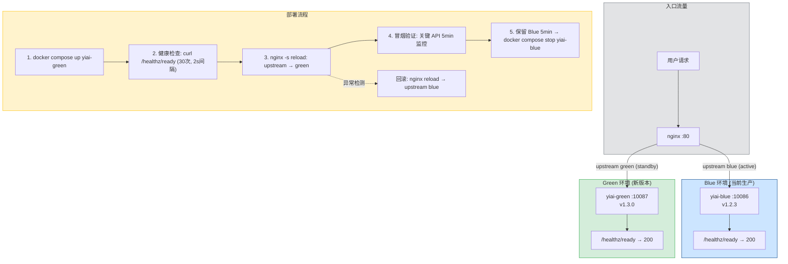
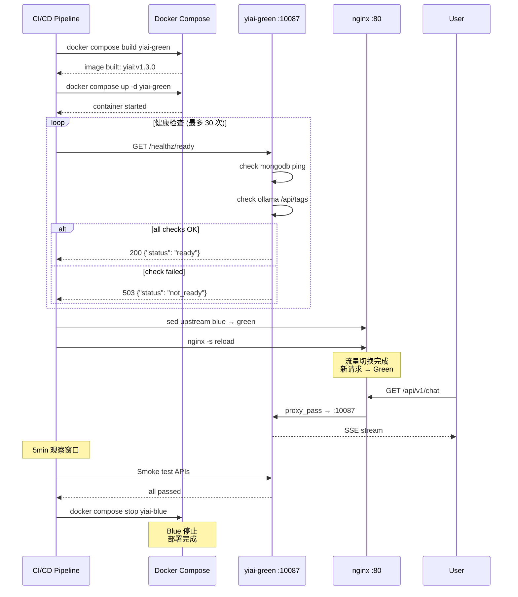

---

doc_type: module
prd_task_id: "YA-09-100"
title: "YA-09-100: 蓝绿部署 — 零停机 + 流量切换 + 快速回滚 — 开发方案"
status: 需求已编写
priority: P2
owner: 陈铭
roles: [engineer]
created: 2026-09-11
updated: 2026-09-23
project: YiAi
project_id: yiai
prd_month: "202609"
estimate_frontend: 0.5
source_prd: "42-需求-蓝绿发布策略.md"
source_okr: [yiai-001]

type: task
---

# YA-09-100: 蓝绿部署 — 零停机 + 流量切换 + 快速回滚 — 开发方案

> 来源 PRD：[42-需求-蓝绿发布策略.md](../../prds/2026-09/42-需求-蓝绿发布策略.md)
> 需求编号：YA-09-100 · 优先级：P2 · 人天：0.5d
> 类型：部署 · 状态：需求已编写

---

## 一、架构概述 (Architecture Mermaid)

蓝绿部署通过同时运行两套完整环境（Blue = 当前生产，Green = 新版本），在流量切换层面实现零停机发布。nginx 作为反向代理承担流量分发——健康检查通过后瞬间切换 upstream，失败时可秒级回滚到 Blue。



### 蓝绿环境对比

| 维度 | Blue (当前) | Green (新版本) |
|------|-----------|--------------|
| 端口 | 10086 | 10087 |
| 镜像 tag | `yiai:v1.2.3` | `yiai:v1.3.0` |
| 数据库 | MongoDB 共享 | MongoDB 共享 |
| 流量 | 100% (初始) | 0% (初始) |
| 状态 | Active | Standby → Active |

---

## 二、文件清单 (File Manifest)

| # | 文件 | 操作 | 说明 | 预估行数 |
|---|------|------|------|----------|
| 1 | `docker-compose.blue-green.yml` | 新增 | 双实例 + nginx 服务编排 | +60 |
| 2 | `nginx.blue-green.conf` | 新增 | nginx upstream 配置模板 (blue/green) | +35 |
| 3 | `scripts/deploy-blue-green.sh` | 新增 | 一键部署脚本: build → health → switch → verify | +100 |
| 4 | `scripts/rollback.sh` | 新增 | 快速回滚脚本: upstream → blue | +30 |
| 5 | `scripts/health-check.sh` | 新增 | 健康检查轮询脚本 (可复用) | +25 |
| 6 | `scripts/smoke-test.sh` | 新增 | 冒烟测试: 关键 API 验证 (chat/query/healthz) | +40 |
| **合计** | | | | **~290 行** |

---

## 三、部署脚本核心逻辑 (Python/Shell Signatures)

```python
# 健康检查端点 (已存在于 src/app.py)
@app.get("/healthz/ready")
async def readiness_probe():
    """K8s/Docker 就绪探针 — 检查所有依赖是否可用。"""
    checks = {
        "mongodb": await check_mongodb(),
        "ollama": await check_ollama(),
    }
    all_ok = all(checks.values())
    status_code = 200 if all_ok else 503
    return JSONResponse(
        content={"status": "ready" if all_ok else "not_ready", "checks": checks},
        status_code=status_code,
    )

async def check_mongodb() -> bool:
    """MongoDB 连接检查 — ping 命令。"""
    try:
        await db.command("ping")
        return True
    except Exception:
        return False

async def check_ollama() -> bool:
    """Ollama 服务检查 — /api/tags 端点。"""
    try:
        async with httpx.AsyncClient() as client:
            r = await client.get(f"{settings.ollama_host}/api/tags", timeout=5)
            return r.status_code == 200
    except Exception:
        return False
```

```bash
# scripts/deploy-blue-green.sh (核心流程)
#!/bin/bash
set -euo pipefail

NEW_COLOR="${1:-green}"
OLD_COLOR="blue"
NGINX_CONF="nginx.blue-green.conf"
HEALTH_URL="http://localhost:10087/healthz/ready"
MAX_RETRIES=30
RETRY_INTERVAL=2

echo "=== Step 1: Build & Start ${NEW_COLOR} ==="
docker compose -f docker-compose.blue-green.yml build "yiai-${NEW_COLOR}"
docker compose -f docker-compose.blue-green.yml up -d "yiai-${NEW_COLOR}"

echo "=== Step 2: Health Check ==="
for i in $(seq 1 $MAX_RETRIES); do
  if curl -sf "${HEALTH_URL}" > /dev/null 2>&1; then
    echo "  ${NEW_COLOR} ready (attempt ${i})"
    break
  fi
  if [ "$i" -eq "$MAX_RETRIES" ]; then
    echo "  ERROR: Health check timeout"
    exit 1
  fi
  sleep "${RETRY_INTERVAL}"
done

echo "=== Step 3: Switch Traffic ==="
sed -i "s/server yiai-${OLD_COLOR}:10086/server yiai-${NEW_COLOR}:10087/" "${NGINX_CONF}"
docker exec yiai-nginx nginx -s reload
echo "  Traffic switched to ${NEW_COLOR}"

echo "=== Step 4: Smoke Test ==="
bash scripts/smoke-test.sh "http://localhost:10087"

echo "=== Step 5: Wait & Stop Old ==="
echo "  Waiting 5min for emergency rollback window..."
sleep 300
docker compose -f docker-compose.blue-green.yml stop "yiai-${OLD_COLOR}"
echo "=== Deploy Complete ==="
```

---

## 四、数据流 (Data Flow)



---

## 五、实施路线图 (Roadmap)

| 步骤 | 任务 | 产出 | 验证方式 | 人天 |
|------|------|------|---------|------|
| 1 | `docker-compose.blue-green.yml` 双实例编排 + `nginx.blue-green.conf` | 双环境可启动 | `docker compose up` 后两个容器 running | 0.1 |
| 2 | `/healthz/ready` 端点完善 (MongoDB ping + Ollama 检查) | 就绪探针可用 | `curl /healthz/ready` → 200 或 503 | 0.05 |
| 3 | `deploy-blue-green.sh` 一键部署脚本 | 部署自动化 | 脚本执行成功 → Green 接收流量 | 0.15 |
| 4 | `rollback.sh` 回滚脚本 + `smoke-test.sh` 冒烟测试 | 回滚 + 验证 | 回滚后流量回到 Blue | 0.1 |
| 5 | 端到端测试 (部署 → 切换 → 冒烟 → 回滚) | 全流程验证 | 3 次完整发布/回滚测试通过 | 0.1 |

**合计：0.5d。**

---

## 六、Review 检查清单 (Review Checklist)

- [ ] `docker-compose.blue-green.yml` 中 blue/green 使用不同端口且不冲突
- [ ] nginx upstream 配置中 blue/green 均为 `server` 指令
- [ ] `/healthz/ready` 返回 503 时部署脚本中止（不等满 30 次）
- [ ] 部署脚本使用 `set -euo pipefail` 确保错误时退出
- [ ] 回滚脚本只需修改 nginx upstream 并 reload，无需重启容器
- [ ] 冒烟测试覆盖核心 API: `POST /` (RPC), `/healthz/live`, `/healthz/ready`
- [ ] Blue/Green 共享同一个 MongoDB——需确认 Schema 迁移向前兼容
- [ ] 部署脚本保留旧容器 5min 后自动 stop（非立即删除）
- [ ] nginx reload 是零停机操作（确认 nginx worker 平滑切换）
- [ ] 脚本参数 `NEW_COLOR` 支持 `blue` 和 `green` 两种输入

---

## 七、技术风险表 (Risk Table)

| 风险 | 概率 | 影响 | 缓解措施 |
|------|------|------|---------|
| Schema 迁移不兼容导致 Green 写坏数据 | 中 | 高 | 部署前运行 Schema 兼容性检查；共享 DB 的蓝绿必须向前兼容 |
| 健康检查误报 (依赖暂不可用但会恢复) | 低 | 中 | 30 次重试 (60s) 覆盖短暂抖动 |
| nginx reload 时瞬间 502 | 低 | 中 | nginx `worker_processes` 配置平滑 reload；验证 reload 不掉请求 |
| 回滚时 Blue 已 stop (5min 后) | 低 | 中 | 保留旧容器 5min，紧急情况可手动 `docker start yiai-blue` |
| 两个实例同时写 MongoDB 产生竞态 | 中 | 低 | 切换是原子操作 (nginx reload)，不存在双写窗口 |

---

## 八、关联模块

- 基础: [YA-09-37 Docker 多阶段构建](./44-prd-task-Docker多阶段构建.md)
- 关联: [YA-09-137 容器化与 Docker 部署](./137-prd-task-容器化与Docker部署.md)
- 关联: [YA-09-05 服务优雅关闭](./28-prd-task-服务优雅关闭.md)