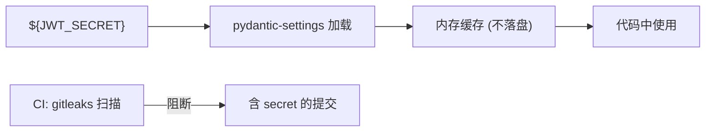

# YA-09-18: 敏感信息加密 — 环境变量 + 密钥管理 + CI 检测 — 开发方案

> **文档职责**：本文档定义**怎么做、为什么这么做、实际做成什么样**（HOW），不含产品目标与测试用例。

> 来源 PRD：[43-需求-敏感信息加密.md](../../prds/2026-09/43-需求-敏感信息加密.md)
> 需求编号：YA-09-18 · 优先级：P1 · 人天：1.0d · 状态：需求已编写

---

## 一、方案

三层防护确保敏感信息不泄露：环境变量注入 → 内存中解密 → CI 扫描阻断。

### 检测规则

| 检查 | 工具 | 阻断级别 |
|------|------|---------|
| 硬编码密钥 | gitleaks | 阻断提交 |
| `config.yaml` 含 secret | pre-commit hook | 阻断提交 |
| 日志含敏感字段 | 日志脱敏规则 | WARN |
| `.env` 文件提交 | `.gitignore` + CI 检查 | 阻断提交 |

---

## 二、实施步骤

| 步骤 | 验证 | 人天 |
|------|------|------|
| 1 | `${VAR}` 环境变量注入 | `config.yaml` 无明文 secret | 0.25 |
| 2 | gitleaks pre-commit + CI 集成 | 提交含假 secret 被阻断 | 0.25 |
| 3 | 日志脱敏 + 存量扫描修复 + 测试 | 无敏感数据泄露 | 0.5 |

**合计：1.0d**。

---

## 三、关联模块

- 关联：[YA-09-19 密钥轮换](./139-prd-task-密钥管理与凭证轮换.md)
- 修复：[JWT Secret 硬编码](../../bugs/2026-09/认证/01-认证-JWT-Secret硬编码默认值.md)