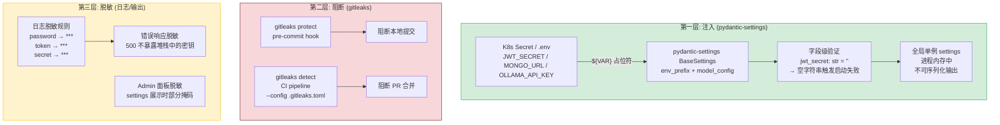
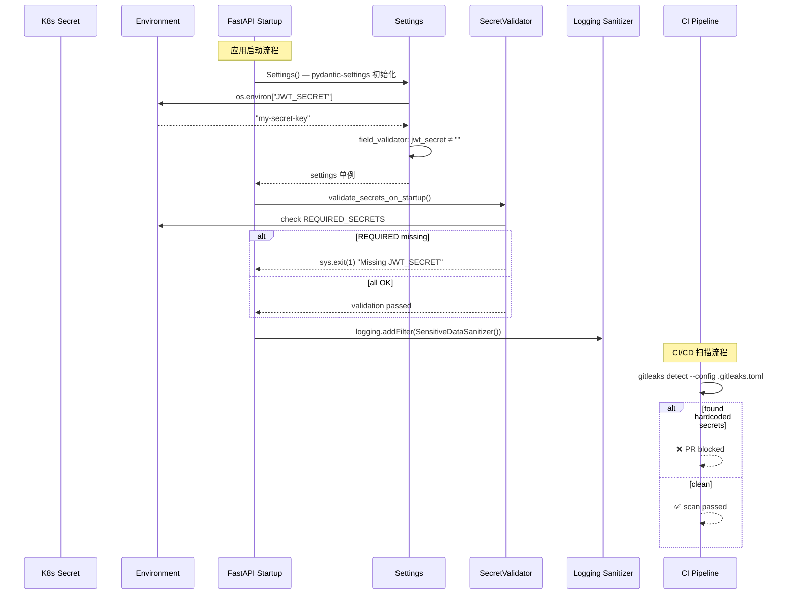

---

doc_type: module
prd_task_id: "YA-09-18"
title: "YA-09-18: 敏感信息加密 — 环境变量 + 密钥管理 + CI 检测 — 开发方案"
status: 需求已编写
priority: P1
owner: 陈铭
roles: [engineer]
created: 2026-09-11
updated: 2026-09-23
project: YiAi
project_id: yiai
prd_month: "202609"
estimate_frontend: 1.0
source_prd: "43-需求-敏感信息加密.md"
source_okr: [yiai-001]

type: task
---

# YA-09-18: 敏感信息加密 — 环境变量 + 密钥管理 + CI 检测 — 开发方案

> 来源 PRD：[43-需求-敏感信息加密.md](../../prds/2026-09/43-需求-敏感信息加密.md)
> 需求编号：YA-09-18 · 优先级：P1 · 人天：1.0d
> 类型：安全 · 状态：需求已编写

---

## 一、架构概述 (Architecture Mermaid)

三层防护体系确保敏感信息不泄露：**注入层** pydantic-settings 从环境变量/K8s Secret 注入配置（`${JWT_SECRET}` 占位符替换），**阻断层** gitleaks pre-commit hook + CI pipeline 拦截硬编码密钥提交，**输出层** 日志脱敏规则在输出侧屏蔽敏感字段。


```mermaid
graph TD
  subgraph Injection["第一层: 注入 (pydantic-settings)"]
    K8S["K8s Secret / .env<br/>JWT_SECRET / MONGO_URL / OLLAMA_API_KEY"] -->|"${VAR} 占位符"| LOAD["pydantic-settings BaseSettings<br/>env_prefix + model_config"]
    LOAD --> VALIDATE["字段级验证<br/>jwt_secret: str = ''<br/>→ 空字符串触发启动失败"]
    VALIDATE --> SINGLETON["全局单例 settings<br/>进程内存中<br/>不可序列化输出"]
  end

  subgraph Blocking["第二层: 阻断 (gitleaks)"]
    GITLEAK_PRE["gitleaks protect<br/>pre-commit hook"]
    GITLEAK_CI["gitleaks detect<br/>CI pipeline<br/>--config .gitleaks.toml"]
    BLOCK_PRE["阻断本地提交"]
    BLOCK_CI["阻断 PR 合并"]
  end

  subgraph Sanitize["第三层: 脱敏 (日志/输出)"]
    LOG_RULES["日志脱敏规则<br/>password → ***<br/>token → ***<br/>secret → ***"]
    ERROR_RULES["错误响应脱敏<br/>500 不暴露堆栈中的密钥"]
    ADMIN_MASK["Admin 面板脱敏<br/>settings 展示时部分掩码"]
  end

  GITLEAK_PRE --> BLOCK_PRE
  GITLEAK_CI --> BLOCK_CI
  LOG_RULES --> ERROR_RULES

  style Injection fill:#d4edda,stroke:#28a745
  style Blocking fill:#f8d7da,stroke:#721c24
  style Sanitize fill:#fff3cd,stroke:#ffc107
```

### 敏感信息分类

| 级别 | 类型 | 示例 | 保护方式 |
|------|------|------|---------|
| S3 - 严重 | Token/密钥 | JWT_SECRET, API_KEY | K8s Secret + 启动时注入 |
| S2 - 高 | 数据库凭证 | MONGO_URL (含密码) | 环境变量 + CI 检测 |
| S1 - 中 | 内部地址 | OLLAMA_HOST, REDIS_URL | config.yaml `${VAR}` 占位符 |
| S0 - 低 | 公开端口 | APP_PORT, LOG_LEVEL | 明文 config.yaml |

---

## 二、文件清单 (File Manifest)

| # | 文件 | 操作 | 说明 | 预估行数 |
|---|------|------|------|----------|
| 1 | `src/shared/config/settings.py` | 修改 | 重构为 pydantic-settings + `${VAR}` 环境变量解析 + 字段验证 | +60 |
| 2 | `src/shared/config/secret_validator.py` | 新增 | 启动时校验所有必需 Secret 已注入（非空） | +30 |
| 3 | `.gitleaks.toml` | 新增 | gitleaks 规则配置：通用密钥模式 + 项目特定模式 | +45 |
| 4 | `.pre-commit-config.yaml` | 修改 | 新增 gitleaks hook (stage: commit) | +20 |
| 5 | `.github/workflows/security-scan.yml` | 新增 | CI 安全扫描流水线：gitleaks + truffleHog | +50 |
| 6 | `scripts/scan-secrets.sh` | 新增 | 存量扫描脚本：全仓库历史记录扫描 | +30 |
| 7 | `src/shared/logging/sanitizer.py` | 新增 | 日志脱敏处理器：正则匹配替换敏感字段 | +40 |
| 8 | `config.yaml` | 修改 | 所有敏感值替换为 `${VAR}` 占位符 | +10 |
| 9 | `.env.example` | 新增 | 环境变量模板（不含真实值） | +15 |
| **合计** | | | | **~300 行** |

---

## 三、Python 核心签名 (Python Signatures)

```python
# src/shared/config/settings.py
from pydantic_settings import BaseSettings, SettingsConfigDict
from pydantic import Field, SecretStr, field_validator
from typing import Optional

class Settings(BaseSettings):
    """YiAi 全局配置 — pydantic-settings 环境变量注入。

    敏感字段使用 SecretStr 类型，打印时自动隐藏。
    `${VAR}` 语法从环境变量/K8s Secret 读取实际值。
    """

    model_config = SettingsConfigDict(
        env_file=".env",
        env_file_encoding="utf-8",
        extra="ignore",
        case_sensitive=False,
    )

    # 敏感 (S3/S2): 使用 SecretStr
    jwt_secret: SecretStr = Field(default=SecretStr(""), description="JWT 签名密钥")
    mongo_url: SecretStr = Field(default=SecretStr("mongodb://localhost:27017"))
    ollama_api_key: SecretStr = Field(default=SecretStr(""))

    # 中敏感 (S1): 使用 str，默认值非敏感
    ollama_host: str = Field(default="http://localhost:11434")
    redis_url: str = Field(default="")

    # 公开 (S0)
    app_port: int = Field(default=10086)
    log_level: str = Field(default="INFO")
    debug: bool = Field(default=False)

    @field_validator("jwt_secret")
    @classmethod
    def jwt_secret_must_not_be_empty(cls, v: SecretStr) -> SecretStr:
        if not v.get_secret_value():
            raise ValueError("JWT_SECRET 不能为空，请设置环境变量")
        return v

    def masked_display(self) -> dict:
        """返回配置的脱敏展示版本（用于 Admin 面板）。"""
        ...


# src/shared/config/secret_validator.py
import os
import sys
from typing import list

REQUIRED_SECRETS: list[str] = [
    "JWT_SECRET",
    "MONGO_URL",
]

OPTIONAL_SECRETS: list[str] = [
    "OLLAMA_API_KEY",
    "REDIS_URL",
]

def validate_secrets_on_startup() -> None:
    """启动时校验所有必需环境变量已设置。

    REQUIRED_SECRETS 中任意一个为空 → sys.exit(1)
    OPTIONAL_SECRETS 为空 → WARN 日志，继续启动
    """
    ...


# src/shared/logging/sanitizer.py
import re
import logging
from typing import Any

SENSITIVE_PATTERNS: list[tuple[str, str]] = [
    (r'(password["\s:=]+)([^\s"\'},]+)', r'\1***'),
    (r'(token["\s:=]+)([^\s"\'},]+)', r'\1***'),
    (r'(secret["\s:=]+)([^\s"\'},]+)', r'\1***'),
    (r'(api_key["\s:=]+)([^\s"\'},]+)', r'\1***'),
    (r'(Authorization:\s*Bearer\s+)(\S+)', r'\1***'),
    (r'(mongodb://[^:]+:)([^@]+)(@)', r'\1***\3'),
]

class SensitiveDataSanitizer(logging.Filter):
    """日志过滤器 — 替换敏感字段为 ***。"""

    def filter(self, record: logging.LogRecord) -> bool:
        if isinstance(record.msg, str):
            for pattern, replacement in SENSITIVE_PATTERNS:
                record.msg = re.sub(pattern, replacement, record.msg, flags=re.IGNORECASE)
        return True
```

---

## 四、数据流 (Data Flow)


```mermaid
sequenceDiagram
    participant K8S as K8s Secret
    participant ENV as Environment
    participant APP as FastAPI Startup
    participant SET as Settings
    participant VAL as SecretValidator
    participant LOG as Logging Sanitizer
    participant CI as CI Pipeline

    Note over APP: 应用启动流程
    APP->>SET: Settings() — pydantic-settings 初始化
    SET->>ENV: os.environ["JWT_SECRET"]
    ENV-->>SET: "my-secret-key"
    SET->>SET: field_validator: jwt_secret ≠ ""
    SET-->>APP: settings 单例

    APP->>VAL: validate_secrets_on_startup()
    VAL->>ENV: check REQUIRED_SECRETS
    alt REQUIRED missing
        VAL-->>APP: sys.exit(1) "Missing JWT_SECRET"
    else all OK
        VAL-->>APP: validation passed
    end

    APP->>LOG: logging.addFilter(SensitiveDataSanitizer())

    Note over CI: CI/CD 扫描流程
    CI->>CI: gitleaks detect --config .gitleaks.toml
    alt found hardcoded secrets
        CI-->>CI: ❌ PR blocked
    else clean
        CI-->>CI: ✅ scan passed
    end
```

### 启动时校验流程

```
python main.py
  → Settings() 从环境变量读取
  → field_validator 检查 jwt_secret 非空
  → validate_secrets_on_startup() 二次校验
  → SensitiveDataSanitizer 注册到 logging
  → uvicorn.run(app)
```

---

## 五、实施路线图 (Roadmap)

| 步骤 | 任务 | 产出 | 验证方式 | 人天 |
|------|------|------|---------|------|
| 1 | 重构 `settings.py` 为 pydantic-settings + SecretStr | 类型安全的配置 | `str(settings.jwt_secret)` → `'**********'` | 0.15 |
| 2 | `SecretValidator` 启动校验 + 单元测试 | 缺失 Secret 时启动失败 | 不设 `JWT_SECRET` 启动 → `sys.exit(1)` | 0.1 |
| 3 | `SensitiveDataSanitizer` 日志过滤器 | 日志中敏感字段显示 `***` | `logger.info("token=abc")` → 输出 `token=***` | 0.1 |
| 4 | `.gitleaks.toml` 规则 + pre-commit hook | 本地提交被阻断 | 在代码中添加 `password="test"` → commit 被拒 | 0.15 |
| 5 | CI security scan pipeline + `.env.example` | CI 自动扫描 | PR 中引入硬编码密钥 → CI 失败 | 0.15 |
| 6 | `scripts/scan-secrets.sh` 存量扫描 + 修复 | 存量问题清零 | `bash scan-secrets.sh` → 0 findings | 0.2 |
| 7 | `config.yaml` 全部敏感值替换为 `${VAR}` | 配置文件不含明文 | `grep -E 'password|secret|token' config.yaml` → 只有 `${...}` | 0.1 |
| 8 | 集成测试: 启动校验 + 日志脱敏 + CI 验证 | 全链路覆盖 | 完整流程测试通过 | 0.05 |

**合计：1.0d。**

---

## 六、Review 检查清单 (Review Checklist)

- [ ] `settings.py` 中所有 S3/S2 敏感字段使用 `SecretStr`
- [ ] `jwt_secret` 为空字符串时 `field_validator` 抛出 `ValueError`
- [ ] `validate_secrets_on_startup()` 在 `app.py` 启动时最先调用
- [ ] `SensitiveDataSanitizer` 注册到 root logger
- [ ] 脱敏正则覆盖所有常见敏感字段模式 (password/token/secret/api_key/Authorization)
- [ ] `.gitleaks.toml` 包含通用规则 + 项目特定路径白名单
- [ ] `.pre-commit-config.yaml` 中 gitleaks stage 为 `commit` (非 push)
- [ ] `.env.example` 包含所有环境变量名，值为空或占位符
- [ ] `config.yaml` 经 `grep` 验证无明文敏感值
- [ ] CI 安全扫描在每次 PR 时自动触发

---

## 七、技术风险表 (Risk Table)

| 风险 | 概率 | 影响 | 缓解措施 |
|------|------|------|---------|
| `.gitignore` 遗漏 `.env` 文件导致误提交 | 中 | 高 | `.gitignore` 规则 + CI 扫描 `.env` 文件存在性 |
| gitleaks 误报阻断正常提交 | 低 | 中 | `.gitleaks.toml` allowlist 规则 + `--no-verify` 逃生舱 |
| `SecretStr` 类型在 JSON 序列化时暴露 | 低 | 高 | `model_dump()` 使用 `mode='json'` 自动隐藏 SecretStr |
| 日志脱敏正则遗漏新敏感字段模式 | 中 | 低 | Code Review 新增日志时检查敏感字段 |
| K8s Secret 未正确挂载导致启动失败 | 低 | 高 | `validate_secrets_on_startup()` 清晰的错误消息 + 启动失败告警 |

---

## 八、关联模块

- 基础: [YA-09-28 多环境配置管理](./147-prd-task-多环境配置管理.md)
- 关联: [YA-09-111 日志敏感数据脱敏](./111-prd-task-日志敏感数据脱敏.md)
- 关联: [YA-09-139 密钥管理与凭证轮换](./139-prd-task-密钥管理与凭证轮换.md)