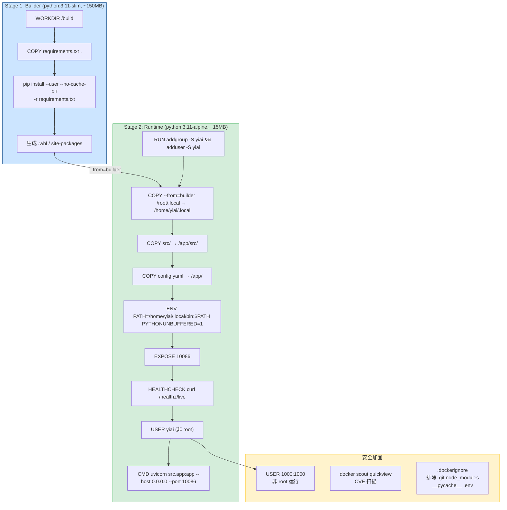
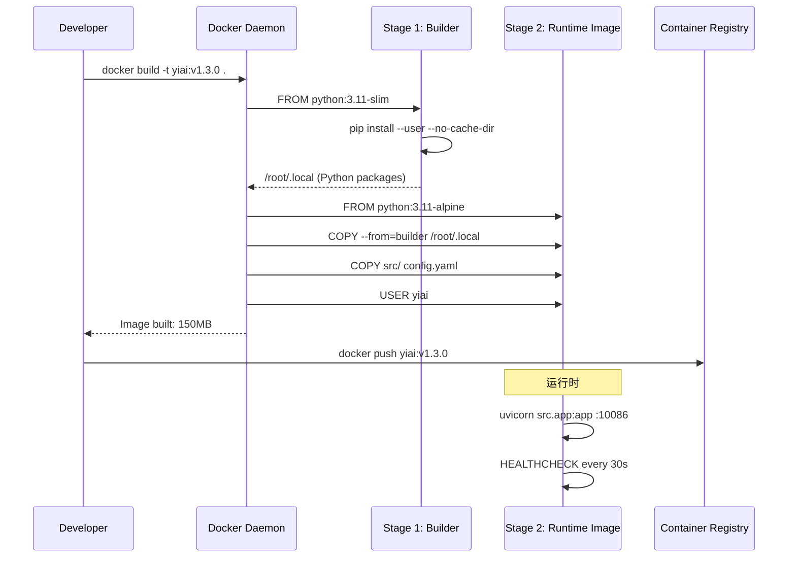

---

doc_type: module
prd_task_id: "YA-09-37"
title: "YA-09-37: Docker 多阶段构建 — 镜像体积优化 + 安全基础镜像 — 开发方案"
status: 需求已编写
priority: P2
owner: 陈铭
roles: [engineer]
created: 2026-09-11
updated: 2026-09-23
project: YiAi
project_id: yiai
prd_month: "202609"
estimate_frontend: 1.0
source_prd: "44-需求-Docker多阶段构建.md"
source_okr: [yiai-001]

type: task
---

# YA-09-37: Docker 多阶段构建 — 镜像体积优化 + 安全基础镜像 — 开发方案

> 来源 PRD：[44-需求-Docker多阶段构建.md](../../prds/2026-09/44-需求-Docker多阶段构建.md)
> 需求编号：YA-09-37 · 优先级：P2 · 人天：1.0d
> 类型：部署 · 状态：需求已编写

---

## 一、架构概述 (Architecture Mermaid)

多阶段构建将编译依赖与运行时依赖分离——Stage 1 (Builder) 使用 `python:3.11-slim` 安装依赖，Stage 2 (Runtime) 使用 `python:3.11-alpine` 仅包含运行时必需文件。最终镜像从 ~900MB 缩减到 ~150MB，同时通过非 root 用户和 HEALTHCHECK 提升安全性。



### 镜像体积对比

| 阶段 | 基础镜像 | 大小 | 说明 |
|------|---------|------|------|
| 单阶段 (当前) | `python:3.11` | ~900MB | 含编译工具链 + pip 缓存 |
| Builder | `python:3.11-slim` | ~150MB | 仅用于 pip install |
| Runtime (目标) | `python:3.11-alpine` | ~150MB | 仅运行时依赖 |
| 预期节省 | — | **~750MB (-83%)** | 拉取/部署速度提升 5x |

---

## 二、文件清单 (File Manifest)

| # | 文件 | 操作 | 说明 | 预估行数 |
|---|------|------|------|----------|
| 1 | `Dockerfile` | 新增 | 多阶段构建 (builder + runtime) | +55 |
| 2 | `.dockerignore` | 新增 | 排除 `.git`/`node_modules`/`__pycache__`/`.env`/`*.pyc`/`tests/` | +25 |
| 3 | `docker-compose.yml` | 修改 | 使用新镜像 + 健康检查依赖 | +20 |
| 4 | `scripts/docker-build.sh` | 新增 | 一键构建 + 扫描脚本 | +30 |
| 5 | `requirements.txt` | 修改 | 区分 build/runtime 依赖注释 | +5 |
| **合计** | | | | **~135 行** |

---

## 三、Python/Shell 核心签名 (Signatures)

```dockerfile
# Dockerfile — 多阶段构建
# Stage 1: Builder
FROM python:3.11-slim AS builder
WORKDIR /build
COPY requirements.txt .
RUN pip install --user --no-cache-dir -r requirements.txt

# Stage 2: Runtime
FROM python:3.11-alpine
# 安全: 创建非 root 用户
RUN addgroup -S yiai && adduser -S yiai -G yiai
WORKDIR /app

# 从 builder 复制已安装的 Python 包
COPY --from=builder /root/.local /home/yiai/.local

# 复制应用代码
COPY src/ /app/src/
COPY config.yaml /app/

# 环境变量
ENV PATH=/home/yiai/.local/bin:$PATH \
    PYTHONUNBUFFERED=1 \
    PYTHONDONTWRITEBYTECODE=1

EXPOSE 10086

# 健康检查
HEALTHCHECK --interval=30s --timeout=3s --retries=3 --start-period=10s \
  CMD wget -qO- http://localhost:10086/healthz/live || exit 1

# 切换到非 root 用户
USER yiai

CMD ["uvicorn", "src.app:app", "--host", "0.0.0.0", "--port", "10086", "--workers", "2"]
```

```bash
# scripts/docker-build.sh
#!/bin/bash
set -euo pipefail
IMAGE="yiai:$(git describe --tags --always --dirty)"
echo "Building ${IMAGE}..."
docker build -t "${IMAGE}" .
echo "Image size: $(docker image ls "${IMAGE}" --format '{{.Size}}')"
echo "Scanning for vulnerabilities..."
docker scout quickview "${IMAGE}" || echo "WARN: scan issues found"
```

---

## 四、数据流 (Data Flow)



---

## 五、实施路线图 (Roadmap)

| 步骤 | 任务 | 产出 | 验证方式 | 人天 |
|------|------|------|---------|------|
| 1 | 多阶段 Dockerfile + `.dockerignore` | 镜像构建成功 | `docker build` 成功，`docker image ls` 显示 ~150MB | 0.2 |
| 2 | 非 root 用户 (`USER yiai`) + HEALTHCHECK | 安全 + 健康检测 | `docker inspect` 确认 User + `docker ps` 显示 healthy | 0.15 |
| 3 | `.dockerignore` 优化 (排除 `.git`/`node_modules`/`__pycache__`) | Context 减小 | `docker build` 日志确认 context 大小 | 0.1 |
| 4 | `docker-compose.yml` 集成新镜像 | compose 可用 | `docker compose up` 正常启动 | 0.15 |
| 5 | `docker scout` CVE 扫描 + CI 集成 | 安全扫描通过 | `docker scout quickview` 0 CRITICAL | 0.2 |
| 6 | `scripts/docker-build.sh` 一键构建 | 标准化构建 | 脚本执行成功 | 0.1 |
| 7 | 端到端验证: build → run → health → API 调用 | 生产就绪 | 完整流程通过 | 0.1 |

**合计：1.0d。**

---

## 六、Review 检查清单 (Review Checklist)

- [ ] Builder stage 和 Runtime stage 使用不同基础镜像
- [ ] `COPY --from=builder` 只复制运行时必需文件，不含编译工具链
- [ ] `USER yiai` 设置在 CMD 之前，容器以非 root 运行
- [ ] `.dockerignore` 排除 `.git`/`__pycache__`/`*.pyc`/`.env`/`tests/`
- [ ] `HEALTHCHECK` 使用轻量工具 (`wget`) 而非 `curl` (alpine 默认不含 curl)
- [ ] `PYTHONUNBUFFERED=1` 确保日志实时输出
- [ ] `--start-period=10s` 给 FastAPI 启动留足时间
- [ ] `requirements.txt` 中开发依赖 (pytest/black) 不出现在 Runtime 镜像中
- [ ] 镜像大小 < 200MB (目标 ~150MB)
- [ ] `docker scout` 扫描无 CRITICAL 级别 CVE

---

## 七、技术风险表 (Risk Table)

| 风险 | 概率 | 影响 | 缓解措施 |
|------|------|------|---------|
| Alpine musl libc 与某些 Python wheel 不兼容 | 中 | 高 | 预编译 wheel 检查；备选 `python:3.11-slim` Runtime |
| `wget` 不在 Alpine 基础镜像中 | 中 | 低 | `RUN apk add --no-cache wget` 或改用 `/healthz/live` socket 检查 |
| `pip install --user` 路径不正确 | 低 | 中 | 验证 `COPY --from=builder` 目标路径 |
| HEALTHCHECK 频繁调用增加负载 | 低 | 低 | 30s 间隔，`/healthz/live` 是简单返回 200 |
| 多阶段构建增加 CI 构建时间 | 低 | 低 | 利用 Docker layer cache，pip layer 仅在 requirements.txt 变时重建 |

---

## 八、关联模块

- 基础: [YA-09-100 蓝绿发布策略](./42-prd-task-蓝绿发布策略.md)
- 关联: [YA-09-137 容器化与 Docker 部署](./137-prd-task-容器化与Docker部署.md)
- 关联: [YA-09-126 cgroups 资源隔离](./126-prd-task-cgroups资源隔离.md)