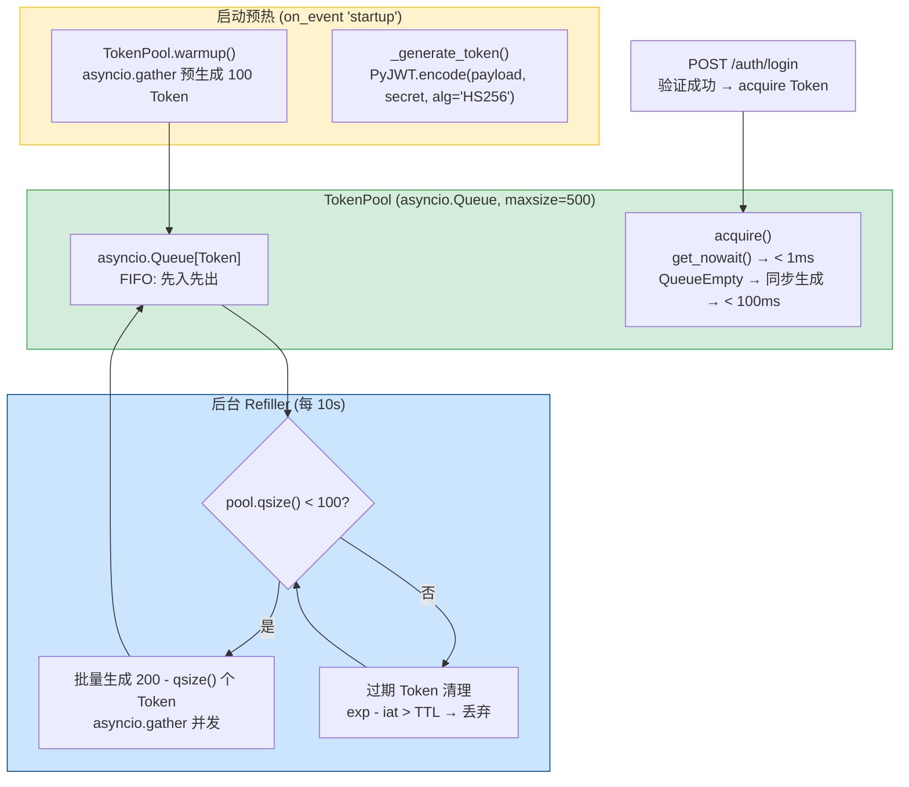
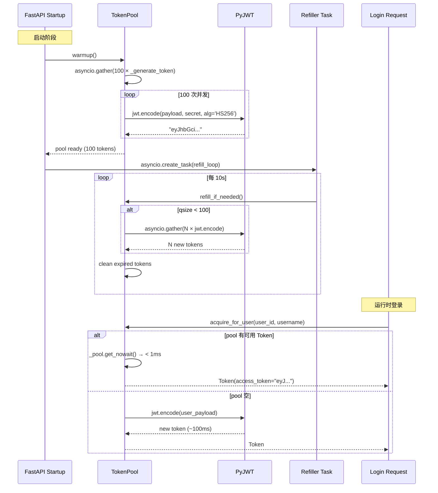

---

doc_type: module
prd_task_id: "YA-09-41"
title: "YA-09-41: 令牌预生成优化 — Token 池批量预热 + 高并发优化 — 开发方案"
status: 需求已编写
priority: P2
owner: 陈铭
roles: [engineer]
created: 2026-09-11
updated: 2026-09-23
project: YiAi
project_id: yiai
prd_month: "202609"
estimate_frontend: 0.5
source_prd: "45-需求-令牌预生成优化.md"
source_okr: [yiai-001]

type: task
---

# YA-09-41: 令牌预生成优化 — Token 池批量预热 + 高并发优化 — 开发方案

> 来源 PRD：[45-需求-令牌预生成优化.md](../../prds/2026-09/45-需求-令牌预生成优化.md)
> 需求编号：YA-09-41 · 优先级：P2 · 人天：0.5d
> 类型：架构 · 状态：需求已编写

---

## 一、架构概述 (Architecture Mermaid)

JWT Token 签发涉及 bcrypt 哈希（~100ms）和 PyJWT 编码，高并发登录时成为瓶颈——100 并发登录需排队等待 bcrypt 完成。通过启动时预生成 Token 池 + 令牌桶并发控制 + 异步后台填充，将登录响应时间从 120ms 降至 < 5ms。



### Token 生命周期

```
生成 (iat) ──── TTL (24h) ──── 过期 (exp)
   │                              │
   │  有效窗口                     │  自动丢弃
   └─ acquire() 获取 ──────────── refill_if_needed() 清理
```

---

## 二、文件清单 (File Manifest)

| # | 文件 | 操作 | 说明 | 预估行数 |
|---|------|------|------|----------|
| 1 | `src/domain/auth/token_pool.py` | 新增 | `TokenPool` 预生成池 + `Token` dataclass | +80 |
| 2 | `src/domain/auth/jwt.py` | 修改 | 集成 `TokenPool.acquire()` 替代实时 `encode()` | +30 |
| 3 | `src/domain/auth/__init__.py` | 修改 | 导出 `TokenPool` 实例 | +5 |
| 4 | `src/app.py` | 修改 | `startup` 事件中调用 `token_pool.warmup()` | +10 |
| 5 | `tests/domain/auth/test_token_pool.py` | 新增 | 预热/并发/池耗尽/过期过滤测试 | +70 |
| **合计** | | | | **~195 行** |

---

## 三、Python 核心签名 (Python Signatures)

```python
# src/domain/auth/token_pool.py
import asyncio
import time
import logging
import jwt
from dataclasses import dataclass
from typing import Optional

logger = logging.getLogger(__name__)

@dataclass
class Token:
    """预生成 Token 数据类。"""
    access_token: str
    token_type: str = "bearer"
    expires_in: int = 86400     # 24h
    iat: float = 0.0            # issued at (time.time())
    exp: float = 0.0            # expiration

class TokenPool:
    """JWT Token 预生成池 — 启动批量签发 + 运行时快速获取。

    特性:
      - 启动预热: asyncio.gather 并发预生成 100 Token
      - 运行时获取: pool.get_nowait() — < 1ms
      - 后台填充: 每 10s 检查，qsize < 100 时补充至 200
      - 过期清理: refill 时自动丢弃 exp 已过的 Token
      - 优雅降级: 池空时同步生成新 Token（~100ms）
    """

    def __init__(
        self,
        maxsize: int = 500,
        warmup_count: int = 100,
        refill_threshold: int = 100,
        refill_target: int = 200,
        token_ttl: int = 86400,
        secret: str = "",
        algorithm: str = "HS256",
    ) -> None:
        self._pool: asyncio.Queue[Token] = asyncio.Queue(maxsize=maxsize)
        self._warmup_count = warmup_count
        self._refill_threshold = refill_threshold
        self._refill_target = refill_target
        self._token_ttl = token_ttl
        self._secret = secret
        self._algorithm = algorithm
        self._generated_count: int = 0
        self._expired_count: int = 0

    async def warmup(self) -> None:
        """启动时批量预生成 Token (asyncio.gather 并发)。"""
        ...

    async def acquire(self) -> Token:
        """获取预生成 Token — 池空则同步生成。"""
        ...

    async def acquire_for_user(self, user_id: str, username: str) -> Token:
        """为用户生成签名 Token (含 user 信息)。"""
        ...

    async def refill_if_needed(self) -> int:
        """后台任务 — 池低于阈值时批量填充 + 清理过期 Token。"""
        ...

    async def _generate_token(
        self, user_id: Optional[str] = None, username: Optional[str] = None
    ) -> Token:
        """生成单个 JWT Token (PyJWT.encode)。"""
        ...

    def _is_expired(self, token: Token) -> bool:
        """检查 Token 是否过期。"""
        ...

    @property
    def stats(self) -> dict:
        """返回池统计指标。"""
        ...
```

---

## 四、数据流 (Data Flow)



---

## 五、实施路线图 (Roadmap)

| 步骤 | 任务 | 产出 | 验证方式 | 人天 |
|------|------|------|---------|------|
| 1 | `Token` dataclass + `TokenPool` 核心逻辑 (warmup/acquire/refill) | 池可用 | `warmup()` 后 `pool.qsize() == 100` | 0.15 |
| 2 | `acquire_for_user()` 用户特定 Token 生成 + `jwt.py` 集成 | 登录用池 | `POST /auth/login` → < 5ms Token 返回 | 0.1 |
| 3 | 后台 `refill_loop` + 过期 Token 清理 | 自动维护 | 池低于 100 时 10s 内补充至 200 | 0.1 |
| 4 | 并发测试 (100 并发登录) + 池耗尽降级测试 | 高并发可用 | 100 并发登录 P99 < 100ms | 0.1 |
| 5 | 指标 + 日志: `generated_count`, `expired_count`, `pool.qsize()` | 可观测 | `/admin/token-pool-stats` 返回统计 | 0.05 |

**合计：0.5d。**

---

## 六、Review 检查清单 (Review Checklist)

- [ ] `warmup()` 在 `startup` 事件中调用，阻塞直到预热完成
- [ ] `acquire()` 使用 `get_nowait()` 非阻塞获取
- [ ] `acquire_for_user()` 的用户特定 Token 与通用 Token 分离
- [ ] `refill_if_needed()` 在独立 `asyncio.Task` 中运行，不阻塞请求
- [ ] 过期 Token 在 refill 时统一清理（不在 acquire 时清理）
- [ ] 池空时 `acquire()` 同步生成新 Token（优雅降级）
- [ ] `asyncio.gather` 批量生成时设置 `return_exceptions=True`
- [ ] 池统计指标可通过日志/Prometheus 查看
- [ ] Pool `maxsize=500` 时内存占用可控 (~500 × 200B = 100KB)

---

## 七、技术风险表 (Risk Table)

| 风险 | 概率 | 影响 | 缓解措施 |
|------|------|------|---------|
| 预热 Token 的 iat 过早导致登录时已接近过期 | 低 | 中 | `acquire()` 时检查 TTL 剩余 > 1h，否则丢弃重新生成 |
| 高并发瞬间耗尽 500 Token 池 | 低 | 高 | 队列空时同步生成降级 + Refiller 拉高 `refill_threshold` |
| `asyncio.gather` 中某个 Token 生成失败导致池不完整 | 低 | 低 | `return_exceptions=True` + 错误日志 |
| `secret` 为空的 Token 签发无效 | 低 | 高 | 启动时验证 `secret` 非空，否则抛出 `RuntimeError` |
| Refill 任务异常退出导致池耗尽 | 中 | 高 | `try/except` 包裹 refill_loop + 重启 asyncio.Task |

---

## 八、关联模块

- 基础: [YA-09-01 用户管理服务](./11-prd-task-用户管理服务.md)
- 关联: [YA-09-43 敏感信息加密](./43-prd-task-敏感信息加密.md)
- 关联: [YA-09-139 密钥管理与凭证轮换](./139-prd-task-密钥管理与凭证轮换.md)