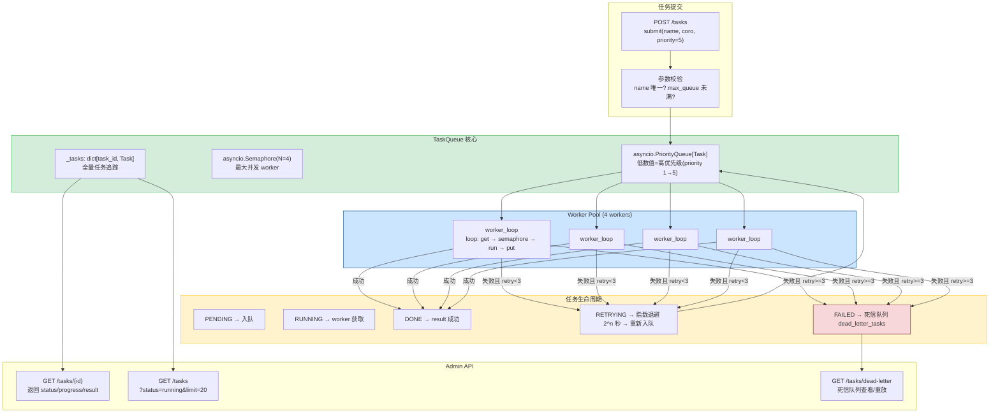
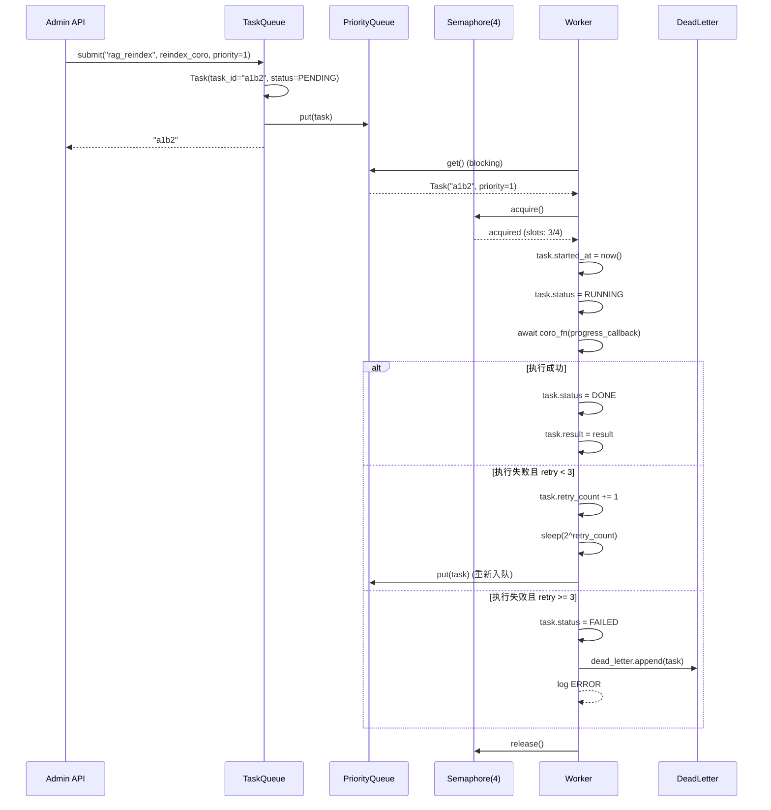

---

doc_type: module
prd_task_id: "YA-09-41"
title: "YA-09-41: 异步任务队列 — asyncio.Queue + Worker Pool + 重试 + 死信 — 开发方案"
status: 需求已编写
priority: P2
owner: 陈铭
roles: [engineer]
created: 2026-09-11
updated: 2026-09-23
project: YiAi
project_id: yiai
prd_month: "202609"
estimate_frontend: 1.0
source_prd: "46-需求-异步任务队列.md"
source_okr: [yiai-001]

type: task
---

# YA-09-41: 异步任务队列 — asyncio.Queue + Worker Pool + 重试 + 死信 — 开发方案

> 来源 PRD：[46-需求-异步任务队列.md](../../prds/2026-09/46-需求-异步任务队列.md)
> 需求编号：YA-09-41 · 优先级：P2 · 人天：1.0d
> 类型：架构 · 状态：需求已编写

---

## 一、架构概述 (Architecture Mermaid)

当前 `asyncio.create_task` 无队列缓冲、无限流、无追踪——耗时任务（RAG 索引重建、CSV 导出、企微群发）可能无限堆积导致 worker 线程阻塞。本方案实现 `TaskQueue`（asyncio.PriorityQueue + Semaphore worker pool），支持优先级调度、状态追踪、指数退避重试、死信队列 + Admin API。



### 任务优先级映射

| 场景 | Priority | 说明 |
|------|---------|------|
| RAG 索引重建 | 1 | 最高——用户搜索依赖 |
| RSS 抓取 | 3 | 标准批量任务 |
| CSV 导出 | 4 | 用户触发，中等延迟 |
| 企微群发 | 5 | 最低——失败不紧急 |
| 数据清理 | 5 | 后台维护任务 |

---

## 二、文件清单 (File Manifest)

| # | 文件 | 操作 | 说明 | 预估行数 |
|---|------|------|------|----------|
| 1 | `src/shared/task_queue.py` | 新增 | `TaskQueue`: PriorityQueue + Worker Pool + retry + 死信 | +160 |
| 2 | `src/shared/task_queue/models.py` | 新增 | `Task` dataclass + `TaskStatus` enum + `TaskPriority` | +35 |
| 3 | `src/server/admin_routes.py` | 修改 | `POST/DELETE /tasks/{id}` + `GET /tasks` + 死信端点 | +45 |
| 4 | `tests/shared/test_task_queue.py` | 新增 | 提交/优先级/并发/重试/死信/并发安全测试 | +80 |
| 5 | `tests/shared/test_task_queue_dead_letter.py` | 新增 | 死信重放/清理测试 | +40 |
| **合计** | | | | **~360 行** |

---

## 三、Python 核心签名 (Python Signatures)

```python
# src/shared/task_queue/models.py
from dataclasses import dataclass, field
from enum import Enum
from datetime import datetime
from typing import Callable, Optional, Any
import uuid

class TaskStatus(str, Enum):
    PENDING = "pending"
    RUNNING = "running"
    DONE = "done"
    FAILED = "failed"
    RETRYING = "retrying"
    CANCELLED = "cancelled"

@dataclass(order=True)
class Task:
    """异步任务模型 — PriorityQueue 排序依据 (priority, created_at)。"""
    priority: int
    name: str
    task_id: str = field(default_factory=lambda: str(uuid.uuid4())[:8])
    coro_fn: Optional[Callable] = field(default=None, compare=False)
    coro_args: tuple = field(default_factory=tuple, compare=False)
    max_retries: int = field(default=3, compare=False)
    status: TaskStatus = field(default=TaskStatus.PENDING, compare=False)
    progress: float = field(default=0.0, compare=False)   # 0.0 ~ 1.0
    result: Any = field(default=None, compare=False)
    error: Optional[str] = field(default=None, compare=False)
    retry_count: int = field(default=0, compare=False)
    created_at: datetime = field(default_factory=datetime.utcnow, compare=False)
    started_at: Optional[datetime] = field(default=None, compare=False)
    completed_at: Optional[datetime] = field(default=None, compare=False)

    def to_dict(self) -> dict:
        """序列化为 API 响应（排除 coro_fn/coro_args）。"""
        ...


# src/shared/task_queue.py
import asyncio
import logging
from typing import Optional

logger = logging.getLogger(__name__)

class TaskQueue:
    """异步任务队列 — PriorityQueue + Semaphore Worker Pool。

    特性:
      - 优先级调度: asyncio.PriorityQueue，低数值先执行
      - 并发控制: asyncio.Semaphore(N) 限流 worker 数量
      - 指数退避重试: sleep(2^retry_count) 后重新入队
      - 死信队列: max_retries 耗尽后移入 dead_letter_tasks
      - 进度回调: progress_callback(0.0~1.0) 更新 task.progress
      - 任务追踪: _tasks dict 全量追踪，Admin API 查询
    """

    def __init__(
        self,
        max_workers: int = 4,
        max_queue_size: int = 1000,
        max_retries: int = 3,
    ) -> None:
        self._queue: asyncio.PriorityQueue[Task] = asyncio.PriorityQueue(maxsize=max_queue_size)
        self._semaphore = asyncio.Semaphore(max_workers)
        self._tasks: dict[str, Task] = {}
        self._dead_letter: list[Task] = []
        self._max_retries = max_retries
        self._running = False

    async def start(self, num_workers: int = 4) -> None:
        """启动 worker pool — 创建 N 个 worker_loop asyncio.Task。"""
        ...

    async def stop(self, graceful: bool = True) -> None:
        """优雅停止: 等待运行中任务完成 → 取消 workers。"""
        ...

    async def submit(
        self,
        name: str,
        coro_fn: Callable,
        *args,
        priority: int = 5,
        max_retries: Optional[int] = None,
    ) -> str:
        """提交任务到队列，返回 task_id。"""
        ...

    async def worker_loop(self, worker_id: int) -> None:
        """Worker 主循环: 从队列取出任务 → 获取信号量 → 执行。"""
        ...

    async def get_status(self, task_id: str) -> Optional[dict]:
        """查询任务状态 (Admin API 用)。"""
        ...

    def list_tasks(self, status: Optional[TaskStatus] = None, limit: int = 50) -> list[dict]:
        """列出任务 (支持按状态筛选)。"""
        ...

    def get_dead_letter(self) -> list[dict]:
        """获取死信队列任务列表。"""
        ...

    async def retry_dead_letter(self, task_id: str) -> bool:
        """重放死信任务——重置 retry_count 重新入队。"""
        ...

    async def cancel(self, task_id: str) -> bool:
        """取消排队中的任务 (仅 PENDING 状态可取消)。"""
        ...
```

---

## 四、数据流 (Data Flow)



---

## 五、实施路线图 (Roadmap)

| 步骤 | 任务 | 产出 | 验证方式 | 人天 |
|------|------|------|---------|------|
| 1 | `Task` dataclass + `TaskStatus` enum + `TaskQueue` 核心 | 队列可提交 | `submit()` 返回 task_id，`get_status()` 可查 | 0.2 |
| 2 | `PriorityQueue` + `Semaphore(4)` Worker Pool | 优先级并发执行 | 同时提交 10 个不同优先级任务 → 低 priority 先完成 | 0.2 |
| 3 | 指数退避重试 (2^n 秒) + `max_retries` | 失败自动重试 | 模拟失败任务 → 自动重试 3 次后进死信 | 0.15 |
| 4 | 死信队列 + Admin API (`GET /tasks`, `GET /tasks/dead-letter`) | 管理端点 | API 返回死信列表 + 可重放 | 0.15 |
| 5 | 进度回调 + `POST /tasks/cancel` | 进度可追踪 | `GET /tasks/{id}` 返回 progress 0.0~1.0 | 0.1 |
| 6 | 模拟任务触发现有 RAG 索引重建 + RSS 抓取的集成 | 存量迁移 | 将 `asyncio.create_task` 替换为 `task_queue.submit` | 0.1 |
| 7 | 测试: 并发安全/死信重放/优雅停止/边界 | 全面覆盖 | pytest 全部通过 | 0.1 |

**合计：1.0d。**

---

## 六、Review 检查清单 (Review Checklist)

- [ ] `PriorityQueue` 排序: 低数值 priority 先出队
- [ ] `Semaphore` 正确释放 (try/finally)
- [ ] 重试指数退避: `sleep(2 ** retry_count)`
- [ ] 重试次数达到 `max_retries` 后进入死信，不再重试
- [ ] `to_dict()` 排除不可序列化字段 (coro_fn, coro_args)
- [ ] `cancel()` 仅对 PENDING 状态任务有效
- [ ] `stop(graceful=True)` 等待运行中任务完成
- [ ] `submit()` 在队列满时返回错误 (不阻塞)
- [ ] `worker_loop` 异常不退出 (`try/except` 包裹 + log)
- [ ] `TaskQueue` 实例是模块级单例

---

## 七、技术风险表 (Risk Table)

| 风险 | 概率 | 影响 | 缓解措施 |
|------|------|------|---------|
| Worker 崩溃导致任务丢失 | 中 | 高 | `worker_loop` 中 `try/except Exception` 确保不会退出 |
| PriorityQueue 任务饥饿（低优先永远不执行） | 低 | 中 | 限制优先级范围 1-5 + aging 机制 (pending 超 5min 优先级+1) |
| `progress_callback` 是同步函数阻塞事件循环 | 低 | 中 | callback 仅做 `setattr`，无 I/O |
| 死信累积耗尽内存 | 低 | 中 | `dead_letter` 上限 1000 + TTL 7 天自动清理 |
| Semaphore 死锁 (异常未释放) | 低 | 高 | `try/finally: semaphore.release()` |

---

## 八、关联模块

- 基础: [YA-09-142 后台任务队列](./142-prd-task-后台任务队列.md)
- 关联: [YA-09-23 RSS 抓取调度优化](./23-prd-task-RSS抓取调度优化.md)
- 关联: [YA-09-182 优雅关闭与状态保存](./182-prd-task-优雅关闭与状态保存.md)