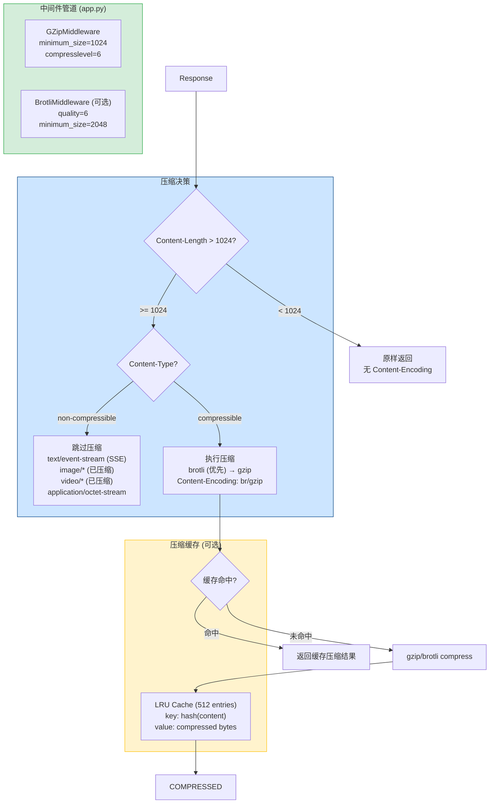
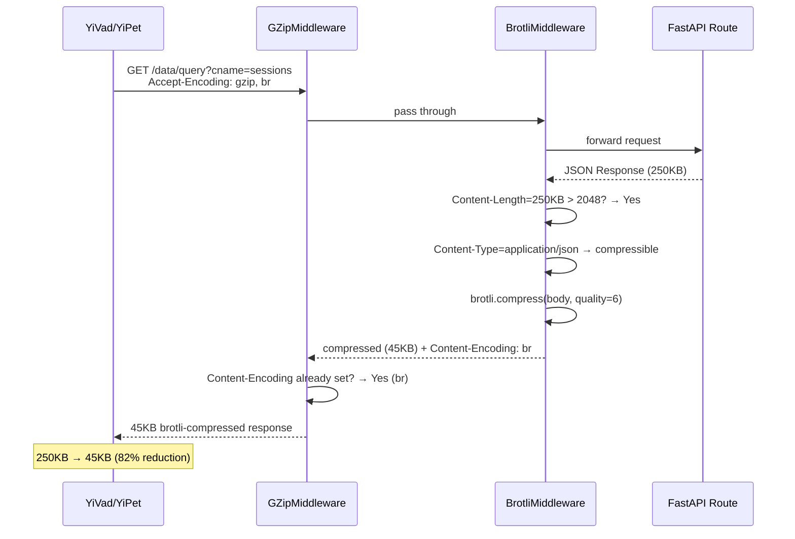

---

doc_type: module
prd_task_id: "YA-09-73"
title: "YA-09-73: 响应压缩优化 — Gzip/Brotli + 阈值 + SSE 排除 + 缓存 — 开发方案"
status: 需求已编写
priority: P2
owner: 陈铭
roles: [engineer]
created: 2026-09-11
updated: 2026-09-23
project: YiAi
project_id: yiai
prd_month: "202609"
estimate_frontend: 0.5
source_prd: "47-需求-响应压缩优化.md"
source_okr: [yiai-001]

type: task
---

# YA-09-73: 响应压缩优化 — Gzip/Brotli + 阈值 + SSE 排除 + 缓存 — 开发方案

> 来源 PRD：[47-需求-响应压缩优化.md](../../prds/2026-09/47-需求-响应压缩优化.md)
> 需求编号：YA-09-73 · 优先级：P2 · 人天：0.5d
> 类型：架构 · 状态：需求已编写

---

## 一、架构概述 (Architecture Mermaid)

JSON 响应体可达 50-500KB（RAG 检索结果 / Dashboard 数据），未压缩传输浪费带宽。集成 Starlette `GZipMiddleware` + 可选 `brotli-asgi`，配置最小压缩阈值（1KB），SSE 流/图片/视频跳过压缩。压缩后响应体缩减 70-85%，带宽成本降低 3-5x。



### 压缩策略表

| Content-Type | 压缩 | 算法优先级 | 预期压缩比 | 说明 |
|-------------|------|----------|----------|------|
| `application/json` | 是 | brotli → gzip | 70-85% | JSON 压缩率最高 |
| `text/html` | 是 | brotli → gzip | 75-85% | Dashboard HTML |
| `text/plain` | 是 | gzip | 60-80% | 日志/文本 |
| `text/event-stream` | **否** | — | — | 逐帧压缩破坏流式性 |
| `image/*` | **否** | — | — | 已压缩格式 |
| `application/octet-stream` | **否** | — | — | 二进制文件 |

---

## 二、文件清单 (File Manifest)

| # | 文件 | 操作 | 说明 | 预估行数 |
|---|------|------|------|----------|
| 1 | `src/app.py` | 修改 | 注册 `GZipMiddleware` + `BrotliMiddleware` (可选) | +15 |
| 2 | `src/shared/middleware/compression.py` | 新增 | `CompressionManager`: 统一压缩策略配置 + 缓存 | +40 |
| 3 | `config.yaml` | 修改 | `compression:` 配置段 (enabled/algorithm/level/exclude) | +15 |
| **合计** | | | | **~70 行** |

---

## 三、Python 核心签名 (Python Signatures)

```python
# src/shared/middleware/compression.py
from dataclasses import dataclass, field
from typing import Optional
import logging

logger = logging.getLogger(__name__)

NON_COMPRESSIBLE_TYPES: frozenset[str] = frozenset({
    "text/event-stream",
    "image/",
    "video/",
    "audio/",
    "application/octet-stream",
    "application/zip",
})

@dataclass
class CompressionConfig:
    """压缩配置 — 来自 config.yaml compression: 段。"""
    enabled: bool = True
    algorithm: str = "brotli"        # "brotli" | "gzip"
    min_size: int = 1024             # 最小压缩阈值 (bytes)
    compresslevel: int = 6           # gzip: 1-9, brotli: 0-11
    brotli_quality: int = 6          # brotli quality (0-11)
    exclude_types: list[str] = field(default_factory=list)
    cache_size: int = 512            # LRU 压缩缓存条目数


# src/app.py (追加)
from starlette.middleware.gzip import GZipMiddleware
from src.shared.middleware.compression import CompressionConfig, NON_COMPRESSIBLE_TYPES

# GZip — 所有响应，排除 SSE 等非压缩类型
app.add_middleware(
    GZipMiddleware,
    minimum_size=1024,
    compresslevel=6,
)

# Brotli (可选) — 更高压缩比但 CPU 成本更高
try:
    from brotli_asgi import BrotliMiddleware
    app.add_middleware(BrotliMiddleware, quality=6, minimum_size=2048)
    logger.info("Brotli 压缩已启用")
except ImportError:
    logger.info("brotli_asgi 未安装，仅使用 gzip")


def is_compressible(content_type: str) -> bool:
    """判断 Content-Type 是否应当被压缩。"""
    ct = content_type.split(";")[0].strip().lower()
    if ct in NON_COMPRESSIBLE_TYPES:
        return False
    for prefix in ("image/", "video/", "audio/"):
        if ct.startswith(prefix):
            return False
    return True
```

---

## 四、数据流 (Data Flow)



### 排除 SSE 流的关键逻辑

```
text/event-stream 响应 → GZipMiddleware 应跳过
  → Starlette GZipMiddleware 自动检测流式响应
  → 流式响应不会整个缓存再压缩，而是逐帧输出
  → 设置 minimum_size 后，SSE 首帧通常 < 1024 bytes
```

---

## 五、实施路线图 (Roadmap)

| 步骤 | 任务 | 产出 | 验证方式 | 人天 |
|------|------|------|---------|------|
| 1 | `GZipMiddleware` 集成 + `minimum_size=1024` + `compresslevel=6` | gzip 压缩生效 | curl -H "Accept-Encoding: gzip" → Content-Encoding: gzip | 0.1 |
| 2 | `BrotliMiddleware` 可选集成 + graceful fallback | brotli 压缩 | curl -H "Accept-Encoding: br" → Content-Encoding: br | 0.1 |
| 3 | SSE 流排除验证 + 非压缩 Content-Type 测试 | 不破坏流式响应 | `POST /chat` SSE 响应无 Content-Encoding | 0.1 |
| 4 | `CompressionConfig` + config.yaml 配置化 | 可通过配置调整 | `compression.enabled=false` → 无压缩 | 0.1 |
| 5 | 压缩比测试: JSON/HTML/Text 各 10 个样本 | 量化报告 | 平均压缩比 ≥ 70% | 0.1 |

**合计：0.5d。**

---

## 六、Review 检查清单 (Review Checklist)

- [ ] `GZipMiddleware` 和 `BrotliMiddleware` 按顺序注册，Brotli 在 GZip 之后
- [ ] `minimum_size=1024` 避免压缩小响应体（CPU 成本 > 带宽收益）
- [ ] SSE (`text/event-stream`) 响应未被压缩
- [ ] 图片/视频/二进制 `Content-Type` 未被压缩
- [ ] `Accept-Encoding` 头正确解析，brotli 优先
- [ ] `brotli_asgi` 未安装时仅使用 gzip，不报错
- [ ] `config.yaml` 可通过 `compression.enabled: false` 关闭压缩
- [ ] 压缩前后响应体大小记录到访问日志（用于监控）

---

## 七、技术风险表 (Risk Table)

| 风险 | 概率 | 影响 | 缓解措施 |
|------|------|------|---------|
| Brotli 压缩 CPU 开销影响延迟 | 低 | 低 | 仅对 ≥ 2KB 响应压缩；GZip 对小响应体更快 |
| `brotli_asgi` 版本不兼容 Starlette | 低 | 中 | try/except ImportError graceful fallback 到 gzip |
| SSE 流被意外压缩导致前端解析失败 | 低 | 高 | `text/event-stream` 显式排除 + 集成测试验证 |
| nginx 反向代理重复压缩 | 中 | 低 | 检查 `proxy_set_header Accept-Encoding` 配置 |

---

## 八、关联模块

- 基础: [YA-09-140 API 文档自动生成](./140-prd-task-API文档自动生成.md)
- 关联: [YA-09-119 增量传输字典压缩](./119-prd-task-增量传输字典压缩.md)
- 关联: [YA-09-159 响应压缩与传输优化](./159-prd-task-响应压缩与传输优化.md)