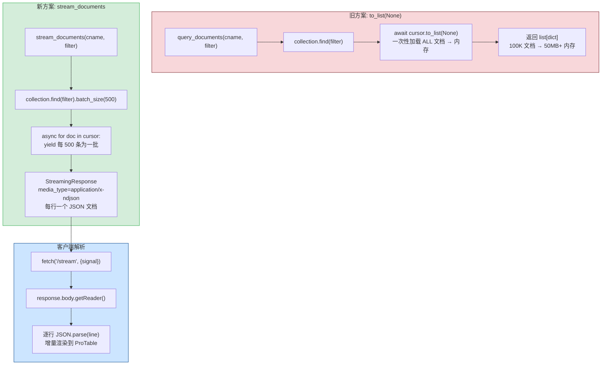
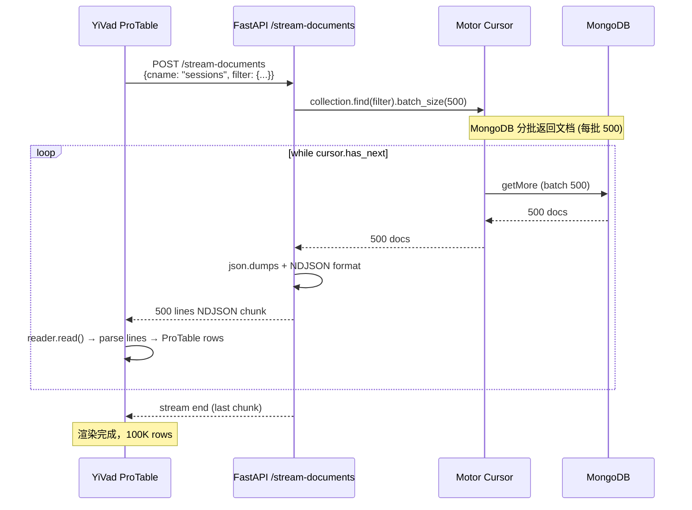

---

doc_type: module
prd_task_id: "YA-09-111"
title: "YA-09-111: 查询结果流式处理 — Motor Cursor + NDJSON 分批传输 — 开发方案"
status: 需求已编写
priority: P2
owner: 陈铭
roles: [engineer]
created: 2026-09-11
updated: 2026-09-23
project: YiAi
project_id: yiai
prd_month: "202609"
estimate_frontend: 0.5
source_prd: "48-需求-查询结果流式处理.md"
source_okr: [yiai-001]

type: task
---

# YA-09-111: 查询结果流式处理 — Motor Cursor + NDJSON 分批传输 — 开发方案

> 来源 PRD：[48-需求-查询结果流式处理.md](../../prds/2026-09/48-需求-查询结果流式处理.md)
> 需求编号：YA-09-111 · 优先级：P2 · 人天：0.5d
> 类型：架构 · 状态：需求已编写

---

## 一、架构概述 (Architecture Mermaid)

当前 `query_documents` 一次性加载所有匹配文档到内存（`to_list(None)`），大数据集 100K+ 文档导致内存飙升甚至 OOM。使用 MongoDB async cursor + NDJSON (`application/x-ndjson`) 流式传输，batch_size=500 分批返回。客户端逐批解析 NDJSON，服务端内存恒定为 batch_size * doc_size。



### NDJSON 格式示例

```
{"_id":"abc","name":"doc1","value":100}\n
{"_id":"def","name":"doc2","value":200}\n
{"_id":"ghi","name":"doc3","value":300}\n
```

---

## 二、文件清单 (File Manifest)

| # | 文件 | 操作 | 说明 | 预估行数 |
|---|------|------|------|----------|
| 1 | `src/domain/data/repository.py` | 修改 | 新增 `stream_find()` 返回 `AsyncIOMotorCursor` | +15 |
| 2 | `src/services/database/data_service.py` | 修改 | 新增 `stream_documents()` async generator | +35 |
| 3 | `src/server/rpc_router.py` | 修改 | 新增 `stream_documents` RPC 方法路由 | +20 |
| 4 | `src/shared/streaming.py` | 新增 | `StreamingResponse` 封装 + 错误处理 | +30 |
| 5 | `tests/test_stream_query.py` | 新增 | 大结果集/中断/超时/错误注入测试 | +65 |
| **合计** | | | | **~165 行** |

---

## 三、Python 核心签名 (Python Signatures)

```python
# src/services/database/data_service.py
import json
from typing import AsyncGenerator, Optional
from motor.motor_asyncio import AsyncIOMotorCollection, AsyncIOMotorCursor

async def stream_documents(
    cname: str,
    filter: Optional[dict] = None,
    sort: Optional[list[tuple[str, int]]] = None,
    batch_size: int = 500,
    max_docs: int = 1_000_000,  # 安全上限，防止无限流
) -> AsyncGenerator[str, None]:
    """流式查询文档 — Motor async cursor + NDJSON 分批传输。

    Parameters:
        cname: 集合名称
        filter: MongoDB 查询过滤条件
        sort: 排序规则 [("created_at", -1)]
        batch_size: 每批文档数 (同时也是 MongoDB batch_size)
        max_docs: 最大返回文档数 (安全上限)

    Yields:
        NDJSON 格式字符串，每行一个 JSON 文档 + "\n"

    Raises:
        ValueError: 集合不存在
        StreamTimeoutError: 流超时
    """
    collection: AsyncIOMotorCollection = get_collection(cname)
    if collection is None:
        raise ValueError(f"Collection '{cname}' not found")

    cursor: AsyncIOMotorCursor = collection.find(
        filter or {},
        batch_size=batch_size,
    )

    if sort:
        cursor = cursor.sort(sort)

    total_yielded = 0
    batch: list[str] = []

    async for doc in cursor:
        # 移除 MongoDB ObjectId (不可 JSON 序列化)
        if "_id" in doc:
            doc["_id"] = str(doc["_id"])

        batch.append(json.dumps(doc, default=str))
        total_yielded += 1

        if len(batch) >= batch_size:
            yield "\n".join(batch) + "\n"
            batch.clear()

        if total_yielded >= max_docs:
            break

    # 剩余不足 batch_size 的文档
    if batch:
        yield "\n".join(batch) + "\n"

    logger.info(
        f"Stream completed: {cname}, {total_yielded} docs yielded"
    )


# src/server/rpc_router.py (追加)
from starlette.responses import StreamingResponse

@app.post("/stream-documents")
async def stream_documents_endpoint(request: Request):
    """流式查询端点 — 返回 application/x-ndjson。"""
    body = await request.json()
    cname = body.get("cname")
    filter = body.get("filter")

    return StreamingResponse(
        stream_documents(cname, filter),
        media_type="application/x-ndjson",
        headers={
            "X-Stream-Name": cname,
            "Cache-Control": "no-cache",
        },
    )


# src/shared/streaming.py
from starlette.responses import StreamingResponse
from typing import AsyncGenerator
import asyncio

class StreamTimeoutError(Exception):
    pass

async def with_timeout(
    generator: AsyncGenerator[str, None],
    timeout: float = 300.0,    # 5 分钟最大流时间
) -> AsyncGenerator[str, None]:
    """为 async generator 添加超时保护。"""
    try:
        async for chunk in asyncio.wait_for(generator_pump(generator), timeout=timeout):
            yield chunk
    except asyncio.TimeoutError:
        logger.warning("Stream timeout after %ds", timeout)
        yield json.dumps({"error": "stream_timeout", "message": f"Query exceeded {timeout}s"}) + "\n"

async def generator_pump(gen: AsyncGenerator[str, None]) -> AsyncGenerator[str, None]:
    async for value in gen:
        yield value
```

---

## 四、数据流 (Data Flow)



### 内存对比

| 方案 | 100K 文档 ~50MB 数据 |
|------|---------------------|
| `to_list(None)` (旧) | 一次性 50MB+ 内存 |
| `stream_documents` (新) | 恒定 ~250KB (500 docs) |

---

## 五、实施路线图 (Roadmap)

| 步骤 | 任务 | 产出 | 验证方式 | 人天 |
|------|------|------|---------|------|
| 1 | `stream_documents()` async generator + cursor `.batch_size(500)` | 流式查询可用 | 100K 文档流内存 < 10MB | 0.1 |
| 2 | `StreamingResponse` 端点 + `application/x-ndjson` | 端点可访问 | curl 验证 NDJSON 格式 | 0.1 |
| 3 | 超时保护 (`asyncio.wait_for`) + `max_docs` 安全上限 | 流有边界 | 模拟慢查询超时 → 优雅终止 | 0.1 |
| 4 | `_id` ObjectId 序列化 + 错误注入测试 | 健壮性 | 中断/超时/空集合/错误集合测试 | 0.15 |
| 5 | YiVad 前端 NDJSON 解析 (ProTable 适配) | 前端可用 | 100K 文档渲染不卡顿 | 0.05 |

**合计：0.5d。**

---

## 六、Review 检查清单 (Review Checklist)

- [ ] `stream_documents` 使用 `async for` 而非 `to_list()`
- [ ] MongoDB `batch_size=500` 设置合理（权衡网络往返和内存）
- [ ] `_id` ObjectId 序列化为字符串 (json.dumps 否则报错)
- [ ] NDJSON 格式: 每行 `{...}\n`
- [ ] `max_docs` 安全上限防止无限流
- [ ] 超时保护 (`asyncio.wait_for`) 防止连接泄漏
- [ ] 错误时返回 NDJSON 格式错误消息（不破坏解析器）
- [ ] `X-Stream-Name` 响应头标识流来源
- [ ] 客户端通过 `AbortController` 可中断流

---

## 七、技术风险表 (Risk Table)

| 风险 | 概率 | 影响 | 缓解措施 |
|------|------|------|---------|
| 网络中断导致流不完整 | 中 | 中 | 客户端 `AbortController` + 超时; 服务端 `asyncio.CancelledError` 处理 |
| `sort` 无索引导致全表扫描 | 中 | 高 | `batch_size` 保证每批小; 记录 slow query 日志 |
| NDJSON 中 `\n` 出现在字段值中 | 低 | 中 | `json.dumps` 默认转义 `\n` → `\\n` |
| 流中间异常导致客户端僵死 | 低 | 中 | 最后一批带 `{"_stream": "end"}` 标记 |
| `batch.clear()` 后 GC 不及时 | 低 | 低 | 每批 yield 后 `batch` 重新赋值新 list |

---

## 八、关联模块

- 基础: [YA-09-15 数据访问层查询优化](./21-prd-task-数据访问层查询优化.md)
- 关联: [YA-09-228 流式响应缓存与重放](./228-prd-task-流式响应缓冲优化.md)
- 关联: [YA-09-115 请求超时取消传播](./115-prd-task-请求超时取消传播.md)