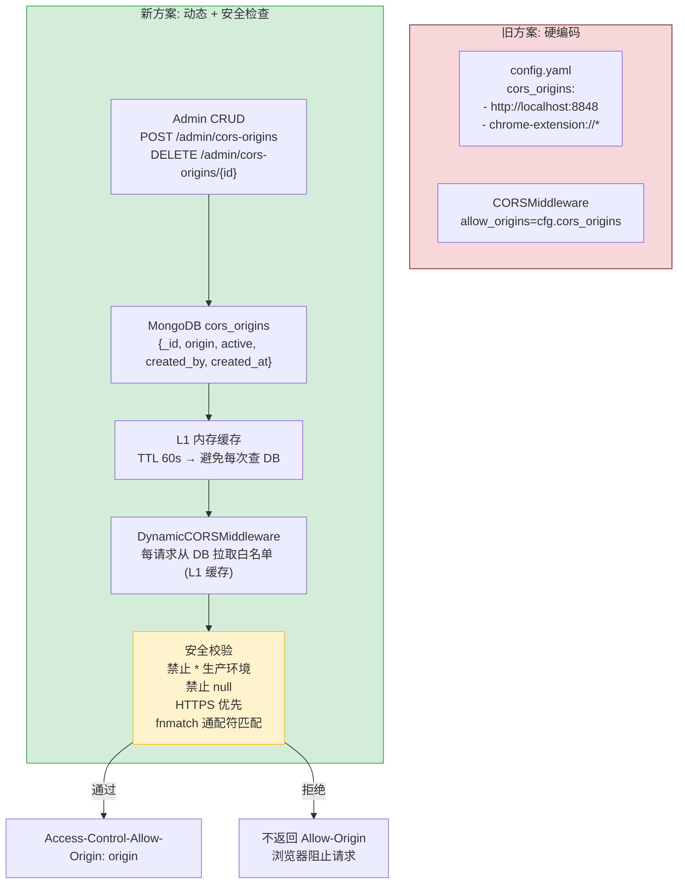
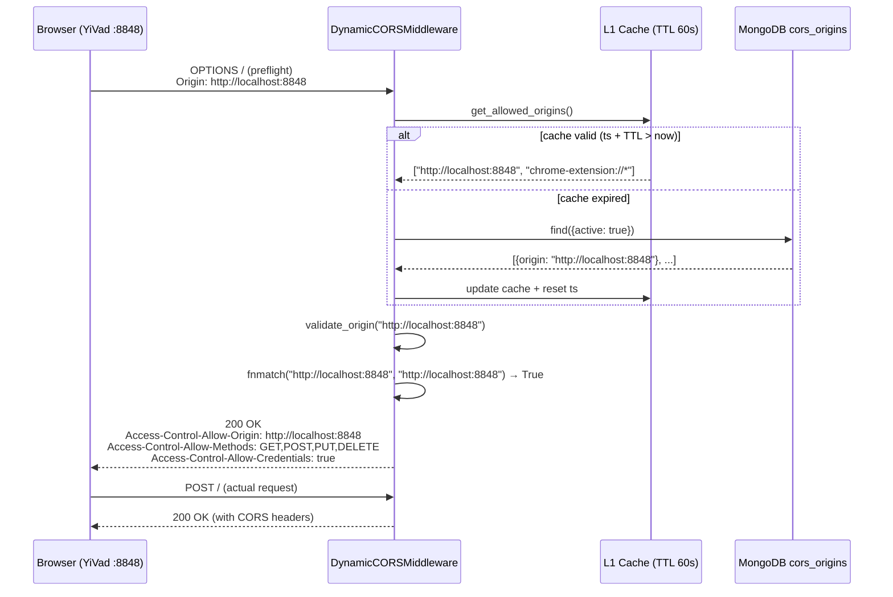

---

doc_type: module
prd_task_id: "YA-09-96"
title: "YA-09-96: CORS 安全增强 — 动态 Origin + 凭证管理 + fnmatch 通配符 — 开发方案"
status: 需求已编写
priority: P2
owner: 陈铭
roles: [engineer]
created: 2026-09-11
updated: 2026-09-23
project: YiAi
project_id: yiai
prd_month: "202609"
estimate_frontend: 0.5
source_prd: "49-需求-CORS安全策略增强.md"
source_okr: [yiai-001]

type: task
---

# YA-09-96: CORS 安全增强 — 动态 Origin + 凭证管理 + fnmatch 通配符 — 开发方案

> 来源 PRD：[49-需求-CORS安全策略增强.md](../../prds/2026-09/49-需求-CORS安全策略增强.md)
> 需求编号：YA-09-96 · 优先级：P2 · 人天：0.5d
> 类型：安全 · 状态：需求已编写

---

## 一、架构概述 (Architecture Mermaid)

CORS 白名单从硬编码 `config.yaml` 升级为 MongoDB 数据库驱动——Admin 页面可动态增删 Origin，支持 `fnmatch` 通配符匹配（`https://*.example.com`）。安全约束：生产禁止 `*` 通配符、禁止 `null` Origin、凭证模式拒绝泛域名。



### 安全约束矩阵

| 约束 | 说明 | 实施 |
|------|------|------|
| 禁止 `*` (生产) | 生产环境禁止通配符 | `validate()` 中拒绝 `"*"` |
| 禁止 `null` Origin | 防止本地 HTML 文件攻击 | 拒绝 origin == "null" |
| HTTPS 优先 | 生产仅允许 `https://` | `env == "production"` 时校验 |
| 凭证限制 | `credentials=True` 时拒绝泛域名 `*.` | CORSMiddleware 默认行为 |
| fnmatch 通配符 | 支持 `https://*.example.com` | `fnmatch.fnmatch(origin, pattern)` |

---

## 二、文件清单 (File Manifest)

| # | 文件 | 操作 | 说明 | 预估行数 |
|---|------|------|------|----------|
| 1 | `src/shared/middleware/cors_dynamic.py` | 新增 | `DynamicCORSMiddleware` + 缓存 + 安全校验 | +80 |
| 2 | `src/shared/cors/models.py` | 新增 | `CorsOrigin` dataclass + 校验逻辑 | +25 |
| 3 | `src/server/admin_routes.py` | 修改 | `POST/DELETE /admin/cors-origins` CRUD 端点 | +40 |
| 4 | `src/shared/db.py` | 修改 | 确保 `cors_origins` 集合 + 默认 Origin 种子数据 | +15 |
| 5 | `tests/shared/middleware/test_cors_dynamic.py` | 新增 | 通配符/拒绝/null/凭证测试 | +55 |
| **合计** | | | | **~215 行** |

---

## 三、Python 核心签名 (Python Signatures)

```python
# src/shared/middleware/cors_dynamic.py
import fnmatch
import logging
import time
from dataclasses import dataclass, field
from typing import Optional
from motor.motor_asyncio import AsyncIOMotorDatabase

logger = logging.getLogger(__name__)

@dataclass
class CorsPolicy:
    """CORS 策略配置。"""
    allow_credentials: bool = True
    allow_methods: list[str] = field(default_factory=lambda: ["GET", "POST", "PUT", "DELETE", "OPTIONS"])
    allow_headers: list[str] = field(default_factory=lambda: ["Content-Type", "Authorization", "X-Token"])
    max_age: int = 3600

class DynamicCORSMiddleware:
    """动态 CORS 中间件 — 数据库驱动 Origin 白名单 + L1 缓存。

    特性:
      - MongoDB 存储: Admin 可动态增删 Origin
      - L1 内存缓存: TTL 60s，避免每次请求查 DB
      - fnmatch 通配符: https://*.example.com
      - 安全校验: 生产禁止 *, 禁止 null, HTTPS 优先
      - 预热: 启动时加载到缓存
    """

    def __init__(self, db: AsyncIOMotorDatabase, env: str = "development") -> None:
        self._db = db
        self._env = env
        self._cache: list[str] = []
        self._cache_ts: float = 0.0
        self._cache_ttl: float = 60.0

    async def get_allowed_origins(self) -> list[str]:
        """获取白名单 — L1 缓存优先 → MongoDB 兜底。"""
        ...

    async def validate_origin(self, origin: Optional[str]) -> Optional[str]:
        """校验 Origin 是否在白名单中。

        返回:
            匹配的 Origin 字符串 → 设置 Access-Control-Allow-Origin
            None → 拒绝请求
        """
        if not origin:
            return None

        # 安全约束
        if origin == "null":
            logger.warning("[CORS] Rejected 'null' origin — possible local file attack")
            return None

        if self._env == "production" and origin == "*":
            logger.critical("[CORS] '*' origin in production — rejected")
            return None

        allowed = await self.get_allowed_origins()
        for pattern in allowed:
            if fnmatch.fnmatch(origin, pattern):
                # 凭证模式下不能返回泛域名
                if "*" in pattern and self._env == "production":
                    logger.warning(f"[CORS] Wildcard origin '{pattern}' with credentials in production")
                    return None
                return origin

        logger.debug(f"[CORS] Origin '{origin}' not in allowlist")
        return None

    async def add_origin(self, origin: str, created_by: str) -> str:
        """Admin: 添加允许的 Origin。"""
        ...

    async def remove_origin(self, origin: str) -> bool:
        """Admin: 移除 Origin。"""
        ...

    async def get_origins(self) -> list[dict]:
        """Admin: 获取所有已注册 Origin (含 active 状态)。"""
        ...


# src/shared/cors/models.py
from dataclasses import dataclass
from datetime import datetime

@dataclass
class CorsOrigin:
    """MongoDB cors_origins 文档模型。"""
    origin: str              # _id: "http://localhost:8848"
    active: bool = True
    description: str = ""
    created_by: str = ""
    created_at: datetime = field(default_factory=datetime.utcnow)

    def is_wildcard(self) -> bool:
        return "*" in self.origin

    def is_https(self) -> bool:
        return self.origin.startswith("https://")
```

---

## 四、数据流 (Data Flow)



---

## 五、实施路线图 (Roadmap)

| 步骤 | 任务 | 产出 | 验证方式 | 人天 |
|------|------|------|---------|------|
| 1 | `DynamicCORSMiddleware` 核心 + L1 缓存 (TTL 60s) | 动态白名单可用 | 从 DB 增删 Origin → 缓存刷新后生效 | 0.1 |
| 2 | 安全校验: 禁止 `*`/`null` + `fnmatch` 通配符 | 安全规则生效 | `curl -H "Origin: null"` → 无 CORS 头 | 0.1 |
| 3 | Admin CRUD (`POST/DELETE /admin/cors-origins`) | 管理端点 | API 增删 Origin → DB 变更 → 缓存失效 | 0.1 |
| 4 | 启动预热 + 默认 Origin 种子数据 | 启动即用 | 启动后 YiVad/YiPet 跨域请求正常 | 0.1 |
| 5 | 测试: 通配符/凭证/HTTPS/null/缓存刷新 | 全场景覆盖 | pytest 全部通过 | 0.1 |

**合计：0.5d。**

---

## 六、Review 检查清单 (Review Checklist)

- [ ] 生产环境禁止 `*` 通配符和 `null` Origin
- [ ] L1 缓存 TTL 60s，缓存过期后自动从 DB 刷新
- [ ] `fnmatch.fnmatch` 正确匹配 `https://*.example.com` 模式
- [ ] 凭证模式 (`credentials=True`) 时不使用泛域名 `*.`
- [ ] Preflight (OPTIONS) 请求正确返回 CORS 头
- [ ] Admin CRUD 端点需要认证 (`require_admin`)
- [ ] `Access-Control-Max-Age: 3600` 减少 preflight 请求
- [ ] 启动时预热缓存 (从 DB 加载)
- [ ] 无效 Origin 时返回正常响应但无 CORS 头（浏览器自动拦截）

---

## 七、技术风险表 (Risk Table)

| 风险 | 概率 | 影响 | 缓解措施 |
|------|------|------|---------|
| 缓存未命中且 DB 不可用导致全部跨域请求失败 | 低 | 高 | 启动预热 + stale-while-revalidate (DB 不可用时用过期缓存) |
| `fnmatch` 通配符误匹配 (过于宽松) | 低 | 中 | 限制通配符仅用于子域名 `*.` 模式 |
| Chrome Extension Origin 格式特殊 | 低 | 中 | 明确支持 `chrome-extension://*` 通配符 |
| 缓存并发刷新 (多个请求同时发现过期) | 低 | 低 | asyncio.Lock 缓存刷新互斥 |

---

## 八、关联模块

- 基础: [YA-09-03 用户管理服务](./11-prd-task-用户管理服务.md)
- 关联: [YA-09-145 IP 白名单与访问控制](./145-prd-task-IP白名单与访问控制.md)
- 关联: [YA-09-54 Admin API 安全加固](./54-prd-task-AdminAPI安全加固.md)