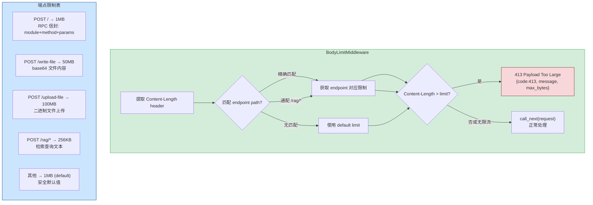
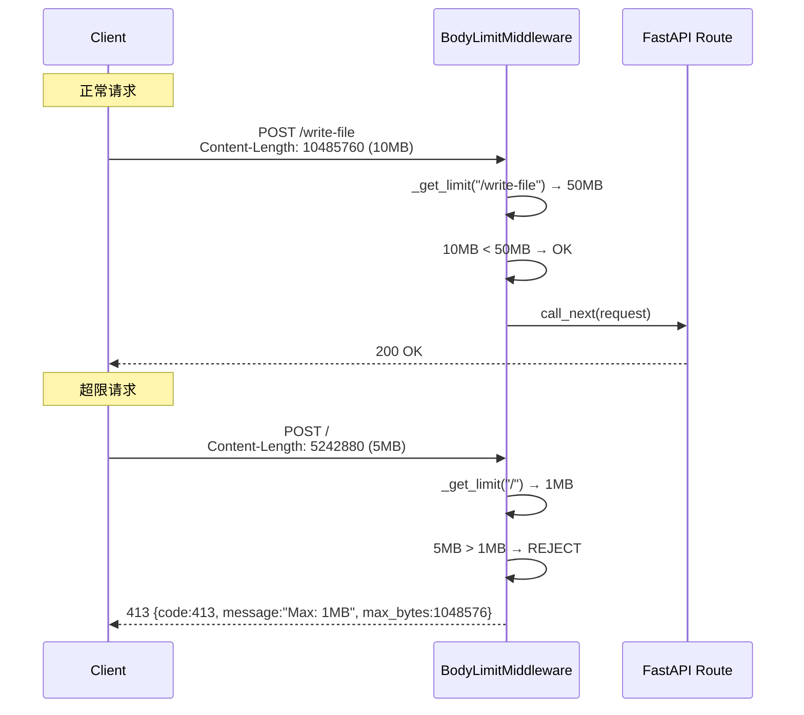

---

doc_type: module
prd_task_id: "YA-09-46"
title: "YA-09-46: 请求体大小限制 — 按端点差异化 + 413 响应 — 开发方案"
status: 需求已编写
priority: P2
owner: 陈铭
roles: [engineer]
created: 2026-09-11
updated: 2026-09-23
project: YiAi
project_id: yiai
prd_month: "202609"
estimate_frontend: 0.5
source_prd: "50-需求-请求体大小限制.md"
source_okr: [yiai-001]

type: task
---

# YA-09-46: 请求体大小限制 — 按端点差异化 + 413 响应 — 开发方案

> 来源 PRD：[50-需求-请求体大小限制.md](../../prds/2026-09/50-需求-请求体大小限制.md)
> 需求编号：YA-09-46 · 优先级：P2 · 人天：0.5d
> 类型：安全 · 状态：需求已编写

---

## 一、架构概述 (Architecture Mermaid)

当前所有端点无请求体大小限制，攻击者可发送超大 Payload 导致内存耗尽 (OOM)。按端点差异化限制：RPC 信封 1MB、文件写入 50MB、二进制上传 100MB、RAG 检索 256KB。超出限制立即返回 413 Payload Too Large。



### 限制策略表

| 端点路径 | 限制 | 原因 | Match 方式 |
|---------|------|------|-----------|
| `POST /` (RPC) | 1 MB | Agent 消息 + context + 参数 | exact |
| `POST /write-file` | 50 MB | base64 编码文件写入 | exact |
| `POST /upload-file` | 100 MB | 二进制大文件上传 | exact |
| `POST /rag/*` | 256 KB | RAG 检索查询 | prefix |
| `POST /read-file` | 1 KB | 文件路径参数 | exact |
| 其他 | 1 MB | 安全默认值 | default |

---

## 二、文件清单 (File Manifest)

| # | 文件 | 操作 | 说明 | 预估行数 |
|---|------|------|------|----------|
| 1 | `src/shared/middleware/body_limit.py` | 新增 | `BodyLimitMiddleware` 按路径差异化限制 | +55 |
| 2 | `src/app.py` | 修改 | 注册 `BodyLimitMiddleware` | +8 |
| 3 | `config.yaml` | 修改 | `body_limits` 配置段 | +12 |
| 4 | `tests/shared/middleware/test_body_limit.py` | 新增 | 边界/超限/默认/流式上传测试 | +55 |
| **合计** | | | | **~130 行** |

---

## 三、Python 核心签名 (Python Signatures)

```python
# src/shared/middleware/body_limit.py
import logging
from starlette.middleware.base import BaseHTTPMiddleware
from starlette.requests import Request
from starlette.responses import JSONResponse
from typing import Optional

logger = logging.getLogger(__name__)

MB = 1024 * 1024
KB = 1024

# 默认端点限制表
ENDPOINT_LIMITS: dict[str, int] = {
    "/": 1 * MB,                # RPC 信封
    "/write-file": 50 * MB,     # 文件写入
    "/upload-file": 100 * MB,   # 文件上传
    "/read-file": 1 * KB,       # 文件路径
    "/rag": 256 * KB,           # RAG 检索 (prefix match)
}

DEFAULT_LIMIT: int = 1 * MB

class BodyLimitMiddleware(BaseHTTPMiddleware):
    """按端点差异化请求体大小限制中间件。

    特性:
      - 端点路径精确匹配 → 使用对应 limit
      - prefix 匹配 (/rag/*) → 使用 /rag limit
      - 无匹配 → 使用 DEFAULT_LIMIT
      - 仅检查 POST/PUT/PATCH 方法 (GET/DELETE 无 body)
      - 流式上传跳过 Content-Length 检查 (Chunked Transfer-Encoding)
      - 413 响应包含 code/message/max_bytes

    Config:
      config.yaml body_limits:
        /write-file: 52428800    # 50MB
        /upload-file: 104857600  # 100MB
        /: 1048576               # 1MB
    """

    LIMITS: dict[str, int] = ENDPOINT_LIMITS.copy()
    DEFAULT: int = DEFAULT_LIMIT

    def __init__(self, app, limits: Optional[dict[str, int]] = None) -> None:
        super().__init__(app)
        if limits:
            self.LIMITS.update(limits)

    async def dispatch(self, request: Request, call_next):
        """检查 Content-Length → 超限返回 413。"""
        if request.method not in ("POST", "PUT", "PATCH"):
            return await call_next(request)

        content_length = request.headers.get("content-length")
        if not content_length:
            # Transfer-Encoding: chunked — 无法预知大小，放行
            return await call_next(request)

        body_size = int(content_length)
        limit = self._get_limit(request.url.path)

        if body_size > limit:
            logger.warning(
                f"[BodyLimit] {request.method} {request.url.path} "
                f"rejected: {body_size} > {limit} bytes"
            )
            return JSONResponse(
                status_code=413,
                content={
                    "code": 413,
                    "message": f"Request body too large. "
                               f"Max: {limit // MB}MB (or {limit} bytes). "
                               f"Received: {body_size} bytes.",
                    "max_bytes": limit,
                },
            )

        return await call_next(request)

    def _get_limit(self, path: str) -> int:
        """获取端点对应的限制值。

        匹配优先级:
          1. 精确匹配 path in LIMITS
          2. Prefix 匹配 path.startswith(key)
          3. 返回 DEFAULT
        """
        if path in self.LIMITS:
            return self.LIMITS[path]
        for key, limit in sorted(self.LIMITS.items(), key=lambda x: -len(x[0])):
            if path.startswith(key + "/") or path.startswith(key):
                return limit
        return self.DEFAULT


# config.yaml (追加)
# body_limits:
#   "/": 1048576
#   "/write-file": 52428800
#   "/upload-file": 104857600
#   "/rag": 262144
```

---

## 四、数据流 (Data Flow)



---

## 五、实施路线图 (Roadmap)

| 步骤 | 任务 | 产出 | 验证方式 | 人天 |
|------|------|------|---------|------|
| 1 | `BodyLimitMiddleware` 核心逻辑 + 端点表 | 按路径限制 | `curl -d @5mb.json POST /` → 413 | 0.1 |
| 2 | Prefix 匹配 (`/rag/*`) + config.yaml 配置化 | 灵活配置 | 自定义 `/custom` 限制 | 0.1 |
| 3 | Chunked Transfer-Encoding 处理 (无 Content-Length) | 流式兼容 | 无 `content-length` 头的请求正常通过 | 0.1 |
| 4 | 413 响应结构化 (code/message/max_bytes) + 日志 | 标准化错误 | 413 响应符合 RPC 错误格式 | 0.1 |
| 5 | 测试: 边界值/超限/默认/prefix 匹配/Config override | 全覆盖 | pytest 全部通过 | 0.1 |

**合计：0.5d。**

---

## 六、Review 检查清单 (Review Checklist)

- [ ] 仅检查 POST/PUT/PATCH 方法 (GET/DELETE 无 body)
- [ ] `Content-Length` 缺失时放行 (Chunked Transfer-Encoding)
- [ ] `Content-Length` 非数字时安全处理 (ValueError → 放行 or 400)
- [ ] Prefix 匹配使用最长 key 优先 (避免 `/` 匹配所有)
- [ ] 413 响应包含 `code`, `message`, `max_bytes`
- [ ] `config.yaml` 可覆盖默认限制
- [ ] `_get_limit` 的 prefix 匹配使用 `sorted(key, -len)` 确保 `/write-file` 优先于 `/`
- [ ] body_size 使用 `int(content_length)` 时处理 `ValueError`

---

## 七、技术风险表 (Risk Table)

| 风险 | 概率 | 影响 | 缓解措施 |
|------|------|------|---------|
| Content-Length 被伪造为极小值绕过限制 | 低 | 中 | Starlette 实际读取 body 时仍会限制；备选: 结合 streaming parse 检查 |
| Prefix 匹配 `/` 匹配所有路径 | 中 | 高 | 使用精确匹配优先 + 最长 prefix 优先的排序策略 |
| Chunked 上传无 Content-Length 无法限流 | 中 | 中 | 对 `/upload-file` 添加 `asyncio.wait_for` 超时 + 最大 chunk 数限制 |
| `Content-Length: 0` 被拒绝 | 低 | 低 | `0 < limit` → 放行 |

---

## 八、关联模块

- 基础: [YA-09-133 请求大小按端点差异化](./133-prd-task-请求大小按端点差异化.md)
- 关联: [YA-09-30 API 网关](./30-prd-task-API网关.md)
- 关联: [YA-09-16 API 限流与并发控制](./16-prd-task-API限流与并发控制.md)