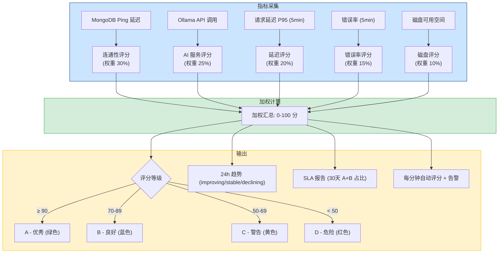
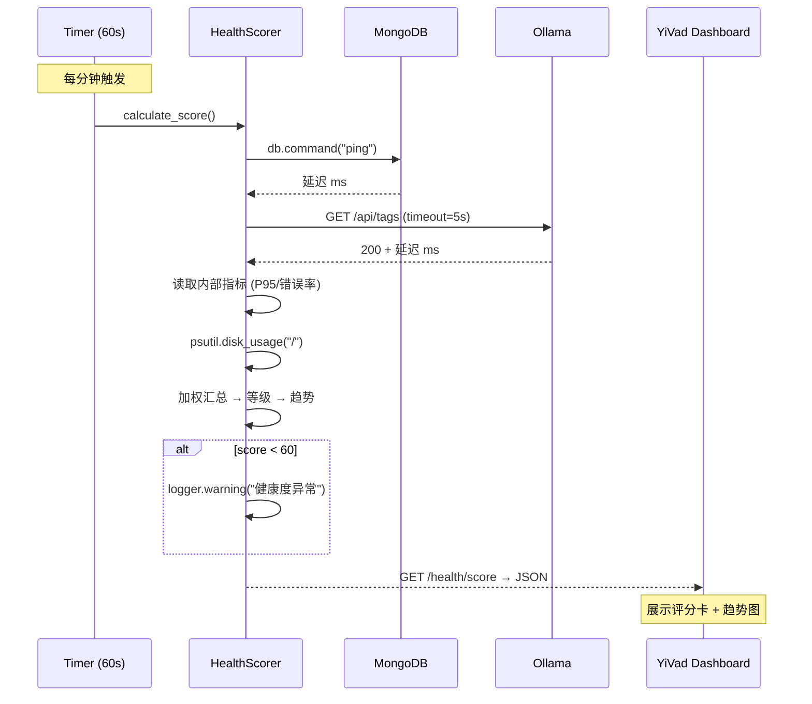

---

doc_type: module
prd_task_id: "YA-09-28"
title: "YA-09-28: 健康度评分卡 — 多维度加权 SLA 评估 + Dashboard — 开发方案"
status: 需求已编写
priority: P2
owner: 陈铭
roles: [engineer]
created: 2026-09-11
updated: 2026-09-23
project: YiAi
project_id: yiai
prd_month: "202609"
estimate_frontend: 1.0
source_prd: "51-需求-健康度评分卡.md"
source_okr: [yiai-001]

type: task
---

# YA-09-28: 健康度评分卡 — 多维度加权 SLA 评估 — 开发方案

> 来源 PRD：[51-需求-健康度评分卡.md](../../prds/2026-09/51-需求-健康度评分卡.md)
> 需求编号：YA-09-28 · 优先级：P2 · 人天：1.0d
> 类型：运维/架构 · 状态：需求已编写

---

## 一、架构概述 (Architecture Mermaid)

当前 `/health/ready` 仅返回二值状态（ready/not_ready），无法反映服务的实际运行质量——MongoDB 延迟 500ms 仍返回 ready，无量化指标也无趋势分析。改造为 5 维度加权评分卡，综合评估服务整体健康度，Dashboard 实时展示评分等级和 24h 趋势。



### 评分维度详情

| 维度 | 权重 | 指标 | 满分 (100) | 零分 (0) | 线性衰减 |
|------|------|------|-----------|---------|---------|
| MongoDB 连通性 | 30% | Ping 延迟 | < 10ms | > 1000ms | `100 × (1 - ms/1000)` |
| Ollama AI 服务 | 25% | API 响应 | < 200ms | > 3000ms | `100 × (1 - ms/3000)` |
| 响应延迟 | 20% | P95 (5min) | < 200ms | > 2000ms | `100 - (ms-200)/18` |
| 错误率 | 15% | 5xx 占比 (5min) | 0% | > 10% | `100 × (1 - rate/0.1)` |
| 磁盘空间 | 10% | 空闲 GB | > 10GB | < 0.5GB | `min(100, gb/10 × 100)` |

---

## 二、文件清单 (File Manifest)

| # | 文件 | 操作 | 说明 | 预估行数 |
|---|------|------|------|----------|
| 1 | `src/services/monitoring/health_score.py` | 新增 | `HealthScorer` + 5 维度评分 + 趋势分析 + SLA 报告 | +150 |
| 2 | `src/server/routes.py` | 修改 | `GET /health/score`、`/health/trend`、`/health/sla` 端点 | +25 |
| 3 | `src/app.py` | 修改 | 注册评分路由 + 启动 1 分钟监控循环 | +10 |
| 4 | `tests/test_health_score.py` | 新增 | 评分/边界/趋势/SLA/异常维度测试 | +80 |
| **合计** | | | | **~265 行** |

---

## 三、Python 核心签名 (Python Signatures)

```python
# src/services/monitoring/health_score.py
from dataclasses import dataclass, field
from typing import Optional, AsyncGenerator
import asyncio, time, logging, httpx, psutil

logger = logging.getLogger("YiAi.HealthScore")

@dataclass
class ScoreRecord:
    """评分记录——用于趋势分析（环形缓冲区）。"""
    timestamp: float
    score: float
    grade: str
    breakdown: dict[str, float]

class HealthScorer:
    """服务健康度评分卡——5 维度加权评估 + 24h 趋势 + SLA 报告。

    权重: MongoDB(30%) / Ollama(25%) / 延迟(20%) / 错误率(15%) / 磁盘(10%)
    等级: A(90+) / B(70-89) / C(50-69) / D(<50)
    监控频率: 每分钟自动评分
    """

    WEIGHTS: dict[str, float] = {
        "mongodb_connectivity": 0.30,
        "ollama_health": 0.25,
        "response_latency": 0.20,
        "error_rate": 0.15,
        "disk_space": 0.10,
    }

    MAX_HISTORY: int = 1440  # 24h × 60min

    def __init__(self, db, ollama_host: str = "http://localhost:11434"):
        self._db = db
        self._ollama_host = ollama_host
        self._history: list[ScoreRecord] = []
        self._running = False
        self._task: Optional[asyncio.Task] = None

    # ---- 评分计算 ----

    async def calculate_score(self) -> dict:
        """计算当前健康度评分 (0-100)。返回完整评分 JSON。"""
        scores = {
            "mongodb_connectivity": await self._check_mongodb(),
            "ollama_health": await self._check_ollama(),
            "response_latency": await self._check_latency(),
            "error_rate": await self._check_error_rate(),
            "disk_space": await self._check_disk_space(),
        }
        total = round(sum(scores[k] * self.WEIGHTS[k] for k in self.WEIGHTS), 1)
        grade = self._grade(total)
        record = ScoreRecord(timestamp=time.time(), score=total, grade=grade, breakdown=scores)
        self._history.append(record)
        if len(self._history) > self.MAX_HISTORY:
            self._history = self._history[-self.MAX_HISTORY:]
        if total < 60:
            logger.warning(f"[HealthScore] 健康度异常: {total}/100 ({grade}), breakdown={scores}")
        return {
            "score": total, "grade": grade,
            "grade_description": self._grade_desc(grade),
            "breakdown": scores, "weights": self.WEIGHTS,
            "timestamp": int(time.time()),
        }

    # ---- 各维度检查 ----

    async def _check_mongodb(self) -> float:
        """MongoDB 连通性——Ping 延迟评分。"""
        try:
            start = time.monotonic()
            await self._db.command("ping")
            ms = (time.monotonic() - start) * 1000
            return max(0.0, 100 * (1 - ms / 1000))
        except Exception:
            return 0.0

    async def _check_ollama(self) -> float:
        """Ollama API 健康——GET /api/tags 延迟评分。"""
        try:
            async with httpx.AsyncClient(timeout=5) as client:
                start = time.monotonic()
                resp = await client.get(f"{self._ollama_host}/api/tags")
                ms = (time.monotonic() - start) * 1000
                return max(0.0, 100 * (1 - ms / 3000)) if resp.status_code == 200 else 0.0
        except Exception:
            return 0.0

    async def _check_latency(self) -> float:
        """响应延迟——基于最近 5 分钟 P95。无数据返回 100。"""
        p95 = await self._get_p95_latency(5)
        if p95 is None:
            return 100.0
        if p95 < 200: return 100.0
        if p95 > 2000: return 0.0
        return max(0.0, 100 - (p95 - 200) / 18)

    async def _check_error_rate(self) -> float:
        """错误率——最近 5 分钟 5xx 占比。无数据返回 100。"""
        err = await self._get_error_rate(5)
        if err is None: return 100.0
        return max(0.0, 100 * (1 - err / 0.1))

    async def _check_disk_space(self) -> float:
        """磁盘空间——空闲 GB 评分。无法检测返回 100。"""
        try:
            free_gb = psutil.disk_usage("/").free / (1024**3)
            return max(0.0, min(100.0, free_gb / 10 * 100))
        except Exception:
            return 100.0

    # ---- 等级 + 趋势 ----

    def _grade(self, score: float) -> str:
        if score >= 90: return "A"
        if score >= 70: return "B"
        if score >= 50: return "C"
        return "D"

    def _grade_desc(self, g: str) -> str:
        return {"A": "Excellent", "B": "Good", "C": "Needs Attention", "D": "Critical"}.get(g, "Unknown")

    def get_trend(self, hours: int = 24) -> dict:
        """24h 趋势分析: improving / stable / declining。"""
        if len(self._history) < 2:
            return {"status": "insufficient_data"}
        cutoff = time.time() - hours * 3600
        recent = [r for r in self._history if r.timestamp > cutoff]
        if len(recent) < 2:
            return {"status": "insufficient_data"}
        delta = self._history[-1].score - recent[0].score
        trend = "improving" if delta > 5 else "declining" if delta < -5 else "stable"
        return {
            "current": self._history[-1].score, "past_hours_ago": round(recent[0].score, 1),
            "delta": round(delta, 1), "trend": trend,
            "avg": round(sum(r.score for r in recent) / len(recent), 1),
            "min": min(r.score for r in recent), "max": max(r.score for r in recent),
        }

    def get_sla_report(self, hours: int = 720) -> dict:
        """SLA 报告——过去 N 小时 A+B 占比。"""
        if not self._history:
            return {"status": "no_data"}
        cutoff = time.time() - hours * 3600
        relevant = [r for r in self._history if r.timestamp > cutoff]
        if not relevant: return {"status": "no_data"}
        total = len(relevant)
        a_n = sum(1 for r in relevant if r.grade == "A")
        b_n = sum(1 for r in relevant if r.grade == "B")
        c_n = sum(1 for r in relevant if r.grade == "C")
        d_n = sum(1 for r in relevant if r.grade == "D")
        return {
            "period_hours": hours, "samples": total,
            "sla_uptime_pct": round((a_n + b_n) / total * 100, 2),
            "distribution": {"A": a_n, "B": b_n, "C": c_n, "D": d_n},
            "avg_score": round(sum(r.score for r in relevant) / total, 1),
        }

    # ---- 监控循环 ----

    async def start_monitoring(self):
        if self._running: return
        self._running = True
        self._task = asyncio.create_task(self._loop())
        logger.info("[HealthScore] 评分监控已启动 (间隔 60s)")

    async def _loop(self):
        while self._running:
            await asyncio.sleep(60)
            try:
                await self.calculate_score()
            except Exception as e:
                logger.error(f"[HealthScore] 评分异常: {e}")

    def stop_monitoring(self):
        self._running = False
        if self._task:
            self._task.cancel()

    # ---- 占位（实际从中间件统计获取） ----

    async def _get_p95_latency(self, minutes: int) -> Optional[float]:
        from src.server.middleware import request_stats
        return request_stats.get_p95_latency(minutes)

    async def _get_error_rate(self, minutes: int) -> Optional[float]:
        from src.server.middleware import request_stats
        return request_stats.get_error_rate(minutes)


# 全局单例
health_scorer: Optional[HealthScorer] = None
```

---

## 四、数据流 (Data Flow)



### 内存与性能

| 资源 | 消耗 | 说明 |
|------|------|------|
| 历史记录内存 | < 1MB | 1440 个 ScoreRecord |
| 单次评分 CPU | < 50ms | 5 个维度检查（含网络 IO） |
| 监控循环 CPU | < 0.01% | 每分钟执行一次 |

---

## 五、实施路线图 (Roadmap)

| 步骤 | 任务 | 产出 | 验证方式 | 人天 |
|------|------|------|---------|------|
| 1 | `HealthScorer` + 5 维度评分 + 等级分类 | 评分计算可用 | 正常环境返回 score ≥ 90 | 0.3 |
| 2 | 24h 趋势分析 + 环形缓冲区 (1440 采样) | 趋势可用 | 模拟历史数据验证 improving/declining | 0.2 |
| 3 | SLA 报告 (A+B 占比) + 监控循环 (60s) | SLA 报告可用 | `/health/sla` 返回分布数据 | 0.2 |
| 4 | `GET /health/score` + `/trend` + `/sla` 端点 | 端点可访问 | curl 验证 JSON 结构 | 0.1 |
| 5 | 测试 (各维度边界/异常/MongoDB 不可用/趋势) | 测试通过 | pytest 10+ 场景 | 0.2 |

**合计：1.0d。**

---

## 六、Review 检查清单 (Review Checklist)

- [ ] 5 维度权重总和 = 1.0 (30+25+20+15+10=100%)
- [ ] 每维度 0-100 分，线性衰减或分段函数
- [ ] A(90+)/B(70-89)/C(50-69)/D(<50) 四级评分
- [ ] MongoDB 评分受 Ping 延迟影响（短暂超时不立刻降为 0）
- [ ] Ollama 评分有 5s 超时，超时即 0 分
- [ ] 24h 趋势分析基于 1440 采样点环形缓冲区
- [ ] 评分 < 60 时自动 WARNING 日志
- [ ] 评分监控循环每分钟一次（不阻塞事件循环）
- [ ] `disk_usage` 异常时返回 100（不误报）
- [ ] 权重可通过配置文件调整（未来）
- [ ] 测试覆盖：全部满分 / 全部零分 / 部分异常 / 趋势判断 / SLA 计算

---

## 七、技术风险表 (Risk Table)

| 风险 | 概率 | 影响 | 缓解措施 |
|------|------|------|---------|
| 权重不合理导致评分误导 | 中 | 中 | 基于历史数据校准；权重可配置 |
| Ollama 偶尔超时导致评分剧烈波动 | 中 | 低 | 5s 超时包容瞬时抖动；滑动窗口平滑 |
| psutil 未安装导致磁盘检查崩溃 | 低 | 中 | try/except Exception 兜底返回 100 |
| 监控循环异常导致评分停止 | 低 | 中 | 循环内 try/except + 日志告警 |
| 新服务无历史数据时趋势报错 | 低 | 低 | `insufficient_data` 状态兜底 |

---

## 八、关联模块

- 基础: [YA-09-16 服务健康检查与就绪探针](./20-prd-task-服务健康检查与就绪探针.md)
- 关联: [YA-09-106 监控与告警体系](./106-prd-task-监控与告警体系.md)
- 关联: [YA-09-93 自愈恢复机制](./93-prd-task-自愈恢复机制.md)