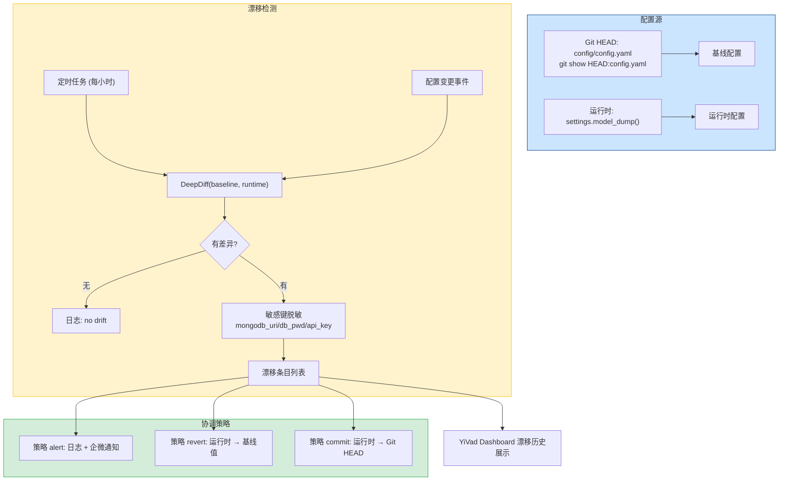
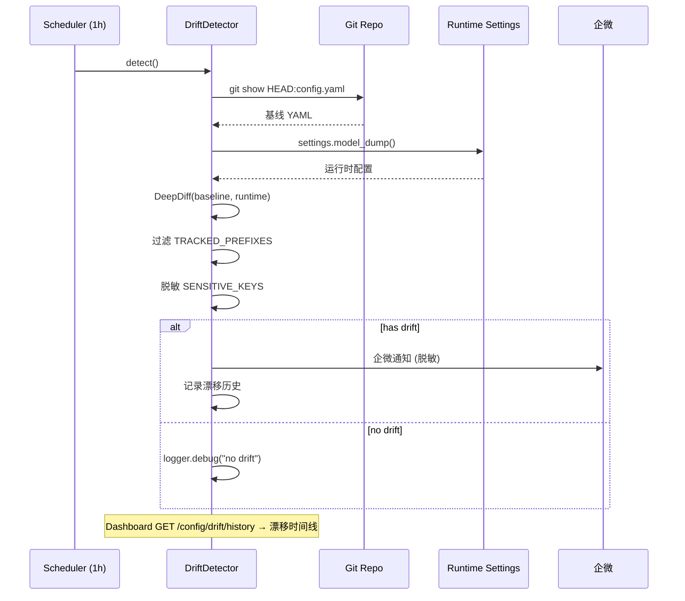

---

doc_type: module
prd_task_id: "YA-09-104"
title: "YA-09-104: 配置漂移检测 — 运行时 vs Git 差异告警 + Deep Diff — 开发方案"
status: 需求已编写
priority: P2
owner: 陈铭
roles: [engineer]
created: 2026-09-11
updated: 2026-09-23
project: YiAi
project_id: yiai
prd_month: "202609"
estimate_frontend: 0.5
source_prd: "52-需求-配置漂移检测.md"
source_okr: [yiai-001]

type: task
---

# YA-09-104: 配置漂移检测 — 运行时 vs Git 差异告警 + Deep Diff — 开发方案

> 来源 PRD：[52-需求-配置漂移检测.md](../../prds/2026-09/52-需求-配置漂移检测.md)
> 需求编号：YA-09-104 · 优先级：P2 · 人天：0.5d
> 类型：运维 · 状态：需求已编写

---

## 一、架构概述 (Architecture Mermaid)

引入配置热更新后，运行时配置可能偏离 Git 版本控制的基线。定期（每小时 + 配置变更时）对比运行时与 Git HEAD `config.yaml`，发现差异后脱敏告警，支持管理员确认后的三种协调策略：告警、回退到基线、提交运行时配置为新基线。



### 协调策略

| 策略 | 操作 | 适用场景 |
|------|------|---------|
| `alert` (默认) | 日志 + 企微通知，不做修改 | 安全，需人工判断 |
| `revert` | 运行时配置回退到 Git 基线 | 配置被错误修改 |
| `commit` | 将运行时配置提交为新的 Git 基线 | 修改是正确的，应持久化 |

---

## 二、文件清单 (File Manifest)

| # | 文件 | 操作 | 说明 | 预估行数 |
|---|------|------|------|----------|
| 1 | `src/shared/config/drift_detector.py` | 新增 | `ConfigDriftDetector`: DeepDiff + 脱敏 + 协调策略 | +120 |
| 2 | `src/server/routes.py` | 修改 | `GET /config/drift` + `POST /config/drift/reconcile` | +25 |
| 3 | `src/app.py` | 修改 | 注册定时检查 + 事件回调 | +10 |
| 4 | `tests/test_drift.py` | 新增 | 漂移检测/脱敏/协调策略/边界测试 | +60 |
| **合计** | | | | **~215 行** |

---

## 三、Python 核心签名 (Python Signatures)

```python
# src/shared/config/drift_detector.py
import asyncio, subprocess, time, yaml, logging
from dataclasses import dataclass, field
from typing import Optional
from deepdiff import DeepDiff

logger = logging.getLogger("YiAi.ConfigDrift")

@dataclass
class DriftEntry:
    """单个配置漂移条目。"""
    key: str
    baseline_value: str
    runtime_value: str
    detected_at: float = field(default_factory=time.time)

@dataclass
class DriftReport:
    """配置漂移报告。"""
    has_drift: bool
    entries: list[DriftEntry]
    count: int
    baseline_source: str = "Git HEAD"
    detected_at: float = field(default_factory=time.time)

class ConfigDriftDetector:
    """配置漂移检测——运行时 vs Git 基线的差异分析。

    检测频率: 每小时定时 + 配置变更事件驱动。
    协调策略: alert（仅告警）/ revert（回退到基线）/ commit（提交运行时）。
    """

    SENSITIVE_KEYS: frozenset[str] = frozenset({
        "mongodb_uri", "ollama_api_key", "wework_webhook_url",
        "auth_secret_key", "jwt_secret", "db_password",
    })

    TRACKED_PREFIXES: tuple[str, ...] = (
        "rag_", "agent_", "mongodb_", "ollama_", "rate_limit_",
        "knowledge_", "server.", "log.",
    )

    def __init__(self, settings):
        self._settings = settings
        self._history: list[DriftReport] = []

    async def detect(self) -> DriftReport:
        """检测运行时与 Git 基线的配置差异。"""
        baseline = self._load_baseline()
        runtime = self._load_runtime()
        entries: list[DriftEntry] = []
        for key in self._tracked_keys(baseline.keys() | runtime.keys()):
            b_val, r_val = baseline.get(key), runtime.get(key)
            if b_val != r_val:
                entries.append(DriftEntry(
                    key=key,
                    baseline_value=self._mask_if_sensitive(key, b_val),
                    runtime_value=self._mask_if_sensitive(key, r_val),
                ))
        report = DriftReport(has_drift=bool(entries), entries=entries, count=len(entries))
        self._history.append(report)
        if len(self._history) > 100:
            self._history = self._history[-100:]
        if entries:
            logger.warning(f"[ConfigDrift] 检测到 {len(entries)} 个漂移: {[e.key for e in entries]}")
        return report

    async def reconcile(self, strategy: str = "alert") -> dict:
        """协调漂移——根据策略处理。"""
        report = await self.detect()
        if not report.has_drift:
            return {"status": "ok", "message": "No drift detected"}
        if strategy == "alert":
            await self._notify_wework(report)
            return {"status": "alerted", "count": report.count}
        elif strategy == "revert":
            restored = []
            baseline = self._load_baseline()
            for e in report.entries:
                if e.key in baseline:
                    self._settings.__setattr__(e.key, baseline[e.key])
                    restored.append(e.key)
            logger.info(f"[ConfigDrift] 已回退 {len(restored)} 键: {restored}")
            return {"status": "reverted", "keys": restored}
        elif strategy == "commit":
            runtime_data = self._settings.model_dump()
            with open("config/config.yaml", "w") as f:
                yaml.dump(runtime_data, f, default_flow_style=False)
            subprocess.run(["git", "add", "config/config.yaml"], capture_output=True)
            subprocess.run(["git", "commit", "-m", f"chore: sync config ({report.count} keys)"], capture_output=True)
            logger.info("[ConfigDrift] 已提交运行时配置为 Git 基线")
            return {"status": "committed", "count": report.count}
        return {"status": "unknown", "message": f"Unknown strategy: {strategy}"}

    def _load_baseline(self) -> dict:
        try:
            r = subprocess.run(["git", "show", "HEAD:config/config.yaml"], capture_output=True, text=True, timeout=5)
            if r.returncode == 0:
                return self._flatten(yaml.safe_load(r.stdout))
        except Exception as e:
            logger.warning(f"[ConfigDrift] Git 基线加载失败: {e}")
        return {}

    def _load_runtime(self) -> dict:
        return self._flatten(self._settings.model_dump())

    def _flatten(self, d: dict, prefix: str = "") -> dict:
        result = {}
        for k, v in d.items():
            full = f"{prefix}.{k}" if prefix else k
            if isinstance(v, dict):
                result.update(self._flatten(v, full))
            else:
                result[full] = v
        return result

    def _tracked_keys(self, all_keys: set) -> set:
        return {k for k in all_keys if any(k.startswith(p) for p in self.TRACKED_PREFIXES)}

    def _mask_if_sensitive(self, key: str, value) -> str:
        s = str(value) if value is not None else "<null>"
        if any(sk in key for sk in self.SENSITIVE_KEYS):
            return f"{s[:4]}...{s[-4:]}" if len(s) > 8 else "*" * len(s)
        return s

    async def _notify_wework(self, report: DriftReport):
        msg = f"[ConfigDrift] {report.count} 项漂移:\n" + "\n".join(
            f"  {e.key}: {e.baseline_value} -> {e.runtime_value}" for e in report.entries
        )
        logger.warning(msg)
        # await wework_send(msg)

    def get_history(self, limit: int = 20) -> list[dict]:
        return [
            {"detected_at": r.detected_at, "has_drift": r.has_drift, "count": r.count,
             "entries": [{"key": e.key, "baseline": e.baseline_value, "runtime": e.runtime_value} for e in r.entries]}
            for r in self._history[-limit:]
        ]


# 全局单例
drift_detector: Optional[ConfigDriftDetector] = None
```

---

## 四、数据流 (Data Flow)



### 容量

| 资源 | 消耗 | 说明 |
|------|------|------|
| Git 操作 | 每小时 1 次 `git show` | < 50ms |
| 漂移历史 | < 100KB | 100 条记录 |
| 配置变更事件 | 即时检测 | < 10ms |

---

## 五、实施路线图 (Roadmap)

| 步骤 | 任务 | 产出 | 验证方式 | 人天 |
|------|------|------|---------|------|
| 1 | `ConfigDriftDetector` + `_flatten` + `_tracked_keys` 过滤 | 检测逻辑可用 | 手动修改配置 → 检测到漂移 | 0.1 |
| 2 | 敏感键脱敏 + 企微告警通知 | 脱敏 + 告警 | 漂移报告中的密码不显示明文 | 0.1 |
| 3 | `reconcile()` 三种策略 (alert/revert/commit) | 协调可用 | 执行 revert → 运行时恢复基线值 | 0.1 |
| 4 | 定时检查 (每小时) + 配置变更事件触发 | 自动检测 | 修改配置后立即检测到漂移 | 0.1 |
| 5 | Dashboard 漂移历史展示 + 测试 | 前端可用 | pytest 8+ 场景 | 0.1 |

**合计：0.5d。**

---

## 六、Review 检查清单 (Review Checklist)

- [ ] `git show HEAD:config.yaml` 成功加载基线（.git 目录存在）
- [ ] Git 不可用时降级为空基线 + 日志告警（不阻塞启动）
- [ ] `SENSITIVE_KEYS` 脱敏仅显示首尾 4 字符
- [ ] `TRACKED_PREFIXES` 过滤无关配置（仅关注业务配置）
- [ ] 三种协调策略：`alert`（默认）/ `revert` / `commit`
- [ ] 协调策略 `commit` 需管理员二次确认
- [ ] 漂移历史保留最近 100 条
- [ ] 企微通知包含脱敏后的差异列表
- [ ] 定时检查 (3600s) + 配置变更事件双重触发
- [ ] 测试：正常/脱敏/revert/commit/Git 不可用

---

## 七、技术风险表 (Risk Table)

| 风险 | 概率 | 影响 | 缓解措施 |
|------|------|------|---------|
| 敏感配置在漂移报告中泄露 | 中 | 高 | `SENSITIVE_KEYS` 自动脱敏；仅管理员可查看完整漂移 |
| Docker 镜像不含 .git 目录 | 中 | 中 | 降级为空基线 + 日志告警；可配置快照路径兜底 |
| `revert` 覆盖有意的配置修改 | 中 | 中 | 默认策略为 `alert`，需显式指定 `revert` |
| `commit` 误提交敏感配置 | 低 | 高 | 提交前脱敏检查 + 管理员人工确认 |
| 漂移检测的 Git 操作超时 | 低 | 低 | 子进程 5s 超时 + try/except 兜底 |

---

## 八、关联模块

- 依赖: [YA-09-27 配置中心热更新](./27-prd-task-配置中心热更新.md)
- 关联: [YA-09-43 敏感信息加密](./43-prd-task-敏感信息加密.md)
- 关联: [YA-09-106 监控与告警体系](./106-prd-task-监控与告警体系.md)