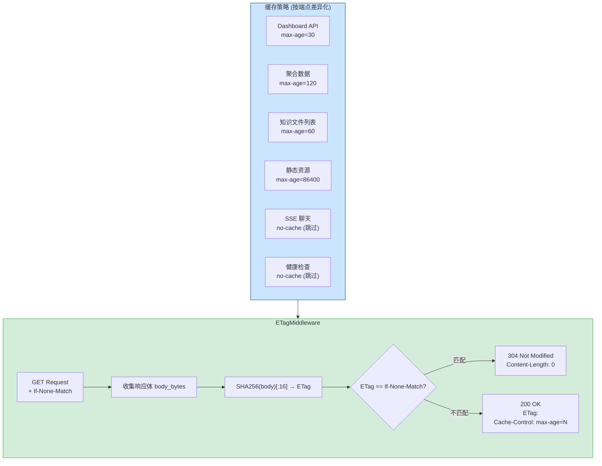
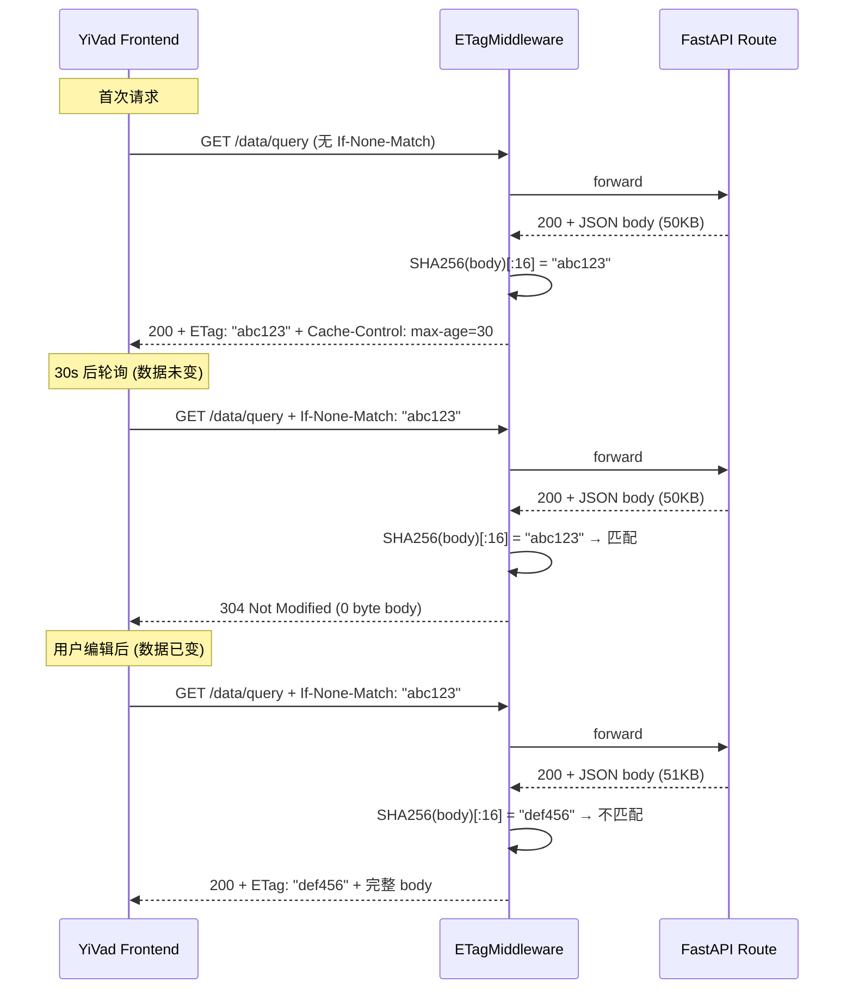

---

doc_type: module
prd_task_id: "YA-09-57"
title: "YA-09-57: ETag 缓存验证 — 304 响应 + 条件请求 + Cache-Control — 开发方案"
status: 需求已编写
priority: P2
owner: 陈铭
roles: [engineer]
created: 2026-09-11
updated: 2026-09-23
project: YiAi
project_id: yiai
prd_month: "202609"
estimate_frontend: 0.5
source_prd: "53-需求-ETag缓存验证.md"
source_okr: [yiai-001]

type: task
---

# YA-09-57: ETag 缓存验证 — 304 响应 + 条件请求 + 端点差异化策略 — 开发方案

> 来源 PRD：[53-需求-ETag缓存验证.md](../../prds/2026-09/53-需求-ETag缓存验证.md)
> 需求编号：YA-09-57 · 优先级：P2 · 人天：0.5d
> 类型：架构 · 状态：需求已编写

---

## 一、架构概述 (Architecture Mermaid)

YiVad Dashboard 每 10s 轮询聚合数据，数据 95% 的时间未变化但仍全量传输 50KB。为 GET 端点添加 ETag（响应体 SHA256 哈希）支持——客户端携带 `If-None-Match`，数据未变化时返回 304 Not Modified（0 byte body），消除 95% 的不必要传输。



### 缓存策略矩阵

| 端点路径 | max-age | ETag 算法 | 说明 |
|---------|---------|-----------|------|
| `data_service.query_documents` | 30s | SHA256(body)[:16] | 数据 30s 内可能变化 |
| `data_service.aggregate` | 120s | SHA256(body)[:16] | 聚合数据计算成本高 |
| `knowledge.list` | 60s | SHA256(body)[:16] | 文件列表变化较慢 |
| `knowledge.get_file` | 300s | SHA256(body)[:16] | 文件内容变化极慢 |
| `/read-file` | 3600s | SHA256(body)[:16] | 文件读取 |
| `/health/live`, `/health/ready` | no-cache | — | 实时状态 |
| SSE: `chat_service.chat` | no-cache | — | text/event-stream 跳过 |

---

## 二、文件清单 (File Manifest)

| # | 文件 | 操作 | 说明 | 预估行数 |
|---|------|------|------|----------|
| 1 | `src/shared/middleware/etag.py` | 新增 | `ETagMiddleware`：SHA256 哈希 + 策略匹配 + 304 | +90 |
| 2 | `src/app.py` | 修改 | 注册 ETagMiddleware 到管道 (CACHING 优先级) | +5 |
| 3 | `tests/test_etag.py` | 新增 | 304/内容变更/策略差异/SSE 排除/缓存清理 | +60 |
| **合计** | | | | **~155 行** |

---

## 三、Python 核心签名 (Python Signatures)

```python
# src/shared/middleware/etag.py
import hashlib, time, logging
from typing import Optional
from starlette.middleware.base import BaseHTTPMiddleware
from starlette.requests import Request
from starlette.responses import Response

logger = logging.getLogger("YiAi.ETag")

# 按端点差异化的缓存策略
CACHE_POLICIES: dict[str, dict] = {
    "/data/query":     {"max_age": 30,   "algorithm": "sha256"},
    "/data/aggregate": {"max_age": 120,  "algorithm": "sha256"},
    "/knowledge/list": {"max_age": 60,   "algorithm": "sha256"},
    "/knowledge/detail": {"max_age": 300, "algorithm": "sha256"},
    "/read-file":      {"max_age": 3600, "algorithm": "sha256"},
    "/health":         {"no_cache": True},
    "/chat":           {"no_cache": True},
}
DEFAULT_POLICY: dict = {"max_age": 30, "algorithm": "sha256"}
SKIP_CONTENT_TYPES: frozenset[str] = frozenset({"text/event-stream", "application/octet-stream"})

class ETagMiddleware(BaseHTTPMiddleware):
    """ETag 缓存验证中间件——基于响应体哈希的 304 Not Modified 优化。

    仅对 GET 请求和 200 响应生效。流式 (text/event-stream) 和二进制响应自动跳过。
    端点差异化策略: 不同路径不同 max-age。ETag 计算有 5min 缓存避免重复计算。
    """

    def __init__(self, app):
        super().__init__(app)
        self._cache: dict[str, tuple[str, float]] = {}
        self._cache_ttl: float = 300.0
        self._max_cache_entries: int = 1000

    async def dispatch(self, request: Request, call_next) -> Response:
        if request.method != "GET":
            return await call_next(request)

        policy = self._get_policy(request.url.path)
        if policy.get("no_cache"):
            response = await call_next(request)
            response.headers["Cache-Control"] = "no-cache"
            return response

        response = await call_next(request)
        if response.status_code != 200 or not self._is_etagable(response):
            return response

        # 收集响应体
        body = b""
        async for chunk in response.body_iterator:
            body += chunk

        etag = self._compute_etag(body, policy["algorithm"])
        cache_key = f"{request.method}:{request.url.path}:{request.url.query}"

        # 从缓存读取 ETag (避免重复 SHA256)
        cached, _ = self._cache.get(cache_key, (None, 0))
        if cached is None:
            self._cache[cache_key] = (etag, time.time())
            self._evict_if_needed()

        # 检查 If-None-Match
        if_none_match = request.headers.get("If-None-Match", "").strip('"')
        if if_none_match == etag:
            logger.debug(f"[ETag] 304 {request.url.path}")
            return Response(status_code=304, headers={
                "ETag": f'"{etag}"',
                "Cache-Control": f"max-age={policy['max_age']}",
                "Vary": "Accept-Encoding",
            })

        return Response(content=body, status_code=200, media_type=response.media_type, headers={
            **{k: v for k, v in response.headers.items() if k.lower() != "content-length"},
            "ETag": f'"{etag}"',
            "Cache-Control": f"max-age={policy['max_age']}",
            "Vary": "Accept-Encoding",
        })

    def _compute_etag(self, body: bytes, algorithm: str) -> str:
        if algorithm == "sha256":
            return hashlib.sha256(body).hexdigest()[:16]
        return hashlib.md5(body).hexdigest()[:12]

    def _is_etagable(self, response: Response) -> bool:
        ct = response.headers.get("content-type", "")
        for skip in SKIP_CONTENT_TYPES:
            if ct.startswith(skip):
                return False
        return True

    def _get_policy(self, path: str) -> dict:
        for prefix, policy in CACHE_POLICIES.items():
            if path.startswith(prefix):
                return policy
        return DEFAULT_POLICY

    def _evict_if_needed(self):
        if len(self._cache) > self._max_cache_entries:
            oldest = sorted(self._cache.items(), key=lambda x: x[1][1])[:100]
            for k, _ in oldest:
                del self._cache[k]

    def invalidate(self, path_prefix: str):
        """写操作后主动清除相关 ETag 缓存。"""
        to_remove = [k for k in self._cache if path_prefix in k]
        for k in to_remove:
            del self._cache[k]
        if to_remove:
            logger.debug(f"[ETag] 缓存失效 {len(to_remove)} 条目: {path_prefix}")
```

---

## 四、数据流 (Data Flow)



### 带宽节省

| 场景 | 改造前 | 改造后 (95% 304) | 节省 |
|------|--------|------------------|------|
| Dashboard 100 次轮询 | 5MB | 250KB | 95% |
| 文件列表 50 次刷新 | 2MB | 100KB | 95% |
| 首次请求 | 50KB | 50KB + 50B 头 | ~0% |

---

## 五、实施路线图 (Roadmap)

| 步骤 | 任务 | 产出 | 验证方式 | 人天 |
|------|------|------|---------|------|
| 1 | `ETagMiddleware` + SHA256 哈希 + 304 逻辑 | 中间件可用 | curl 验证 ETag 头 + 304 响应 | 0.1 |
| 2 | 端点差异化策略 (CACHE_POLICIES) + no-cache 排除 | 策略生效 | 不同端点不同 max-age | 0.1 |
| 3 | ETag 5min 缓存 + 写操作主动失效 | 避免重复计算 | 写操作后清除相关缓存 | 0.1 |
| 4 | SSE/二进制 Content-Type 排除 | SSE 不受影响 | POST /chat 无 ETag 干预 | 0.1 |
| 5 | 测试 (304/内容变更/策略/排空/并发) | 测试通过 | pytest 8+ 场景 | 0.1 |

**合计：0.5d。**

---

## 六、Review 检查清单 (Review Checklist)

- [ ] ETag 基于响应体 SHA256 哈希 (前 16 位)
- [ ] 304 响应 Content-Length: 0，仅含 ETag 和 Cache-Control 头
- [ ] 仅 GET 请求应用 ETag (POST/PUT/DELETE 跳过)
- [ ] `text/event-stream` (SSE) 和 `application/octet-stream` 自动跳过
- [ ] 端点差异化策略：聚合 120s、查询 30s、文件 3600s
- [ ] 健康检查端点 `no-cache`
- [ ] ETag 计算有 5min LRU 缓存 (避免大响应体重复 SHA256)
- [ ] 写操作后调用 `invalidate()` 清除相关 ETag 缓存
- [ ] 响应头包含 `Vary: Accept-Encoding`
- [ ] 中间件注册在 CACHING 优先级 (500)

---

## 七、技术风险表 (Risk Table)

| 风险 | 概率 | 影响 | 缓解措施 |
|------|------|------|---------|
| ETag 缓存导致数据变化后仍返回 304 | 中 | 中 | 5min 缓存窗口可调；写操作主动失效 |
| SHA256 大响应体 (>500KB) 延迟增加 | 低 | 低 | 5min ETag 缓存；后续请求优于首次 |
| 304 响应被代理缓存导致过期 | 低 | 中 | `max-age` 限制缓存时间 |
| SSE 流被意外应用 ETag 导致流中断 | 低 | 高 | `text/event-stream` 显式跳过 + 集成测试 |

---

## 八、关联模块

- 关联: [YA-09-47 响应压缩优化](./47-prd-task-响应压缩优化.md)
- 关联: [YA-09-108 缓存层设计](./108-prd-task-缓存层设计.md)
- 关联: [YA-09-116 缓存强一致性](./116-prd-task-缓存强一致性.md)