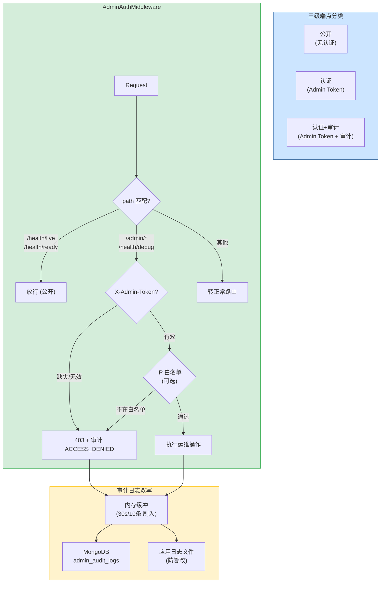
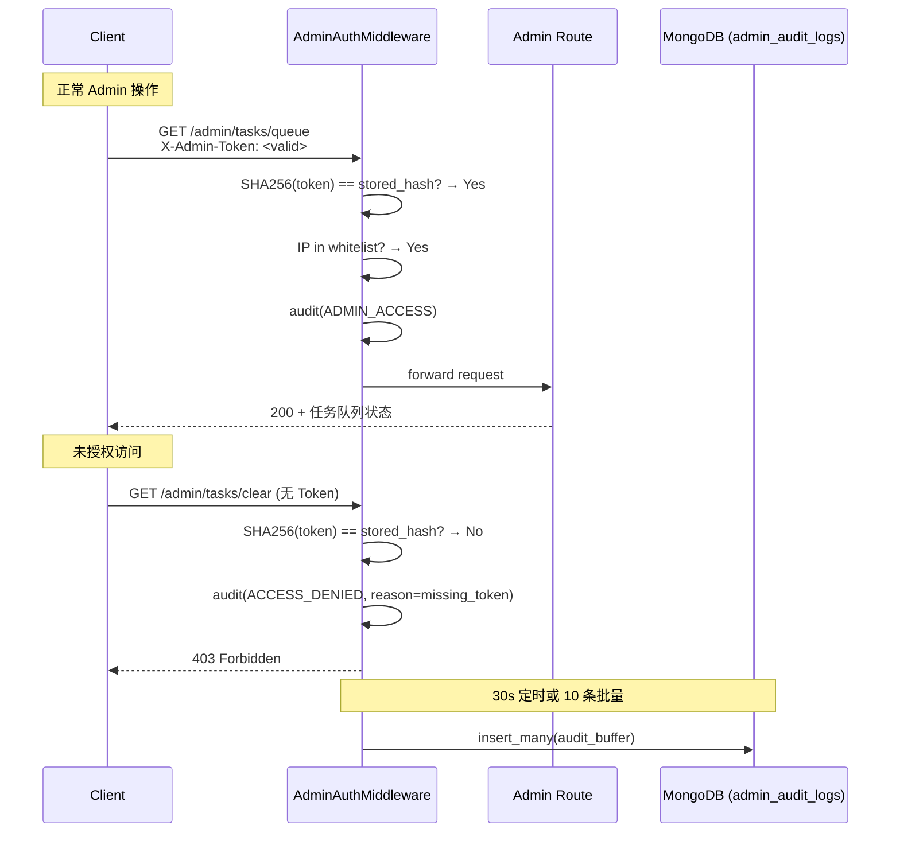

---

doc_type: module
prd_task_id: "YA-09-53"
title: "YA-09-53: Admin API 安全加固 — 独立 Token + IP 白名单 + 审计日志 — 开发方案"
status: 需求已编写
priority: P2
owner: 陈铭
roles: [engineer]
created: 2026-09-11
updated: 2026-09-23
project: YiAi
project_id: yiai
prd_month: "202609"
estimate_frontend: 1.0
source_prd: "54-需求-AdminAPI安全加固.md"
source_okr: [yiai-001]

type: task
---

# YA-09-53: Admin API 安全加固 — 独立 Token + IP 白名单 + 分级审计 — 开发方案

> 来源 PRD：[54-需求-AdminAPI安全加固.md](../../prds/2026-09/54-需求-AdminAPI安全加固.md)
> 需求编号：YA-09-53 · 优先级：P2 · 人天：1.0d
> 类型：安全 · 状态：需求已编写

---

## 一、架构概述 (Architecture Mermaid)

当前所有运维端点 (`/admin/*`、`/health/debug`) 无任何访问控制——任何能访问 `localhost:10086` 的客户端均可触发 CPU Profiling、查看内存/连接池详情、清空任务队列。将端点分为三级：公开（健康检查）、认证（状态查询）、认证+审计（破坏性操作），使用独立 `X-Admin-Token` + 可选 IP 白名单 + 审计日志双写。



### 端点分级

| 端点 | 等级 | Token | 审计 | 限流 |
|------|------|-------|------|------|
| `/health/live`, `/health/ready` | 公开 | 无 | 无 | 无 |
| `/health/debug`, `/admin/profile/hotspots` | 认证 | Admin | 记录访问 | 10/min |
| `/admin/tasks/clear`, `/admin/profile/start` | 认证+审计 | Admin | 完整审计 | 3/min |
| `/admin/config/drift` | 认证 | Admin | 记录访问 | 5/min |
| 其他 `/admin/*` | 认证 | Admin | 记录访问 | 10/min |

---

## 二、文件清单 (File Manifest)

| # | 文件 | 操作 | 说明 | 预估行数 |
|---|------|------|------|----------|
| 1 | `src/shared/middleware/admin_auth.py` | 新增 | `AdminAuthMiddleware`：Token 验证 + IP 白名单 + 分级审计 + 审计缓冲 | +120 |
| 2 | `src/app.py` | 修改 | 注册中间件到管道 (SECURITY 优先级) | +5 |
| 3 | `config.yaml` | 修改 | `admin_auth` 配置段 (token / ip_whitelist / rate_limit) | +10 |
| 4 | `tests/test_admin_auth.py` | 新增 | Token/IP/审计/公开端点/时序攻击/分级测试 | +80 |
| **合计** | | | | **~215 行** |

---

## 三、Python 核心签名 (Python Signatures)

```python
# src/shared/middleware/admin_auth.py
import os, hashlib, secrets, time, logging, ipaddress
from typing import Optional
from dataclasses import dataclass, field
from motor.motor_asyncio import AsyncIOMotorDatabase

logger = logging.getLogger("YiAi.AdminAuth")

# 公开端点白名单——K8s 探针必须保持公开
PUBLIC_PATHS: frozenset[str] = frozenset({"/health/live", "/health/ready"})
# Admin 端点前缀——需要认证
ADMIN_PREFIXES: tuple[str, ...] = ("/admin/", "/health/debug")
# 危险操作——需要完整审计
AUDIT_PATHS: frozenset[str] = frozenset({
    "/admin/tasks/clear", "/admin/profile/start",
})

@dataclass
class AuditEntry:
    """审计日志条目。"""
    action: str           # "ADMIN_ACCESS" | "ACCESS_DENIED" | "DANGEROUS_OP"
    path: str
    method: str
    client_ip: str
    reason: Optional[str] = None
    timestamp: float = field(default_factory=time.time)

class AdminAuthMiddleware:
    """Admin API 认证中间件——三级防护 (公开/认证/审计)。

    - 公开端点: /health/live, /health/ready (无认证)
    - 认证端点: 需要 X-Admin-Token Header (SHA-256 + 恒定时间比较)
    - 审计端点: 认证 + 完整操作审计记录
    - IP 白名单: 可选，仅允许内网 IP 段
    - 审计双写: MongoDB 结构化 + 应用日志文件
    """

    def __init__(self, db: AsyncIOMotorDatabase, admin_token: Optional[str] = None):
        self._db = db
        self._token = admin_token or os.environ.get("YIAI_ADMIN_TOKEN", secrets.token_hex(32))
        self._token_hash = hashlib.sha256(self._token.encode()).hexdigest()
        self._ip_whitelist: list[str] = [
            ip for ip in os.environ.get("ADMIN_IP_WHITELIST", "").split(",") if ip
        ]
        self._audit_buffer: list[AuditEntry] = []
        self._flush_interval = 30
        self._flush_batch = 10
        if not os.environ.get("YIAI_ADMIN_TOKEN"):
            logger.info(f"[AdminAuth] 未设置 YIAI_ADMIN_TOKEN，自动生成: {self._token[:8]}...")

    def authenticate(self, request) -> Optional[str]:
        """验证 Admin Token。返回 None 表示通过，返回错误消息表示拒绝。"""
        path = request.url.path
        if path in PUBLIC_PATHS:
            return None
        if not any(path.startswith(p) for p in ADMIN_PREFIXES):
            return None

        token = request.headers.get("X-Admin-Token")
        client_ip = request.client.host if request.client else "unknown"

        if not token:
            self._audit(AuditEntry(action="ACCESS_DENIED", path=path, method=request.method,
                                   client_ip=client_ip, reason="missing_token"))
            return "missing_token"

        token_hash = hashlib.sha256(token.encode()).hexdigest()
        if not secrets.compare_digest(token_hash, self._token_hash):
            self._audit(AuditEntry(action="ACCESS_DENIED", path=path, method=request.method,
                                   client_ip=client_ip, reason="invalid_token"))
            return "invalid_token"

        if self._ip_whitelist:
            try:
                ip = ipaddress.ip_address(client_ip)
                if not any(ip in ipaddress.ip_network(net) for net in self._ip_whitelist):
                    self._audit(AuditEntry(action="ACCESS_DENIED", path=path, method=request.method,
                                           client_ip=client_ip, reason="ip_not_whitelisted"))
                    return "ip_not_whitelisted"
            except ValueError:
                return "invalid_ip"

        action = "DANGEROUS_OP" if path in AUDIT_PATHS else "ADMIN_ACCESS"
        self._audit(AuditEntry(action=action, path=path, method=request.method, client_ip=client_ip))
        return None

    def _audit(self, entry: AuditEntry):
        self._audit_buffer.append(entry)
        level = logging.WARNING if entry.action in ("ACCESS_DENIED", "DANGEROUS_OP") else logging.INFO
        logger.log(level, f"[AdminAudit] {entry.action} {entry.method} {entry.path} from {entry.client_ip}")
        if len(self._audit_buffer) >= self._flush_batch:
            asyncio.ensure_future(self._flush())

    async def _flush(self):
        if not self._audit_buffer:
            return
        batch = self._audit_buffer[:]
        self._audit_buffer = []
        try:
            await self._db.admin_audit_logs.insert_many([
                {"action": e.action, "path": e.path, "method": e.method,
                 "client_ip": e.client_ip, "reason": e.reason, "timestamp": e.timestamp}
                for e in batch
            ])
        except Exception as exc:
            logger.error(f"[AdminAudit] 日志刷入失败: {exc}")
            self._audit_buffer = batch + self._audit_buffer

    async def get_audit_logs(self, limit: int = 100) -> list[dict]:
        cursor = self._db.admin_audit_logs.find().sort("timestamp", -1).limit(limit)
        return await cursor.to_list(limit)
```

---

## 四、数据流 (Data Flow)



---

## 五、实施路线图 (Roadmap)

| 步骤 | 任务 | 产出 | 验证方式 | 人天 |
|------|------|------|---------|------|
| 1 | `AdminAuthMiddleware` + Token 验证 + SHA256 + `secrets.compare_digest` | 认证可用 | 无 Token → 403, 有效 Token → 放行 | 0.2 |
| 2 | IP 白名单验证 (CIDR 网段匹配) | IP 过滤 | 非白名单 IP → 403 | 0.1 |
| 3 | 三级分级: PUBLIC/AUTH/DANGEROUS + 审计缓冲区 | 分级生效 | `/admin/tasks/clear` → DANGEROUS_OP 审计 | 0.2 |
| 4 | 审计双写 (内存缓冲 → MongoDB + 日志) + 定时刷入 | 审计持久化 | 30s 后 MongoDB 有记录 | 0.2 |
| 5 | 环境变量配置 + 启动自生成 Token + 测试 | 可部署 | pytest 8+ 场景 | 0.3 |

**合计：1.0d。**

---

## 六、Review 检查清单 (Review Checklist)

- [ ] Admin Token 通过环境变量注入，不硬编码；未设置时自动生成 (仅 dev)
- [ ] Token 使用 SHA-256 哈希存储，`secrets.compare_digest` 恒定时间比较
- [ ] 公开端点 (`/health/live`, `/health/ready`) 白名单保持公开
- [ ] 三级分级: PUBLIC / ADMIN_ACCESS / DANGEROUS_OP
- [ ] 危险操作 (`/admin/tasks/clear`, `/admin/profile/start`) 标记为 DANGEROUS_OP
- [ ] 未授权尝试记录 ACCESS_DENIED 事件 + 原因
- [ ] IP 白名单 (CIDR 格式) 可选启用
- [ ] 审计日志双写: 内存缓冲 (30s/10条) → MongoDB + 应用日志文件
- [ ] 审计日志不可通过 API 删除 (MongoDB 集合 + 文件系统权限保护)
- [ ] 中间件在管道中 SECURITY 优先级 (100)，位于 CORS 之后
- [ ] 测试: 公开/认证/拒绝/IP/审计刷入/时序攻击

---

## 七、技术风险表 (Risk Table)

| 风险 | 概率 | 影响 | 缓解措施 |
|------|------|------|---------|
| Token 泄露 (环境变量) | 中 | 高 | SHA-256 哈希存储；支持轮换 (重启生效) |
| 健康检查被误拦截 | 低 | 高 | PUBLIC_PATHS 白名单 + K8s 探针集成测试 |
| 审计日志缓冲溢出导致内存泄漏 | 低 | 中 | 最大缓冲区 1000 条；后台定期刷入 |
| Token 暴力破解 | 低 | 低 | 恒定时间比较 + Admin 端点限流 (10/min) |
| 管理员忘记 Token | 中 | 低 | 启动时打印 Token 前 8 位 (仅 dev) |

---

## 八、关联模块

- 依赖: [YA-09-09 审计日志](./09-prd-task-审计日志.md)
- 关联: [YA-09-16 API 限流与并发控制](./16-prd-task-API限流与并发控制.md)
- 关联: [YA-09-43 敏感信息加密](./43-prd-task-敏感信息加密.md)