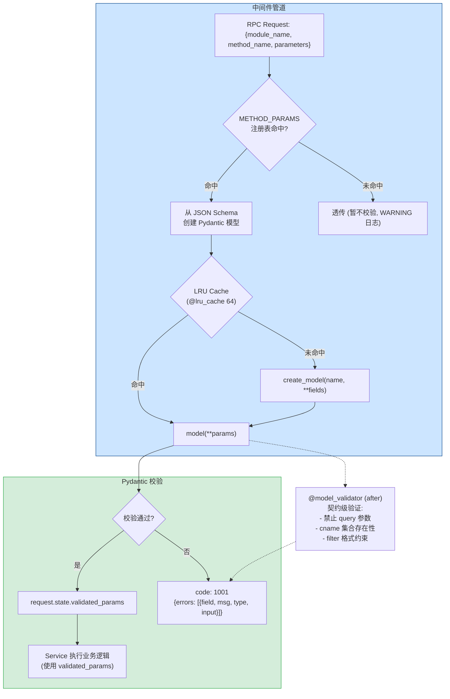
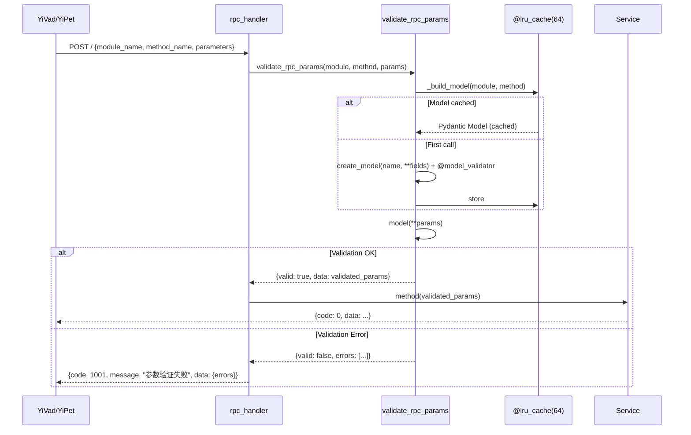

---

doc_type: module
prd_task_id: "YA-09-101"
title: "YA-09-101: Pydantic 参数校验增强 — RPC 参数模型 + 契约检测 + 友好错误 — 开发方案"
status: 需求已编写
priority: P2
owner: 陈铭
roles: [engineer]
created: 2026-09-11
updated: 2026-09-23
project: YiAi
project_id: yiai
prd_month: "202609"
estimate_frontend: 0.5
source_prd: "55-需求-Pydantic参数校验.md"
source_okr: [yiai-002]

type: task
---

# YA-09-101: Pydantic 参数校验增强 — RPC 参数模型 + 契约验证器 — 开发方案

> 来源 PRD：[55-需求-Pydantic参数校验.md](../../prds/2026-09/55-需求-Pydantic参数校验.md)
> 需求编号：YA-09-101 · 优先级：P2 · 人天：0.5d
> 类型：架构 · 状态：需求已编写

---

## 一、架构概述 (Architecture Mermaid)

RPC 方法的 `parameters` 当前是自由 `dict`，无类型校验——参数名错误（如 `query` 而非 `filter`）静默失败，历史上已导致至少 3 次前端传参 bug。为每个 RPC 方法定义 Pydantic model，在 RPC 调度前自动校验类型/范围/参数名契约，失败返回 `code: 1001` + 字段级错误详情。



### 类型转换策略

| 类型 | 策略 | 示例 |
|------|------|------|
| `int` / `float` | 宽松 (自动 str→int) | `"100"` → `100` |
| `bool` | 宽松 (自动 "true"→True) | `"true"` → `True` |
| `enum` | 严格 (精确匹配) | `"bugs"` ≠ `"Bugs"` |
| `datetime` | 严格 (ISO 8601) | `"2026-09-11T10:00:00Z"` |

---

## 二、文件清单 (File Manifest)

| # | 文件 | 操作 | 说明 | 预估行数 |
|---|------|------|------|----------|
| 1 | `src/shared/validation/__init__.py` | 新增 | `METHOD_PARAMS` 注册表 + `validate_rpc_params()` | +20 |
| 2 | `src/shared/validation/models.py` | 新增 | 各 RPC 方法的 Pydantic models + 自定义 validator | +100 |
| 3 | `src/server/rpc_handler.py` | 修改 | 调度前调用 `validate_rpc_params()` | +10 |
| 4 | `src/services/database/data_service.py` | 修改 | 移除手动 if/else 校验，使用 `request.state.validated_params` | -30 |
| 5 | `tests/test_validation.py` | 新增 | 参数名纠错/类型/枚举/范围/缓存/契约检查测试 | +70 |
| **合计** | | | | **~230 行** |

---

## 三、Python 核心签名 (Python Signatures)

```python
# src/shared/validation/__init__.py
from functools import lru_cache
from pydantic import BaseModel, Field, ValidationError, create_model
from typing import Optional, Any

_TYPE_MAP = {
    "string": str, "integer": int, "number": float,
    "boolean": bool, "object": dict, "array": list, "null": type(None),
}

@lru_cache(maxsize=64)
def _build_model(module_name: str, method_name: str) -> Optional[type[BaseModel]]:
    """从 METHOD_PARAMS 注册表构建 Pydantic 模型 (带 LRU 缓存)。"""
    key = f"{module_name}.{method_name}"
    schema = METHOD_PARAMS.get(key)
    if not schema:
        return None
    if isinstance(schema, type) and issubclass(schema, BaseModel):
        return schema  # 已定义好的模型
    # 从 dict schema 动态构建
    fields = {}
    for prop, defn in schema.get("properties", {}).items():
        py_type = _TYPE_MAP.get(defn.get("type", "string"), str)
        kwargs = {"description": defn.get("description", "")}
        if "minimum" in defn: kwargs["ge"] = defn["minimum"]
        if "maximum" in defn: kwargs["le"] = defn["maximum"]
        required = prop in schema.get("required", [])
        fields[prop] = (py_type, Field(**kwargs)) if required else (Optional[py_type], Field(default=None, **kwargs))
    return create_model(method_name.replace(".", "_"), **fields)


def validate_rpc_params(module_name: str, method_name: str, params: dict) -> dict:
    """校验 RPC 参数——返回 {valid: bool, data: dict|None, errors: list}。"""
    model = _build_model(module_name, method_name)
    if model is None:
        return {"valid": True, "data": params, "errors": []}  # 未注册，透传
    try:
        validated = model(**params)
        return {"valid": True, "data": validated.model_dump(), "errors": []}
    except ValidationError as e:
        return {
            "valid": False, "data": None,
            "errors": [{
                "field": ".".join(str(loc) for loc in err["loc"]),
                "msg": err["msg"], "type": err["type"],
                "input": str(err.get("input", ""))[:100],
            } for err in e.errors()],
        }


# src/shared/validation/models.py
from pydantic import BaseModel, Field, model_validator
from typing import Optional

class QueryDocumentsParams(BaseModel):
    """data_service.query_documents 参数模型。

    注意: filter 而非 query——历史上 query 参数名错误导致静默失败。
    """
    cname: str = Field(..., min_length=1, max_length=50, pattern=r'^[a-z_]+$',
                       description="集合名称，如 bugs/sessions/projects")
    filter: dict = Field(default_factory=dict, description="MongoDB 查询过滤条件")
    pageSize: int = Field(default=20, ge=1, le=500, description="每页数量 (1-500)")
    pageNum: int = Field(default=1, ge=1, description="页码 (从 1 开始)")
    sort: Optional[dict] = Field(default=None, description="排序规则")

    @model_validator(mode="after")
    def _check_contract(self):
        """契约级参数校验——防止历史上导致 bug 的参数名错误。"""
        f = self.filter or {}
        if isinstance(f, dict) and "query" in f:
            raise ValueError("请使用 'filter' 而非 'query'——参考 RPC 参数名契约")
        return self

class CreateDocumentParams(BaseModel):
    cname: str = Field(..., min_length=1, max_length=50)
    document: dict = Field(..., min_properties=1, description="文档内容 (至少 1 个字段)")

class ChatParams(BaseModel):
    message: str = Field(..., min_length=1, max_length=32000, description="对话消息")
    session_key: Optional[str] = Field(default=None, description="会话标识")
    model: str = Field(default="llama3", description="模型名称")

class RunAgentParams(BaseModel):
    task: str = Field(..., min_length=1, max_length=10000, description="Agent 任务描述")
    max_iterations: int = Field(default=10, ge=1, le=50, description="最大迭代次数 (1-50)")
    tools: Optional[list[str]] = Field(default=None, description="启用的工具列表")


# 注册表: module_name.method_name → Pydantic Model
METHOD_PARAMS: dict[str, type[BaseModel]] = {
    "services.database.data_service.query_documents": QueryDocumentsParams,
    "services.database.data_service.create_document": CreateDocumentParams,
    "services.ai.chat_service.chat": ChatParams,
    "services.ai.agent_service.run_agent": RunAgentParams,
}
```

---

## 四、数据流 (Data Flow)



---

## 五、实施路线图 (Roadmap)

| 步骤 | 任务 | 产出 | 验证方式 | 人天 |
|------|------|------|---------|------|
| 1 | `METHOD_PARAMS` 注册表 + `_build_model` + `validate_rpc_params` | 校验层可用 | 传入非法参数 → 返回 code: 1001 | 0.1 |
| 2 | Pydantic models 定义 (query_documents/create/chat/agent) + @model_validator | 类型校验生效 | `pageSize: "100"` → 自动转 int=100 | 0.1 |
| 3 | @model_validator 参数名契约检查 (`filter` vs `query`) | 契约警告生效 | `parameters.query` → 明确错误提示 | 0.1 |
| 4 | 集成到 RPC 调度 (rpc_handler) + 移除 data_service 手动校验 | 代码简化 | 原有测试仍通过 | 0.1 |
| 5 | 测试 (类型/范围/枚举/契约/缓存/未注册/错误格式) | 测试通过 | pytest 10+ 场景 | 0.1 |

**合计：0.5d。**

---

## 六、Review 检查清单 (Review Checklist)

- [ ] 所有注册的 RPC 方法均有 Pydantic model 定义
- [ ] 校验失败返回 `code: 1001` + 字段级 `errors` 数组 (兼容 RPC 信封)
- [ ] `@model_validator(after)` 覆盖参数名契约检查 (`filter` vs `query`)
- [ ] 可选字段标注 `Optional`，避免误判为必填
- [ ] Pydantic 模型使用 `@lru_cache(maxsize=64)` 缓存
- [ ] 数字/布尔启用自动类型转换 (`str→int`, `str→bool`)
- [ ] 枚举字段严格校验 (不自动转换大小写)
- [ ] 未注册模块透传 + WARNING 日志 (不阻断)
- [ ] 错误信息不包含堆栈跟踪 (防止信息泄露)
- [ ] 校验中间件在 VALIDATION 优先级 (300)

---

## 七、技术风险表 (Risk Table)

| 风险 | 概率 | 影响 | 缓解措施 |
|------|------|------|---------|
| 新增可选字段被误判为必填 | 中 | 中 | `Optional` 标注 + CI 检查 model 定义 |
| 缓存模型与实际 Schema 不同步 | 低 | 低 | 开发阶段重启服务清除 LRU；可加主动清除端点 |
| 校验过严导致合法请求被拒 | 中 | 中 | 宽松类型转换 (str→int)；未注册方法透传 |
| @lru_cache 线程安全问题 | 低 | 中 | `lru_cache` 在 async event loop 中线程安全 (读取) |
| Pydantic v2 API 迁移 | 低 | 低 | 锁定 `Pydantic>=2.0` |

---

## 八、关联模块

- 依赖: [YA-09-14 RPC 契约测试与类型同步](./14-prd-task-RPC契约测试与类型同步.md)
- 关联: [YA-09-08 API 契约校验](./08-prd-task-API契约校验.md)
- 关联: [YA-09-99 中间件管道编排](./56-prd-task-中间件管道编排.md)