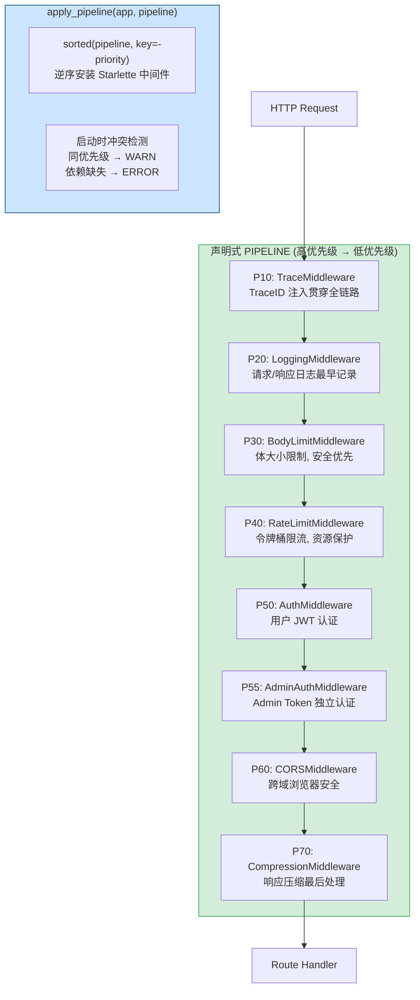

---

doc_type: module
prd_task_id: "YA-09-99"
title: "YA-09-99: 中间件管道编排 — 声明式顺序 + 优先级 + 冲突检测 — 开发方案"
status: 需求已编写
priority: P2
owner: 陈铭
roles: [engineer]
created: 2026-09-11
updated: 2026-09-23
project: YiAi
project_id: yiai
prd_month: "202609"
estimate_frontend: 0.5
source_prd: "56-需求-中间件管道编排.md"
source_okr: [yiai-001]

type: task
---

# YA-09-99: 中间件管道编排 — 声明式顺序 + 优先级 + 冲突检测 — 开发方案

> 来源 PRD：[56-需求-中间件管道编排.md](../../prds/2026-09/56-需求-中间件管道编排.md)
> 需求编号：YA-09-99 · 优先级：P2 · 人天：0.5d
> 类型：架构 · 状态：需求已编写

---

## 一、架构概述 (Architecture Mermaid)

FastAPI 中间件按 `add_middleware` 的**逆序**执行——Starlette 实现细节导致最先添加的中间件在最外层。手动维护 `add_middleware` 顺序极易出错（如 Auth 在 CORS 之后、Compression 在 Trace 之前）。通过声明式 `MiddlewareDef` + 优先级编排 + 启动时冲突检测，确保执行顺序符合预期。



### 中间件执行顺序 (请求入站方向)

| 优先级 | 中间件 | 职责 | 插在之前的原因 |
|--------|--------|------|-------------|
| 10 | TraceMiddleware | TraceID 注入 | 最外层, 贯穿全链路 |
| 20 | LoggingMiddleware | 请求/响应日志 | 尽早记录, 中间件错误也能捕获 |
| 30 | BodyLimitMiddleware | 请求体大小限制 | 安全优先于业务逻辑 |
| 40 | RateLimitMiddleware | 令牌桶限流 | 资源保护优先于认证 |
| 50 | AuthMiddleware | 用户 JWT 认证 | 身份验证 |
| 55 | AdminAuthMiddleware | Admin Token 认证 | 与用户 JWT 并行 |
| 60 | CORSMiddleware | CORS 头处理 | 浏览器安全 |
| 70 | CompressionMiddleware | 响应压缩 | 最后处理响应体 |

---

## 二、文件清单 (File Manifest)

| # | 文件 | 操作 | 说明 | 预估行数 |
|---|------|------|------|----------|
| 1 | `src/shared/middleware/pipeline.py` | 新增 | `MiddlewareDef` + `apply_pipeline()` + 冲突检测 | +60 |
| 2 | `src/app.py` | 修改 | 用 `apply_pipeline()` 替代逐个 `add_middleware` | +15 |
| 3 | `tests/middleware/test_pipeline.py` | 新增 | 顺序验证/冲突检测/优先级测试 | +50 |
| **合计** | | | | **~125 行** |

---

## 三、Python 核心签名 (Python Signatures)

```python
# src/shared/middleware/pipeline.py
from dataclasses import dataclass, field
from typing import Any, Optional
import logging

logger = logging.getLogger(__name__)

@dataclass
class MiddlewareDef:
    """中间件声明定义。"""
    cls: type                             # 中间件类
    priority: int                         # 优先级 (数值越低越外层, 越先执行)
    kwargs: dict[str, Any] = field(default_factory=dict)  # 构造参数
    name: Optional[str] = None            # 可读名称 (默认 cls.__name__)
    requires: Optional[list[str]] = None  # 依赖的其他中间件 name

    def __post_init__(self):
        if self.name is None:
            self.name = self.cls.__name__

# 全局中间件管道定义
PIPELINE: list[MiddlewareDef] = [
    MiddlewareDef(TraceMiddleware, 10),
    MiddlewareDef(LoggingMiddleware, 20),
    MiddlewareDef(BodyLimitMiddleware, 30),
    MiddlewareDef(RateLimitMiddleware, 40),
    MiddlewareDef(AuthMiddleware, 50),
    MiddlewareDef(AdminAuthMiddleware, 55),
    MiddlewareDef(CORSMiddleware, 60, kwargs={"allow_origins": [...]}),
    MiddlewareDef(CompressionMiddleware, 70),
]

def apply_pipeline(app, pipeline: list[MiddlewareDef]) -> None:
    """将声明式管道应用到 FastAPI app。

    Starlette 中间件按 add_middleware 逆序执行:
      最先 add 的中间件 → 最外层 (请求最先经过, 响应最后离开)
      最后 add 的中间件 → 最内层

    因此按 priority 降序 add:
      P70 (Compress) 最先 add → 最外层先经过 Trace/Logging → 最后压缩
    """
    _validate_pipeline(pipeline)

    for mw_def in sorted(pipeline, key=lambda m: -m.priority):
        logger.info(f"[Pipeline] Registering: {mw_def.name} (priority={mw_def.priority})")
        app.add_middleware(mw_def.cls, **mw_def.kwargs)

def _validate_pipeline(pipeline: list[MiddlewareDef]) -> None:
    """启动时校验: 重复优先级 / 依赖关系。"""
    priorities: dict[int, list[str]] = {}
    names = set()

    for mw_def in pipeline:
        # 重复名称检测
        if mw_def.name in names:
            raise ValueError(f"Duplicate middleware name: {mw_def.name}")
        names.add(mw_def.name)

        # 同优先级告警
        priorities.setdefault(mw_def.priority, []).append(mw_def.name)

        # 依赖检测
        if mw_def.requires:
            missing = set(mw_def.requires) - names
            if missing:
                raise ValueError(
                    f"Middleware '{mw_def.name}' requires {missing} — "
                    f"but they are not registered before it"
                )

    # 同优先级 WARN (不阻止启动)
    for pri, mw_names in priorities.items():
        if len(mw_names) > 1:
            logger.warning(
                f"[Pipeline] Priority {pri} has multiple middlewares: {mw_names}"
                f" — order is undefined between them"
            )
```

---

## 四、实施路线图 (Roadmap)

| 步骤 | 任务 | 产出 | 验证方式 | 人天 |
|------|------|------|---------|------|
| 1 | `MiddlewareDef` dataclass + `apply_pipeline()` | 声明式管道可用 | `apply_pipeline(app, PIPELINE)` 启动无异常 | 0.1 |
| 2 | 冲突检测: 重复优先级 + 依赖检查 | 启动时捕获错误 | 模拟重复/缺失依赖 → 启动失败 | 0.1 |
| 3 | 迁移现有中间件到 `PIPELINE` 列表 | 使用声明式 | diff 对比: 删掉旧 `add_middleware` 行 | 0.15 |
| 4 | 测试: 顺序验证 (中间件执行顺序 mock) | 顺序正确 | Request → TraceID → Log → Auth → CORS → Compress | 0.15 |

**合计：0.5d。**

---

## 五、技术风险表 (Risk Table)

| 风险 | 概率 | 影响 | 缓解措施 |
|------|------|------|---------|
| 中间件顺序错误导致 Auth 绕过 | 中 | 高 | 冲突检测 + 集成测试验证顺序 |
| Starlette 逆序安装逻辑遗漏 | 低 | 中 | 文档化 `sorted(-priority)` 原因 |
| 新增中间件忘记加 `PIPELINE` | 中 | 低 | Code Review 检查 + CLAUDE.md 说明 |

---

## 六、Review 检查清单 (Review Checklist)

- [ ] 优先级数值无重复 (或已确认 WARN 可接受)
- [ ] Auth 优先级在 CORS 之前 (50 < 60)
- [ ] Compression 优先级最高 (70 = 最内层)
- [ ] TraceID 优先级最低 (10 = 最外层)
- [ ] 依赖关系 `requires` 已检查
- [ ] `_validate_pipeline()` 在 `apply_pipeline()` 开头调用

---

## 七、关联模块

- 基础: [YA-09-30 API 网关](./30-prd-task-API网关.md)
- 关联: [YA-09-113 全链路 TraceID 透传](./113-prd-task-全链路TraceID透传.md)
- 关联: [YA-09-128 请求生命周期事件](./128-prd-task-请求生命周期事件.md)