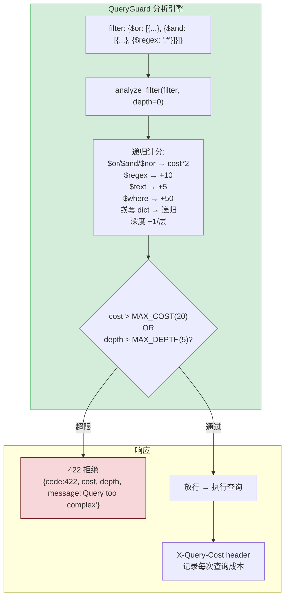
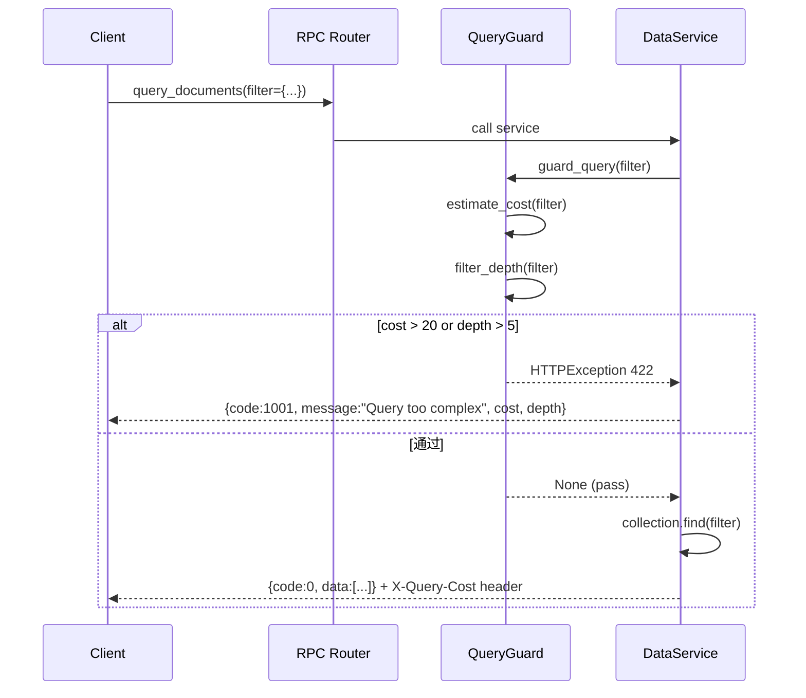

---

doc_type: module
prd_task_id: "YA-09-107"
title: "YA-09-107: 查询复杂度限制 — filter 深度/广度 + 成本评分 — 开发方案"
status: 需求已编写
priority: P2
owner: 陈铭
roles: [engineer]
created: 2026-09-11
updated: 2026-09-23
project: YiAi
project_id: yiai
prd_month: "202609"
estimate_frontend: 0.5
source_prd: "57-需求-查询复杂度限制.md"
source_okr: [yiai-001]

type: task
---

# YA-09-107: 查询复杂度限制 — filter 深度/广度 + 成本评分 — 开发方案

> 来源 PRD：[57-需求-查询复杂度限制.md](../../prds/2026-09/57-需求-查询复杂度限制.md)
> 需求编号：YA-09-107 · 优先级：P2 · 人天：0.5d
> 类型：安全 · 状态：需求已编写

---

## 一、架构概述 (Architecture Mermaid)

RPC `query_documents` 的 `filter` 参数无复杂度限制——`$regex` 全表扫描、深层嵌套 `$or/$and`、恶意 `$where` 可导致 DoS 攻击。递归分析 filter 结构计算成本分数，超限拒绝并返回友好提示。



### 操作符成本表

| 操作符 | 成本分 | 原因 |
|--------|--------|------|
| `$where` | 50 | 高危: 执行任意 JS |
| `$regex` | 10 | 无索引可用全表扫描 |
| `$text` | 5 | MongoDB 文本搜索 |
| `$or/$and/$nor` | 子项成本 x2 | 多分支查询 |
| `$in` (>100 元素) | 5 | 大数组匹配 |
| `$elemMatch` | 3 | 嵌套数组 |
| 普通字段 | 1 | 基本过滤 |

---

## 二、文件清单 (File Manifest)

| # | 文件 | 操作 | 说明 | 预估行数 |
|---|------|------|------|----------|
| 1 | `src/shared/query_guard.py` | 新增 | `QueryGuard`: 成本估算 + 深度检测 + X-Query-Cost | +70 |
| 2 | `src/services/database/data_service.py` | 修改 | 查询前调用 `guard_query()` | +12 |
| 3 | `tests/test_query_guard.py` | 新增 | 各种 filter 复杂度/边界/恶意测试 | +60 |
| **合计** | | | | **~142 行** |

---

## 三、Python 核心签名 (Python Signatures)

```python
# src/shared/query_guard.py
from typing import Union, Optional
from fastapi import HTTPException
import logging

logger = logging.getLogger(__name__)

MAX_COST: int = 20
MAX_DEPTH: int = 5

# 操作符成本映射
OPERATOR_COST: dict[str, int] = {
    "$where": 50,       # 高危 JS 执行
    "$regex": 10,       # 全表扫描
    "$text": 5,         # 文本搜索
    "$in": 5,           # 大数组匹配 (仅 >100 元素时)
    "$elemMatch": 3,    # 嵌套数组查询
    "$geoWithin": 5,    # 地理空间
    "$near": 5,         # 地理空间
}

def estimate_cost(filter_obj: Union[dict, list], depth: int = 0) -> int:
    """递归计算 filter 的查询成本。

    成本规则:
      - 普通字段 → +1
      - $or/$and/$nor → 子项成本总和 × 2
      - 危险操作符 → 查表 OPERATOR_COST
      - 嵌套 dict → 递归
      - 深度每层 +1
    """
    cost = 0
    if isinstance(filter_obj, list):
        for item in filter_obj:
            cost += estimate_cost(item, depth)
        return cost

    if not isinstance(filter_obj, dict):
        return 1

    for key, value in filter_obj.items():
        if key in ("$or", "$and", "$nor"):
            if isinstance(value, list):
                cost += sum(estimate_cost(sub, depth + 1) for sub in value) * 2
        elif key in OPERATOR_COST:
            cost += OPERATOR_COST[key]
        elif isinstance(value, dict):
            cost += estimate_cost(value, depth)
        elif isinstance(value, list):
            cost += estimate_cost(value, depth)
        else:
            cost += 1
    return cost

def filter_depth(filter_obj: Union[dict, list], current: int = 0) -> int:
    """递归计算 filter 的最大嵌套深度。"""
    if not isinstance(filter_obj, (dict, list)):
        return current

    max_d = current
    items = filter_obj.items() if isinstance(filter_obj, dict) else enumerate(filter_obj)

    for _, value in items:
        if isinstance(value, (dict, list)):
            d = filter_depth(value, current + 1)
            max_d = max(max_d, d)
    return max_d

def guard_query(filter_obj: dict) -> None:
    """查询守卫 — 超限抛出 HTTPException 422。"""
    cost = estimate_cost(filter_obj)
    depth = filter_depth(filter_obj)

    if cost > MAX_COST or depth > MAX_DEPTH:
        raise HTTPException(
            status_code=422,
            detail={
                "code": 1001,
                "message": f"Query too complex (cost={cost}/{MAX_COST}, depth={depth}/{MAX_DEPTH}). "
                           f"Please simplify your filter conditions.",
                "cost": cost,
                "depth": depth,
                "max_cost": MAX_COST,
                "max_depth": MAX_DEPTH,
            },
        )
```

### 成本计算示例

```python
# 简单查询 → cost=3
guard_query({"name": "test", "status": "active"})

# 带 $or 的查询 → cost=5
guard_query({"$or": [{"status": "a"}, {"status": "b"}]})

# 深层 $regex 嵌套 → cost=24 (超限)
guard_query({
    "$or": [
        {"$and": [{"field1": {"$regex": ".*"}}, {"field2": {"$regex": ".*"}}]},
        {"$and": [{"field3": {"$regex": ".*"}}, {"field4": {"$regex": ".*"}}]}
    ]
})  # → 422 拒绝
```

---

## 四、数据流 (Data Flow)



---

## 五、实施路线图 (Roadmap)

| 步骤 | 任务 | 产出 | 验证方式 | 人天 |
|------|------|------|---------|------|
| 1 | `estimate_cost()` + `filter_depth()` 递归实现 | 成本计算可用 | 已知 filter 的手动验证 cost 值 | 0.1 |
| 2 | `guard_query()` 集成到 `data_service.query_documents` | 查询前校验 | 正常查询通过, 恶意查询拒绝 | 0.1 |
| 3 | `X-Query-Cost` 响应头 + Prometheus 指标 `yiai_query_cost` | 可观测 | curl -I → 显示 X-Query-Cost | 0.1 |
| 4 | 测试: 正常/边界/恶意嵌套/批量/$where 攻击 | 全覆盖 | pytest 全部通过 | 0.2 |

**合计：0.5d。**

---

## 六、Review 检查清单 (Review Checklist)

- [ ] `$where` 成本 = 50，几乎肯定触发拒绝
- [ ] `$regex` 成本 = 10，两个 $regex + $or = 超限
- [ ] 递归有深度限制（通过 `filter_depth` 计数）
- [ ] 空 filter `{}` 返回 cost=0 不拒绝
- [ ] `guard_query` 在数据服务查询前调用（RPC 层）
- [ ] 错误消息包含 cost/max_cost/depth/max_depth 数值

---

## 七、技术风险表 (Risk Table)

| 风险 | 概率 | 影响 | 缓解措施 |
|------|------|------|---------|
| MAX_COST=20 误杀正常复杂查询 | 中 | 中 | config.yaml 可配置阈值; 按 collection 差异化 |
| 任意 json 嵌套导致递归栈溢出 | 低 | 高 | `filter_depth` 加 MAX_DEPTH 限制 |
| 成本模型与实际 MongoDB 执行计划不符 | 中 | 低 | 定期对比 explain() 的 millis 与 cost 分数 |

---

## 八、关联模块

- 基础: [YA-09-15 数据访问层查询优化](./21-prd-task-数据访问层查询优化.md)
- 关联: [YA-09-50 请求体大小限制](./50-prd-task-请求体大小限制.md)
- 关联: [YA-09-81 慢查询索引建议](./81-prd-task-慢查询索引建议.md)