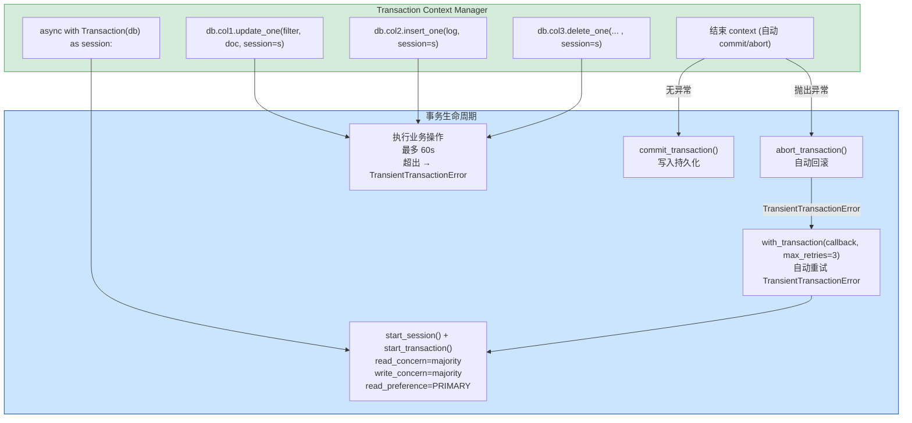
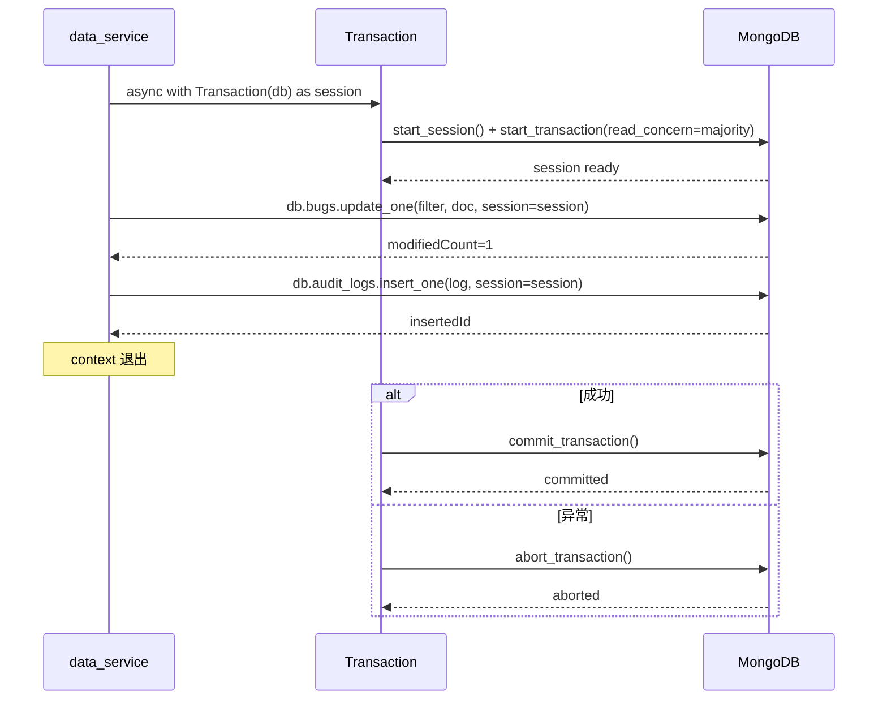

---

doc_type: module
prd_task_id: "YA-09-42"
title: "YA-09-42: MongoDB 事务支持 — 多文档 ACID + with_transaction + 重试 — 开发方案"
status: 需求已编写
priority: P2
owner: 陈铭
roles: [engineer]
created: 2026-09-11
updated: 2026-09-23
project: YiAi
project_id: yiai
prd_month: "202609"
estimate_frontend: 1.5
source_prd: "58-需求-MongoDB事务支持.md"
source_okr: [yiai-001]

type: task
---

# YA-09-42: MongoDB 事务支持 — 多文档 ACID + with_transaction + 重试 — 开发方案

> 来源 PRD：[58-需求-MongoDB事务支持.md](../../prds/2026-09/58-需求-MongoDB事务支持.md)
> 需求编号：YA-09-42 · 优先级：P2 · 人天：1.5d
> 类型：架构 · 状态：需求已编写

---

## 一、架构概述 (Architecture Mermaid)

MongoDB 4.0+ 支持多文档事务（需 Replica Set）。封装 Motor `ClientSession` + `with_transaction()` 为 async context manager，实现多集合原子写入 + 自动重试 + 超时控制。适用场景：Bug 转移（更新 bugs + 插入 audit_logs）、用户创建（users + user_profiles）、RAG 索引更新（knowledge_files + 重建向量索引）。



### 事务约束

| 约束 | 值 | 说明 |
|------|-----|------|
| Replica Set 必需 | 运行 `rs.initiate()` | 单节点 mongod 不支持事务 |
| 超时 | 60s (`maxTransactionLockRequestTimeoutMillis`) | 长事务自动 abort |
| 性能影响 | +15-20% 延迟 | 事务中每个操作需等待 majority ack |
| 跨库 | 不支持 | 仅限同一数据库 |
| 跨集合 | 支持 | 同一 Replica Set 内任意集合 |

---

## 二、文件清单 (File Manifest)

| # | 文件 | 操作 | 说明 | 预估行数 |
|---|------|------|------|----------|
| 1 | `src/domain/data/transaction.py` | 新增 | `Transaction` context manager + `run_transaction()` | +80 |
| 2 | `src/domain/data/repository.py` | 修改 | 关键方法添加 `session: Optional[ClientSession]` 参数 | +30 |
| 3 | `src/services/data/data_service.py` | 修改 | Bug 转移/用户创建使用事务 | +40 |
| 4 | `tests/test_transaction.py` | 新增 | 事务提交/回滚/并发/重试/Replica Set 降级测试 | +90 |
| **合计** | | | | **~240 行** |

---

## 三、Python 核心签名 (Python Signatures)

```python
# src/domain/data/transaction.py
import logging
from typing import Optional, TypeVar, Callable, Awaitable
from motor.motor_asyncio import AsyncIOMotorClientSession, AsyncIOMotorDatabase
from pymongo.read_concern import ReadConcern
from pymongo.write_concern import WriteConcern
from pymongo.read_preferences import ReadPreference
from pymongo.errors import ConnectionFailure, OperationFailure

logger = logging.getLogger(__name__)
T = TypeVar("T")

class Transaction:
    """MongoDB async 事务 context manager。

    用法:
      async with Transaction(db) as session:
          await db.col1.update_one(..., session=session)
          await db.col2.insert_one(..., session=session)
      # context 退出时自动 commit 或 abort
    """

    def __init__(
        self,
        db: AsyncIOMotorDatabase,
        timeout_ms: int = 60_000,
    ) -> None:
        self._db = db
        self._timeout_ms = timeout_ms
        self._session: Optional[AsyncIOMotorClientSession] = None

    async def __aenter__(self) -> AsyncIOMotorClientSession:
        self._session = await self._db.client.start_session()
        self._session.start_transaction(
            read_concern=ReadConcern("majority"),
            write_concern=WriteConcern("majority"),
            read_preference=ReadPreference.PRIMARY,
            max_commit_time_ms=self._timeout_ms,
        )
        return self._session

    async def __aexit__(self, exc_type, exc_val, exc_tb) -> bool:
        if not self._session:
            return False

        try:
            if exc_type is not None:
                await self._session.abort_transaction()
                logger.warning(f"[Transaction] Aborted: {exc_val}")
            else:
                await self._session.commit_transaction()
        except OperationFailure as e:
            if e.has_error_label("TransientTransactionError"):
                logger.warning(f"[Transaction] Transient error (retryable): {e}")
            raise
        finally:
            # Motor session 超时自动结束，无需显式 end_session
            pass
        return False


async def run_transaction(
    db: AsyncIOMotorDatabase,
    callback: Callable[[AsyncIOMotorClientSession], Awaitable[T]],
    max_retries: int = 3,
) -> T:
    """执行带自动重试的事务。

    对 TransientTransactionError (写冲突/网络抖动) 自动重试。
    """
    for attempt in range(max_retries):
        try:
            async with Transaction(db) as session:
                return await callback(session)
        except (ConnectionFailure, OperationFailure) as e:
            if attempt == max_retries - 1:
                raise
            if isinstance(e, OperationFailure) and e.has_error_label("TransientTransactionError"):
                delay = 0.5 * (2 ** attempt)
                logger.info(f"[Transaction] Retry {attempt+1}/{max_retries} after {delay}s")
                await asyncio.sleep(delay)
            else:
                raise


# 业务示例: Bug 所有权转移 (需事务保证一致性)
async def transfer_bug_ownership(
    bug_id: str, from_user: str, to_user: str
) -> None:
    async def _do_transfer(session):
        # 1. 更新 Bug 所有者
        result = await db.bugs.update_one(
            {"key": bug_id},
            {"$set": {"owner": to_user}},
            session=session,
        )
        if result.matched_count == 0:
            raise ValueError(f"Bug {bug_id} not found")

        # 2. 写审计日志
        await db.audit_logs.insert_one({
            "action": "transfer_ownership",
            "bug_id": bug_id,
            "from": from_user,
            "to": to_user,
            "timestamp": datetime.utcnow(),
        }, session=session)
        return True

    return await run_transaction(db, _do_transfer)
```

---

## 四、数据流 (Data Flow)



---

## 五、实施路线图 (Roadmap)

| 步骤 | 任务 | 产出 | 验证方式 | 人天 |
|------|------|------|---------|------|
| 1 | `Transaction` context manager + read/write concern 配置 | 事务可用 | `async with Transaction(db)` 无异常 | 0.3 |
| 2 | `run_transaction()` 带自动重试 (TransientTransactionError) | 重试机制 | Mock 写冲突 → 自动重试 3 次 | 0.3 |
| 3 | 集成到 Bug 转移 + 用户创建业务 | 关键路径事务 | Bug 转移失败 → 审计日志不写入 | 0.3 |
| 4 | repository 层 `session` 参数支持 | 方法签名统一 | 所有写方法支持 `session=None` | 0.3 |
| 5 | 测试: 提交/回滚/并发冲突/Replica Set 降级 | 全覆盖 | pytest + testcontainers MongoDB Replica Set | 0.3 |

**合计：1.5d。**

---

## 六、Review 检查清单 (Review Checklist)

- [ ] Replica Set 环境检测: 单节点部署跳过事务测试
- [ ] `commit_transaction()` 异常也调用 `abort_transaction()`
- [ ] `session` 参数在 repository 方法中默认 None (不强制事务)
- [ ] 事务中超时 60s (`max_commit_time_ms`)
- [ ] `write_concern=majority` 确保多数节点确认
- [ ] `TransientTransactionError` 正确捕获并重试
- [ ] `ConnectionFailure` 重试而非静默降级

---

## 七、技术风险表 (Risk Table)

| 风险 | 概率 | 影响 | 缓解措施 |
|------|------|------|---------|
| 生产环境单节点 MongoDB 不支持事务 | 高 | 高 | 启动时检测 + 文档降级策略 |
| 事务超时导致请求失败 | 中 | 中 | 60s 超时 + 将长事务拆分为短事务 |
| `session` 未正确传递导致操作不在事务中 | 中 | 高 | Code Review 强制检查 session 参数传递 |
| 并发写冲突导致重试次数耗尽 | 低 | 中 | 3 次重试 + 指数退避 |

---

## 八、关联模块

- 基础: [YA-09-06 数据层](./06-prd-task-数据层.md)
- 关联: [YA-09-21 数据访问层查询优化](./21-prd-task-数据访问层查询优化.md)
- 关联: [YA-09-39 幂等写入保护](./39-prd-task-幂等写入保护.md)