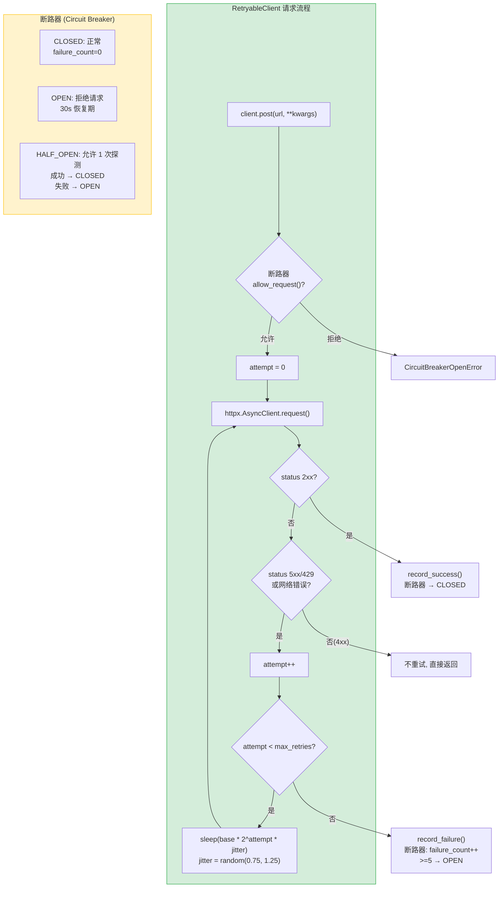

---

doc_type: module
prd_task_id: "YA-09-55"
title: "YA-09-55: HTTP 重试策略 — httpx 指数退避 + 断路器 + Jitter — 开发方案"
status: 需求已编写
priority: P2
owner: 陈铭
roles: [engineer]
created: 2026-09-11
updated: 2026-09-23
project: YiAi
project_id: yiai
prd_month: "202609"
estimate_frontend: 0.5
source_prd: "59-需求-HTTP重试策略.md"
source_okr: [yiai-001]

type: task
---

# YA-09-55: HTTP 重试策略 — httpx 指数退避 + 断路器 + Jitter — 开发方案

> 来源 PRD：[59-需求-HTTP重试策略.md](../../prds/2026-09/59-需求-HTTP重试策略.md)
> 需求编号：YA-09-55 · 优先级：P2 · 人天：0.5d
> 类型：架构 · 状态：需求已编写

---

## 一、架构概述 (Architecture Mermaid)

YiAi 对外部 HTTP 调用（Ollama、Jina Reader、DuckDuckGo）使用裸 `httpx.AsyncClient`，无重试逻辑——网络波动直接失败。封装带指数退避 + jitter + 半开断路器的 `RetryableClient`，提升外部调用的可靠性。



### 各目标重试配置

| 目标服务 | max_retries | base_delay | retry_on | timeout | 说明 |
|---------|-----------|-----------|---------|---------|------|
| Ollama API | 2 | 1s | 502/503/504 | 60s | LLM 推理可能超时 |
| Jina Reader | 3 | 2s | 5xx | 30s | 网页抓取 |
| DuckDuckGo | 2 | 0.5s | 429/5xx | 10s | 搜索 API 限流 |
| Webhook 推送 | 3 | 1s | 5xx | 10s | 外部集成 |

---

## 二、文件清单 (File Manifest)

| # | 文件 | 操作 | 说明 | 预估行数 |
|---|------|------|------|----------|
| 1 | `src/shared/http_client.py` | 新增 | `RetryableClient` + `CircuitBreaker` + 各目标工厂 | +120 |
| 2 | `src/domain/ai/tools/web_search.py` | 修改 | 使用 `get_duckduckgo_client()` | +5 |
| 3 | `src/domain/ai/tools/web_fetch.py` | 修改 | 使用 `get_jina_client()` | +5 |
| 4 | `tests/test_http_retry.py` | 新增 | 重试/断路器/超时/目标工厂测试 | +60 |
| **合计** | | | | **~190 行** |

---

## 三、Python 核心签名 (Python Signatures)

```python
# src/shared/http_client.py
import asyncio
import random
import time
import logging
import httpx
from typing import Optional

logger = logging.getLogger(__name__)

class CircuitBreaker:
    """半开断路器 — 失败计数达到阈值后拒绝请求。

    状态转换:
      CLOSED: failure_count < threshold → 允许请求
      OPEN: recovery_timeout 内 → 拒绝请求
      HALF_OPEN: 超时到期 → 允许 1 次探测
    """

    def __init__(self, failure_threshold: int = 5, recovery_timeout: float = 30.0):
        self._threshold = failure_threshold
        self._timeout = recovery_timeout
        self._failure_count: int = 0
        self._last_failure_time: float = 0.0
        self._state: str = "CLOSED"

    def allow_request(self) -> bool:
        """检查是否允许请求。"""
        if self._state == "CLOSED":
            return True
        if self._state == "OPEN":
            if time.monotonic() - self._last_failure_time > self._timeout:
                self._state = "HALF_OPEN"
                return True
            return False
        # HALF_OPEN: 允许 1 次探测
        return True

    def record_success(self) -> None:
        self._failure_count = 0
        self._state = "CLOSED"

    def record_failure(self) -> None:
        self._failure_count += 1
        self._last_failure_time = time.monotonic()
        if self._failure_count >= self._threshold:
            self._state = "OPEN"
            logger.warning("[CircuitBreaker] OPEN — blocking requests for %ds", self._timeout)


class RetryExhaustedError(Exception):
    pass

class CircuitBreakerOpenError(Exception):
    pass


class RetryableClient:
    """带重试 + 断路器的 httpx 客户端。

    指数退避: delay = base_delay * 2^attempt * jitter(±25%)
    断路器: failure_count >= 5 → OPEN 30s
    """

    def __init__(
        self,
        max_retries: int = 3,
        base_delay: float = 1.0,
        retry_on: tuple[int, ...] = (500, 502, 503, 504),
        timeout: float = 30.0,
        circuit_threshold: int = 5,
        circuit_recovery: float = 30.0,
    ):
        self._client = httpx.AsyncClient(timeout=httpx.Timeout(timeout))
        self.max_retries = max_retries
        self.base_delay = base_delay
        self.retry_on = retry_on
        self._breaker = CircuitBreaker(circuit_threshold, circuit_recovery)

    async def post(self, url: str, **kwargs):
        return await self._request_with_retry("POST", url, **kwargs)

    async def get(self, url: str, **kwargs):
        return await self._request_with_retry("GET", url, **kwargs)

    async def _request_with_retry(self, method: str, url: str, **kwargs):
        if not self._breaker.allow_request():
            raise CircuitBreakerOpenError(f"Circuit breaker is OPEN: {url}")

        last_exc = None
        for attempt in range(self.max_retries + 1):
            try:
                resp = await self._client.request(method, url, **kwargs)
                if resp.status_code < 500 and resp.status_code not in self.retry_on:
                    self._breaker.record_success()
                    return resp
                raise httpx.HTTPStatusError(
                    f"{resp.status_code}", request=resp.request, response=resp
                )
            except (httpx.TimeoutException, httpx.ConnectError, httpx.HTTPStatusError) as e:
                last_exc = e
                if attempt < self.max_retries:
                    delay = self.base_delay * (2 ** attempt) * random.uniform(0.75, 1.25)
                    logger.warning(f"Retry {attempt+1}/{self.max_retries}: {url}, wait {delay:.1f}s")
                    await asyncio.sleep(delay)

        self._breaker.record_failure()
        raise RetryExhaustedError(f"All {self.max_retries+1} attempts failed: {url}") from last_exc

    async def close(self):
        await self._client.aclose()


# 各目标服务的工厂函数
def get_ollama_client() -> RetryableClient:
    return RetryableClient(max_retries=2, base_delay=1.0, timeout=60.0)

def get_jina_client() -> RetryableClient:
    return RetryableClient(max_retries=3, base_delay=2.0, timeout=30.0)

def get_duckduckgo_client() -> RetryableClient:
    return RetryableClient(max_retries=2, base_delay=0.5, retry_on=(429, 500, 502, 503), timeout=10.0)
```

---

## 四、实施路线图 (Roadmap)

| 步骤 | 任务 | 产出 | 验证方式 | 人天 |
|------|------|------|---------|------|
| 1 | `RetryableClient` + 指数退避 + jitter | 重试可用 | Mock HTTP 服务器返回 503 → 自动重试 3 次 | 0.15 |
| 2 | `CircuitBreaker` (CLOSED/OPEN/HALF_OPEN) | 断路器可用 | 模拟 5 次失败 → OPEN 状态拒绝请求 | 0.15 |
| 3 | 集成到 Ollama/Jina/DuckDuckGo + 工厂函数 | 外部调用可靠 | Web search 失败自动重试 | 0.1 |
| 4 | 测试: 重试/断路器/超时/4xx 不重试 | 全覆盖 | pytest + httpx mock | 0.1 |

**合计：0.5d。**

---

## 五、Review 检查清单 (Review Checklist)

- [ ] 4xx 状态码不重试 (客户端错误)
- [ ] 429 Too Many Requests 可重试 (DuckDuckGo 限流)
- [ ] Jitter ±25% 避免惊群效应
- [ ] 断路器 HALF_OPEN 仅允许 1 次探测
- [ ] 断路器 `record_failure` 后正确更新 `_failure_count`
- [ ] `RetryableClient` 支持 `.close()` 清理 httpx 连接
- [ ] 工厂函数返回预配置的客户端实例

---

## 六、技术风险表 (Risk Table)

| 风险 | 概率 | 影响 | 缓解措施 |
|------|------|------|---------|
| 断路器 OPEN 状态永久阻塞合法请求 | 低 | 高 | 30s recovery_timeout + HALF_OPEN 探测 |
| 重试 + jitter 累加导致请求超时 | 中 | 中 | total_timeout = (sum of retry delays) < 30s |
| httpx 连接池泄漏 (忘记 close) | 中 | 中 | 工厂函数管理生命周期 + FastAPI shutdown event close |

---

## 七、关联模块

- 基础: [YA-09-120 数据库查询重试策略](./120-prd-task-数据库查询重试策略.md)
- 关联: [YA-09-109 错误分类自动恢复](./109-prd-task-错误分类自动恢复.md)
- 关联: [YA-09-23 RSS 抓取调度优化](./23-prd-task-RSS抓取调度优化.md)