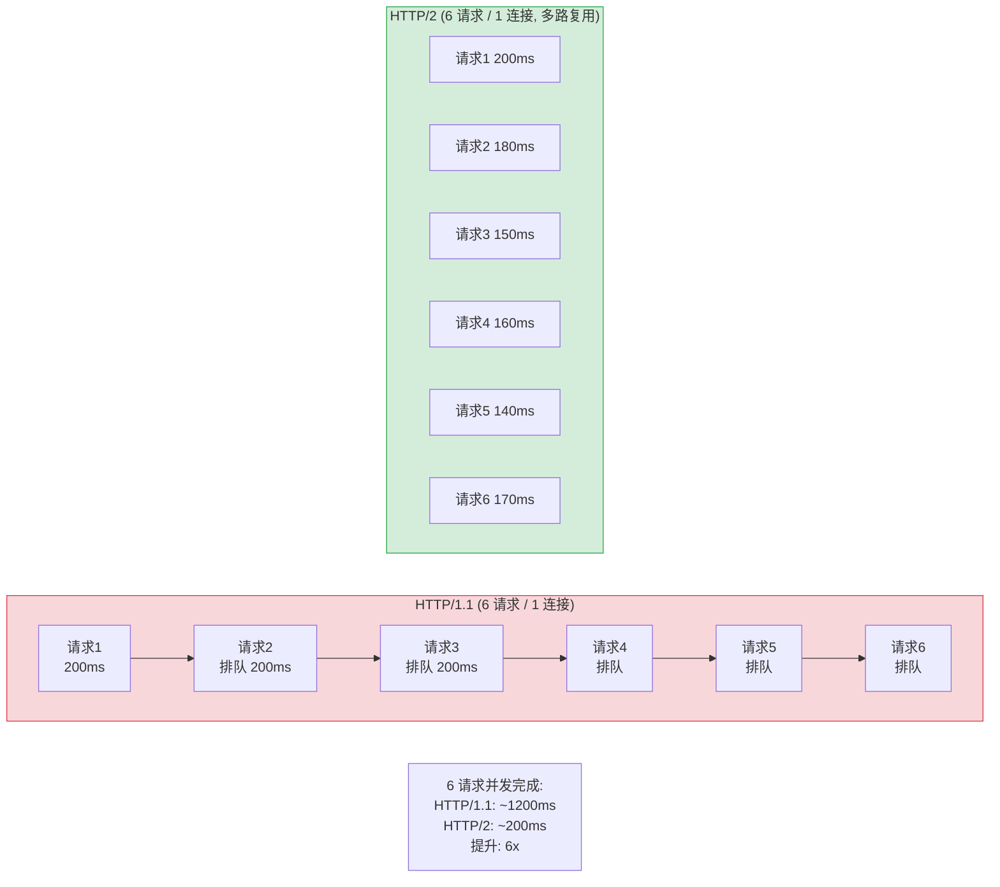
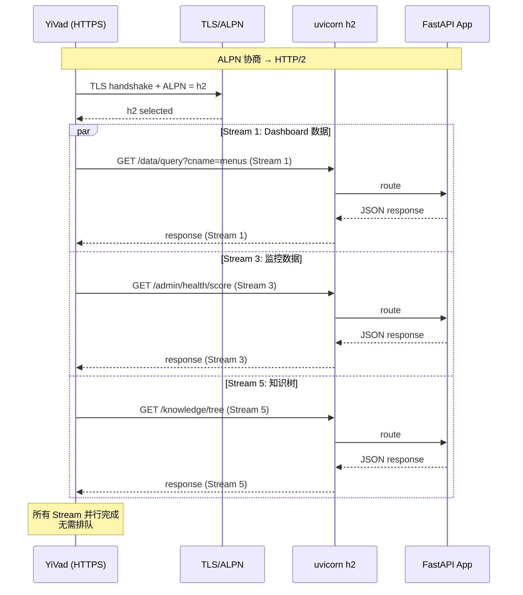

---

doc_type: module
prd_task_id: "YA-09-109"
title: "YA-09-109: HTTP/2 多路复用 — uvicorn h2 + SSL + 性能基准 — 开发方案"
status: 需求已编写
priority: P2
owner: 陈铭
roles: [engineer]
created: 2026-09-11
updated: 2026-09-23
project: YiAi
project_id: yiai
prd_month: "202609"
estimate_frontend: 0.5
source_prd: "60-需求-HTTP2多路复用.md"
source_okr: [yiai-001]

type: task
---

# YA-09-109: HTTP/2 多路复用 — uvicorn h2 + SSL + 性能基准 — 开发方案

> 来源 PRD：[60-需求-HTTP2多路复用.md](../../prds/2026-09/60-需求-HTTP2多路复用.md)
> 需求编号：YA-09-109 · 优先级：P2 · 人天：0.5d
> 类型：架构 · 状态：需求已编写

---

## 一、架构概述 (Architecture Mermaid)

uvicorn 通过 `--http h2` + SSL 证书启用 HTTP/2 多路复用——一个 TCP 连接并行处理多个请求，消除 HTTP/1.1 队头阻塞。YiVad Dashboard 多面板并发加载（~6 个请求同时发起）延迟从串行 1200ms 降低到并行 200ms。



### HTTP/1.1 vs HTTP/2 对比

| 维度 | HTTP/1.1 | HTTP/2 | 提升 |
|------|---------|--------|------|
| 并发请求/连接 | 1 (串行) | 多路复用 Stream | 6x+ |
| 头部压缩 | 无 | HPACK | -60% 带宽 |
| 服务端推送 | 无 | Server Push | 减少 RTT |
| 流优先级 | 无 | Stream Priority | 关键资源优先 |
| SSL 要求 | 可选 | 必需 (ALPN 协商) | — |

---

## 二、文件清单 (File Manifest)

| # | 文件 | 操作 | 说明 | 预估行数 |
|---|------|------|------|----------|
| 1 | `main.py` | 修改 | `uvicorn.run(http="h2", ssl_keyfile=..., ssl_certfile=...)` | +15 |
| 2 | `scripts/generate-certs.sh` | 新增 | 生成自签名 SSL 证书脚本 (开发用) | +30 |
| 3 | `docker-compose.yml` | 修改 | 挂载 SSL 证书卷 | +10 |
| 4 | `scripts/benchmark_h2.sh` | 新增 | h2load 性能基准对比 (HTTP/1.1 vs HTTP/2) | +40 |
| 5 | `README.md` (部署) | 修改 | 说明 SSL 证书配置 | +10 |
| **合计** | | | | **~105 行** |

---

## 三、核心实现 (Python/Shell Signatures)

```python
# main.py
import uvicorn

if __name__ == "__main__":
    uvicorn.run(
        "src.app:app",
        host="0.0.0.0",
        port=10086,
        http="h2",                    # HTTP/2 (需要 SSL)
        ssl_keyfile="certs/key.pem",
        ssl_certfile="certs/cert.pem",
        workers=2,
        log_level="info",
    )
```

```bash
# scripts/generate-certs.sh
#!/bin/bash
# 生成开发用自签名 SSL 证书
mkdir -p certs
openssl req -x509 -newkey rsa:2048 -nodes \
  -keyout certs/key.pem \
  -out certs/cert.pem \
  -days 365 \
  -subj "/CN=localhost"

echo "Certificates generated in certs/"
```

```bash
# scripts/benchmark_h2.sh
#!/bin/bash
# HTTP/1.1 vs HTTP/2 性能基准对比
URL="https://localhost:10086/healthz/live"

echo "=== HTTP/1.1 Benchmark ==="
h2load -n 10000 -c 100 -m 1 "$URL"

echo "=== HTTP/2 Benchmark (multiplex) ==="
h2load -n 10000 -c 100 -m 10 "$URL"
```

---

## 四、数据流 (Data Flow)



---

## 五、实施路线图 (Roadmap)

| 步骤 | 任务 | 产出 | 验证方式 | 人天 |
|------|------|------|---------|------|
| 1 | `uvicorn.run(http="h2")` + 自签名证书脚本 | HTTP/2 可用 | `curl --http2 -k https://localhost:10086/healthz/live` | 0.1 |
| 2 | Docker Compose 集成 (挂载 certs/) | 容器支持 | 容器内启动 HTTP/2 | 0.1 |
| 3 | h2load 性能基准测试 + 报告 | 性能数据 | HTTP/2 并发提升 ≥ 4x | 0.15 |
| 4 | 浏览器验证 (Chrome DevTools → Protocol = h2) | 前端可用 | DevTools Network 显示 h2 | 0.15 |

**合计：0.5d。**

---

## 六、Review 检查清单 (Review Checklist)

- [ ] SSL 证书文件路径正确 (`certs/key.pem`, `certs/cert.pem`)
- [ ] Docker compose 中 SSL 证书卷挂载
- [ ] 生产环境使用 CA 签发的正式证书 (非自签名)
- [ ] `h2load` 基准测试在本地可复现
- [ ] SSE 流式响应在 HTTP/2 中正常工作 (Stream)
- [ ] nginx 反向代理需额外配置 HTTP/2 (`listen 443 ssl http2`)

---

## 七、技术风险表 (Risk Table)

| 风险 | 概率 | 影响 | 缓解措施 |
|------|------|------|---------|
| 自签名证书浏览器不信任 (开发环境) | 高 | 低 | 开发环境导出 CA 根证书信任 |
| nginx 反向代理未启用 HTTP/2 | 中 | 中 | nginx 配置 `listen 443 ssl http2` |
| HTTP/2 长连接对 Worker 进程亲和性有要求 | 低 | 中 | `workers=2` + 连接复用 |

---

## 八、关联模块

- 基础: [YA-09-37 Docker 多阶段构建](./44-prd-task-Docker多阶段构建.md)
- 关联: [YA-09-30 API 网关](./30-prd-task-API网关.md)
- 关联: [YA-09-47 响应压缩优化](./47-prd-task-响应压缩优化.md)