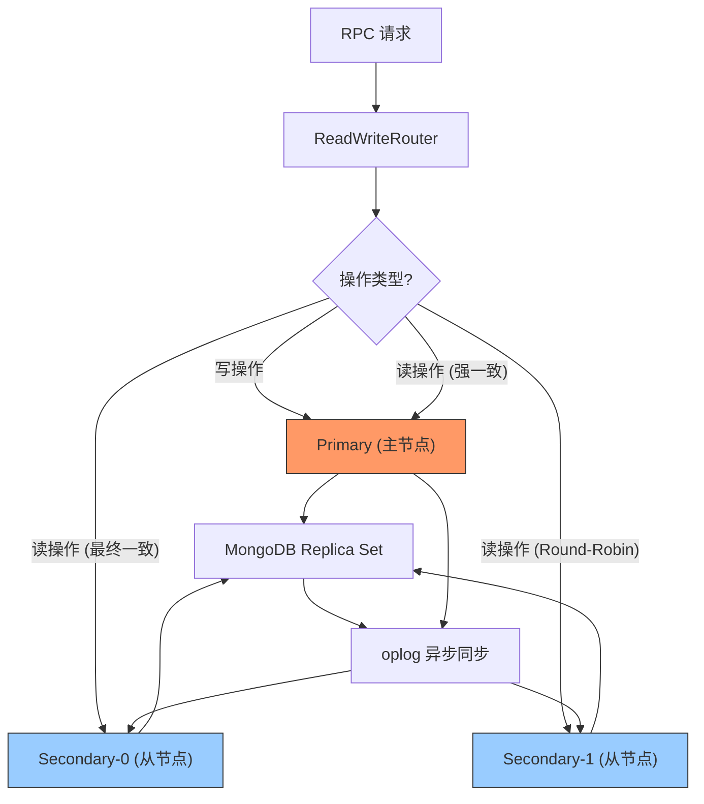

---

doc_type: module
prd_task_id: "YA-09-54"
title: "YA-09-54: 数据库读写分离 — 主从路由 + 读优先从库 — 开发方案"
status: 需求已编写
priority: P2
owner: 陈铭
roles: [engineer]
created: 2026-09-11
updated: 2026-09-23
project: YiAi
project_id: yiai
prd_month: "202609"
estimate_frontend: 1.0
source_prd: "61-需求-数据库读写分离.md"
source_okr: [yiai-001]

type: task
---

# YA-09-54: 数据库读写分离 — 主从路由 + 读优先从库 — 开发方案

> **文档职责**：本文档定义**怎么做、为什么这么做、实际做成什么样**（HOW），不含产品目标与测试用例。

> 来源 PRD：[61-需求-数据库读写分离.md](../../prds/2026-09/61-需求-数据库读写分离.md)
> 需求编号：YA-09-54 · 优先级：P2 · 人天：1.0d · 状态：需求已编写

---

<a id="sec-1"></a>
## 一、架构总览

当前 YiAi 所有数据库操作（读写占 85%）共享同一 MongoDB 实例，RAG 检索、全局搜索、Dashboard 等读密集型操作与 Agent 会话持久化、审计日志写入等写操作竞争 I/O 资源。通过 MongoDB Replica Set 的 Primary/Secondary 分离能力，将读操作路由到从节点，大幅减轻主节点压力。



**路由策略**：写操作强制 Primary，默认读操作 Secondary（最终一致），关键路径读（认证/会话加载）强制 Primary（强一致）。从节点间 Round-Robin 负载均衡。

---

<a id="sec-2"></a>
## 二、文件清单

| 文件 | 操作 | 说明 |
|------|------|------|
| `YiAi/src/domain/data/read_write_split.py` | 新增 | ReadWriteRouter + 操作分类表 + 健康检查 |
| `YiAi/src/domain/data/database.py` | 修改 | 使用 ReadWriteRouter 替代单一连接 |
| `YiAi/src/domain/data/repository.py` | 修改 | 注入路由决策到数据访问层 |
| `YiAi/.env.example` | 修改 | 添加 `MONGO_SECONDARY_URIS` 配置 |
| `YiAi/tests/test_read_write_split.py` | 新增 | 读写分离 6+ 场景测试 |

---

<a id="sec-3"></a>
## 三、模块设计

### 3.1 ReadWriteRouter

```python
# YiAi/src/domain/data/read_write_split.py
from motor.motor_asyncio import AsyncIOMotorClient, AsyncIOMotorDatabase
from pymongo.read_preference import ReadPreference
from typing import Optional

class ReadWriteRouter:
    """MongoDB 读写分离路由器。

    Primary（主节点）  → 写操作 + 强一致读
    Secondary（从节点）→ 最终一致读（Round-Robin）
    """

    def __init__(self, primary_uri: str, secondary_uris: list[str] = None): ...
    def get_write_db(self) -> AsyncIOMotorDatabase: ...
    def get_read_db(self, consistency: str = 'eventual') -> AsyncIOMotorDatabase: ...
    def get_read_preference(self, consistency: str) -> ReadPreference: ...
    async def health_check(self) -> dict: ...
    async def close(self): ...

# 操作分类表
WRITE_OPERATIONS = {
    'create_document', 'update_document', 'delete_document',
    'create_session', 'save_session', 'sync_knowledge_files',
    'create_user', 'update_user', 'delete_user',
}

STRONG_READ_OPERATIONS = {
    'verify_token', 'load_session', 'get_user_permissions',
    'get_document_detail',  # 详情页需要最新数据
}

class ReadWriteMiddleware:
    """读写分离中间件——在请求级别注入路由决策。"""

    def __init__(self, router: ReadWriteRouter): ...
    def route(self, operation: str) -> AsyncIOMotorDatabase:
        """根据操作名决定路由：
        - WRITE_OPERATIONS → Primary
        - STRONG_READ_OPERATIONS → Primary (强一致)
        - 其他 → Secondary (Round-Robin, 最终一致)
        """
```

### 3.2 路由规则

| 操作 | 路由 | 一致性 | 原因 |
|------|------|--------|------|
| `create_document/update_document/delete_document` | Primary | Strong | 写入必须持久化 |
| `query_documents` | Secondary | Eventual | 查询可容忍短暂延迟 |
| `rag.rag_query` | Secondary | Eventual | RAG 检索读密集 |
| `search.global_search` | Secondary | Eventual | 搜索可容忍延迟 |
| `agent.save_session` | Primary | Strong | 会话必须持久化 |
| `agent.load_session` | Primary | Strong | 关键路径 read-your-writes |
| `auth.verify_token` | Primary | Strong | 认证必须准确 |

### 3.3 降级策略

当 `secondary_uris` 为空或所有从节点不可用时，`get_read_db()` 自动降级返回 Primary，记录 WARNING 日志。从节点恢复后自动重连。

---

<a id="sec-4"></a>
## 四、数据流

```
RPC 请求
  → ReadWriteMiddleware.route(operation)
    → 写操作: ReadWriteRouter.get_write_db() → Primary 连接池
    → 强一致读: ReadWriteRouter.get_read_db(consistency='strong') → Primary 连接池
    → 最终一致读: ReadWriteRouter.get_read_db(consistency='eventual') → Secondary[i] Round-Robin
  → Motor 异步驱动执行 CRUD
  → 响应返回
```

**连接池配置**：Primary minPoolSize=5/maxPoolSize=50，每个 Secondary 独立连接池 minPoolSize=5/maxPoolSize=50。

---

<a id="sec-5"></a>
## 五、实施路线

| # | 步骤 | 产出 | 验证 | 人天 |
|---|------|------|------|------|
| 1 | 创建 ReadWriteRouter | `read_write_split.py` | 单元测试：路由逻辑正确 | 0.3 |
| 2 | 配置 MongoDB 副本集（开发环境） | 部署 | `rs.status()` 确认副本集正常 | 0.2 |
| 3 | 重构 database.py 使用 Router | `database.py` | 读写操作路由到不同节点 | 0.2 |
| 4 | 集成 ReadWriteMiddleware 到 repository | `repository.py` | 操作分类表覆盖所有 CRUD | 0.15 |
| 5 | 健康检查 + 降级逻辑 | `read_write_split.py` | `/health/debug` 查看主从状态 | 0.1 |
| 6 | 测试用例 | `tests/test_read_write_split.py` | 6+ 场景：路由/降级/Round-Robin/强一致 | 0.05 |

**合计：1.0d**

---

<a id="sec-6"></a>
## 六、代码审查检查清单

- [ ] 读操作默认路由到 Secondary（Round-Robin），写操作强制 Primary
- [ ] `load_session`、`verify_token` 等关键读操作强制读 Primary（read-your-writes）
- [ ] 从节点不可用时自动降级到 Primary（不抛异常）
- [ ] `WRITE_OPERATIONS` 和 `STRONG_READ_OPERATIONS` 集合完整覆盖所有操作
- [ ] 新增数据库操作时同步更新操作分类表
- [ ] 健康检查端点返回主从节点状态
- [ ] 单元测试覆盖：写路由/读路由/Round-Robin/强一致/降级/健康检查
- [ ] 日志记录路由决策（INFO 级别）、降级事件（WARNING 级别）

---

<a id="sec-7"></a>
## 七、风险评估

| 风险 | 概率 | 影响 | 缓解措施 |
|------|------|------|----------|
| 写后立即读读到旧数据（replication lag） | 中 | 高 | 关键路径强制 Primary |
| 所有 Secondary 不可用时读操作全部失败 | 低 | 高 | 自动降级到 Primary |
| 新操作未加入分类表导致路由错误 | 中 | 中 | CI 检查未知操作告警 |
| Round-Robin 在连接池层面不均匀 | 低 | 低 | 监控 Secondary 间负载分布 |
| 副本集配置错误导致启动失败 | 低 | 中 | 启动时健康检查 + 明确错误日志 |

**回滚**：移除 `MONGO_SECONDARY_URIS` 配置项，所有流量走 Primary 单一连接，恢复原有行为。