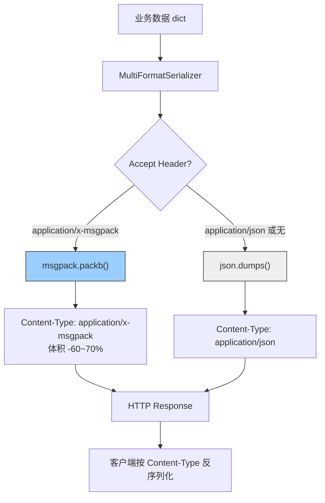

---

doc_type: module
prd_task_id: "YA-09-108"
title: "YA-09-108: 序列化协议优化 — MessagePack 替代 JSON — 开发方案"
status: 需求已编写
priority: P2
owner: 陈铭
roles: [engineer]
created: 2026-09-11
updated: 2026-09-23
project: YiAi
project_id: yiai
prd_month: "202609"
estimate_frontend: 0.5
source_prd: "62-需求-序列化协议优化.md"
source_okr: [yiai-001]

type: task
---

# YA-09-108: 序列化协议优化 — MessagePack 替代 JSON — 开发方案

> **文档职责**：本文档定义**怎么做、为什么这么做、实际做成什么样**（HOW），不含产品目标与测试用例。

> 来源 PRD：[62-需求-序列化协议优化.md](../../prds/2026-09/62-需求-序列化协议优化.md)
> 需求编号：YA-09-108 · 优先级：P2 · 人天：0.5d · 状态：需求已编写

---

<a id="sec-1"></a>
## 一、架构总览

YiAi 所有 RPC 响应当前使用 JSON 序列化，大响应场景（Dashboard 50KB、RAG 检索 30KB）存在体积膨胀和解析性能瓶颈。引入 MessagePack 作为可选二进制格式，通过 HTTP Accept Header 内容协商实现格式选择，保持对现有 JSON 客户端的完全向后兼容。



**关键决策**：选择 MessagePack 而非 Protobuf——同为 Schema-less 格式，与 JSON 一一对应零成本迁移。Protobuf 需要 .proto 定义和代码生成，对 YiAi 动态 RPC 响应过于重量级。

---

<a id="sec-2"></a>
## 二、文件清单

| 文件 | 操作 | 说明 |
|------|------|------|
| `YiAi/src/server/serializer.py` | 新增 | MultiFormatSerializer + 类型预处理 |
| `YiAi/src/server/main.py` | 修改 | RPC 路由集成多格式序列化 |
| `YiAi/requirements.txt` | 修改 | 添加 `msgpack>=1.0` 依赖 |
| `YiAi/tests/test_serializer.py` | 新增 | 格式协商 + 类型预处理测试 |

---

<a id="sec-3"></a>
## 三、模块设计

### 3.1 MultiFormatSerializer

```python
# YiAi/src/server/serializer.py
import json, msgpack
from typing import Optional, Any
from bson import ObjectId
from datetime import datetime, date

class MultiFormatSerializer:
    """多格式序列化——基于 Accept Header 自动选择。

    支持格式:
        - application/json（默认，向后兼容）
        - application/x-msgpack（二进制高效格式）
    """

    FORMATS = {
        'application/json': {'encoder': json.dumps, 'decoder': json.loads},
        'application/x-msgpack': {'encoder': msgpack.packb, 'decoder': msgpack.unpackb},
    }

    DEFAULT_FORMAT = 'application/json'

    def serialize(self, data: Any, accept_header: Optional[str] = None) -> tuple[bytes, str]:
        """根据 Accept 头选择格式，返回 (响应体, Content-Type)"""
        ...

    def deserialize(self, body: bytes, content_type: Optional[str] = None) -> Any:
        """根据 Content-Type 反序列化请求体"""
        ...

    def _negotiate_format(self, accept_header: Optional[str]) -> str:
        """Accept 头解析：msgpack 优先级 > json > 默认 JSON"""
        ...

    def _preprocess(self, data: Any) -> Any:
        """预处理特殊类型：
        - ObjectId → str
        - datetime/date → ISO 8601
        - bytes → hex string
        """
        ...

    def get_format_info(self) -> dict:
        """返回支持的格式信息（用于 /health/debug）"""
        ...
```

### 3.2 FastAPI 集成点

```python
# YiAi/src/server/main.py
@app.post("/")
async def rpc_handler(request: Request):
    body = await request.body()
    ct = request.headers.get('Content-Type', 'application/json')
    params = serializer.deserialize(body, ct)
    result = await route_rpc(params)
    accept = request.headers.get('Accept', '')
    resp_body, resp_type = serializer.serialize(result, accept)
    return Response(content=resp_body, media_type=resp_type, headers={'Vary': 'Accept'})
```

### 3.3 性能对比

| 数据规模 | JSON 体积 | MessagePack 体积 | 节省 | JSON 耗时 | MessagePack 耗时 |
|----------|----------|-----------------|------|----------|-----------------|
| 1KB | 1KB | 0.4KB | 60% | 0.1ms | 0.05ms |
| 10KB | 10KB | 3.5KB | 65% | 0.5ms | 0.15ms |
| 50KB (Dashboard) | 50KB | 15KB | 70% | 2ms | 0.5ms |
| 100KB (知识库列表) | 100KB | 30KB | 70% | 4ms | 1.0ms |

---

<a id="sec-4"></a>
## 四、数据流

```
RPC 请求进入
  → serializer.deserialize(body, Content-Type)
    → msgpack.unpackb() 或 json.loads()
    → _preprocess 还原类型（不适用，只在序列化方向预处理）
  → 业务逻辑处理
  → serializer.serialize(result, Accept-Header)
    → _preprocess 预处理特殊类型
    → _negotiate_format 解析 Accept 选择格式
    → encoder(data) 序列化为 bytes
  → Response(content=bytes, media_type=format, Vary=Accept)
```

**降级规则**：未声明 Accept → JSON，Accept: */* → JSON，无效格式 → JSON。客户端无需修改即可继续工作。

---

<a id="sec-5"></a>
## 五、实施路线

| # | 步骤 | 产出 | 验证 | 人天 |
|---|------|------|------|------|
| 1 | 安装 msgpack 依赖 | `requirements.txt` | `pip install msgpack` 成功 | 0.02 |
| 2 | 创建 MultiFormatSerializer | `serializer.py` | 单元测试：格式选择逻辑 | 0.13 |
| 3 | 集成到 RPC 路由 | `main.py` | `Accept: application/x-msgpack` 返回二进制 | 0.10 |
| 4 | 实现 _preprocess 特殊类型 | `serializer.py` | ObjectId/datetime/bytes 序列化不报错 | 0.08 |
| 5 | 前端适配（可选） | YiVad/YiPet | 添加 Accept Header | 0.07 |
| 6 | 测试用例 | `tests/test_serializer.py` | 8+ 场景：JSON/msgpack/默认/特殊类型/体积对比 | 0.10 |

**合计：0.5d**

---

<a id="sec-6"></a>
## 六、代码审查检查清单

- [ ] RPC 响应支持 JSON + MessagePack 双格式
- [ ] 客户端通过 `Accept` 头部声明格式偏好
- [ ] 默认 JSON（未声明格式 / Accept: */* 时）
- [ ] 响应头包含 `Vary: Accept`（CDN/缓存区分）
- [ ] 特殊类型（ObjectId/datetime/bytes）序列化前预处理
- [ ] ObjectId → str, datetime → ISO 8601, bytes → hex
- [ ] MessagePack 解析失败时不抛 500，返回明确错误
- [ ] 单元测试覆盖：双格式/默认/特殊类型/体积对比/无效 Accept
- [ ] 性能测试：50KB 数据 MessagePack 耗时 < 1ms

---

<a id="sec-7"></a>
## 七、风险评估

| 风险 | 概率 | 影响 | 缓解措施 |
|------|------|------|----------|
| MessagePack 反序列化失败导致客户端崩溃 | 低 | 高 | 客户端集成测试 + 降级 JSON |
| Accept 头解析错误（多值、权重） | 低 | 中 | 多 Accept 头组合测试 |
| ObjectId 序列化后无法还原 | 低 | 中 | 端到端测试验证 ObjectId 往返 |
| msgpack 库版本与 Python 不兼容 | 低 | 中 | 锁定 `msgpack>=1.0,<2.0` |
| 二进制数据调试困难 | 高 | 低 | 开发环境默认 JSON，生产可选 |

**回滚**：移除 `msgpack` 格式选项，仅保留 JSON 序列化路径。客户端不发送 `Accept: application/x-msgpack` 即自动降级。