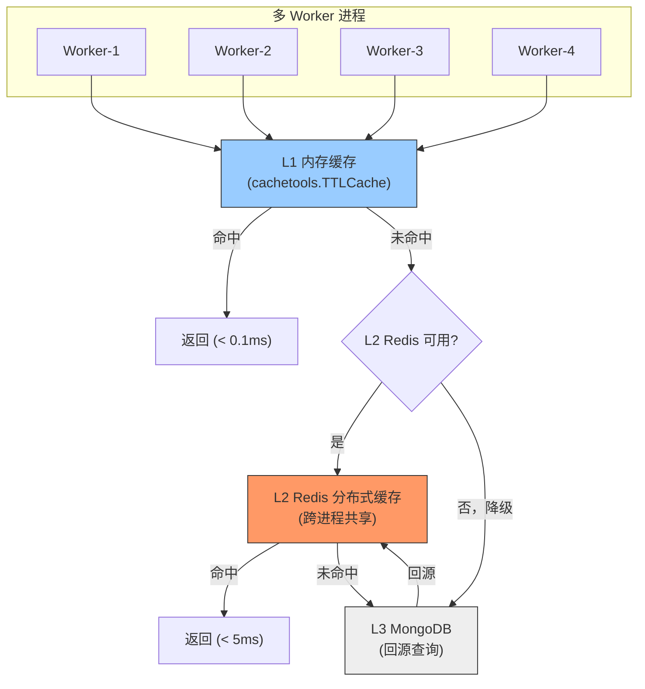

---

doc_type: module
prd_task_id: "YA-09-38"
title: "YA-09-38: Redis 分布式缓存 — aioredis 集成 + 哨兵 + 优雅降级 — 开发方案"
status: 需求已编写
priority: P2
owner: 陈铭
roles: [engineer]
created: 2026-09-11
updated: 2026-09-23
project: YiAi
project_id: yiai
prd_month: "202609"
estimate_frontend: 1.5
source_prd: "63-需求-Redis分布式缓存.md"
source_okr: [yiai-003]

type: task
---

# YA-09-38: Redis 分布式缓存 — aioredis 集成 + 哨兵 + 优雅降级 — 开发方案

> **文档职责**：本文档定义**怎么做、为什么这么做、实际做成什么样**（HOW），不含产品目标与测试用例。

> 来源 PRD：[63-需求-Redis分布式缓存.md](../../prds/2026-09/63-需求-Redis分布式缓存.md)
> 需求编号：YA-09-38 · 优先级：P2 · 人天：1.5d · 状态：需求已编写
> 依赖：YA-09-25（数据查询缓存层 L1 内存缓存）

---

<a id="sec-1"></a>
## 一、架构总览

YA-09-25 实现的 `QueryCache` 基于 Python dict 内存缓存，在多 Worker 部署（`uvicorn --workers 4`）时存在严重缺陷：缓存不跨进程共享（命中率仅 25%）、重启全量失效、无内存淘汰机制。引入 Redis 作为 L2 分布式缓存层，Redis 不可用时自动降级到 L1 内存缓存 + L3 MongoDB 回源查询。



**三级缓存架构**：L1 内存（< 0.1ms, 1000 条上限, per-process）→ L2 Redis（< 5ms, 跨进程共享, 持久化）→ L3 MongoDB（< 50ms, 回源查询）。Redis 故障时 L1 直接穿透到 L3，保证服务可用。

---

<a id="sec-2"></a>
## 二、文件清单

| 文件 | 操作 | 说明 |
|------|------|------|
| `YiAi/src/shared/redis_cache.py` | 新增 | RedisCache 类 + 连接管理 + 降级逻辑 |
| `YiAi/src/shared/query_cache.py` | 修改 | 替换内存 dict 为 L1+L2 分层缓存 |
| `YiAi/src/services/database/data_service.py` | 修改 | 写操作后调用 invalidate 清除缓存 |
| `YiAi/requirements.txt` | 修改 | 添加 `redis>=5.0` 依赖 |
| `YiAi/tests/test_redis_cache.py` | 新增 | Redis 缓存 8+ 场景测试 |

---

<a id="sec-3"></a>
## 三、模块设计

### 3.1 RedisCacheConfig

```python
# YiAi/src/shared/redis_cache.py
import redis.asyncio as aioredis
from dataclasses import dataclass

@dataclass
class RedisCacheConfig:
    redis_url: str = 'redis://localhost:6379'
    default_ttl: int = 60           # 默认 TTL 60s
    empty_ttl: int = 30             # 空结果 TTL 30s（防穿透）
    max_retries: int = 3            # Redis 操作重试
    connect_timeout: int = 2        # 连接超时 (s)
    operation_timeout: int = 1      # 操作超时 (s)
    key_prefix: str = 'yiai:cache:'  # Key 命名空间前缀
    sentinel: bool = False          # 是否启用哨兵模式
    sentinel_hosts: list = None     # 哨兵节点列表
    sentinel_service: str = 'mymaster'
```

### 3.2 RedisCache

```python
class RedisCache:
    """Redis 分布式缓存——替代内存字典。

    特性:
        - 跨进程缓存共享（解决多 Worker 命中率低问题）
        - Redis 不可用时自动降级内存缓存
        - 缓存穿透保护（空结果短 TTL 缓存）
        - Key 模式删除支持（写操作后批量失效）
        - 哨兵模式高可用（生产环境）
        - 自动重连（Redis 恢复后无缝切换）
    """

    def __init__(self, config: RedisCacheConfig = None): ...
    async def _ensure_connection(self):
        """确保 Redis 连接可用。哨兵模式优先，普通模式 fallback。"""
        ...

    async def get_or_fetch(self, key: str, fetcher: Callable, ttl: int = None) -> Any:
        """缓存获取或回源查询。Redis 不可用时降级内存缓存。"""
        ...

    async def _redis_get_or_fetch(self, key: str, fetcher, ttl: int) -> Any:
        """Redis 路径：GET → 命中返回 / 未命中回源 → SET → 返回"""
        ...

    async def _fallback_get_or_fetch(self, key: str, fetcher, ttl: int) -> Any:
        """降级路径：内存 dict → 命中返回 / 未命中回源 → 写入内存"""
        ...

    async def invalidate(self, pattern: str):
        """按模式删除缓存。写操作后调用，如 invalidate('query:bugs:*')。
        使用 SCAN 遍历匹配 keys（非 KEYS，避免阻塞 Redis）。"""
        ...

    async def health_check(self) -> dict:
        """返回 Redis 连接状态、已用内存、key 数量。降级时返回 fallback_keys 数量。"""
        ...

    async def close(self): ...
```

### 3.3 缓存 Key 设计

| 缓存类型 | Key 格式 | TTL | 示例 |
|----------|----------|-----|------|
| 查询结果 | `query:{cname}:{filter_hash}` | 60s | `query:bugs:a1b2c3` |
| Dashboard | `dashboard:{panel}:{period}` | 120s | `dashboard:bugs_trend:7d` |
| RAG 检索 | `rag:{query_hash}` | 300s | `rag:d4e5f6` |
| 用户权限 | `perm:{user_id}` | 600s | `perm:user123` |
| 空结果 | `empty:{cname}:{filter_hash}` | 30s | `empty:bugs:x7y8z9` |

---

<a id="sec-4"></a>
## 四、数据流

```
请求进入
  → query_cache.get_or_fetch(key, fetcher)
    → L1 内存命中? → 返回 (< 0.1ms)
    → L1 未命中 → _ensure_connection()
      → Redis 可用:
        → GET key → 命中 → 回填 L1 → 返回 (< 5ms)
        → 未命中 → await fetcher() → SET key (TTL) → 返回
      → Redis 不可用:
        → _fallback_get_or_fetch → 内存 dict → 回源 MongoDB → 返回
        → 记录 WARNING 日志
```

**写操作触发缓存失效**：
```
data_service.create_document()
  → repository.insert_one()
  → redis_cache.invalidate('query:{cname}:*')
  → 相关查询缓存全部清除
```

---

<a id="sec-5"></a>
## 五、实施路线

| # | 步骤 | 产出 | 验证 | 人天 |
|---|------|------|------|------|
| 1 | 启动 Redis 实例（开发环境） | docker-compose | `redis-cli ping` → PONG | 0.1 |
| 2 | 创建 RedisCache + 连接管理 | `redis_cache.py` | 单元测试：连接/读写/序列化 | 0.4 |
| 3 | 实现 L1+L2 分层缓存替换 QueryCache | `query_cache.py` | 多 Worker 命中率 > 80% | 0.3 |
| 4 | 实现 invalidate 模式删除 | `redis_cache.py` | SCAN + DELETE 批量清除 | 0.2 |
| 5 | 添加哨兵模式 + 降级逻辑 | `redis_cache.py` | Redis 停机 → 自动降级，恢复 → 自动重连 | 0.25 |
| 6 | 健康检查 + 监控指标 | `redis_cache.py` | `/health/debug` 查看 Redis 状态 | 0.15 |
| 7 | 测试用例 | `tests/test_redis_cache.py` | 8+ 场景：命中/未命中/降级/空结果/模式删除/重连 | 0.1 |

**合计：1.5d**

---

<a id="sec-6"></a>
## 六、代码审查检查清单

- [ ] L1 内存缓存 (cachetools.TTLCache) + L2 Redis 分层架构
- [ ] Redis 不可用时自动降级 L1 → MongoDB，不抛异常
- [ ] Redis 恢复后自动重连（`health_check_interval=30`）
- [ ] 缓存 Key 前缀 `yiai:cache:` 防止命名冲突
- [ ] 空结果缓存 30s（防穿透），正常数据 60s（默认）
- [ ] TTL 按数据类型差异化（Dashboard 120s, RAG 300s, 权限 600s）
- [ ] 写操作后主动 `invalidate` 相关缓存模式
- [ ] 使用 SCAN 而非 KEYS 遍历匹配 keys
- [ ] `/health/debug` 返回 Redis 连接状态和降级状态
- [ ] 单元测试覆盖：双路径/降级/空结果/模式删除/重连/哨兵

---

<a id="sec-7"></a>
## 七、风险评估

| 风险 | 概率 | 影响 | 缓解措施 |
|------|------|------|----------|
| Redis 内存溢出导致 OOM | 中 | 高 | maxmemory 配置 + allkeys-lru 淘汰策略 |
| Redis 单点故障 | 低 | 中 | 哨兵集群 + 自动降级内存缓存 |
| 缓存雪崩（大量 key 同时过期） | 低 | 中 | TTL 添加 ±10% 随机偏移 |
| 缓存与数据库不一致 | 中 | 中 | 写操作后主动 invalidate 相关缓存 |
| 大 value 序列化/反序列化耗时长 | 低 | 低 | 限制单 value 最大 1MB |

**回滚**：设置环境变量 `REDIS_ENABLED=false`，所有查询退化为 L1 内存缓存 + MongoDB 回源。Redis 完全切除不影响业务。